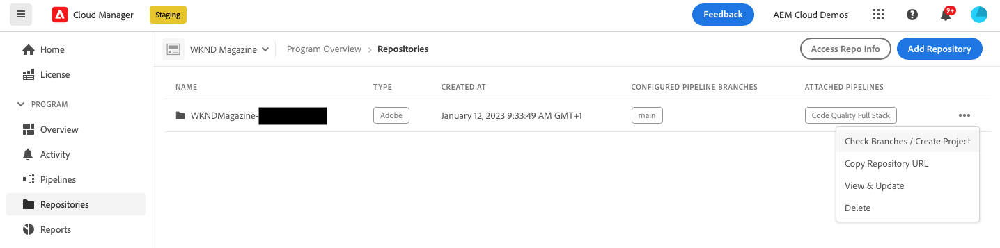

# repositories beheren in Cloud Manager {#managing-repos}

Leer hoe u uw git-opslagruimten in Cloud Manager kunt weergeven, toevoegen en verwijderen.

## Over opslagruimten in Cloud Manager {#overview}

Opslagplaatsen in Cloud Manager worden gebruikt om de projectcode op te slaan en te beheren met Git. Voor elk *programma* u toevoegt, wordt een Adobe-beheerde bewaarplaats automatisch gecreeerd.

Daarnaast kunt u meer opslagruimten met beheerde Adobe maken of uw eigen persoonlijke opslagruimten toevoegen. Alle bewaarplaatsen verbonden aan uw programma kunnen op de **pagina van Bewaarplaatsen** worden bekeken.

In Cloud Manager gemaakte opslagplaatsen kunnen ook worden geselecteerd bij het toevoegen of bewerken van pijpleidingen. Voor meer informatie bij het vormen van pijpleidingen, zie [ CI-CD Pijpleidingen ](/help/implementing/cloud-manager/configuring-pipelines/introduction-ci-cd-pipelines.md).

Elke pijpleiding is verbonden met een primaire bewaarplaats of tak. Nochtans, met [ submodule van de Git steun ](git-submodules.md), kunnen de veelvoudige secundaire takken tijdens het bouwstijlproces worden omvat.

## De pagina Opslagplaatsen weergeven {#repositories-window}

Op de **pagina van Bewaarplaatsen**, kunt u details over de geselecteerde bewaarplaats bekijken. Deze informatie omvat het type opslagplaats dat in gebruik is. Als de bewaarplaats als **Adobe** duidelijk is, wijst het erop dat het een Adobe-beheerde bewaarplaats is. Als het als **GitHub** wordt geëtiketteerd, verwijst het naar een privé bewaarplaats GitHub die u beheert. Daarnaast bevat de pagina gegevens zoals wanneer de opslagplaats is gemaakt en de bijbehorende pijpleidingen.

Om actie op een geselecteerde bewaarplaats te ondernemen, kunt u op de bewaarplaats klikken en  gebruiken om een drop-down menu te openen. Voor Adobe-geleide bewaarplaatsen, kunt u **[Tanden controleren/Project](#check-branches)** creëren.

*drop-down menu op de pagina van Bewaarplaatsen.*

Andere beschikbare acties op het drop-down menu omvatten **[Repository URL van het Exemplaar](#copy-url)**, **[Mening &amp; Update](#view-update)**, en **[Schrapping](#delete)** de bewaarplaats.

**om de pagina van Bewaarplaatsen te bekijken:**

1. Logboek in Cloud Manager bij [ my.cloudmanager.adobe.com ](https://my.cloudmanager.adobe.com/) en selecteert de aangewezen organisatie en het programma.

1. Van de **pagina van het Overzicht van het 0} Programma, op het zijmenu, klik ** Bewaarplaatsen **.**

1. De **pagina van Bewaarplaatsen** toont alle bewaarplaatsen verbonden aan uw geselecteerd programma.

   
   *de pagina van Bewaarplaatsen in Cloud Manager.*

## Een opslagplaats toevoegen {#adding-repositories}

Een gebruiker moet de rol **Manager van de Plaatsing** of **BedrijfsEigenaar** hebben om een bewaarplaats toe te voegen.

Op de **pagina van Bewaarplaatsen**, dichtbij de hoger-juiste hoek, klik **Add Bewaarplaats**

*voeg de dialoogdoos van de Bewaarplaats toe.*

Cloud Manager steunt twee types van bewaarplaatsen: Adobe-beheerde bewaarplaatsen (**de Bewaarplaats van de Adobe**) en zelfbeheerde bewaarplaatsen (**Privé Bewaarplaats**). De vereiste velden voor installatie zijn afhankelijk van het type opslagplaats dat u wilt toevoegen. Raadpleeg de volgende secties voor meer informatie:

* [Adobe-opslagruimten toevoegen in Cloud Manager](adobe-repositories.md)
* [Persoonlijke opslagruimten toevoegen in Cloud Manager](private-repositories.md)

Er geldt een limiet van 300 gegevensbanken voor alle programma&#39;s in een bepaalde onderneming of IMS-organisatie.

## Gegevens uit de gegevensopslagplaats {#repo-info}

Wanneer het bekijken van uw bewaarplaatsen in het **** venster van Bewaarplaatsen {, kunt u de details op bekijken hoe te tot Adobe-geleide bewaarplaatsen programmatically toegang te hebben door de **knoop van Info van de Reparatie van de Toegang** op de toolbar te klikken.

Het **venster van Info van de Bewaarplaats** opent met de details. Voor meer informatie bij de toegang tot van bewaarplaats informatie, zie [ Toegang tot de Informatie van de Bewaarplaats ](/help/implementing/cloud-manager/managing-code/accessing-repos.md).

## Branches controleren / Project maken {#check-branches}

In **AEM Cloud Manager**, de **Tak van de Controle / creeer de actie van het Project** dient twee doeleinden, afhankelijk van de huidige staat van de bewaarplaats.

* Als de bewaarplaats nieuw wordt gecreeerd, produceert deze actie een steekproefproject gebruikend [ het AEM projectarchetype ](https://experienceleague.adobe.com/en/docs/experience-manager-core-components/using/developing/archetype/overview).
* Als het voorbeeldproject reeds in de bewaarplaats wordt gecreeerd, controleert de actie de status van de bewaarplaats en zijn takken, die terugkoppelen op of het steekproefproject reeds bestaat.

  

## Repository-URL kopiëren {#copy-url}

De **actie van Repository URL van het Exemplaar van de Bewaarplaats** kopieert URL van de bewaarplaats die in de **wordt geselecteerd Repositories** pagina aan het klembord dat elders moet worden gebruikt.

## Een opslagplaats weergeven en bijwerken {#view-update}

De **Mening &amp; van de Update** actie opent de **Repository van de Update** dialoogdoos, waar u de 4} Naam van de bewaarplaats **en** Voorproef van Repository URL van de Bewaarplaats **kunt bekijken.** Bovendien, laat het u de **Beschrijving** van de bewaarplaats bijwerken.

## Een opslagplaats verwijderen {#delete}

De **schrapping** actie verwijdert de bewaarplaats uit uw project. Een opslagplaats kan niet worden geschrapt als het met een pijpleiding wordt geassocieerd.

Als u een opslagplaats verwijdert, wordt de naam onbruikbaar voor nieuwe opslagplaatsen die in de toekomst worden gemaakt. Als u probeert een gegevensopslagruimte toe te voegen met dezelfde naam als een verwijderde gegevensopslagruimte, wordt het volgende foutbericht weergegeven:

`Repository name should be unique within organization.`

Bovendien is de verwijderde opslagplaats niet meer beschikbaar in Cloud Manager en kan deze niet worden gekoppeld aan pijpleidingen.

