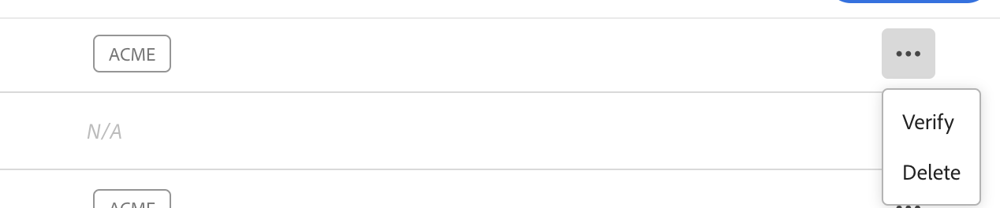
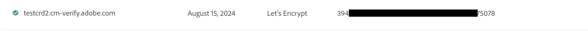

# DV-certificaten (Domain Validated) {#domain-validated-certificates}

Leer hoe u DV-certificaten (Domain Validated) beheert in Cloud Manager.

>[!NOTE]
>
>Deze functie is alleen beschikbaar voor [het programma voor vroegtijdige adoptie .](/help/implementing/cloud-manager/release-notes/current.md#early-adoption)

## Inleiding {#introduction}

Met Cloud Manager kunt u via zelfbediening een DV (Domain Validated SSL Certificate) genereren en beheren. Dit biedt u de snelste, eenvoudigste en voordeligste oplossing om een veilige website voor uw online bedrijf te maken.

Domeingevalideerde certificaten zijn beschikbaar voor beide [productie- en sandboxprogramma&#39;s.](/help/implementing/cloud-manager/getting-access-to-aem-in-cloud/program-types.md)

## Een aangepast domein toevoegen {#adding-domain}

Als u een DV-certificaat (Domain Validated) wilt toevoegen, moet u eerst het aangepaste domein configureren. Het proces is grotendeels hetzelfde als in het document wordt beschreven [Inleiding tot aangepaste domeinnamen.](/help/implementing/cloud-manager/custom-domain-names/introduction.md) Deze functionaliteit is echter enigszins uitgebreid.

1. Wanneer het verifiëren van het domein, kunt u verkiezen om Adobe-geleide of zelf-beheerde certificaten met het domein te gebruiken. Kies **Door Adobe beheerd certificaat** om later een DV-certificaat toe te voegen.

   

1. Om een Adobe te gebruiken beheerde certificaat, moet u een verslag CNAME aan uw DNS toevoegen zoals die in wordt beschreven **Domein verifiëren** in.

   

1. Tik op de knop Ovaal in de lijst met domeinen nadat u het domein hebt gemaakt of klik op deze knop **Verifiëren** om het domein te verifiëren.

   

## Een DV-certificaat toevoegen {#adding}

Als u uw domein correct hebt geconfigureerd, kunt u een DV-certificaat toevoegen door op de knop **SSL-certificaat toevoegen** in het venster SSL-certificaten.

1. Selecteer de optie **beheerde Adobe (DV)**.
1. Geef de domeinnaam op in het dialoogvenster **Domeinen selecteren** vallen.
1. Tik of klik op **Opslaan**.

Als het certificaat is toegevoegd, is het in behandeling en krijgt het een gele waarschuwing met de naam in het dialoogvenster **SSL-certificaten** venster.

Als het certificaat eenmaal is uitgegeven, krijgt het een groen vinkje in het veld **SSL-certificaten** venster.

Zie het document voor meer informatie over het toevoegen van SSL-certificaten en het venster SSL-certificaten [Een SSL-certificaat toevoegen.](add-ssl-certificate.md)

## CDN-configuratie toevoegen {#add-cdn}

Deze stap moet worden voltooid om een domein met SSL te vormen gebruikend Fastly CDN.

Ga als volgt te werk om een CDN-configuratie toe te voegen met gebruik van Cloud Manager.

1. Aanmelden bij Cloud Manager [my.cloudmanager.adobe.com](https://my.cloudmanager.adobe.com/) en selecteert u de gewenste organisatie.

1. Selecteer de **CDN-configuraties** klikken of tikken **Toevoegen** in de werkbalk.

1. In de **CDN configureren** de nodige informatie te verstrekken.

   * Selecteer de **Oorsprong**. Dit kan zijn:
      * Een omgeving met Cloud Servicen
      * Een site voor Edge Delivery Services
   * Selecteer het CDN-type.
   * Selecteer het domein.
   * Selecteer het SSL-certificaat.
      * Slechts vereist voor Adobe-geleide CDNs.

   

>
>
>Voor Adobe-geleide CDNs, wanneer het gebruiken van DV certificaten, slechts worden de plaatsen met de bevestiging van ACME toegelaten.
