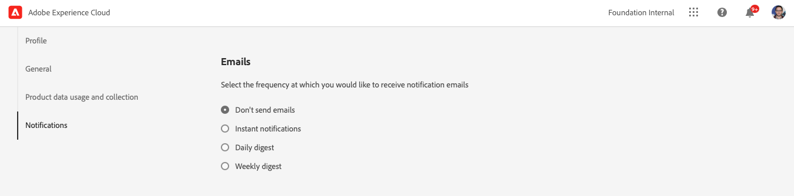

# Meldingen {#notifications}

[!UICONTROL Cloud Manager] staat de gebruiker toe om berichten te ontvangen wanneer de productiepijplijn (met succes of met succes), tijdens een productielocatie begint en voltooit.

Deze meldingen worden verzonden via de Adobe [!UICONTROL Experience Cloud] meldingssysteem voor gebruikers met rollen **Zakelijke eigenaar**, **Programmabeheerder**, en **Implementatiebeheer**.

De meldingen worden rechts op de menubalk weergegeven in het dialoogvenster [!UICONTROL Cloud Manager] UI en door Adobe [!UICONTROL Experience Cloud].

Het belpictogram is gemarkeerd wanneer er nieuwe meldingen zijn. Klik erop om het deelvenster te openen om de meldingen weer te geven.

In het deelvenster worden alleen de meest recente meldingen weergegeven. Klikken **Alles weergeven** onder aan het deelvenster om al uw meldingen weer te geven.

## E-mailmeldingen {#email-notifications}

Standaard zijn meldingen beschikbaar in de gebruikersinterface van Adobe [!UICONTROL Experience Cloud] oplossingen. Individuele gebruikers kunnen deze berichten ook via e-mail verzenden door deze stappen te volgen.

1. Klik op het belpictogram om de meldingen weer te geven.
1. Klik op de knop **Voorkeuren bewerken** pictogram (in de vorm van een tandwiel) boven aan het venster met meldingen.
1. Klik in het venster dat wordt geopend op **Meldingen** in de linkernavigatie.
   
1. Omlaag schuiven naar de **E-mail** kop.
   
1. Selecteer hoe je e-mailberichten wilt ontvangen.
   * Geen e-mails verzenden (standaard)
   * Directe meldingen
   * Dagelijks overzicht
   * Wekelijks overzicht

Nadat u een selectie hebt gemaakt, wordt uw keuze automatisch opgeslagen zonder dat u op de knop Opslaan of Toepassen hoeft te klikken.
