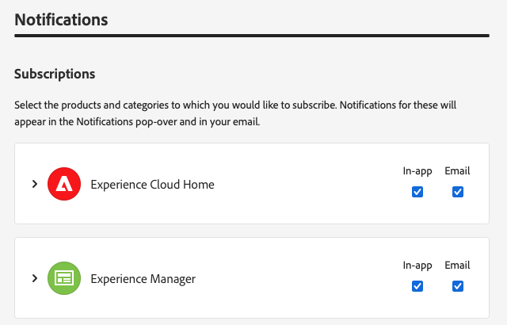
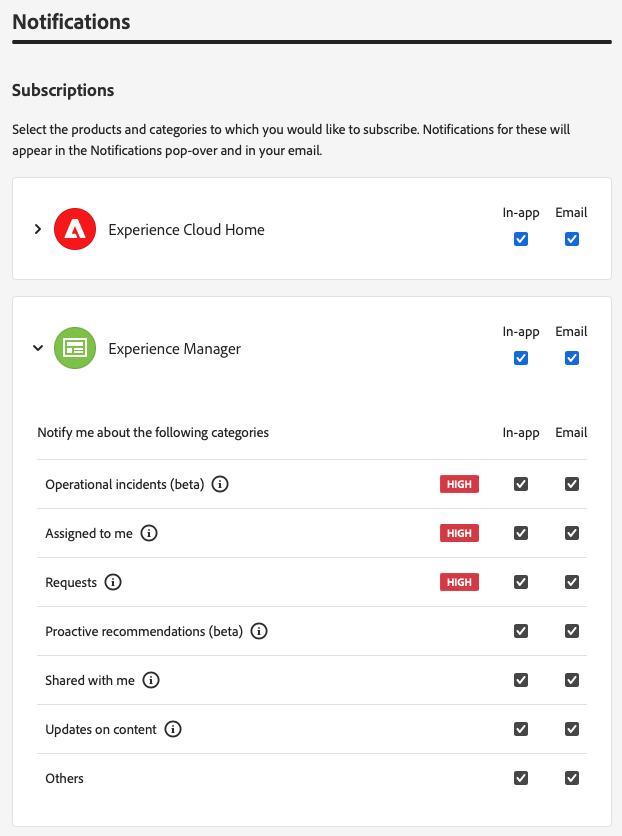
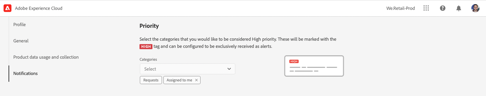
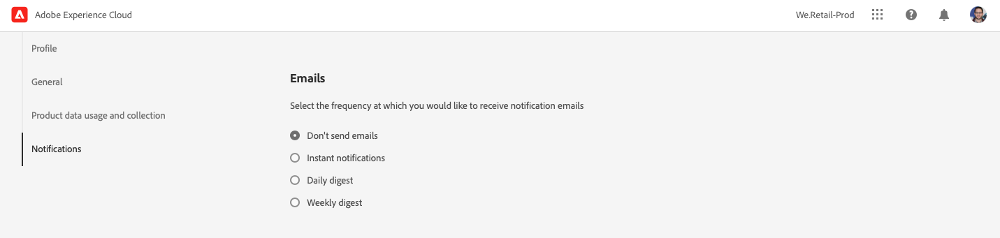

# Meldingen {#notifications}

Leer hoe Cloud Manager u op de hoogte brengt van belangrijke gebeurtenissen.

## Meldingen in Cloud Manager {#cloud-manager-notifications}

[!UICONTROL Cloud Manager] stuurt u meldingen wanneer een productiepijplijn begint en (met succes of zonder succes) wordt voltooid, aan het begin van een productieimplementatie.

Deze berichten worden verzonden door het [!UICONTROL Experience Cloud] berichtsysteem naar gebruikers in **BedrijfsEigenaar**, **Manager van het Programma**, en **de rollen van de Manager van de Plaatsing**.

De meldingen worden weergegeven in een zijbalk in [!UICONTROL Cloud Manager] en in de hele Adobe [!UICONTROL Experience Cloud] . Het belpictogram in de koptekst is gemarkeerd wanneer u nieuwe meldingen hebt.

Klik op het belpictogram om de zijbalk te openen en de meldingen weer te geven. Het **lusje van Meldingen** in sidebar maakt een lijst van de meest recente berichten zoals plaatsingsbevestigingen. Meldingen betreffen uw omgeving.

Het **lusje van Mededelingen** &lbrace;omvat het productaankondigingen van Adobe. Aankondigingen betreffen het product.

Klik op een melding of aankondiging om de details weer te geven. De berichten verbonden aan activiteiten zoals pijpleidingsplaatsingen nemen u aan het detail van die activiteit zoals het venster van de pijpleidingsuitvoering.

Klik de **Mening allen** optie bij de bodem van het paneel om alle aankondigingen in uw inbox te bekijken.

Klik het **Teken allen als gelezen** optie bij de bodem van het paneel om alle ongelezen berichten als gelezen te merken en het belpictogram te ontruimen.

## Configuratie van melding {#configuration}

U kunt aanpassen hoe u meldingen ontvangt en welke meldingen u ontvangt.

Klik het tandwielpictogram bij de bovenkant van de berichten sidebar om het **voorkeurenvenster van Experience Cloud** te openen. Van hieruit kunt u uw meldingsabonnementen definiëren en bepalen hoe u uw meldingen ontvangt.

### Abonnementen {#subscriptions}

In abonnementen wordt gedefinieerd voor welke producten u meldingen ontvangt en welke meldingen.

Standaard ontvangt u alle meldingen voor alle producten, zowel in de toepassing als via e-mail. Klik op het pictogram naast een productnaam om de gedetailleerde opties weer te geven en de typen meldingen te definiëren die u voor dat product ontvangt. U kunt ook de opties op productniveau in- of uitschakelen om alle opties voor het product in of uit te schakelen.

### Prioriteit {#priority}

Het prioritaire alarm wordt duidelijk met a **HOGE** markering. U kunt hen vormen om uitsluitend als alarm worden ontvangen. In de **Prioriteit** sectie, kunt u bepalen welke categorieën als prioritaire berichten kwalificeren.

Gebruik de vervolgkeuzelijst om aan de lijst met categorieën toe te voegen die als prioriteit worden aangemerkt. Klik op de X naast de categorienamen om deze te verwijderen.

### Waarschuwingen {#alerts}

Er worden enkele seconden waarschuwingen weergegeven in de rechterbovenhoek van het venster. Gebruik de **sectie van Alarm** om te bepalen voor welke berichten u alarm ontvangt.

U kunt het gedrag van de waarschuwingen definiëren.

* **toon alarm voor** - bepaalt de soorten berichten die alarm teweegbrengen
* **Alarm zou op het scherm moeten blijven tot ik hen** ontvang - Controles als het alarm zou moeten voortbestaan tenzij u hen actief ontslaat
* **Duur** - bepaalt hoe lang het alarm op het scherm zou moeten blijven als u niet hebt gekozen dat zij op het scherm zouden moeten blijven.

### E-mails {#emails}

Meldingen zijn beschikbaar in de webgebruikersinterface van alle Adobe [!UICONTROL Experience Cloud] -oplossingen. U kunt voor deze berichten ook kiezen om door e-mail in de **E-mail** sectie worden verzonden.

Standaard worden geen e-mails verzonden. U kunt e-mails ontvangen als:

* Meteen
* Dagelijks
* Wekelijks

Wanneer u **Onmiddellijke berichten** kiest, worden de e-mails verzonden onmiddellijk voor elk bericht. Voor **Dagelijkse samenvatting** en **Weekse samenvatting** kunt u kiezen wanneer uw dagelijkse samenvatting wordt verzonden en op welke dag en wanneer uw wekelijkse samenvatting wordt verzonden.