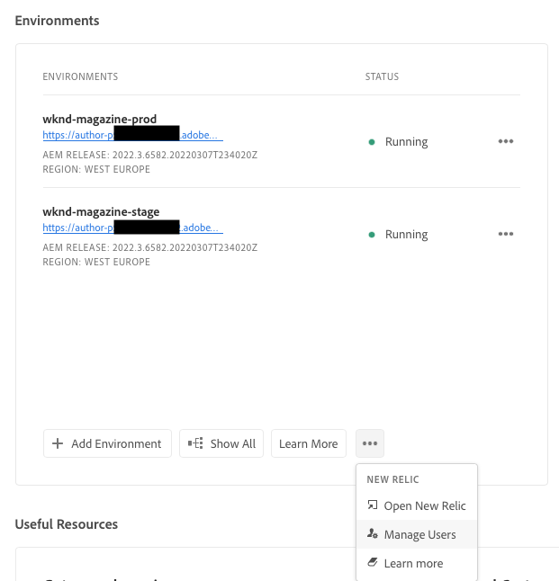

# New Relic One {#user-access}

Meer informatie over de service voor het controleren van de prestaties van New Relic One-toepassingen (APM) voor AEM as a Cloud Service en over hoe u deze service kunt gebruiken.

## Informatie over New Relic One {#introduction}

Adobe legt de nadruk op de bewaking, beschikbaarheid en prestaties van uw toepassing. AEM as a Cloud Service biedt toegang tot New Relic One-bewaking, zodat teams als onderdeel van het standaardproduct uitgebreide zichtbaarheid krijgen in de maatstaven voor systeem- en omgevingsprestaties.

In dit document wordt beschreven hoe u de toegang tot APM-functies (Application Performance Monitoring) van New Relic One in AEM as a Cloud Service-omgevingen kunt beheren. Een effectief beheer van deze functies ondersteunt optimale prestaties en maximaliseert de voordelen van AEM as a Cloud Service.

Wanneer een nieuw productieprogramma wordt gemaakt, wordt automatisch de New Relic One-subaccount gemaakt die aan uw AEM as a Cloud Service-programma is gekoppeld. [&#x200B; Deze sub-account moet &#x200B;](#activate-sub-account) worden geactiveerd beginnen het opnemen gegevens.

## Functies {#transaction-monitoring}

New Relic One APM voor AEM as a Cloud Service heeft veel functies.

* Directe toegang tot een toegewezen New Relic One-account

* New Relic One APM-agent met instrumenten die exacte methodeaanroepen met regelnummers weergeeft, inclusief externe afhankelijkheden en databases

* Holistische optimalisatie van prestaties door belangrijke metriek van infrastructuur-vlakke controle en toepassing (Adobe Experience Manager) controle te combineren

* AEM as a Cloud Service maakt Java Management Extensions (JMX) MB&#39;s en gezondheidscontroles direct beschikbaar binnen New Relic Insights, waardoor een diepgaande inspectie van de prestaties en gezondheidsmaatstaven van toepassingen mogelijk is.

## Je New Relic One-subaccount activeren {#activate-sub-account}

Voor een nieuw gemaakt programma wordt een New Relic One-subaccount voor u gemaakt. U moet deze echter activeren om gegevens in te voeren. Deze activering is niet automatisch. Voer de volgende stappen uit om uw subaccount te activeren.

>[!NOTE]
>
>Een gebruiker in de **BedrijfsEigenaar** of **rol van de Manager van de Plaatsing** moet worden het programma geopend om subaccount van New Relic One te beheren.

1. Logboek in Cloud Manager bij [&#x200B; my.cloudmanager.adobe.com &#x200B;](https://my.cloudmanager.adobe.com/) en selecteer de aangewezen organisatie.

1. Op de **[Mijn console van Programma&#39;s](/help/implementing/cloud-manager/navigation.md#my-programs)**, klik het programma waarvoor u uw gebruikers van New Relic One wilt beheren.

1. Bij de bodem van de **kaart van Milieu&#39;s** op de pagina van het programmaoverzicht, klik  en selecteer **New Relic** activeren.

   

   * U kunt tot **toegang hebben leidt gebruikers** optie. Bij de bovenkant van het **scherm van Milieu&#39;s** van uw programma, klik .

1. [&#x200B; stel een pijpleiding &#x200B;](/help/implementing/cloud-manager/configuring-pipelines/managing-pipelines.md#running-pipelines) voor het zelfde milieu in werking aan succesvolle voltooiing om de subrekeningsactivering te voltooien.

Wanneer de subaccount wordt gedeactiveerd, worden geen gegevens ingevoerd.

## New Relic One-gebruikers beheren {#manage-users}

Voer de volgende stappen uit om de gebruikers van uw New Relic One-subaccount voor uw AEM as a Cloud Service-programma te definiëren.

>[!NOTE]
>
>Een gebruiker in de **BedrijfsEigenaar** of **rol van de Manager van de Plaatsing** moet worden het programma geopend om de gebruikers van New Relic One te beheren.

1. Logboek in Cloud Manager bij [&#x200B; my.cloudmanager.adobe.com &#x200B;](https://my.cloudmanager.adobe.com/) en selecteer de aangewezen organisatie.

1. Klik op het programma waarvoor u de New Relic One-gebruikers wilt beheren.

1. Bij de bodem van de **kaart van Milieu&#39;s** op de pagina van het programmaoverzicht, klik  en selecteer **leiden gebruikers**.

   

   * U kunt tot **toegang hebben leidt gebruikers** optie. Bij de bovenkant van het **scherm van Milieu&#39;s** van uw programma, klik .

1. In **beheer de gebruikers van New Relic** dialoogdoos, ga de eerste en achternaam van de gebruiker in u wilt toevoegen, en klik **toevoegen** knoop. Herhaal deze stap voor alle gebruikers die u wilt toevoegen.

    toe

1. Als u een New Relic One-gebruiker wilt verwijderen, klikt u op de verwijderknop aan de rechterkant van de rij die de gebruiker vertegenwoordigt.

1. Klik **sparen** om de gebruikers tot stand te brengen.

Nadat de gebruikers zijn gedefinieerd, stuurt New Relic een bevestigingsbericht naar elke gebruiker aan wie u toegang hebt verleend, zodat de gebruiker het installatieproces kan voltooien en zich kan aanmelden.

>[!NOTE]
>
>Als u de New Relic One-gebruikers beheert, moet u uzelf ook als gebruiker toevoegen om zelf toegang te hebben. Het zijn van de **BedrijfsEigenaar** of **Manager van de Plaatsing** volstaat niet om toegang tot New Relic One te hebben. U moet uzelf ook als gebruiker maken.

## Je New Relic One-gebruikersaccount activeren {#activate-user-account}

Zodra een gebruikersrekening van New Relic One zoals die in de voorproefsectie [&#x200B; wordt beschreven de Gebruikers van New Relic One beheren &#x200B;](#manage-users) wordt gecreeerd, verzendt New Relic die gebruikers een bevestigingsmail naar het verstrekte adres. Als gebruikers deze accounts willen gebruiken, moeten ze eerst hun accounts bij New Relic activeren door hun wachtwoorden opnieuw in te stellen.

**om uw New Relic One gebruikersrekening te activeren:**

1. Klik op de koppeling in het e-mailbericht van New Relic.

1. Voor New Relic binnen pagina, klik **vergeten uw wachtwoord?**

   

1. Ga het e-mailadres in waar u bevestigingse-mail ontving, en selecteer **verzend mijn terugstellings verbinding**.

    in

1. New Relic stuurt je een e-mail met een koppeling om de account te bevestigen.

Als u geen bevestigingse-mail van New Relic ontvangt, zie de [&#x200B; het oplossen van problemensectie &#x200B;](#troubshooting).

## Toegang tot New Relic One {#accessing-new-relic}

Zodra u [&#x200B; uw rekening van New Relic &#x200B;](#activate-account) hebt geactiveerd, kunt u tot New Relic One als Cloud Manager of direct toegang hebben.

**om tot New Relic One als Cloud Manager toegang te hebben:**

1. Logboek in Cloud Manager bij [&#x200B; my.cloudmanager.adobe.com &#x200B;](https://my.cloudmanager.adobe.com/) en selecteer de aangewezen organisatie.

1. Klik op het programma waartoe u New Relic One wilt openen.

1. Bij de bodem van de **kaart van Milieu&#39;s** op de pagina van het programmaoverzicht, klik  en selecteer **Open New Relic**.

   

   * U kunt ook New Relic openen. Bij de bovenkant van het **scherm van Milieu&#39;s** van uw programma, klik .

1. Meld u aan bij New Relic One op het nieuwe browsertabblad dat wordt geopend.

**om tot New Relic One direct toegang te hebben:**

1. Ga naar de aanmeldingspagina van New Relic op [`https://login.newrelic.com/login` &#x200B;](https://login.newrelic.com/login)

1. Meld u aan bij New Relic One.

### Uw e-mail verifiëren {#verify-email}

Als u wordt gevraagd uw e-mail te verifiëren tijdens het aanmelden bij New Relic One, betekent dit dat uw e-mail is gekoppeld aan meerdere accounts. U kunt kiezen welk account u wilt openen.

Als u uw e-mailadres niet verifieert, probeert New Relic u aan te melden met de meest recente gebruikersrecord die aan uw e-mailadres is gekoppeld. Vermijd het verifiëren van uw e-mail tijdens elke login, klik **me** checkbox in het login scherm herinneren.

Voor meer hulp, open een steunkaartje als [&#x200B; Portaal van de Steun van AEM &#x200B;](https://helpx.adobe.com/enterprise/using/support-for-experience-cloud.html).

## Problemen met New Relic One-gebruikerstoegang oplossen {#troubleshooting}

Als u als gebruiker van New Relic One werd toegevoegd, zoals die in [&#x200B; wordt beschreven beheer New Relic One Gebruikers &#x200B;](#manage-users), en niet van de originele van de rekeningsbevestiging e-mail kan de plaats bepalen, kunt u de volgende het oplossen van problemenstappen doen.

**om de gebruikerstoegang van New Relic One problemen op te lossen:**

1. Navigeer naar de aanmeldingspagina van New Relic op [`login.newrelic.com/login` &#x200B;](https://login.newrelic.com/login) .

1. Klik op **[!UICONTROL Forgot your password?]**.

   

1. Ga het e-mailadres in dat werd gebruikt om uw rekening tot stand te brengen, en selecteer **verzend mijn terugstellings verbinding**.

    in

1. New Relic stuurt je een e-mail met een koppeling om de account te bevestigen.

Als u het aanmeldingsproces voltooit en niet aan uw rekening wegens e-mail of wachtwoordfoutenmeldingen kan aanmelden, registreer een steunkaartje als [&#x200B; Admin Console &#x200B;](https://adminconsole.adobe.com/).

Ga als volgt te werk als je geen e-mail van New Relic ontvangt:

* Controleer uw [&#x200B; spamfilters &#x200B;](https://docs.newrelic.com/docs/accounts/accounts-billing/account-setup/create-your-new-relic-account/).
* Indien van toepassing, [&#x200B; voeg New Relic aan uw e-maillijst van gewenste personen &#x200B;](https://docs.newrelic.com/docs/accounts/accounts/account-maintenance/account-email-settings/#email-whitelist) toe.
* Als geen van beide suggesties helpt, geef terugkoppelen op het steunkaartje.

## Gebruiksnotities {#usage-notes}

* Er kunnen maximaal 30 gebruikers worden toegevoegd. Als het maximumaantal gebruikers is bereikt, verwijdert u gebruikers om nieuwe gebruikers toe te voegen.
* De gebruikers die aan New Relic worden toegevoegd zijn van het type **Basis**. Zie de [&#x200B; documentatie van New Relic voor details &#x200B;](https://docs.newrelic.com/docs/accounts/accounts-billing/new-relic-one-user-management/user-type/).
* AEM as a Cloud Service biedt alleen de New Relic One APM-oplossing en biedt geen ondersteuning voor waarschuwingen, logboekregistratie of API-integratie.

>[!NOTE]
>
>Als geen **gebruikerslogin** activiteit in uw sub-rekening van New Relic One 30 dagen of meer wordt ontdekt, wordt de agent APM tegengehouden. Er worden geen gegevens verzonden van AEM Cloud Service naar New Relic. *Gegevens wordt niet opnieuw verzonden tot uw sub-account wordt opnieuw geactiveerd.*
>
>Volg de zelfde stappen in [&#x200B; activeer Uw sub-Rekening van New Relic One &#x200B;](#activate-sub-account) sectie van dit document om uw sub-rekening van New Relic One opnieuw te activeren.

Voor meer hulp of extra begeleiding op het dienstenaanbod van New Relic One voor uw Programma van AEM as a Cloud Service, open een steunkaartje als [&#x200B; Portaal van de Steun van AEM &#x200B;](https://helpx.adobe.com/enterprise/using/support-for-experience-cloud.html).

## Veelgestelde vragen {#faqs}

+++**wat controleert Adobe met New Relic One?**

Adobe bewaakt de auteur-, publicatie- en voorvertoningsservices van AEM as a Cloud Service (indien beschikbaar) via de New Relic One Java-plug-in. Adobe maakt aangepaste New Relic One APM telemetrie en bewaking mogelijk in niet-productie en productie-AEM as a Cloud Service-omgevingen.

Uw New Relic One-account is gekoppeld aan een primaire Adobe-account en bevat meerdere toepassingen die erin worden gerapporteerd; drie per AEM as a Cloud Service-omgeving.

* Eén toepassing voor de service Auteur per omgeving
* Eén toepassing voor de service `Publish` per omgeving (inclusief Gulden publicatie)
* Eén toepassing voor de voorbeeldservice per omgeving

Opmerking:

* Elke toepassing gebruikt één licentiecode.
* AEM as a Cloud Service-omgevingen rapporteren slechts aan één New Relic One-account.
* De volledige meetgegevens en gebeurtenissen voor de bewaking van beide New Relic One worden drie maanden bewaard.

+++

+++**verzendt Adobe waakzame berichten van New Relic One?**

Adobe biedt New Relic One alleen toegang voor waarneembare doeleinden en gebruikt deze niet voor klantwaarschuwingen of interne operationele waarschuwingen. De berichten voor om het even welke incidenten worden verzonden gebruikend [&#x200B; profielen van het gebruikersbericht &#x200B;](/help/journey-onboarding/notification-profiles.md).
+++

+++**wie tot de gegevens van de de wolkendienst van New Relic One kan toegang hebben?**

Volledige leestoegang wordt verleend voor maximaal 30 leden van uw team. Leestoegang omvat alle APM-meetgegevens die door de New Relic One-agent worden verzameld.
+++

+++**wordt de configuratie van douaneSSO gesteund?**

Aangepaste SSO-configuratie wordt niet ondersteund voor de New Relic One-account die is ingericht door Adobe.
+++

+++**wat als ik reeds een op-gebouw New Relic abonnement heb?**

New Relic One is het nieuwe platform voor waarneming vanuit New Relic en biedt Adobe-ondersteuning en uw teams de mogelijkheid om metingen en gebeurtenissen op één locatie te observeren, te controleren en weer te geven.

New Relic One biedt gebruikers de mogelijkheid om te zoeken in alle accounts waar ze toegang hebben tot de gegevens van alle services en hosts in één weergave en deze zichtbaar te maken.

Adobe-ondersteuning bewaakt AEM as a Cloud Service met New Relic One en andere tools, terwijl uw teams New Relic nog steeds kunnen gebruiken voor services en infrastructuur op locatie. Ze kunnen de gegevens visualiseren van zowel Adobe New Relic One-accounts als door klanten beheerde New Relic-accounts.

>[!NOTE]
>
>Om beide gegevensreeksen binnen New Relic One te bekijken, moet een gebruiker de juiste toestemmingen hebben en de zelfde login methodologie voor beide rekeningen gebruiken (Adobe New Relic One en de klant-beheerde rekeningen van New Relic).

+++

+++**de agent APM voor mijn rekening van New Relic One wordt tegengehouden. Wat is er gebeurd?**

[&#x200B; de agenten van APM worden tegengehouden &#x200B;](#limitations) als geen activiteit voor 30 dagen of meer wordt ontdekt. Volg de zelfde stappen in [&#x200B; activeer Uw sub-Rekening van New Relic One &#x200B;](#activate-sub-account) sectie van dit document om uw sub-rekening van New Relic One opnieuw te activeren.
+++
