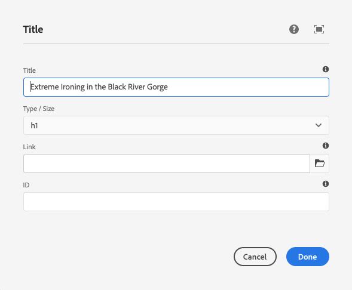
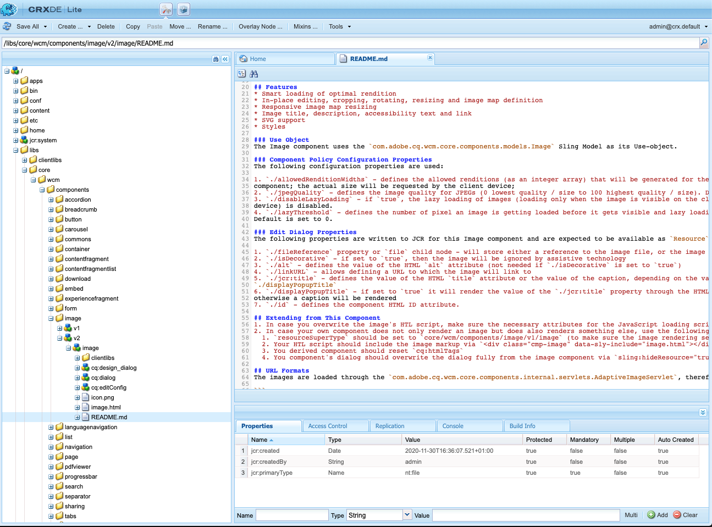

# Referentiehandleiding voor componenten {#components-reference-guide}

Componenten vormen de kern van het opbouwen van een ervaring in AEM. Met de [Core Components](https://experienceleague.adobe.com/docs/experience-manager-core-components/using/introduction.html) en de [AEM Project Archetype](https://experienceleague.adobe.com/docs/experience-manager-core-components/using/developing/archetype/overview.html) kunt u eenvoudig aan de slag met een gereedschapsset kant van kant-en-klare, robuuste componenten. In de [WKND-zelfstudie](/help/implementing/developing/introduction/develop-wknd-tutorial.md) wordt uitgelegd hoe u deze gereedschappen kunt gebruiken en hoe u aangepaste componenten kunt maken om een nieuwe AEM te maken.

>[!TIP]
>
>Voordat verwijzingen naar dit document worden toegevoegd, moet u de [WKND-zelfstudie](/help/implementing/developing/introduction/develop-wknd-tutorial.md) hebben voltooid en zo vertrouwd zijn met [Core Components](https://experienceleague.adobe.com/docs/experience-manager-core-components/using/introduction.html) en [AEM Project Archetype.](https://experienceleague.adobe.com/docs/experience-manager-core-components/using/developing/archetype/overview.html)

Omdat de WKND-zelfstudie betrekking heeft op de meeste gevallen van gebruik, is dit document alleen bedoeld als aanvulling op deze bronnen. Het geeft diepgaande technische details over hoe de componenten in AEM gestructureerd en gevormd zijn en niet bedoeld als begonnen gids worden.

## Overzicht {#overview}

In deze sectie worden de belangrijkste concepten en kwesties behandeld als een inleiding op de benodigde details bij het ontwikkelen van uw eigen componenten.

### Planning {#planning}

Voordat u begint met het configureren of coderen van uw component, moet u het volgende vragen:

* Wat hebt u precies nodig om de nieuwe component te doen?
* Moet u een geheel nieuwe component maken of kunt u de basisbeginselen overnemen van een bestaande component?
* Heeft uw component logica nodig voor het selecteren/manipuleren van de inhoud?
   * De logica moet gescheiden worden gehouden van de gebruikersinterfacelaag. HTL is ontworpen om ervoor te zorgen dat dit gebeurt.
* Heeft uw component CSS-opmaak nodig?
   * CSS-opmaak moet gescheiden blijven van de componentdefinities. Definieer conventies voor de naamgeving van uw HTML-elementen, zodat u deze kunt wijzigen via externe CSS-bestanden.
* Welke veiligheidsimplicaties kan uw nieuwe component introduceren?

### Bestaande componenten opnieuw gebruiken {#reusing-components}

Voordat u tijd investeert in het maken van een geheel nieuwe component, kunt u het aanpassen of uitbreiden van bestaande componenten overwegen. [De Core ](https://experienceleague.adobe.com/docs/experience-manager-core-components/using/introduction.html) Component is een reeks flexibele, robuuste en goed geteste onderdelen die klaar zijn voor productie.

#### Uitbreiding van kerncomponenten {#extending-core-components}

De Componenten van de Kern bieden ook [duidelijke aanpassingspatronen](https://experienceleague.adobe.com/docs/experience-manager-core-components/using/developing/customizing.html) aan die u kunt gebruiken om hen aan de behoeften van uw eigen project aan te passen.

#### Onderdelen {#overlying-components} overschrijven

Componenten kunnen ook opnieuw worden gedefinieerd met een [overlay](/help/implementing/developing/introduction/overlays.md) op basis van de logica van het zoekpad. In dat geval wordt de [Sling Resource Merger](/help/implementing/developing/introduction/sling-resource-merger.md) echter niet geactiveerd en moet `/apps` de volledige overlay definiëren.

#### Componentdialoogvensters uitbreiden {#extending-component-dialogs}

Het is ook mogelijk om een componentendialoog met voeten te treden gebruikend de Verschuivende Fusie van het Middel en het bepalen van het bezit `sling:resourceSuperType`.

Dit betekent dat u alleen de vereiste verschillen opnieuw hoeft te definiëren in plaats van het volledige dialoogvenster opnieuw te definiëren.

### Opmaak voor contentlogica en rendering {#content-logic-and-rendering-markup}

De component wordt weergegeven met [HTML.](https://www.w3schools.com/htmL/html_intro.asp) Uw component moet de HTML definiëren die nodig is om de vereiste inhoud te nemen en deze vervolgens naar wens weer te geven, zowel in de auteur- als in de publicatieomgeving.

Het wordt aanbevolen de code die verantwoordelijk is voor opmaak en rendering, gescheiden te houden van de code die de logica regelt die wordt gebruikt om de inhoud van de component te selecteren.

Deze filosofie wordt gesteund door [HTL](https://experienceleague.adobe.com/docs/experience-manager-htl/using/overview.html), een malplaatjetaal die opzettelijk beperkt is om ervoor te zorgen dat een echte programmeertaal wordt gebruikt om de onderliggende bedrijfslogica te bepalen. Dit mechanisme markeert de code die voor een bepaalde mening wordt geroepen en, indien vereist, staat specifieke logica voor verschillende meningen van de zelfde component toe.

Deze (facultatieve) logica kan op verschillende manieren worden uitgevoerd en wordt aangehaald van HTML met specifieke bevelen:

* Java gebruiken - [De HTML Java use-API](https://helpx.adobe.com/experience-manager/htl/using/use-api-java.html) laat een HTML- dossier toe om helpermethodes in een klasse van douaneJava tot stand te brengen. Hierdoor kunt u Java-code gebruiken om de logica voor het selecteren en configureren van de inhoud van de component te implementeren.
* JavaScript gebruiken - [De HTML JavaScript gebruik-API](https://experienceleague.adobe.com/docs/experience-manager-htl/using/htl/use-api-javascript.html) laat een HTML- dossier toe om helpercode toegang te hebben die in JavaScript wordt geschreven. Hierdoor kunt u JavaScript-code gebruiken om de logica voor het selecteren en configureren van de componentinhoud te implementeren.
* Het gebruik van Client-Side Libraries - Moderne websites vertrouwen sterk op client-side verwerking door complexe JavaScript- en CSS-code. Zie het document [Client-Side Bibliotheken gebruiken op AEM als een Cloud Service](/help/implementing/developing/introduction/clientlibs.md) voor meer informatie.

### Uw eigen componenten ontwikkelen {#developing-your-own-components}

Wilt u hier inhoud ontwikkelen?

## Componentstructuur {#structure}

De structuur van een AEM is krachtig en flexibel. De belangrijkste onderdelen zijn:

* [Type bron](#resource-type)
* [Componentdefinitie](#component-definition)
* [Eigenschappen en onderliggende knooppunten van een component](#properties-and-child-nodes-of-a-component)
* [Dialoogvensters](#dialogs)
* [Ontwerpdialoogvensters](#design-dialogs)

### Type bron {#resource-type}

Een zeer belangrijk element van de structuur is het middeltype.

* In de inhoudstructuur worden intenties gedeclareerd.
* Het middeltype voert hen uit.

Dit is een abstractie die helpt ervoor te zorgen dat zelfs wanneer de blik en het gevoel in tijd verandert, dat de intentie de tijd blijft.

### Componentdefinitie {#component-definition}

De definitie van een component kan als volgt worden uitgesplitst:

* AEM componenten zijn gebaseerd op [Sling.](https://sling.apache.org/documentation.html)
* AEM componenten bevinden zich onder `/libs/core/wcm/components`.
* Projectspecifieke componenten/site bevinden zich onder `/apps/<myApp>/components`.
* AEM standaardcomponenten worden gedefinieerd als `cq:Component` en hebben de belangrijkste elementen:
   * jcr-eigenschappen - Een lijst met jcr-eigenschappen. Dit zijn variabele en sommige kunnen facultatief zijn hoewel de basisstructuur van een componentenknoop, zijn eigenschappen, en subnodes door de `cq:Component` definitie worden bepaald.
   * Bronnen - Deze definiëren statische elementen die door de component worden gebruikt.
   * Scripts - Deze worden gebruikt om het gedrag van de resulterende instantie van de component te implementeren.

#### Vitale eigenschappen {#vital-properties}

* **Basisknooppunt**:
   * `<mycomponent> (cq:Component)` - Hiërarchieknooppunt van component.
* **Vitale eigenschappen**:
   * `jcr:title` - titel van de component; wordt bijvoorbeeld gebruikt als label wanneer de component wordt vermeld in de  [Componentbrowser ](/help/sites-cloud/authoring/fundamentals/environment-tools.md#components-browser) en  [Componentconsole](/help/sites-cloud/authoring/features/components-console.md)
   * `jcr:description` - Beschrijving van het onderdeel; gebruikt als muis-over wenk in de Browser van Componenten en de Console van Componenten
   * Zie de sectie [Component Icon](#component-icon) voor meer informatie
* **Vitale onderliggende knooppunten**:
   * `cq:editConfig (cq:EditConfig)` - Definieert de bewerkingseigenschappen van de component en zorgt ervoor dat de component wordt weergegeven in de Componentbrowser
      * Als de component een dialoogvenster heeft, wordt dit automatisch weergegeven in de browser Components of Sidetrap, zelfs als cq:editConfig niet bestaat.
   * `cq:childEditConfig (cq:EditConfig)` - Bepaalt de UI-aspecten van de auteur voor onderliggende componenten die hun eigen componenten niet definiëren  `cq:editConfig`.
   * `cq:dialog (nt:unstructured)` - Dialoogvenster voor deze component. Definieert de interface waarmee de gebruiker de component kan configureren en/of inhoud kan bewerken.
   * `cq:design_dialog (nt:unstructured)` - Ontwerpbewerking voor deze component

#### Componentpictogram {#component-icon}

Het pictogram of de afkorting voor de component wordt gedefinieerd via JCR-eigenschappen van de component wanneer de component door de ontwikkelaar wordt gemaakt. Deze eigenschappen worden in de volgende volgorde geëvalueerd en de eerste geldige gevonden eigenschap wordt gebruikt.

1. `cq:icon` - Tekenreekseigenschap die naar een standaardpictogram in de  [Coral UI-](https://helpx.adobe.com/experience-manager/6-5/sites/developing/using/reference-materials/coral-ui/coralui3/Coral.Icon.html) bibliotheek verwijst dat in de componentbrowser wordt weergegeven
   * Gebruik de waarde van het HTML-kenmerk van het pictogram Coral.
1. `abbreviation` - Tekenreekseigenschap om de afkorting van de componentnaam in de componentbrowser aan te passen
   * De afkorting moet worden beperkt tot twee tekens.
   * Als u een lege tekenreeks opgeeft, wordt de afkorting opgebouwd van de eerste twee tekens van de eigenschap `jcr:title`.
      * Bijvoorbeeld &quot;Im&quot; voor &quot;Image&quot;
      * De gelokaliseerde titel wordt gebruikt om de afkorting samen te stellen.
   * De afkorting wordt alleen omgezet als de component een eigenschap `abbreviation_commentI18n` heeft, die vervolgens als vertaalhint wordt gebruikt.
1. `cq:icon.png` of  `cq:icon.svg` - Pictogram voor deze component, die wordt weergegeven in de Componentbrowser
   * 20 x 20 pixels is de grootte van pictogrammen van standaardcomponenten.
      * Grotere pictogrammen worden verkleind (op de client).
   * De aanbevolen kleur is rgb(112, 112, 112) > #707070
   * De achtergrond van standaardcomponentpictogrammen is transparant.
   * Alleen `.png`- en `.svg`-bestanden worden ondersteund.
   * Als u bestanden importeert vanuit het bestandssysteem via de Eclipse-plug-in, moeten bestandsnamen bijvoorbeeld worden beschermd als `_cq_icon.png` of `_cq_icon.svg`.
   * `.png` heeft voorrang op  `.svg` als beide aanwezig zijn.

Als geen van de bovengenoemde eigenschappen (`cq:icon`, `abbreviation`, `cq:icon.png` of `cq:icon.svg`) op de component worden gevonden:

* Het systeem zoekt naar dezelfde eigenschappen op de supercomponenten na de eigenschap `sling:resourceSuperType`.
* Als er op het niveau van de supercomponent niets of een lege afkorting wordt gevonden, maakt het systeem de afkorting van de eerste letters van de eigenschap `jcr:title` van de huidige component.

Als u de overerving van pictogrammen van supercomponenten wilt annuleren, wordt het standaardgedrag hersteld wanneer u een lege eigenschap `abbreviation` voor de component instelt.

De [Component Console](/help/sites-cloud/authoring/features/components-console.md#component-details) toont hoe het pictogram voor een bepaalde component wordt bepaald.

#### SVG-pictogramvoorbeeld {#svg-icon-example}

```xml
<?xml version="1.0" encoding="utf-8"?>
<!DOCTYPE svg PUBLIC "-//W3C//DTD SVG 1.1//EN" "https://www.w3.org/Graphics/SVG/1.1/DTD/svg11.dtd">
<svg version="1.1" id="Layer_1" xmlns="https://www.w3.org/2000/svg" xmlns:xlink="https://www.w3.org/1999/xlink" x="0px" y="0px"
     width="20px" height="20px" viewBox="0 0 20 20" enable-background="new 0 0 20 20" xml:space="preserve">
    <ellipse cx="5" cy="5" rx="3" ry="3" fill="#707070"/>
    <ellipse cx="15" cy="5" rx="4" ry="4" fill="#707070"/>
    <ellipse cx="5" cy="15" rx="5" ry="5" fill="#707070"/>
    <ellipse cx="15" cy="15" rx="4" ry="4" fill="#707070"/>
</svg>
```

### Eigenschappen en onderliggende knooppunten van een component {#properties-and-child-nodes-of-a-component}

Veel van de knopen/eigenschappen nodig om een component te bepalen zijn gemeenschappelijk voor beide UIs, met verschillen die onafhankelijk blijven zodat uw component in beide milieu&#39;s kan werken.

Een component is een knooppunt van het type `cq:Component` en heeft de volgende eigenschappen en onderliggende knooppunten:

| Naam | Type | Beschrijving |
|---|---|---|
| `.` | `cq:Component` | Dit vertegenwoordigt de huidige component. Een component is van knooppunttype `cq:Component`. |
| `componentGroup` | `String` | Dit vertegenwoordigt de groep waaronder de component in [Browser van Componenten kan worden geselecteerd.](/help/sites-cloud/authoring/fundamentals/environment-tools.md#components-browser) Een waarde die begint met  `.` wordt gebruikt voor componenten die niet beschikbaar voor selectie van UI zoals basiscomponenten zijn waarvan andere componenten erven. |
| `cq:isContainer` | `Boolean` | Dit geeft aan of de component een containercomponent is en daarom andere componenten zoals een alineasysteem kan bevatten. |
| `cq:dialog` | `nt:unstructured` | Dit is de definitie van het dialoogvenster Bewerken voor de component. |
| `cq:design_dialog` | `nt:unstructured` | Dit is de definitie van het ontwerpdialoogvenster voor de component. |
| `cq:editConfig` | `cq:EditConfig` | Dit bepaalt [geef configuratie van de component uit.](#edit-behavior) |
| `cq:htmlTag` | `nt:unstructured` | Hiermee worden extra tagkenmerken geretourneerd die aan de omringende HTML-tag worden toegevoegd. Hiermee schakelt u het toevoegen van kenmerken aan de automatisch gegenereerde div-elementen in. |
| `cq:noDecoration` | `Boolean` | Indien waar (true), wordt de component niet gerenderd met automatisch gegenereerde div- en css-klassen. |
| `cq:template` | `nt:unstructured` | Indien gevonden, zal dit knooppunt als inhoudsmalplaatje worden gebruikt wanneer de component van Browser van Componenten wordt toegevoegd. |
| `jcr:created` | `Date` | Dit is de datum waarop de component is gemaakt. |
| `jcr:description` | `String` | Dit is de beschrijving van de component. |
| `jcr:title` | `String` | Dit is de titel van de component. |
| `sling:resourceSuperType` | `String` | Wanneer deze is ingesteld, overerft de component deze component. |
| `component.html` | `nt:file` | Dit is het HTML-scriptbestand van de component. |
| `cq:icon` | `String` | Deze waarde verwijst naar het [pictogram van de component](#component-icon) en verschijnt in Browser van Componenten. |

Als we naar de **component Text** kijken, kunnen we een aantal van deze elementen zien:


Tot de eigenschappen van bijzonder belang behoren:

* `jcr:title` - Dit is de titel van de component die wordt gebruikt om de component in de Componentbrowser te identificeren.
* `jcr:description` - Dit is de beschrijving van de component.
* `sling:resourceSuperType` - Dit geeft het pad van de overerving aan wanneer een component wordt uitgebreid (door een definitie te overschrijven).

Onderliggende knooppunten die van bijzonder belang zijn, zijn onder meer:

* `cq:editConfig` - Hiermee bepaalt u de visuele aspecten van de component tijdens het bewerken.
* `cq:dialog` - Hiermee wordt het dialoogvenster gedefinieerd voor het bewerken van de inhoud van deze component.
* `cq:design_dialog` - Hiermee worden de opties voor het bewerken van ontwerpen voor deze component opgegeven.

### Dialoogvensters {#dialogs}

Dialoogvensters zijn een belangrijk element van uw component omdat ze een interface bieden waarmee auteurs de component op een inhoudspagina kunnen configureren en invoer voor die component kunnen leveren. Zie [ontwerpdocumentatie](/help/sites-cloud/authoring/fundamentals/editing-content.md) voor meer informatie over hoe de auteurs van inhoud met componenten communiceren.

Afhankelijk van de complexiteit van de component heeft uw dialoogvenster mogelijk een of meer tabbladen nodig.

Dialoogvensters voor AEM componenten:

* Dit zijn `cq:dialog` knooppunten van het type `nt:unstructured`.
* Deze knooppunten bevinden zich onder hun `cq:Component` knooppunten en naast hun componentdefinities.
* Definieer het dialoogvenster voor het bewerken van de inhoud van deze component.
* Wordt gedefinieerd met graniet UI-componenten.
* Gerenderde server-kant (als het Verdelen componenten), die op hun inhoudsstructuur en `sling:resourceType` bezit wordt gebaseerd.
* Bevat een nodestructuur die de gebieden binnen de dialoog beschrijft
   * Deze knooppunten hebben `nt:unstructured` de vereiste `sling:resourceType` eigenschap.



In het dialoogvenster worden afzonderlijke velden gedefinieerd:


### Ontwerpdialoogvensters {#design-dialogs}

De dialoogvensters van het ontwerp zijn gelijkaardig aan de dialogen die worden gebruikt om inhoud uit te geven en te vormen, maar zij verstrekken de interface voor malplaatjeauteurs om ontwerpdetails voor die component op een paginasjabloon pro-vormen en te verstrekken. Paginasjablonen worden vervolgens door de auteurs van de inhoud gebruikt om inhoudspagina&#39;s te maken. Zie de [sjabloondocumentatie](/help/sites-cloud/authoring/features/templates.md) voor meer informatie over hoe sjablonen worden gemaakt.

[De dialoogvensters van het ontwerp worden gebruikt wanneer het uitgeven van een paginamalplaatje](/help/sites-cloud/authoring/features/templates.md), hoewel zij niet voor alle componenten nodig zijn. De **Title** en **Image Components** hebben bijvoorbeeld allebei ontwerpdialoogvensters, terwijl **Social Media Sharing Component** dat niet doet.

### UI voor koralen en graniet {#coral-and-granite}

De interface van koralen en de interface van Granite bepalen het uiterlijk van AEM.

* [Koraal ](https://helpx.adobe.com/experience-manager/6-5/sites/developing/using/reference-materials/coral-ui/coralui3/index.html) UIverstrekt een verenigbare UI over alle wolkenoplossingen.
* [Granite ](https://helpx.adobe.com/experience-manager/6-5/sites/developing/using/reference-materials/granite-ui/api/jcr_root/libs/granite/ui/index.html) UIttert de prijsverhoging van de Koraal UI die in het Verkopen componenten voor de bouw van consoles UI en dialogen wordt verpakt.

De graniet-interface biedt een groot aantal basiswidgets die nodig zijn om uw dialoogvenster in de ontwerpomgeving te maken. Indien nodig kunt u deze selectie uitbreiden en uw eigen widget maken.

Zie de volgende bronnen voor meer informatie:

* [Handleiding voor koraal](https://helpx.adobe.com/experience-manager/6-5/sites/developing/using/reference-materials/coral-ui/coralui3/index.html)
* [Granite UI-documentatie](https://helpx.adobe.com/experience-manager/6-5/sites/developing/using/reference-materials/granite-ui/api/index.html)
* [Structuur van de AEM-interface](/help/implementing/developing/introduction/ui-structure.md)

### Dialoogvenstervelden {#customizing-dialog-fields} aanpassen

>[!TIP]
>
>Zie [AEM Gems session](https://docs.adobe.com/content/ddc/en/gems/customizing-dialog-fields-in-touch-ui.html) op het aanpassen van dialooggebieden.

Als u een nieuwe widget wilt maken voor gebruik in een componentdialoogvenster, moet u een nieuwe granite UI-veldcomponent maken.

Als u het dialoogvenster beschouwt als een eenvoudige container voor een formulierelement, kunt u ook de primaire inhoud van het dialoogvenster zien als formuliervelden. Voor het maken van een nieuw formulierveld moet u een brontype maken; dit is hetzelfde als het maken van een nieuwe component. Om u in die taak te helpen, biedt granite UI een generische gebiedscomponent aan om van (het gebruiken van `sling:resourceSuperType`) te erven:

`/libs/granite/ui/components/coral/foundation/form/field`

Meer specifiek verstrekt granite UI een waaier van gebiedscomponenten die voor gebruik in dialogen geschikt zijn, of meer in het algemeen sprekend in [vormen.](https://helpx.adobe.com/experience-manager/6-5/sites/developing/using/reference-materials/granite-ui/api/jcr_root/libs/granite/ui/components/foundation/form/index.html)

Zodra u uw middeltype hebt gecreeerd, kunt u uw gebied concretiseren door een nieuw knooppunt in uw dialoog toe te voegen, met het bezit `sling:resourceType` die naar het middeltype verwijzen u net hebt geïntroduceerd.

#### Toegang tot dialoogvelden {#access-to-dialog-fields}

U kunt rendervoorwaarden (`rendercondition`) ook gebruiken om te controleren wie toegang tot specifieke lusjes/gebieden in uw dialoog heeft; bijvoorbeeld:

```text
+ mybutton
  - sling:resourceType = granite/ui/components/coral/foundation/button
  + rendercondition
    - sling:resourceType = myapp/components/renderconditions/group
    - groups = ["administrators"]
```

## Componenten {#using-components} gebruiken

Wanneer u een component hebt gemaakt, moet u deze inschakelen om deze te kunnen gebruiken. Het gebruiken van het toont hoe de structuur van de component op de structuur van de resulterende inhoud in de bewaarplaats betrekking heeft.

### De component toevoegen aan de sjabloon {#adding-your-component-to-the-template}

Wanneer een component is gedefinieerd, moet deze beschikbaar worden gesteld voor gebruik. Als u een component beschikbaar wilt maken voor gebruik in een sjabloon, moet u de component inschakelen in het beleid van de lay-outcontainer van de sjabloon.

Zie de [sjabloondocumentatie](/help/sites-cloud/authoring/features/templates.md) voor meer informatie over hoe sjablonen worden gemaakt.

### Componenten en de inhoud die ze maken {#components-and-the-content-they-create}

Als we een instantie van de component **Title** op de pagina maken en configureren: `/content/wknd/language-masters/en/adventures/extreme-ironing.html`


Dan kunnen wij de structuur zien van de inhoud die binnen de bewaarplaats wordt gecreeerd:


Met name als u de werkelijke tekst van een **Titel-component** bekijkt:

* De inhoud bevat een eigenschap `jcr:title` met de werkelijke tekst van de titel die de auteur heeft ingevoerd.
* Het bevat ook een `sling:resourceType` verwijzing naar de componentendefinitie.

De gedefinieerde eigenschappen zijn afhankelijk van de afzonderlijke definities. Hoewel ze complexer kunnen zijn dan boven ze liggen, volgen ze nog steeds dezelfde basisbeginselen.

## Componenthiërarchie en overerving {#component-hierarchy-and-inheritance}

Componenten binnen AEM zijn onderworpen aan de **Resource Type Hierarchy**. Dit wordt gebruikt om componenten uit te breiden gebruikend het bezit `sling:resourceSuperType`. Hierdoor kan de component overerven van een andere component.

Zie de sectie [Componenten opnieuw gebruiken](#reusing-components) voor meer informatie.

## Gedrag bewerken {#edit-behavior}

In deze sectie wordt uitgelegd hoe u het bewerkingsgedrag van een component kunt configureren. Dit omvat kenmerken zoals acties beschikbaar voor de component, kenmerken van de in.place redacteur, en de luisteraars met betrekking tot gebeurtenissen op de component.

Het bewerkingsgedrag van een component wordt gevormd door een `cq:editConfig` knoop van type `cq:EditConfig` onder de componentenknoop (van type `cq:Component`) toe te voegen en door specifieke eigenschappen en kindknopen toe te voegen. De volgende eigenschappen en onderliggende knooppunten zijn beschikbaar:

* `cq:editConfig` knoopeigenschappen
* [`cq:editConfig` onderliggende knooppunten](#configuring-with-cq-editconfig-child-nodes):
   * `cq:dropTargets` (knooppunttype  `nt:unstructured`): definieert een lijst met neerzetdoelen die een neerzetbestemming kunnen accepteren vanuit een element van de inhoudzoeker (één neerzetdoel is toegestaan)
   * `cq:inplaceEditing` (knooppunttype  `cq:InplaceEditingConfig`): definieert een op locatie bewerkingsconfiguratie voor de component
   * `cq:listeners` (knooppunttype  `cq:EditListenersConfig`): definieert wat er gebeurt voordat of nadat een handeling op de component plaatsvindt

Er zijn vele bestaande configuraties in AEM. U kunt gemakkelijk naar specifieke eigenschappen of kindknopen zoeken gebruikend het hulpmiddel van de Vraag in **CRXDE Lite**.

### Configureren met cq:EditConfig Onderliggende knooppunten {#configuring-with-cq-editconfig-child-nodes}

#### Elementen in een dialoogvenster neerzetten - cq:dropTargets {#cq-droptargets}

De `cq:dropTargets` knoop (knooptype `nt:unstructured`) bepaalt het dalingsdoel dat een daling van een element kan goedkeuren dat van de inhoudzoeker wordt gesleept. Het is een knooppunt van het type `cq:DropTargetConfig`.

Het onderliggende knooppunt van het type `cq:DropTargetConfig` definieert een neerzetdoel in de component.

### Op plaats bewerken - cq:inplaceEditing {#cq-inplaceediting}

Met een interne editor kan de gebruiker inhoud rechtstreeks in de inhoudsstroom bewerken, zonder dat een dialoogvenster hoeft te worden geopend. Bijvoorbeeld, hebben de standaard **Tekst** en **Titel** componenten allebei een inp-kant redacteur.

Een interne editor is niet nodig/zinvol voor elk componenttype.

De `cq:inplaceEditing` knoop (knooptype `cq:InplaceEditingConfig`) bepaalt een op zijn plaats het uitgeven configuratie voor de component. Deze kan de volgende eigenschappen hebben:

| Eigenschapnaam | Type eigenschap | Waarde van eigenschap |
|---|---|---|
| `active` | `Boolean` | `true` om op plaats het uitgeven van de component toe te laten. |
| `configPath` | `String` | Pad van de editorconfiguratie, die door een configuratieknooppunt kan worden gespecificeerd |
| `editorType` | `String` | De beschikbare typen zijn: `plaintext` voor niet-HTML-inhoud converteert `title` grafische titels naar een gewone tekst voordat het bewerken begint, en `text` gebruikt de Rich Text Editor |

In de volgende configuratie wordt het bewerken van de invoegpositie ingeschakeld en wordt `plaintext` gedefinieerd als het editortype:

```text
    <cq:inplaceEditing
        jcr:primaryType="cq:InplaceEditingConfig"
        active="{Boolean}true"
        editorType="plaintext"/>
```

### Veldgebeurtenissen verwerken - cq:listeners {#cq-listeners}

De methode voor het verwerken van gebeurtenissen in dialoogvelden wordt uitgevoerd met listeners in een aangepaste [clientbibliotheek.](/help/implementing/developing/introduction/clientlibs.md)

Om logica in uw gebied te injecteren, zou u moeten:

* Laat uw veld gemarkeerd zijn met een bepaalde CSS-klasse (de haak).
* Definieer in uw clientbibliotheek een JS-listener die is gekoppeld aan die CSS-klassenaam (dit zorgt ervoor dat uw aangepaste logica alleen binnen het bereik van uw veld valt en niet van invloed is op andere velden van hetzelfde type).

Hiervoor moet u weten welke onderliggende widgetbibliotheek u wilt gebruiken. [Zie de ](https://helpx.adobe.com/experience-manager/6-5/sites/developing/using/reference-materials/coral-ui/coralui3/index.html) documentatie van de Koral UI om te identificeren aan welke gebeurtenis u wilt reageren.

De `cq:listeners` knoop (knooptype `cq:EditListenersConfig`) bepaalt wat vóór of na een actie op de component gebeurt. In de volgende tabel worden de mogelijke eigenschappen gedefinieerd.

| Eigenschapnaam | Waarde van eigenschap |
|---|---|
| `beforedelete` | De handler wordt geactiveerd voordat de component wordt verwijderd. |
| `beforeedit` | De handler wordt geactiveerd voordat de component wordt bewerkt. |
| `beforecopy` | De handler wordt geactiveerd voordat de component wordt gekopieerd. |
| `beforeremove` | De handler wordt geactiveerd voordat de component wordt verplaatst. |
| `beforeinsert` | De handler wordt geactiveerd voordat de component wordt ingevoegd. |
| `beforechildinsert` | De handler wordt geactiveerd voordat de component in een andere component wordt ingevoegd (alleen containers). |
| `afterdelete` | De handler wordt geactiveerd nadat de component is verwijderd. |
| `afteredit` | De handler wordt geactiveerd nadat de component is bewerkt. |
| `aftercopy` | De handler wordt geactiveerd nadat de component is gekopieerd. |
| `afterinsert` | De handler wordt geactiveerd nadat de component is ingevoegd. |
| `aftermove` | De handler wordt geactiveerd nadat de component is verplaatst. |
| `afterchildinsert` | De handler wordt geactiveerd nadat de component in een andere component is ingevoegd (alleen containers). |

>[!NOTE]
>
>In het geval van geneste componenten gelden bepaalde beperkingen voor handelingen die zijn gedefinieerd als eigenschappen op het knooppunt `cq:listeners`. Voor geneste componenten zijn de waarden van de volgende eigenschappen **must** `REFRESH_PAGE`:
>
>* `aftermove`
>* `aftercopy`


De gebeurtenishandler kan worden geïmplementeerd met een aangepaste implementatie. Bijvoorbeeld (waarbij `project.customerAction` een statische methode is):

`afteredit = "project.customerAction"`

Het volgende voorbeeld is gelijkwaardig aan de `REFRESH_INSERTED` configuratie:

`afterinsert="function(path, definition) { this.refreshCreated(path, definition); }"`

Met de volgende configuratie wordt de pagina vernieuwd nadat de component is verwijderd, bewerkt, ingevoegd of verplaatst:

```text
    <cq:listeners
        jcr:primaryType="cq:EditListenersConfig"
        afterdelete="REFRESH_PAGE"
        afteredit="REFRESH_PAGE"
        afterinsert="REFRESH_PAGE"
        afterMove="REFRESH_PAGE"/>
```

### Veldvalidatie {#field-validation}

Veldvalidatie in de graniet-gebruikersinterface en de graniet-UI-widgets wordt uitgevoerd met de API `foundation-validation`. Raadpleeg de [`foundation-valdiation` documentatie van graniet](https://helpx.adobe.com/experience-manager/6-5/sites/developing/using/reference-materials/granite-ui/api/jcr_root/libs/granite/ui/components/coral/foundation/clientlibs/foundation/js/validation/index.html) voor meer informatie.

## Gedrag voorvertoning {#preview-behavior}

Het [WCM Modus](https://helpx.adobe.com/experience-manager/6-5/sites/developing/using/reference-materials/javadoc/com/day/cq/wcm/api/WCMMode.html) koekje wordt geplaatst wanneer het schakelen aan de wijze van de Voorproef zelfs wanneer de pagina niet wordt verfrist.

Voor componenten met een teruggeven die voor de Wijze van WCM gevoelig zijn, moeten zij worden bepaald om zich specifiek te verfrissen, dan zich op de waarde van het koekje baseren.

## Componenten {#documenting-components} documenteren

Als ontwikkelaar wilt u eenvoudige toegang tot componentendocumentatie zodat u de component snel kunt begrijpen:

* Beschrijving
* Beoogd gebruik
* Inhoudsstructuur en eigenschappen
* Toegankelijke API&#39;s en uitbreidingspunten
* enz.

Daarom is het vrij gemakkelijk om het even welke bestaande documentatiemarkering te maken u binnen de component zelf beschikbaar hebt.

U hoeft alleen een `README.md`-bestand in de componentstructuur te plaatsen.



Deze markering wordt dan weergegeven in de [Component Console.](/help/sites-cloud/authoring/features/components-console.md)


De ondersteunde markering is gelijk aan die voor [inhoudsfragmenten.](/help/assets/content-fragments/content-fragments.md)