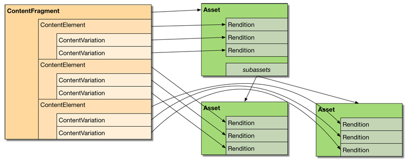

# Inhoudsfragmenten aanpassen en uitbreiden{#customizing-and-extending-content-fragments}

In Adobe Experience Manager als Cloud Service breidt een inhoudsfragment een standaard element uit. zie:

* [Inhoudsfragmenten](/help/assets/content-fragments/content-fragments.md) en [paginascripts maken en beheren met inhoudsfragmenten](/help/sites-cloud/authoring/fundamentals/content-fragments.md) voor meer informatie over inhoudsfragmenten.

* [Elementen](/help/assets/manage-digital-assets.md) beheren en de Asset Editor [](/help/assets/extend-asset-editor.md) aanpassen en uitbreiden voor meer informatie over standaardelementen.

## Architectuur {#architecture}

De basisonderdelen [van een inhoudsfragment](/help/assets/content-fragments/content-fragments.md#constituent-parts-of-a-content-fragment) zijn:

* Een *inhoudsfragment*,
* bestaande uit een of meer *inhoudselementen*,
* en die een of meer *inhoudvariaties* kunnen hebben.

Afhankelijk van het type fragment worden ook modellen of de sjabloon **Eenvoudig fragment** gebruikt:

>[!CAUTION]
>
>[Inhoudsfragmentmodellen](/help/assets/content-fragments/content-fragments-models.md) worden nu aanbevolen voor het maken van al uw fragmenten.
>
>Inhoudsfragmentmodellen worden voor alle voorbeelden in WKND gebruikt.

* Modellen van contentfragmenten:

   * Wordt gebruikt voor het definiëren van inhoudsfragmenten die gestructureerde inhoud bevatten.
   * Inhoudsfragmentmodellen definiëren de structuur van een inhoudsfragment wanneer dit wordt gemaakt.
   * Een fragment verwijst naar het model; wijzigingen in het model kunnen/zullen dus gevolgen hebben voor afhankelijke fragmenten.
   * Modellen zijn samengesteld uit gegevenstypen.
   * Functies om nieuwe variaties toe te voegen, enz., moeten het fragment dienovereenkomstig bijwerken.
   >[!NOTE]
   >
   >Als u een inhoudsfragment wilt weergeven/renderen, moet uw account `read` machtigingen voor het model hebben.

   >[!CAUTION]
   >
   >Wijzigingen in een bestaand inhoudsfragmentmodel kunnen van invloed zijn op afhankelijke fragmenten. dit kan leiden tot weeseigenschappen in die fragmenten .

* Sjabloon voor inhoudsfragment - **Eenvoudig fragment**:

   * Wordt gebruikt voor het definiëren van eenvoudige inhoudsfragmenten.

   * Deze sjabloon definieert de (basis, alleen-tekst) structuur van een inhoudsfragment wanneer het wordt gemaakt.

   * De sjabloon wordt naar het fragment gekopieerd wanneer het wordt gemaakt.

   * Functies om nieuwe variaties toe te voegen, enz., moeten het fragment dienovereenkomstig bijwerken.

   * De sjabloon voor het inhoudsfragment (**eenvoudig fragment**) werkt op een andere manier dan andere sjablonen in het AEM-ecosysteem (bijvoorbeeld paginasjablonen, enz.). Daarom moet deze afzonderlijk worden beschouwd.

   * Wanneer gebaseerd op het **Eenvoudige malplaatje van het Fragment** wordt het MIME type van de inhoud beheerd op de daadwerkelijke inhoud; dit betekent dat elk element en elke variatie een ander MIME-type kunnen hebben.

### Integratie van sites met middelen {#integration-of-sites-with-assets}

CFM (Content Fragment Management) maakt als volgt deel uit van AEM Assets:

* Inhoudsfragmenten zijn elementen.
* Ze gebruiken de bestaande functionaliteit Elementen.
* Ze zijn volledig geïntegreerd met middelen (beheerconsoles, enz.).

Inhoudsfragmenten worden als volgt beschouwd als een functie Sites:

* Deze worden gebruikt bij het ontwerpen van uw pagina&#39;s.

#### Gestructureerde inhoudsfragmenten toewijzen aan elementen {#mapping-structured-content-fragments-to-assets}


Inhoudsfragmenten met gestructureerde inhoud (d.w.z. gebaseerd op een inhoudsfragmentmodel) worden toegewezen aan één element:

* Alle inhoud wordt opgeslagen onder het `jcr:content/data` knooppunt van het element:

   * De elementgegevens worden opgeslagen onder het hoofdsubknooppunt:
      `jcr:content/data/master`

   * Variaties worden opgeslagen onder een subknooppunt met de naam van de variatie:
bijv. `jcr:content/data/myvariation`

   * De gegevens van elk element worden in het desbetreffende subknooppunt opgeslagen als een eigenschap met de elementnaam:
De inhoud van het element `text` wordt bijvoorbeeld opgeslagen als eigenschap `text` op `jcr:content/data/master`

* Metagegevens en bijbehorende inhoud worden hieronder opgeslagen `jcr:content/metadata`Met uitzondering van de titel en beschrijving, die niet als traditionele metagegevens worden beschouwd en die worden opgeslagen op `jcr:content`

#### Eenvoudige inhoudsfragmenten toewijzen aan elementen {#mapping-simple-content-fragments-to-assets}



Eenvoudige inhoudsfragmenten (gebaseerd op de sjabloon **Eenvoudig fragment** ) worden toegewezen aan een samenstelling die bestaat uit een hoofdelement en (optionele) subelementen:

* Alle niet-inhoudinformatie van een fragment (zoals titel, beschrijving, metagegevens, structuur) wordt uitsluitend beheerd op het hoofdelement.
* De inhoud van het eerste element van een fragment wordt toegewezen aan de oorspronkelijke uitvoering van het hoofdelement.

   * De variaties (indien aanwezig) van het eerste element worden toegewezen aan andere uitvoeringen van het hoofdelement.

* Aanvullende elementen (indien aanwezig) worden toegewezen aan subactiva van het hoofdactief.

   * De belangrijkste inhoud van deze aanvullende elementen is gekoppeld aan de oorspronkelijke uitvoering van het respectieve subactief.
   * Andere variaties (indien van toepassing) van eventuele aanvullende elementen die zijn toegewezen aan andere uitvoeringen van het desbetreffende subactief.

#### Locatie van element {#asset-location}

Net als bij standaardelementen wordt een inhoudsfragment opgeslagen onder:

`/content/dam`

#### Elementmachtigingen {#asset-permissions}

Zie [Inhoudsfragment - Overwegingen](/help/assets/content-fragments/content-fragments-delete.md)verwijderen voor meer informatie.

#### Functieintegratie {#feature-integration}

Integreren met de kern Elementen:

* De functie CFM (Content Fragment Management) is gebaseerd op de kern Elementen.

* CFM biedt zijn eigen implementaties voor items in de kaart-, kolom- of lijstweergaven; Deze plug-in de bestaande implementaties voor het renderen van de inhoud van Elementen.

* Verschillende middelencomponenten zijn uitgebreid om rekening te houden met inhoudsfragmenten.

### Inhoudsfragmenten op pagina&#39;s gebruiken {#using-content-fragments-in-pages}

>[!CAUTION]
>
>De component [Inhoudsfragment maakt deel uit van Core Components](https://docs.adobe.com/content/help/en/experience-manager-core-components/using/components/content-fragment-component.html). Zie [Core Components](https://docs.adobe.com/content/help/en/experience-manager-core-components/using/developing/developing.html) ontwikkelen voor meer informatie.

Vanuit AEM-pagina&#39;s kan naar inhoudsfragmenten worden verwezen, net als met elk ander elementtype. AEM biedt de kerncomponent **[van het](https://docs.adobe.com/content/help/en/experience-manager-core-components/using/components/content-fragment-component.html)**inhoudsfragment - een[component waarmee u inhoudsfragmenten op uw pagina](/help/sites-cloud/authoring/fundamentals/content-fragments.md#adding-a-content-fragment-to-your-page)&#39;s kunt opnemen. U kunt deze kerncomponent**[Inhoudsfragment](https://docs.adobe.com/content/help/en/experience-manager-core-components/using/developing/developing.html)** ook uitbreiden.

* De component gebruikt de `fragmentPath` eigenschap om naar het daadwerkelijke inhoudsfragment te verwijzen. De `fragmentPath` onroerende goederen worden op dezelfde wijze afgehandeld als soortgelijke eigendommen van andere soorten activa; bijvoorbeeld wanneer het inhoudsfragment naar een andere locatie wordt verplaatst.

* Met de component kunt u de variatie selecteren die moet worden weergegeven.

* Bovendien kan een reeks alinea&#39;s worden geselecteerd om de uitvoer te beperken; Dit kan bijvoorbeeld worden gebruikt voor uitvoer met meerdere kolommen.

* De component staat tussenliggende inhoud toe:

   * Hier kunt u andere elementen (afbeeldingen, enz.) plaatsen tussen de alinea&#39;s van het fragment waarnaar wordt verwezen.

   * Voor tussenliggende inhoud moet u:

      * zich bewust zijn van de mogelijkheid van onstabiele referenties; tussenliggende inhoud (toegevoegd tijdens het ontwerpen van een pagina) heeft geen vaste relatie met de alinea die naast de inhoud wordt geplaatst, waarbij een nieuwe alinea (in de inhoudfragmenteditor) wordt ingevoegd voordat de positie van de tussenliggende inhoud de relatieve positie kan verliezen

      * Overweeg de extra parameters (zoals variatie en paragraaffilters) om te vormen wat op de pagina wordt teruggegeven

>[!NOTE]
>
>**Inhoudsfragmentmodel:**
>
>Wanneer u een inhoudsfragment gebruikt dat is gebaseerd op een inhoudsfragmentmodel op een pagina, wordt naar het model verwezen. Dit betekent dat als het model niet is gepubliceerd op het moment dat u de pagina publiceert, dit wordt gemarkeerd en het model wordt toegevoegd aan de bronnen die met de pagina moeten worden gepubliceerd.
>
>**Sjabloon voor inhoudsfragment - Eenvoudig fragment:**
>
>Wanneer u een inhoudsfragment gebruikt dat is gebaseerd op de sjabloon **Eenvoudig fragment** van het inhoudsfragment op een pagina, is er geen verwijzing omdat de sjabloon is gekopieerd bij het maken van het fragment.

### Integratie met andere frameworks {#integration-with-other-frameworks}

Inhoudsfragmenten kunnen worden geïntegreerd met:

* **Vertalingen**

   Inhoudsfragmenten zijn volledig geïntegreerd met de AEM-vertaalworkflow. Op architectonisch niveau betekent dit:

   * De afzonderlijke vertalingen van een inhoudsfragment zijn eigenlijk afzonderlijke fragmenten. bijvoorbeeld:

      * zij zijn in verschillende taalgebieden gevestigd; maar deel exact hetzelfde relatieve pad onder de relevante taalbasis:

         `/content/dam/<path>/en/<to>/<fragment>`

         vs

         `/content/dam/<path>/de/<to>/<fragment>`
   * Naast de op regel gebaseerde paden bestaat er geen verdere verbinding tussen de verschillende taalversies van een inhoudsfragment. ze worden behandeld als twee afzonderlijke fragmenten, hoewel de interface de mogelijkheid biedt om tussen de taalvarianten te navigeren.
   >[!NOTE]
   >
   >De AEM-vertaalworkflow werkt met `/content`:
   >
   >* Aangezien de modellen van het inhoudsfragment in verblijven `/conf`, zijn deze niet inbegrepen in dergelijke vertalingen. U kunt de UI-tekenreeksen internationaliseren.


* **Metagegevensschema&#39;s**

   * Inhoudsfragmenten (opnieuw) gebruiken de [metagegevensschema](/help/assets/metadata-schemas.md)&#39;s die met standaardelementen kunnen worden gedefinieerd.

   * CFM biedt een eigen, specifiek schema:

      `/libs/dam/content/schemaeditors/forms/contentfragment`

      dit kan zo nodig worden verlengd .

   * Het respectievelijke schema-formulier is geïntegreerd met de fragmenteditor.

## De API voor contentfragmentbeheer - Server-kant {#the-content-fragment-management-api-server-side}

U kunt de server-kant API gebruiken om tot uw inhoudsfragmenten toegang te hebben; zie:

[com.adobe.cq.dam.cfm](https://docs.adobe.com/content/help/en/experience-manager-cloud-service/implementing/developing/ref/javadoc/com/adobe/cq/dam/cfm/package-frame.html)

>[!CAUTION]
>
>Het wordt ten zeerste aanbevolen de server-side API te gebruiken in plaats van rechtstreeks toegang te krijgen tot de inhoudsstructuur.

### Belangrijke interfaces {#key-interfaces}

De volgende drie interfaces kunnen als ingangspunten dienen:

* **Inhoudsfragment** ([ContentFragment](https://docs.adobe.com/content/help/en/experience-manager-cloud-service/implementing/developing/ref/javadoc/com/adobe/cq/dam/cfm/ContentFragment.html))

   Met deze interface kunt u op abstracte wijze werken met een inhoudsfragment.

   De interface voorziet u van de middelen:

   * Basisgegevens beheren (bijvoorbeeld naam ophalen; get/set titel/beschrijving)
   * Toegang tot metagegevens
   * Toegangselementen:

      * Lijstelementen
      * Elementen op naam ophalen
      * Nieuwe elementen maken (zie [Voorzorgsmaatregelen](#caveats))

      * Gegevens over toegangselementen (zie `ContentElement`)
   * Variaties weergeven die zijn gedefinieerd voor het fragment
   * Nieuwe variaties wereldwijd maken
   * Gekoppelde inhoud beheren:

      * Lijstverzamelingen
      * Verzamelingen toevoegen
      * Verzamelingen verwijderen
   * Open het model of de sjabloon van het fragment
   De interfaces die de belangrijkste elementen van een fragment vertegenwoordigen zijn:

   * **Content Element** ([ContentElement](https://docs.adobe.com/content/help/en/experience-manager-cloud-service/implementing/developing/ref/javadoc/com/adobe/cq/dam/cfm/ContentElement.html))

      * Basisgegevens ophalen (naam, titel, beschrijving)
      * Inhoud ophalen/instellen
      * Toegang tot variaties van een element:

         * Variaties weergeven
         * Variaties ophalen op naam
         * Nieuwe variaties maken (zie [Voorkeuren](#caveats))
         * Variaties verwijderen (zie [Voorwerpen](#caveats))
         * Toegang tot variatiegegevens (zie `ContentVariation`)
      * Sneltoets voor het oplossen van variaties (door een aanvullende, implementatiespecifieke fallback-logica toe te passen als de opgegeven variatie niet beschikbaar is voor een element)
   * **Inhoudsvariatie** ([ContentVariation](https://docs.adobe.com/content/help/en/experience-manager-cloud-service/implementing/developing/ref/javadoc/com/adobe/cq/dam/cfm/ContentVariation.html))

      * Basisgegevens ophalen (naam, titel, beschrijving)
      * Inhoud ophalen/instellen
      * Eenvoudige synchronisatie, gebaseerd op laatst gewijzigde informatie
   Alle drie interfaces ( `ContentFragment`, `ContentElement`, `ContentVariation`) breiden de `Versionable` interface uit, die versiemogelijkheden toevoegt, die voor inhoudsfragmenten worden vereist:

   * Nieuwe versie van het element maken
   * Versies van het element weergeven
   * Hiermee wordt de inhoud opgehaald van een specifieke versie van het element met versiebeheer


### Aanpassen - Using adjustTo() {#adapting-using-adaptto}

Het volgende kan worden aangepast:

* `ContentFragment` kan worden aangepast aan:

   * `Resource` - de onderliggende sloopbron; wanneer u de onderliggende waarde `Resource` rechtstreeks wilt bijwerken, moet u het `ContentFragment` object opnieuw opbouwen.

   * `Asset` - de DAM- `Asset` abstractie die het inhoudsfragment vertegenwoordigt; wanneer u het `Asset` object `ContentFragment` rechtstreeks wilt bijwerken, moet u het opnieuw samenstellen.

* `ContentElement` kan worden aangepast aan:

   * `ElementTemplate` - voor toegang tot de structurele informatie van het element.

* `Resource` kan worden aangepast aan:

   * `ContentFragment`

### Caveats {#caveats}

Er zij op gewezen dat:

* De gehele API is zo ontworpen dat wijzigingen **niet** automatisch worden voortgezet (tenzij anders vermeld in de API JavaDoc). Zo zult u altijd de middeloplosser van het respectieve verzoek (of resolver moeten begaan u eigenlijk gebruikt).

* Taken die extra inspanning zouden kunnen vereisen:

   * Maak nieuwe variaties van `ContentFragment` om de gegevensstructuur bij te werken.

   * Als u bestaande variaties via een element verwijdert, worden de algemene gegevensstructuren die aan de variatie zijn toegewezen, niet bijgewerkt `ContentElement.removeVariation()`met het gebruik van dat element. Om ervoor te zorgen dat deze gegevensstructuren gesynchroniseerd blijven, gebruikt u `ContentFragment.removeVariation()` in plaats daarvan, waardoor een variatie wereldwijd wordt verwijderd.

## De API voor contentfragmentbeheer - Client-kant {#the-content-fragment-management-api-client-side}

>[!CAUTION]
>
>De client-side API is intern.

### Additional Information {#additional-information}

Zie het volgende:

* `filter.xml`

   De methode `filter.xml` voor het beheer van inhoudsfragmenten is zo geconfigureerd dat deze niet overlapt met het inhoudspakket voor de kernelementen.

## Sessies bewerken {#edit-sessions}

>[!CAUTION]
>
>Houd rekening met deze achtergrondinformatie. U wordt geacht hier niets te veranderen (aangezien het als *privé gebied* in de bewaarplaats wordt gemerkt), maar het zou in sommige gevallen kunnen helpen om te begrijpen hoe de dingen onder de kap werken.

Het bewerken van een inhoudsfragment, dat meerdere weergaven kan beslaan (= HTML-pagina&#39;s), is atomisch. Aangezien dergelijke atomische multi-view bewerkingsmogelijkheden geen typisch concept AEM zijn, gebruiken de inhoudsfragmenten wat een *het uitgeven zitting* wordt genoemd.

Er wordt een bewerkingssessie gestart wanneer de gebruiker een inhoudsfragment in de editor opent. De bewerkingssessie is voltooid wanneer de gebruiker de editor verlaat door **Opslaan** of **Annuleren** te selecteren.

Technisch gezien worden alle bewerkingen uitgevoerd op *live* -inhoud, net als bij alle andere AEM-bewerkingen. Wanneer de bewerkingssessie wordt gestart, wordt een versie van de huidige, onbewerkte status gemaakt. Als een gebruiker een bewerking annuleert, wordt die versie hersteld. Als de gebruiker op **Opslaan** klikt, gebeurt er niets specifieks, aangezien alle bewerkingen zijn uitgevoerd op *live* -inhoud. Alle wijzigingen blijven daarom al behouden. Als u op **Opslaan** klikt, wordt er ook een achtergrondverwerking gestart (zoals het maken van volledige zoekinformatie voor tekst en/of het verwerken van media-elementen met gemengde tekst).

Er zijn enkele veiligheidsmaatregelen voor randgevallen. bijvoorbeeld als de gebruiker de editor probeert te verlaten zonder de bewerkingssessie op te slaan of te annuleren. Er is ook een periodieke automatische opslag beschikbaar om gegevensverlies te voorkomen.
Twee gebruikers kunnen hetzelfde inhoudsfragment gelijktijdig bewerken en overschrijven daarom elkaars wijzigingen. Om dit te voorkomen, moet het inhoudsfragment worden vergrendeld door de *uitcheckactie* van de DAM-administratie op het fragment toe te passen.

## Voorbeelden {#examples}

### Voorbeeld: Een bestaand inhoudsfragment openen {#example-accessing-an-existing-content-fragment}

Hiertoe kunt u de bron die de API vertegenwoordigt aanpassen aan:

`com.adobe.cq.dam.cfm.ContentFragment`

Bijvoorbeeld:

```java
// first, get the resource
Resource fragmentResource = resourceResolver.getResource("/content/dam/fragments/my-fragment");
// then adapt it
if (fragmentResource != null) {
    ContentFragment fragment = fragmentResource.adaptTo(ContentFragment.class);
    // the resource is now accessible through the API
}
```

### Voorbeeld: Een nieuw inhoudsfragment maken {#example-creating-a-new-content-fragment}

Als u programmatisch een nieuw inhoudsfragment wilt maken, moet u een`FragmentTemplate` aangepast fragment gebruiken op basis van een model of sjabloonbron.

Bijvoorbeeld:

```java
Resource templateOrModelRsc = resourceResolver.getResource("...");
FragmentTemplate tpl = templateOrModelRsc.adaptTo(FragmentTemplate.class);
ContentFragment newFragment = tpl.createFragment(parentRsc, "A fragment name", "A fragment description.");
```

### Voorbeeld: Het interval voor automatisch opslaan opgeven {#example-specifying-the-auto-save-interval}

Het interval [voor](/help/assets/content-fragments/content-fragments-managing.md#save-cancel-and-versions) automatisch opslaan (gemeten in seconden) kan worden gedefinieerd met de configuratiemanager (ConfMgr):

* Knooppunt: `<conf-root>/settings/dam/cfm/jcr:content`
* Naam eigenschap: `autoSaveInterval`
* Type: `Long`

* Standaard: `600` (10 minuten); dit is gedefinieerd op `/libs/settings/dam/cfm/jcr:content`

Als u een auto sparen interval van 5 minuten wilt plaatsen moet u het bezit op uw knoop bepalen; bijvoorbeeld:

* Knooppunt: `/conf/global/settings/dam/cfm/jcr:content`
* Naam eigenschap: `autoSaveInterval`

* Type: `Long`

* Waarde: `300` (5 minuten komt overeen met 300 seconden)

## Componenten voor paginaontwerp {#components-for-page-authoring}

Zie voor meer informatie

* [Core Components - Content Fragment Component](https://docs.adobe.com/content/help/en/experience-manager-core-components/using/components/content-fragment-component.html) (aanbevolen)
