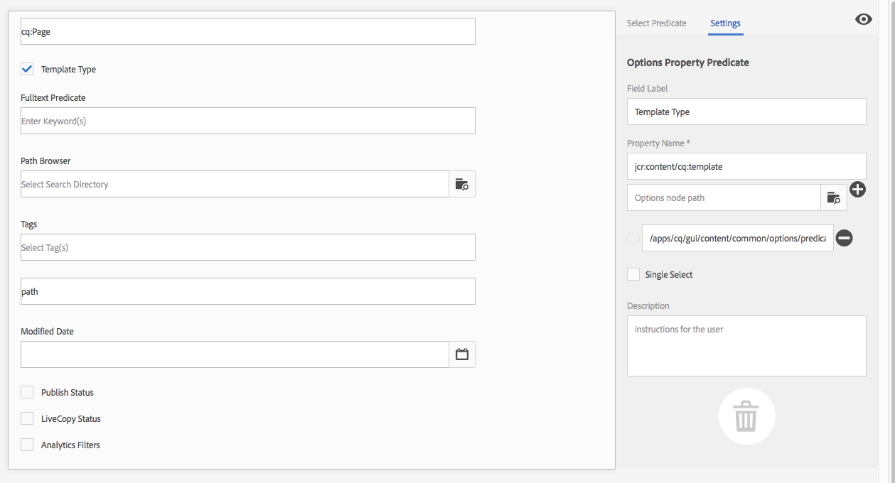

# Zoeken in Forms configureren {#configuring-search-forms}

Adobe Experience Manager as a Cloud Service komt met een krachtig [ mechanisme van het Onderzoek ](/help/sites-cloud/authoring/search.md).

In combinatie hiermee is er ook een set vooraf gedefinieerde opties waarmee u de inhoud kunt filteren. Deze greep vooraf bepaalde facetten zoals **Gewijzigde Datum**, **publiceer Status**, of **Status van de Leef** om u te helpen snel neer boren aan de middelen u nodig hebt.

Samen helpen u om uw inhoud snel en gemakkelijk te vinden van:

* [Zoeken en filteren](/help/sites-cloud/authoring/search.md#search-and-filter)
* [Spoorwegkiezer](/help/sites-cloud/authoring/basic-handling.md#rail-selector)
* Browser van [ Assets ](/help/sites-cloud/authoring/page-editor/editor-side-panel.md#assets-browser) (wanneer het uitgeven van pagina&#39;s)

>[!NOTE]
>
>U kunt het onderliggende [ Onderzoek van de Inhoud en het Indexeren ](/help/operations/indexing.md) dienst vormen.

Gebruikend **Onderzoek Forms**, kunt u, deze panelen aanpassen en uitbreiden, volgens uw specifieke behoeften.

Het **Onderzoek Forms** verstrekt een uit-van-de-doosselectie van [ voorspelt ](#predicates-and-their-settings) dat u kunt combineren en bepalen. De [ dialogen voor het vormen van deze vormen ](#configuring-your-search-forms) kunnen via worden betreden:

* **Hulpmiddelen**
   * **Algemeen**
      * **Onderzoek Forms**

## Standaard Forms {#default-forms}

Wanneer u eerst tot het **Onderzoek Forms** console toegang hebt kunt u zien dat alle configuraties een hangslotsymbool hebben. Dit wijst erop dat de overeenkomstige configuratie de standaardconfiguratie (uit-van-de-doos) is - en kan niet worden geschrapt. Zodra u hebt aangepast, en bewaard, zal een configuratie het slot verdwijnen. Het zal opnieuw verschijnen wanneer u [ uw aangepaste configuratie ](#deleting-a-configuration-to-reinstate-the-default) schrapt, waarin het gebrek (en de hangslotindicator) wordt hersteld.

De standaardconfiguraties (alfabetisch weergegeven) zijn:

* **Assets Admin Rail van het Onderzoek**
* **Redacteur van de Pagina (het onderzoek van Documenten)**
* **de Redacteur van de Pagina (het Onderzoek van Fragmenten van de Ervaring)**
* **de Redacteur van de Pagina (het onderzoek van het Beeld)**
* **Redacteur van de Pagina (het onderzoek van Manuscript)**
* **Redacteur van de Pagina (het onderzoek van de Pagina)**
* **Redacteur van de Pagina (het onderzoek van Paragraaf)**
* **Redacteur van de Pagina (het onderzoek van het Product)**
* **de Redacteur van de Pagina (onderzoek Scene7)**
* **de Redacteur van de Pagina (Video onderzoek)**
* **Rail van het Onderzoek van Admin van het Project {**
* **Rail van het Onderzoek van de Vertaling van het Project**
* **Rail van het Onderzoek van Plaatsen Admin**
* **Fragmenten Admin Rail van het Onderzoek van Admin**
* **Rail van het Onderzoek van Admin van het Beeld**
* **Modellen van het Fragment van de Inhoud van het Onderzoek Rail**
* **Rail van het Onderzoek van Admin van het Project {**
* **Rail van het Onderzoek van de Vertaling van het Project**

>[!NOTE]
>
>Voor meer details over activa verwante onderzoeksvormen, zie [ Assets - de Facetten van het Onderzoek ](/help/assets/search-facets.md).

## Voorspellen en de bijbehorende instellingen {#predicates-and-their-settings}

### Voorspellen {#predicates}

De volgende predikaten zijn beschikbaar, afhankelijk van de configuratie:

<table>
 <tbody>
  <tr>
   <th>Voorspelend</th>
   <th>Doel</th>
   <th>Instellingen</th>
  </tr>
  <tr>
   <td>Analyse</td>
   <td>Mogelijkheden zoeken/filteren in de Sites-browser bij het weergeven van gegevens met analysemogelijkheden. De zoekfilters van Analytics laden tot aan de in kaart gebrachte aangepaste analytische kolommen.</td>
   <td>
    <ul>
     <li>Veldlabel</li>
     <li>Beschrijving</li>
    </ul> </td>
  </tr>
  <tr>
   <td>Goedkeuringsstatus</td>
   <td>Zoeken op basis van goedkeuringsstatus.</td>
   <td>
    <ul>
     <li>Veldlabel</li>
     <li>Eigenschapnaam*</li>
     <li>Beschrijving</li>
    </ul> 
   </td>
  </tr>
  <tr>
   <td>Auteur</td>
   <td>Zoeken volgens auteur.</td>
   <td>
    <ul>
     <li>Plaatsaanduiding</li>
     <li>Eigenschapnaam*</li>
     <li>Beschrijving</li>
    </ul> 
   </td>
  </tr>
  <tr>
   <td>Uitgecheckt door</td>
   <td>Zoeken naar elementen die zijn uitgecheckt door een specifieke gebruiker.</td>
   <td>
    <ul>
     <li>Veldlabel</li>
     <li>Plaatsaanduiding</li>
     <li>Beschrijving</li>
    </ul> 
   </td>
  </tr>
  <tr>
   <td>Afhandelingsstatus</td>
   <td>Zoeken naar elementen met een specifieke status voor uitchecken.</td>
   <td>
    <ul>
     <li>Veldlabel</li>
     <li>Eigenschapnaam*</li>
     <li>Beschrijving</li>
    </ul> 
   </td>
  </tr>
  <tr>
   <td>Onderdelen</td>
   <td>Hiermee kan een auteur zoeken/filteren op pagina's die een specifieke component bevatten. Bijvoorbeeld, een beeldgalerij.  </td>
   <td>
    <ul>
     <li>Plaatsaanduiding</li>
     <li>Eigenschapnaam*</li>
     <li>Diepte van eigenschap</li>
     <li>Beschrijving</li>
    </ul> </td>
  </tr>
  <tr>
   <td>Datumbereik</td>
   <td>Zoek naar middelen die binnen een gespecificeerde waaier voor een datumbezit worden gecreeerd. In het deelvenster Zoeken kunt u begin- en einddatums opgeven.</td>
   <td>
    <ul>
     <li>Veldlabel</li>
     <li>Plaatsaanduiding</li>
     <li>Eigenschapnaam*</li>
     <li>Bereik tekst (Van)*</li>
     <li>Bereik tekst (naar)*</li>
     <li>Beschrijving</li>
    </ul> </td>
  </tr>
  <tr>
   <td>Vervalstatus</td>
   <td>Zoek bronnen op basis van de vervalstatus.</td>
   <td>
    <ul>
     <li>Veldlabel</li>
     <li>Eigenschapnaam*</li>
     <li>Beschrijving</li>
    </ul> </td>
  </tr>
  <tr>
   <td>Bestandsgrootte</td>
   <td>Bronnen filteren op basis van hun grootte.</td>
   <td>
    <ul>
     <li>Veldlabel</li>
     <li>Eigenschapnaam*</li>
     <li>Optiepad</li>
     <li>Beschrijving</li>
    </ul> </td>
  </tr>
  <tr>
   <td>Bestandstype</td>
   <td>Elementen zoeken op basis van het bestands-/mime-type.</td>
   <td>
    <ul>
     <li>Veldlabel</li> 
     <li>Eigenschapnaam*</li>
     <li>Mimetype-pad</li>
     <li>Beschrijving</li>
    </ul> 
   </td>
  </tr>
  <tr>
   <td>Fulltext</td>
   <td>Zoeken voorspelt zoekopdrachten in volledige tekst. Het is toegewezen met de operator "jcr:contains".</td>
   <td>
    <ul>
     <li>Plaatsaanduiding</li>
     <li>Eigenschapnaam</li>
     <li>Beschrijving</li>
    </ul> </td>
  </tr>
  <tr>
   <td>Groep</td>
   <td>Zoeken naar voorspellingen voor groep (alleen gebruikt binnen het voorvoegsel Inzichten).</td>
   <td>
    <ul>
     <li>Veldlabel</li>
     <li>Beschrijving</li>
    </ul> </td>
  </tr>
  <tr>
   <td>Verborgen filter</td>
   <td>Een filter op eigenschap en waarde, niet zichtbaar voor de gebruiker.</td>
   <td>
    <ul>
     <li>Eigenschapnaam*</li>
     <li>Waarde van eigenschap*</li>
     <li>Beschrijving</li>
    </ul> </td>
  </tr>
  <tr>
   <td>Inzichten</td>
   <td>Zoek volgens een selectie van parameters van Inzichten.</td>
   <td>Dit is een complexe predikaat die uit veelvoudige predikaten wordt samengesteld:
    <ul>
     <li>Groep</li>
     <li>Bereik</li>
     <li>Opties</li>
    </ul> 
   </td>
  </tr>
  <tr>
   <td>Lid van herkomst</td>
   <td>Zoeken naar elementen die lid zijn van een verzameling</td>
   <td>
    <ul>
     <li>Beschrijving</li>
    </ul> 
   </td>
  </tr>
  <tr>
   <td>Eigenschap voor meerdere waarden</td>
   <td>Zoeken op meerdere waarden van een opgegeven eigenschap.</td>
   <td>
    <ul>
     <li>Veldlabel</li>
     <li>Plaatsaanduiding</li>
     <li>Eigenschapnaam*</li>
     <li>Delimiter-ondersteuning</li>
     <li>Invoerscheidingstekens</li>
     <li>Hoofdlettergebruik negeren</li>
     <li>Beschrijving</li>
    </ul> 
   </td>
  </tr>
  <tr>
   <td>Opties</td>
   <td>
De opties zijn inhoudsknooppunten die door de gebruiker zijn gemaakt.
 
Zie <a href="#addinganoptionspredicate"> Toevoegend een Predicate van Opties </a> voor meer informatie.
 </td>
   <td>
    <ul>
     <li>Veldlabel</li>
     <li>Eigenschapnaam*</li>
     <li>Enkel selecteren</li>
     <li>Opties toevoegen</li>
     <li>Handmatig</li>
     <li>Beschrijving</li>
    </ul> </td>
  </tr>
  <tr>
   <td>Opties, eigenschap</td>
   <td>Zoeken op een of meer eigenschappen van de optie.</td>
   <td>
    <ul>
     <li>Veldlabel</li>
     <li>Eigenschapnaam*</li>
     <li>Pad naar knooppunt Opties</li>
     <li>Diepte van eigenschap</li>
     <li>Enkel selecteren</li>
     <li>Beschrijving</li>
    </ul> </td>
  </tr>
  <tr>
   <td>Paginastatus</td>
   <td>Pagina's filteren op basis van hun status.</td>
   <td>
    <ul>
     <li>Veldlabel</li>
     <li>Naam van eigenschap publiceren*</li>
     <li>Eigenschapnaam vergrendelde pagina's*</li>
     <li>Beschrijving</li>
    </ul> </td>
  </tr>
  <tr>
   <td>Pad</td>
   <td>Filter op basis van een specifiek pad. U kunt meerdere paden opgeven als opties.</td>
   <td>
    <ul>
     <li>Veldlabel</li>
     <li>Zoekpaden toevoegen</li>
     <li>Beschrijving</li>
    </ul> </td>
  </tr>
  <tr>
   <td>Padbrowser</td>
   <td>Geef een padbrowser op om naar een vooraf gedefinieerd hoofdpad te zoeken.</td>
   <td>
    <ul>
     <li>Plaatsaanduiding</li>
     <li>Basispad</li>
     <li>Beschrijving</li>
    </ul> 
   </td>
  </tr>
  <tr>
   <td>Pad verborgen</td>
   <td>Een filter op pad dat niet zichtbaar is voor de gebruiker.</td>
   <td>
    <ul>
     <li>Naam eigenschap ("path")</li>
     <li>Waarde van het onroerend goed (`/content/dam')</li>
    </ul> 
   </td>
  </tr>
  <tr>
   <td>Eigenschap</td>
   <td>Zoeken op een opgegeven eigenschap.</td>
   <td>
    <ul>
     <li>Veldlabel</li>
     <li>Plaatsaanduiding</li>
     <li>Eigenschapnaam</li>
     <li>Gedeeltelijk zoeken</li>
     <li>Hoofdlettergebruik negeren</li>
     <li>Beschrijving</li>
    </ul> 
   </td>
  </tr>
  <tr>
   <td>Status publiceren</td>
   <td>Bronnen filteren op basis van hun publicatiestatus.</td>
   <td>
    <ul>
     <li>Veldlabel</li>
     <li>Eigenschapnaam*</li>
     <li>Beschrijving</li>
    </ul> </td>
  </tr>
  <tr>
   <td>Bereik</td>
   <td>Zoekbronnen binnen een opgegeven bereik. In het paneel van het Onderzoek, kunt u minimum en maximumwaarden voor de waaier specificeren.</td>
   <td>
    <ul>
     <li>Veldlabel</li>
     <li>Eigenschapnaam*</li>
     <li>Beschrijving</li>
    </ul> </td>
  </tr>
  <tr>
   <td>Classificatie</td>
   <td>Zoek naar middelen volgens hun gemiddelde classificatie.  </td>
   <td>
    <ul>
     <li>Veldlabel</li>
     <li>Eigenschapnaam*</li>
     <li>Optiepad</li>
     <li>Beschrijving</li>
    </ul> </td>
  </tr>
  <tr>
   <td>Relatieve datum</td>
   <td>Bronnen filteren op basis van de relatieve datum waarop ze zijn gemaakt. 1 week geleden, 1 maand geleden.</td>
   <td>
    <ul>
     <li>Veldlabel</li>
     <li>Eigenschapnaam*</li>
     <li>Relatieve datum</li>
     <li>Beschrijving</li>
    </ul> </td>
  </tr>
  <tr>
   <td>Schuifbereik</td>
   <td>Een gemeenschappelijk onderzoek voorspelt zich uitbreidend de waaiervoorspelling met het schuifvermogen. De waarde van de gezochte eigenschap moet tussen de schuifregelaargrenzen liggen.</td>
   <td>
    <ul>
     <li>Veldlabel</li>
     <li>Eigenschapnaam*</li>
     <li>Pad naar knooppunt Opties</li>
     <li>Beschrijving</li>
    </ul> </td>
  </tr>
  <tr>
   <td>Status</td>
   <td>Zoeken op basis van de status voor goedkeuring en afhandeling.</td>
   <td>Dit is een complexe predikaat die uit veelvoudige predikaten wordt samengesteld:
    <ul>
     <li>Goedkeuringsstatus</li>
     <li>Afhandelingsstatus</li>
    </ul> 
   </td>
  </tr>
  <tr>
   <td>Tags</td>
   <td>Zoeken op basis van tags.</td>
   <td>
    <ul>
     <li>Veldgelavel</li>
     <li>Plaatsaanduiding</li>
     <li>Eigenschapnaam*</li>
     <li>Alle labels weergeven, optie</li>
     <li>Pad van basiscodes</li>
     <li>Beschrijving</li>
    </ul> </td>
  </tr>
  <tr>
   <td>Sjablonen</td>
   <td>Zoeken volgens de geselecteerde sjabloon.</td>
   <td>
    <ul>
     <li>Plaatsaanduiding</li>
     <li>Eigenschapnaam*</li>
     <li>Beschrijving</li>
    </ul> 
   </td>
  </tr>
  <tr>
   <td>Vertaalstatus</td>
   <td>Zoeken volgens de vertaalstatus.</td>
   <td>
    <ul>
     <li>Veldlabel</li>
    </ul> 
   </td>
  </tr>
 </tbody>
</table>

<!--
  <tr>
   <td>Date ???</td>
   <td>Slider-based search of assets based on a date property.</td>
   <td>
    <ul>
     <li>Field Label</li>
     <li>Property Name*</li>
     <li>Description</li>
    </ul> </td>
  </tr>
  <tr>
   <td>Asset Last Modified ?????</td>
   <td>Date the asset was last modified.  </td>
   <td>A customized predicate, based on the Date Predicate.</td>
  </tr>
  <tr>
   <td>Range Options ???</td>
   <td>A specific search predicate for Assets and the same as common Slider Predicate. Is still available due to backward compatibilty issues.</td>
   <td>
    <ul>
     <li>Field Label</li>
     <li>Property Name*</li>
     <li>Option Path</li>
     <li>Description</li>
    </ul> </td>
  </tr>
  <tr>
   <td>Tag </td>
   <td>Search assets based on tags. You can configure the Path property to populate various tags in the Tags list.</td>
   <td>
    <ul>
     <li>Field Label</li>
     <li>Property Name*</li>
     <li>Option Path</li>
     <li>Description</li>
    </ul> </td>
  </tr>
-->

>[!NOTE]
>
>De algemene zoekvoorspelling wordt gedefinieerd in:
>  `/libs/cq/gui/components/common/admin/customsearch/searchpredicates`
>
>Deze informatie is alleen ter referentie. U mag `/libs` niet wijzigen.

<!--
>* Search predicates related only to siteadmin (classic UI) are located under:
> `/libs/cq/gui/components/siteadmin/admin/searchpanel/searchpredicates`
>   * These are deprecated and only available for backward compatibility.
>
-->

### Instellingen voor voorspelling {#predicate-settings}

Afhankelijk van de voorspelling zijn er verschillende instellingen beschikbaar voor de configuratie, waaronder:

* **Etiket van het Gebied**

  Het label dat wordt weergegeven als de inklapbare koptekst of als veldlabel van de voorspelling.

* **Beschrijving**

  Beschrijvende details voor de gebruiker.

* **Placeholder**

  Lege tekst of de plaatsaanduiding van de voorspelling voor het geval er geen filtertekst wordt ingevoerd.

* **de Naam van het Bezit**

  De eigenschap waarop moet worden gezocht. Er wordt een relatief pad gebruikt en de jokertekens `*/*/*` geven de diepte van de eigenschap op ten opzichte van het knooppunt `jcr:content` (elke asterisk vertegenwoordigt één knooppuntniveau).

  Als u alleen wilt zoeken op een onderliggend knooppunt op het eerste niveau van de bron met de eigenschap `x` op het `jcr:content` nodegebruik `*/jcr:content/x`

* **Diepte van het Bezit**

  De maximumdiepte om naar dat bezit binnen de middelen te zoeken. Een zoekopdracht naar die eigenschap kan dus worden uitgevoerd op een resource en recursieve onderliggende elementen totdat het niveau van de onderliggende objecten gelijk is aan de opgegeven diepte.

* **Waarde van het Bezit**

  De eigenschapswaarde als een absolute tekenreeks of als expressietaal, bijvoorbeeld `cq:Page` of

  `${empty requestPathInfo.suffix ? "/content" : requestPathInfo.suffix}`.

* **Tekst van de Waaier**

  Het etiket van het waaiergebied in de **Waaier van de Datum** voorspelt.

* **Pad van de Optie**

  De gebruiker kan het pad selecteren met behulp van de Padbrowser op het tabblad Voorspelfunctie. Nadat u het pictogram **+** hebt geselecteerd, wordt de selectie toegevoegd aan de lijst met geldige opties (en wordt het pictogram **-** indien nodig verwijderd).

  De opties zijn inhoudsknooppunten die door de gebruiker zijn gemaakt en die de volgende structuur hebben:

  `(jcr:primaryType = nt:unstructured, value (String), jcr:title (String))`

* **de knoopweg van Opties**
In feite het zelfde als het **Weg van Opties**, slechts is dit op het gemeenschappelijke predikaat gebied, andere specifiek voor activa is.

* **Enige Uitgezochte**
Als deze optie is ingeschakeld, worden de opties weergegeven als selectievakjes die slechts één selectie toestaan. Als u per ongeluk een selectievakje hebt ingeschakeld, kan dit worden uitgeschakeld.

* **publiceer en Levende Naam van het Bezit van het Exemplaar**
De etiketten voor publiceren en levende exemplaarcontroledozen voor het specifieke predikaat van Plaatsen.

* &amp;ast; op de gebiedslabels op het **lusje van Montages** betekent de gebieden verplicht zijn en als verlaten leeg een foutenmelding zal verschijnen.

## Uw zoekopdracht configureren, Forms {#configuring-your-search-forms}

### Een aangepaste configuratie maken/openen {#creating-opening-a-customized-configuration}

1. Navigeer aan **Hulpmiddelen**, **Algemeen**, **Onderzoek Forms**.

1. Selecteer de configuratie die u wilt aanpassen.
1. Gebruik **geef** pictogram uit om de configuratie voor het bijwerken te openen.
1. Als een nieuwe aanpassing u waarschijnlijk [ zult willen toevoegen nieuwe voorspellen gebieden en de montages ](#add-edit-a-predicate-field-and-define-field-settings) zoals vereist bepalen. Als een bestaande aanpassing u een bestaand gebied kunt selecteren en [ de montages ](#add-edit-a-predicate-field-and-define-field-settings) bijwerken.
1. Selecteer **Gedaan** om de configuratie te bewaren. De volgende keer dat de configuratie wordt gebruikt, zijn uw wijzigingen zichtbaar.

   >[!NOTE]
   >
   >De aangepaste configuraties worden (indien van toepassing) opgeslagen onder:
   >
   >* `/apps/cq/gui/content/facets/<option>`
   >* `/apps/commerce/gui/content/facets/<option>`

### Een voorspelbaar veld toevoegen/bewerken en veldinstellingen definiëren {#add-edit-a-predicate-field-and-define-field-settings}

U kunt velden toevoegen of bewerken en de instellingen van velden definiëren/bijwerken:

1. [ open de aangepaste configuratie ](#creating-opening-a-customized-configuration) voor het bijwerken.
1. Als u een nieuw gebied wilt toevoegen, open **Uitgezochte Predicate** tabel en sleep vereiste predikaat aan de vereiste plaats. Bijvoorbeeld, het **Predicate van de Waaier van de Datum**:

    toe

1. Afhankelijk van of:

   * U voegt een nieuw veld toe:

     Na het toevoegen van predikaat, opent het **lusje van Montages** en toont de eigenschappen die kunnen worden bepaald.

   * U wilt een bestaande voorspelling bijwerken:

     Selecteer het predikaat gebied (op het recht), dan open de **Montages** tabel.

   Bijvoorbeeld, de montages voor het **Predicate van de Waaier van de Datum**:

   

1. Breng zonodig uw veranderingen aan en bevestig met **Gereed**. De volgende keer dat de configuratie wordt gebruikt, zijn uw wijzigingen zichtbaar.

### Een voorvertoning weergeven van de zoekconfiguratie {#previewing-the-search-configuration}

1. Selecteer het pictogram Voorvertoning:

   

1. Hiermee geeft u de zoekformulieren weer zoals deze worden weergegeven (volledig uitgevouwen) in de kolom Zoeken van de desbetreffende console.

   

1. **dicht** de voorproef om de configuratie terug te keren en te beëindigen.

### Een voorspelbaar veld verwijderen {#deleting-a-predicate-field}

1. [ open de aangepaste configuratie ](#creating-opening-a-customized-configuration) voor het bijwerken.
1. Selecteer het voorspelbare gebied (op het recht), open het **lusje van Montages** en selecteer dan het **Schrapping** pictogram (linksonder).

   

1. In een dialoogvenster wordt bevestiging van de verwijderactie gevraagd.

1. Bevestig dit en om het even welke andere veranderingen met **Gereed**.

### Een configuratie verwijderen (om de standaardinstelling te herstellen) {#deleting-a-configuration-to-reinstate-the-default}

Zodra u een configuratie hebt aangepast zal dit de gebreken met voeten treden. U kunt de standaardconfiguratie herstellen door uw aangepaste configuratie te schrappen.

>[!NOTE]
>
>U kunt de standaardconfiguraties niet verwijderen.

Het schrappen van een aangepaste configuratie wordt gedaan van de console:

1. Selecteer de vereiste configuratie (bijvoorbeeld, **Redacteur van de Pagina (het onderzoek van Paragraaf)**) en toen **schrap** pictogram in de toolbar:

   

1. De aangepaste configuratie wordt verwijderd en de standaardinstelling wordt hersteld (dit wordt aangegeven door het opnieuw verschijnen van het hangslotsymbool in de console).

### Voorwaarden voor opties toevoegen {#adding-options-predicates}

De voorspelling van de optie (Opties, het Bezit van Opties) staat u toe om een punt te vormen dat moet worden gezocht naar. Deze worden meestal gebruikt om rechtstreeks onder de pagina naar iets te zoeken, bijvoorbeeld een eigenschap op het paginaknooppunt.

In het volgende voorbeeld (om te zoeken op basis van de sjabloon die wordt gebruikt om een pagina te maken) worden de desbetreffende stappen geïllustreerd:

1. Maak het knooppunt waarin de eigenschap wordt gedefinieerd waarop moet worden gezocht.

   U hebt een basisknooppunt met definities van de afzonderlijke opties nodig om beschikbaar te zijn voor de gebruiker.

   De knooppunten voor de afzonderlijke opties hebben de volgende eigenschappen nodig:

   * `jcr:title` - het veldlabel dat moet worden weergegeven in de zoekrail
   * `value` - de eigenschapswaarde waarop moet worden gezocht

   

   >[!NOTE]
   >
   >U ***moet*** niets in de `/libs` weg veranderen.
   >
   >De reden hiervoor is dat de inhoud van `/libs` de volgende keer dat u een upgrade uitvoert van de instantie wordt overschreven (en dat deze inhoud ook kan worden overschreven wanneer u een hotfix- of functiepakket toepast).
   >
   >De aanbevolen methode voor configuratie en andere wijzigingen is:
   >
   >1. Herstel het vereiste item, zoals het in `/libs` onder `/apps` staat. In dit geval:
   >1. `/libs/cq/gui/content/common/options/predicates`
   >1. Breng eventuele wijzigingen aan binnen `/apps.`

1. Open de **console van Forms van het Onderzoek** en selecteer de configuratie u wilt bijwerken. Bijvoorbeeld, **Sites Admin sporen van het Onderzoek**. Dan uitgezocht **geef** uit.

1. Afhankelijk van de configuratie voeg een **Opties** of **Bezit van Opties** aan de configuratie toe.
1. Werk de velden bij, met name:

   * **de Naam van het Bezit**

     Specifiek het knoopbezit dat op de doelknopen moet worden gezocht. Bijvoorbeeld:

     `jcr:content/cq:template`

   * **de knoopweg van de Optie**

     Selecteer het pad naar de locatie waar uw opties staan. Bijvoorbeeld:

     `/apps/cq/gui/content/common/options/predicates/templatetype`

   

1. Selecteer **Gedaan** om uw configuratie te bewaren.
1. Navigeer aan de aangewezen console (in dit voorbeeld, **Plaatsen**) en open het **Onderzoek - Filters** spoor. De nieuwe zoekformulieren en de verschillende opties zijn zichtbaar. Selecteer de gewenste optie om de zoekresultaten weer te geven.

    worden gebruikt

## Gebruikersmachtigingen {#user-permissions}

In de volgende tabel worden de machtigingen weergegeven die vereist zijn voor het uitvoeren van bewerkingen, verwijderen en voorvertoningen van handelingen op zoekformulieren.

<table>
 <thead>
  <tr>
   <td><strong>Handeling</strong></td>
   <td><strong>Machtigingen</strong></td>
  </tr>
 </thead>
 <tbody>
  <tr>
   <td>Bewerken </td>
   <td>Lees, schrijf toestemmingen op de <code>/apps </code> knoop.</td>
  </tr>
  <tr>
   <td>Verwijderen</td>
   <td>Machtigingen voor het knooppunt <code>/apps</code> lezen, schrijven, verwijderen</td>
  </tr>
  <tr>
   <td>Voorvertoning</td>
   <td>Machtigingen voor het lezen, schrijven en verwijderen van het knooppunt <code>/var/dam/content</code> .  Rechten voor lezen, schrijven op het knooppunt <code>/apps</code> .</td>
  </tr>
 </tbody>
</table>
