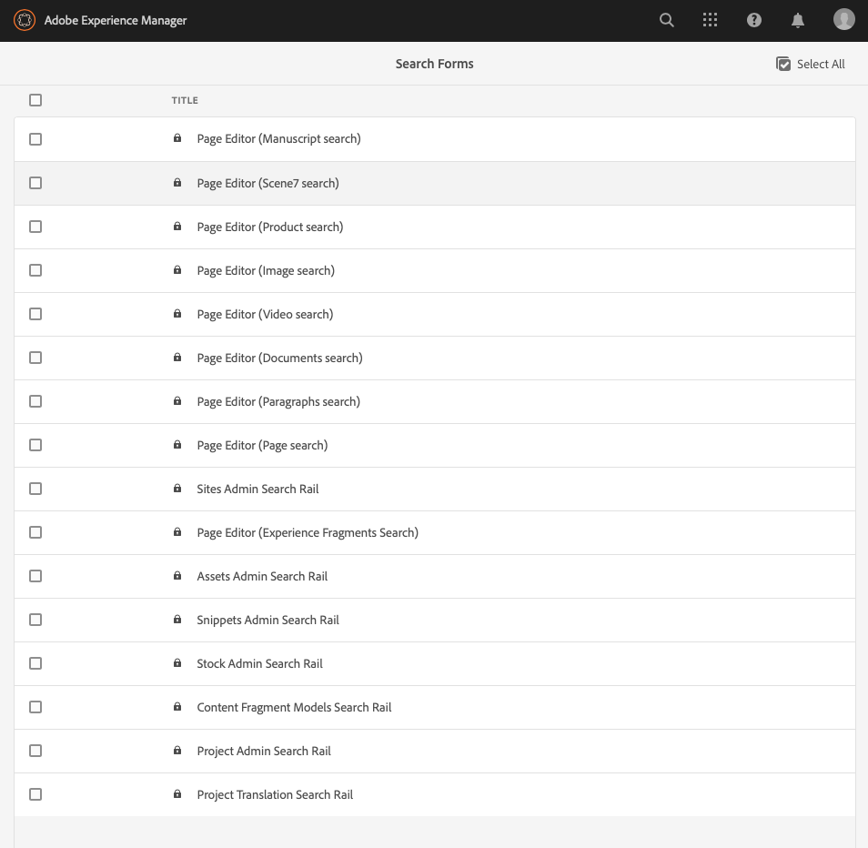
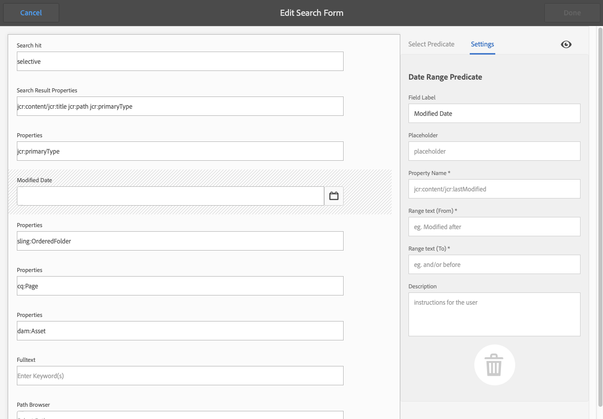

# Zoekformulieren configureren {#configuring-search-forms}

Met **Zoekformulieren** kunt u de zoekfacetten en filters die beschikbaar zijn in de verschillende zoekvensters van de schrijveromgeving aanpassen. Als u deze deelvensters aanpast, is de zoekfunctionaliteit veelzijdig op basis van uw specifieke behoeften.

Een [waaier van](#predicates-and-their-settings)predikaten is beschikbaar uit-van-de-doos.

U kunt de zoekformulieren  configureren die worden gebruikt in verschillende consoles en in de middelenbrowser (wanneer u pagina&#39;s bewerkt). De [dialoogvensters voor het configureren van deze formulieren](#configuring-your-search-forms) zijn toegankelijk via:

* **Opties**

   * **Algemeen**

      * **Zoeken in formulieren**

Wanneer u eerst tot deze console toegang hebt kunt u zien dat alle configuraties een hangslotsymbool hebben. Dit wijst erop dat de aangewezen configuratie de standaardconfiguratie (uit-van-de-doos) is - en kan niet worden geschrapt. Zodra u de configuratie hebt aangepast zal het slot verdwijnen - tenzij u uw aangepaste configuratie schrapt, in welk geval het gebrek (en de hangslotindicator) zal worden hersteld.

## Configuraties {#configurations}

De standaardconfiguraties (alfabetisch weergegeven) zijn:

* **Middelen Admin Search Rail:**

   Deze configuratie bepaalt de onderzoeksopties beschikbaar aan de gebruiker wanneer het gebruiken van de console van Activa.

* **Pagina-editor (zoeken naar documenten):**

   Deze configuratie bepaalt de beschikbare opties wanneer het zoeken naar documenten in middelenbrowser (wanneer het uitgeven van een pagina).

* **Pagina-editor (zoeken naar fragmenten uit ervaring):**

   Deze configuratie bepaalt de beschikbare opties wanneer het zoeken naar de Fragmenten van de Ervaring in middelenbrowser (wanneer het uitgeven van een pagina).

* **Pagina-editor (zoeken naar afbeeldingen):**

   Deze configuratie bepaalt de beschikbare opties wanneer het zoeken naar beelden in middelenbrowser (wanneer het uitgeven van een pagina).

* **Pagina-editor (Manuscript-zoekopdracht):**

   Deze configuratie bepaalt de beschikbare opties wanneer het zoeken naar manuscripten in middelenbrowser (wanneer het uitgeven van een pagina).

* **Pagina-editor (zoeken naar pagina):**

   Deze configuratie bepaalt de beschikbare opties wanneer het zoeken naar pagina&#39;s in middelenbrowser (wanneer het uitgeven van een pagina).

* **Pagina-editor (zoeken naar alinea&#39;s):**

   Deze configuratie bepaalt de beschikbare opties wanneer het zoeken naar paragrafen in middelenbrowser (wanneer het uitgeven van een pagina).

* **Pagina-editor (zoeken naar producten):**

   Deze configuratie bepaalt de beschikbare opties wanneer het zoeken naar producten in middelenbrowser (wanneer het uitgeven van een pagina).

* **De Redacteur van de pagina (onderzoek Scene7)**:

   Deze configuratie bepaalt de beschikbare opties wanneer het zoeken naar middelen Scene7 in middelenbrowser (wanneer het uitgeven van een pagina).

* **Pagina-editor (videozoekopdracht)**:

   Deze configuratie bepaalt de beschikbare opties wanneer het zoeken naar video&#39;s in middelenbrowser (wanneer het uitgeven van een pagina).

* **Zoekspoor voor projectbeheerder:**

   Deze configuratie bepaalt de onderzoeksopties beschikbaar aan de gebruiker wanneer het zoeken van projecten.

* **Zoekspoor voor vertaling van project:**

   Deze configuratie bepaalt de onderzoeksopties beschikbaar aan de gebruiker wanneer het zoeken van projectvertalingen.

* **Sites Admin Search Rail**:

   Deze configuratie bepaalt de onderzoeksopties beschikbaar aan de gebruiker wanneer het gebruiken van de onderzoekslijn van de console van Plaatsen.

* **Fragmenten Zoekspoor** beheerder:

   Deze configuratie bepaalt de onderzoeksopties beschikbaar aan de gebruiker wanneer het zoeken van fragmenten.

* **Zoeken op rails** voor voorraadbeheerder:

   Deze configuratie bepaalt de onderzoeksopties beschikbaar aan de gebruiker wanneer het zoeken van voorraad.

## Voorspellen en instellingen {#predicates-and-their-settings}

### Voorspellen {#predicates}

De volgende predikaten zijn beschikbaar, afhankelijk van de configuratie:

<table>
 <tbody>
  <tr>
   <th>Voorspelend</th>
   <th>Doel</th>
   <th>Instellingen</th>
  </tr>
  <tr>
   <td>Analyse</td>
   <td>Mogelijkheden zoeken/filteren in de Sites-browser bij het weergeven van gegevens met analysemogelijkheden. De zoekfilters van Analytics laden tot aan de in kaart gebrachte aangepaste analytische kolommen.</td>
   <td>
    <ul>
     <li>Veldlabel</li>
     <li>Beschrijving</li>
    </ul> </td>
  </tr>
  <tr>
   <td>Goedkeuringsstatus</td>
   <td>Zoeken op basis van goedkeuringsstatus.</td>
   <td>
    <ul>
     <li>Veldlabel</li>
     <li>Eigenschapnaam*</li>
     <li>Beschrijving</li>
    </ul> 
   </td>
  </tr>
  <tr>
   <td>Author</td>
   <td>Zoeken volgens auteur.</td>
   <td>
    <ul>
     <li>Plaatsaanduiding</li>
     <li>Eigenschapnaam*</li>
     <li>Beschrijving</li>
    </ul> 
   </td>
  </tr>
  <tr>
   <td>Uitgecheckt door</td>
   <td>Zoeken naar elementen die zijn uitgecheckt door een specifieke gebruiker.</td>
   <td>
    <ul>
     <li>Veldlabel</li>
     <li>Plaatsaanduiding</li>
     <li>Beschrijving</li>
    </ul> 
   </td>
  </tr>
  <tr>
   <td>Afhandelingsstatus</td>
   <td>Zoeken naar elementen met een specifieke uitcheckstatus.</td>
   <td>
    <ul>
     <li>Veldlabel</li>
     <li>Eigenschapnaam*</li>
     <li>Beschrijving</li>
    </ul> 
   </td>
  </tr>
  <tr>
   <td>Onderdelen</td>
   <td>Hiermee kan een auteur zoeken/filteren op pagina's die een specifieke component bevatten. Bijvoorbeeld een afbeeldingsgalerie.  </td>
   <td>
    <ul>
     <li>Plaatsaanduiding</li>
     <li>Eigenschapnaam*</li>
     <li>Diepte van eigenschap</li>
     <li>Beschrijving</li>
    </ul> </td>
  </tr>
  <tr>
   <td>Datumbereik</td>
   <td>Zoek in een opgegeven bereik gemaakte elementen naar een datumeigenschap. In het deelvenster Zoeken kunt u begin- en einddatums opgeven.</td>
   <td>
    <ul>
     <li>Veldlabel</li>
     <li>Plaatsaanduiding</li>
     <li>Eigenschapnaam*</li>
     <li>Bereik tekst (Van)*</li>
     <li>Bereik tekst (naar)*</li>
     <li>Beschrijving</li>
    </ul> </td>
  </tr>
  <tr>
   <td>Vervalstatus</td>
   <td>Zoeken in middelen op basis van vervalstatus.</td>
   <td>
    <ul>
     <li>Veldlabel</li>
     <li>Eigenschapnaam*</li>
     <li>Beschrijving</li>
    </ul> </td>
  </tr>
  <tr>
   <td>Bestandsgrootte</td>
   <td>Elementen zoeken op basis van hun grootte.</td>
   <td>
    <ul>
     <li>Veldlabel</li>
     <li>Eigenschapnaam*</li>
     <li>Optiepad</li>
     <li>Beschrijving</li>
    </ul> </td>
  </tr>
  <tr>
   <td>Bestandstype</td>
   <td>Elementen zoeken op basis van het bestands-/mime-type.</td>
   <td>
    <ul>
     <li>Veldlabel</li>
     <li>Eigenschapnaam*</li>
     <li>Mimetype-pad</li>
     <li>Beschrijving</li>
    </ul> 
   </td>
  </tr>
  <tr>
   <td>Fulltext</td>
   <td>Zoeken voorspelt zoekopdrachten in volledige tekst.</td>
   <td>
    <ul>
     <li>Plaatsaanduiding</li>
     <li>Eigenschapnaam</li>
     <li>Beschrijving</li>
    </ul> </td>
  </tr>
  <tr>
   <td>Groeperen</td>
   <td>Zoeken naar voorspellingen voor groep (alleen gebruikt binnen het voorvoegsel Inzichten).</td>
   <td>
    <ul>
     <li>Veldlabel</li>
     <li>Beschrijving</li>
    </ul> </td>
  </tr>
  <tr>
   <td>Verborgen filter</td>
   <td>Een filter op eigenschap en waarde, niet zichtbaar voor de gebruiker.</td>
   <td>
    <ul>
     <li>Eigenschapnaam*</li>
     <li>Waarde van eigenschap*</li>
     <li>Beschrijving</li>
    </ul> </td>
  </tr>
  <tr>
   <td>Inzichten</td>
   <td>Zoek volgens een selectie van parameters van Inzichten.</td>
   <td>Dit is een complexe predikaat die uit veelvoudige predikaten wordt samengesteld:
    <ul>
     <li>Groeperen</li>
     <li>Bereik</li>
     <li>Opties</li>
    </ul> 
   </td>
  </tr>
  <tr>
   <td>Lid van collectie</td>
   <td>Zoeken naar elementen die lid zijn van een verzameling</td>
   <td>
    <ul>
     <li>Beschrijving</li>
    </ul> 
   </td>
  </tr>
  <tr>
   <td>Eigenschap voor meerdere waarden</td>
   <td>Zoeken op meerdere waarden van een opgegeven eigenschap.</td>
   <td>
    <ul>
     <li>Veldlabel</li>
     <li>Plaatsaanduiding</li>
     <li>Eigenschapnaam*</li>
     <li>Delimiter-ondersteuning</li>
     <li>Invoerscheidingstekens</li>
     <li>Hoofdlettergebruik negeren</li>
     <li>Beschrijving</li>
    </ul> 
   </td>
  </tr>
  <tr>
   <td>Opties</td>
   <td>
De opties zijn inhoudsknooppunten die door de gebruiker zijn gemaakt.
 
Zie Een voorspelling <a href="#addinganoptionspredicate">van opties</a> toevoegen voor meer informatie.
 </td>
   <td>
    <ul>
     <li>Veldlabel</li>
     <li>Eigenschapnaam*</li>
     <li>Enkel selecteren</li>
     <li>Opties toevoegen</li>
     <li>Handmatig</li>
     <li>Beschrijving</li>
    </ul> </td>
  </tr>
  <tr>
   <td>Opties, eigenschap</td>
   <td>Zoeken op een of meer eigenschappen van de optie.</td>
   <td>
    <ul>
     <li>Veldlabel</li>
     <li>Eigenschapnaam*</li>
     <li>Pad naar knooppunt Opties</li>
     <li>Diepte van eigenschap</li>
     <li>Enkel selecteren</li>
     <li>Beschrijving</li>
    </ul> </td>
  </tr>
  <tr>
   <td>Paginastatus</td>
   <td>Pagina's zoeken op basis van hun status.</td>
   <td>
    <ul>
     <li>Veldlabel</li>
     <li>Naam van eigenschap publiceren*</li>
     <li>Eigenschapnaam vergrendelde pagina's*</li>
     <li>Beschrijving</li>
    </ul> </td>
  </tr>
  <tr>
   <td>Pad</td>
   <td>Zoeken naar elementen die zich onder een specifiek pad bevinden.</td>
   <td>
    <ul>
     <li>Veldlabel</li>
     <li>Zoekpaden toevoegen</li>
     <li>Beschrijving</li>
    </ul> </td>
  </tr>
  <tr>
   <td>Padbrowser</td>
   <td>Geef een padbrowser op waarin u kunt zoeken.</td>
   <td>
    <ul>
     <li>Plaatsaanduiding</li>
     <li>Basispad</li>
     <li>Beschrijving</li>
    </ul> 
   </td>
  </tr>
  <tr>
   <td>Pad verborgen</td>
   <td>Een filter op pad dat niet zichtbaar is voor de gebruiker.</td>
   <td>
    <ul>
     <li>Naam eigenschap ("path")</li>
     <li>Waarde van het onroerend goed (`/content/dam')</li>
    </ul> 
   </td>
  </tr>
  <tr>
   <td>Eigenschap</td>
   <td>Zoeken op een opgegeven eigenschap.</td>
   <td>
    <ul>
     <li>Veldlabel</li>
     <li>Plaatsaanduiding</li>
     <li>Eigenschapnaam</li>
     <li>Gedeeltelijk zoeken</li>
     <li>Hoofdlettergebruik negeren</li>
     <li>Beschrijving</li>
    </ul> 
   </td>
  </tr>
  <tr>
   <td>Status publiceren</td>
   <td>Middelen zoeken op basis van hun publicatiestatus</td>
   <td>
    <ul>
     <li>Veldlabel</li>
     <li>Eigenschapnaam*</li>
     <li>Beschrijving</li>
    </ul> </td>
  </tr>
  <tr>
   <td>Bereik</td>
   <td>Zoekbronnen binnen een opgegeven bereik. In het paneel van het Onderzoek, kunt u minimum en maximumwaarden voor de waaier specificeren.</td>
   <td>
    <ul>
     <li>Veldlabel</li>
     <li>Eigenschapnaam*</li>
     <li>Beschrijving</li>
    </ul> </td>
  </tr>
  <tr>
   <td>Classificatie</td>
   <td>Elementen zoeken op basis van hun waardering.  </td>
   <td>
    <ul>
     <li>Veldlabel</li>
     <li>Eigenschapnaam*</li>
     <li>Optiepad</li>
     <li>Beschrijving</li>
    </ul> </td>
  </tr>
  <tr>
   <td>Relatieve datum</td>
   <td>Elementen zoeken op basis van de relatieve datum waarop ze zijn gemaakt  </td>
   <td>
    <ul>
     <li>Veldlabel</li>
     <li>Eigenschapnaam*</li>
     <li>Relatieve datum</li>
     <li>Beschrijving</li>
    </ul> </td>
  </tr>
  <tr>
   <td>Schuifbereik</td>
   <td>Een gemeenschappelijk onderzoek voorspelt zich uitbreidend de waaiervoorspelling met het schuifvermogen. De waarde van de gezochte eigenschap moet tussen de schuifregelaargrenzen liggen.</td>
   <td>
    <ul>
     <li>Veldlabel</li>
     <li>Eigenschapnaam*</li>
     <li>Pad naar knooppunt Opties</li>
     <li>Beschrijving</li>
    </ul> </td>
  </tr>
  <tr>
   <td>Status</td>
   <td>Zoeken op basis van de status voor goedkeuring en afhandeling.</td>
   <td>Dit is een complexe predikaat die uit veelvoudige predikaten wordt samengesteld:
    <ul>
     <li>Goedkeuringsstatus</li>
     <li>Afhandelingsstatus</li>
    </ul> 
   </td>
  </tr>
  <tr>
   <td>Tags</td>
   <td>Zoeken op basis van tags.</td>
   <td>
    <ul>
     <li>Veldgelavel</li>
     <li>Plaatsaanduiding</li>
     <li>Eigenschapnaam*</li>
     <li>Alle labels weergeven, optie</li>
     <li>Pad van basiscodes</li>
     <li>Beschrijving</li>
    </ul> </td>
  </tr>
  <tr>
   <td>Sjablonen</td>
   <td>Zoeken op basis van de geselecteerde sjabloon.</td>
   <td>
    <ul>
     <li>Plaatsaanduiding</li>
     <li>Eigenschapnaam*</li>
     <li>Beschrijving</li>
    </ul> 
   </td>
  </tr>
  <tr>
   <td>Vertaalstatus</td>
   <td>Zoeken op basis van de vertaalstatus.</td>
   <td>
    <ul>
     <li>Veldlabel</li>
    </ul> 
   </td>
  </tr>
 </tbody>
</table>

<!--
  <tr>
   <td>Date ???</td>
   <td>Slider-based search of assets based on a date property.</td>
   <td>
    <ul>
     <li>Field Label</li>
     <li>Property Name*</li>
     <li>Description</li>
    </ul> </td>
  </tr>
  <tr>
   <td>Asset Last Modified ?????</td>
   <td>Date the asset was last modified.  </td>
   <td>A customized predicate, based on the Date Predicate.</td>
  </tr>
  <tr>
   <td>Range Options ???</td>
   <td>A specific search predicate for Assets and the same as common Slider Predicate. Is still available due to backward compatibilty issues.</td>
   <td>
    <ul>
     <li>Field Label</li>
     <li>Property Name*</li>
     <li>Option Path</li>
     <li>Description</li>
    </ul> </td>
  </tr>
  <tr>
   <td>Tag </td>
   <td>Search assets based on tags. You can configure the Path property to populate various tags in the Tags list.</td>
   <td>
    <ul>
     <li>Field Label</li>
     <li>Property Name*</li>
     <li>Option Path</li>
     <li>Description</li>
    </ul> </td>
  </tr>
-->

<!--
>[!NOTE]
>
>* The common search predicates are defined in:
>  `/libs/cq/gui/components/common/admin/customsearch/searchpredicates`
>
>
>* Search predicates related only to siteadmin (classic UI) are located under:
> `/libs/cq/gui/components/siteadmin/admin/searchpanel/searchpredicates`
>   * These are deprecated and only available for backward compatibility.
>
>This information is for reference only, you must not make changes to `/libs`.
-->

### Voorspelinstellingen {#predicate-settings}

Afhankelijk van de voorspelling is een selectie van instellingen beschikbaar voor configuratie:

* **Veldlabel**

   Het label dat wordt weergegeven als de inklapbare koptekst of als veldlabel van de voorspelling.

* **Beschrijving**

   Beschrijvende details voor de gebruiker.

* **Plaatsaanduiding**

   Lege tekst of de plaatsaanduiding van de voorspelling voor het geval er geen filtertekst wordt ingevoerd.

* **Eigenschapnaam**

   De eigenschap waarop moet worden gezocht. Er wordt een relatief pad gebruikt en de jokertekens `*/*/*` geven de diepte van de eigenschap ten opzichte van het `jcr:content` knooppunt op (elk sterretje vertegenwoordigt één knooppuntniveau).

   Als u slechts op een eerste niveaukindknoop van het middel wilt zoeken die het `x` bezit op het `jcr:content` knoopgebruik heeft `*/jcr:content/x`

* **Diepte van eigenschap**

   De maximumdiepte om naar dat bezit binnen de middelen te zoeken. Een zoekopdracht naar die eigenschap kan dus worden uitgevoerd op een resource en recursieve onderliggende elementen totdat het niveau van de onderliggende elementen overeenkomt met de opgegeven diepte.

* **Waarde van eigenschap**

   De eigenschapswaarde als een absolute tekenreeks of als expressietaal; bijvoorbeeld, `cq:Page` of

   `${empty requestPathInfo.suffix ? "/content" : requestPathInfo.suffix}`.

* **Bereik tekst**

   Het label van het bereikveld in de **Datumbereik** voorspellen.

* **Optiepad**

   De gebruiker kan het pad selecteren met behulp van de Padbrowser op het tabblad Voorspelfunctie. Nadat u het pictogram **+** hebt geselecteerd, wordt de selectie toegevoegd aan de lijst met geldige opties (en vervolgens het **-** pictogram dat moet worden verwijderd).

   De opties zijn inhoudsknooppunten die door de gebruiker zijn gemaakt en die de volgende structuur hebben:

   `(jcr:primaryType = nt:unstructured, value (String), jcr:title (String))`

* **Het de knoopweg** van opties richtIn feite het zelfde als de Weg **van** Opties, slechts is dit op het gemeenschappelijke voorspelbare gebied, andere is specifiek voor activa.

* **Enkel selecteren** Als deze optie is ingeschakeld, worden de opties weergegeven als selectievakjes die slechts één selectie toestaan. Als u per ongeluk een selectievakje hebt ingeschakeld, kan dit worden uitgeschakeld.

* **Naam(s) van eigenschap(pen) publiceren en live kopiëren** De labels voor de selectievakjes Publiceren en Live kopie voor de specifieke voorspelling van sites.

* The&amp;ast; op de veldlabels op het tabblad **Instellingen** betekent dat de velden verplicht zijn en dat er een foutbericht wordt weergegeven als deze leeg zijn gelaten.

## Uw zoekformulieren configureren {#configuring-your-search-forms}

### Een aangepaste configuratie maken/openen {#creating-opening-a-customized-configuration}

1. Navigeer naar **Gereedschappen**, **Algemeen**, Formulieren **** zoeken.

1. Selecteer de configuratie die u wilt aanpassen.
1. Gebruik het pictogram **Bewerken** om de configuratie voor het bijwerken te openen.
1. Als u een nieuwe aanpassing wilt maken, wilt u waarschijnlijk nieuwe voorspelvelden [toevoegen en de instellingen](#add-edit-a-predicate-field-and-define-field-settings) naar wens definiëren. Als een bestaande aanpassing u een bestaand gebied kunt selecteren en de montages bijwerken.
1. Selecteer **Gereed** om de configuratie op te slaan. De volgende keer dat de configuratie wordt gebruikt, zijn uw wijzigingen zichtbaar.

   >[!NOTE]
   >
   >De aangepaste configuraties worden (indien van toepassing) opgeslagen onder:
   >
   >* `/apps/cq/gui/content/facets/<option>`
   >* `/apps/commerce/gui/content/facets/<option>`

### Een voorspelbaar veld toevoegen/bewerken en veldinstellingen definiëren {#add-edit-a-predicate-field-and-define-field-settings}

U kunt velden toevoegen of bewerken en de instellingen van velden definiëren/bijwerken:

1. [Open de aangepaste configuratie](#creating-opening-a-customized-configuration) voor bijwerken.
1. Als u een nieuw veld wilt toevoegen, opent u het tabblad Voorspelfunctie **** selecteren en sleept u het vereiste voorloopgebied naar de gewenste locatie. Het **Datumbereik voorspelt** bijvoorbeeld:

   

1. Afhankelijk van of:

   * U voegt een nieuw veld toe:

      Nadat u de voorspelling hebt toegevoegd, wordt het tabblad **Instellingen** geopend en worden de eigenschappen weergegeven die kunnen worden gedefinieerd.

   * U wilt een bestaande voorspelling bijwerken:

      Selecteer het voorloopveld (rechts) en open het tabblad **Instellingen** .
   De instellingen voor de **Datumbereikvoorspelling** zijn bijvoorbeeld:

   

1. Breng de gewenste wijzigingen aan en bevestig deze met **Gereed**. De volgende keer dat de configuratie wordt gebruikt, zijn uw wijzigingen zichtbaar.

### Een voorvertoning weergeven van de zoekconfiguratie {#previewing-the-search-configuration}

1. Selecteer het pictogram Voorvertoning:

   

1. Hierdoor worden de zoekformulieren weergegeven zoals deze worden weergegeven (volledig uitgevouwen) in de kolom Zoeken van de desbetreffende console.

   

1. **Sluit** de voorvertoning om de configuratie te retourneren en te voltooien.

### Een voorspelbaar veld verwijderen {#deleting-a-predicate-field}

1. [Open de aangepaste configuratie](#creating-opening-a-customized-configuration) voor bijwerken.
1. Selecteer het voorloopveld (rechts), open het tabblad **Instellingen** en selecteer vervolgens het pictogram **Verwijderen** (linksonder).

   

1. In een dialoogvenster wordt bevestiging van de verwijderactie gevraagd.

1. Bevestig dit en om het even welke andere veranderingen met **Gedaan**.

### Een configuratie verwijderen (om de standaardinstelling te herstellen) {#deleting-a-configuration-to-reinstate-the-default}

Zodra u een configuratie hebt aangepast zal dit de gebreken met voeten treden. U kunt de standaardconfiguratie herstellen door uw aangepaste configuratie te schrappen.

>[!NOTE]
>
>U kunt de standaardconfiguraties niet verwijderen.

Het schrappen van een aangepaste configuratie wordt gedaan van de console:

1. Selecteer de vereiste configuratie (bijvoorbeeld **Pagina-editor (zoeken in alinea&#39;s)**) en kies vervolgens het pictogram **Verwijderen** op de werkbalk:

   

1. De aangepaste configuratie wordt verwijderd en de standaardinstelling wordt hersteld (dit wordt aangegeven door het opnieuw verschijnen van het hangslotsymbool in de console).

### Voorwaarden voor opties toevoegen {#adding-options-predicates}

De voorspelling van de optie (Opties, het Bezit van Opties) staat u toe om een punt te vormen dat moet worden gezocht naar. Deze worden meestal gebruikt om rechtstreeks onder de pagina naar iets te zoeken. bijvoorbeeld een eigenschap op het paginaknooppunt.

In het volgende voorbeeld (om te zoeken op basis van de sjabloon die wordt gebruikt om een pagina te maken) worden de desbetreffende stappen geïllustreerd:

1. Maak het knooppunt waarin de eigenschap wordt gedefinieerd waarop moet worden gezocht.

   U hebt een basisknooppunt nodig met definities van de afzonderlijke opties die beschikbaar zijn voor de gebruiker.

   De knooppunten voor de afzonderlijke opties hebben de volgende eigenschappen nodig:

   * `jcr:title` - het veldetiket dat in de zoekrail moet worden aangebracht;
   * `value` - de waarde van de eigenschap waarop moet worden gezocht

<!--
   
-->

>[!NOTE]
>
>U ***mag*** niets in het `/libs` pad wijzigen.
>
>De reden hiervoor is dat de inhoud van `/libs` de volgende keer dat u een upgrade uitvoert van uw exemplaar, wordt overschreven (en dat deze inhoud ook kan worden overschreven wanneer u een hotfix- of functiepakket toepast).
>
>De aanbevolen methode voor configuratie en andere wijzigingen is:
>
>1. Maak het vereiste item opnieuw, zoals het in, `/libs`onder `/apps`. In dit geval:
>1. `/libs/cq/gui/content/common/options/predicates`
>1. Breng wijzigingen aan in `/apps.`

1. Open de console **Zoeken in formulieren** en selecteer de configuratie die u wilt bijwerken. Bijvoorbeeld Sites Admin Search Rail ****.

   Klik vervolgens op het pictogram Zoekformulieren **** bewerken of tik erop.

1. Afhankelijk van de configuratie voeg een **Opties** of het Bezit **van** Opties aan de configuratie toe.
1. Werk de velden bij, met name:

   * **Eigenschapnaam**

      Specifiek het knoopbezit dat op de doelknopen moet worden gezocht. Bijvoorbeeld:

      `jcr:content/cq:template`

   * **Pad naar knooppunt Option**

      Selecteer het pad naar de locatie waar uw opties staan. Bijvoorbeeld:

      `/apps/cq/gui/content/common/options/predicates/templatetype`

<!--
   
-->

1. Selecteer **Gereed** om uw configuratie op te slaan.
1. Navigeer naar de juiste console (in dit voorbeeld **Sites**) en open de **Search** -rail. De nieuwe zoekformulieren worden samen met de verschillende opties weergegeven. Selecteer de gewenste optie om de zoekresultaten weer te geven:

<!--
   
-->

## Gebruikersmachtigingen {#user-permissions}

In de volgende tabel worden de machtigingen weergegeven die vereist zijn voor het uitvoeren van bewerkingen, verwijderen en voorvertoningen van handelingen op zoekformulieren.

<table>
 <tbody>
  <tr>
   <td><strong>Actie</strong></td>
   <td><strong>Machtigingen</strong></td>
  </tr>
  <tr>
   <td>Bewerken </td>
   <td>Lezen, schrijven toestemmingen op de <code>/apps </code>knoop.</td>
  </tr>
  <tr>
   <td>Verwijderen</td>
   <td>De machtigingen voor het <code>/apps</code> knooppunt lezen, schrijven, verwijderen</td>
  </tr>
  <tr>
   <td>Voorvertoning</td>
   <td>Machtigingen voor lezen, schrijven en verwijderen op het <code>/var/dam/content</code> knooppunt.  Lezen, schrijven toestemmingen op de <code>/apps</code> knoop.</td>
  </tr>
 </tbody>
</table>
