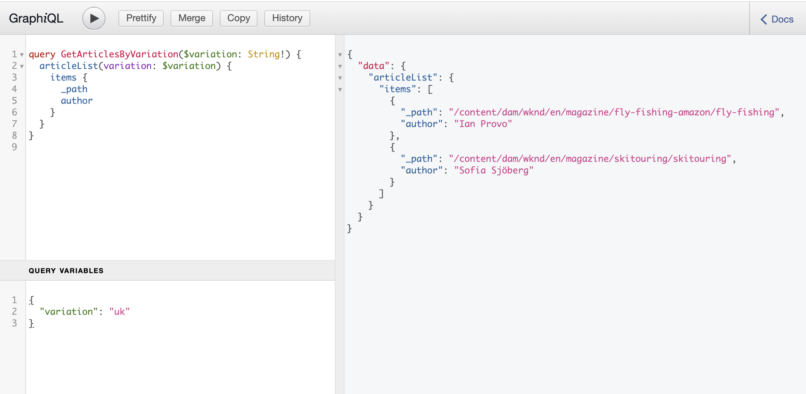

# Hoe te om tot Uw Inhoud via AEM levering APIs {#access-your-content} toegang te hebben

>[!CAUTION]
>
>WERK IN VOORTGANG - De opstelling van dit document is aan de gang en mag niet worden opgevat als volledig of definitief en mag niet worden gebruikt voor productiedoeleinden.

In dit deel van [AEM Headless Developer Journey,](overview.md) kunt u leren hoe u query&#39;s GraphQL kunt gebruiken om toegang te krijgen tot de inhoud van uw Content Fragments.

## Het verhaal tot nu toe {#story-so-far}

In het vorige document van de AEM headless reis, [Hoe te om Uw Inhoud te modelleren](model-your-content.md) leerde u de grondbeginselen van gegevensmodellering in AEM, zodat zou u nu moeten begrijpen hoe te om uw inhoudsstructuur te modelleren, dan realiseer die structuur gebruikend AEM Modellen van het Fragment van de Inhoud en de Fragments van de Inhoud:

* Herken de concepten en de terminologie met betrekking tot [gegevensmodellering](#data-modeling).
* Begrijp [waarom gegevensmodellering nodig is voor levering van inhoud zonder kop](#data-modeling-for-aem-headless).
* Begrijp [hoe te om deze structuur te realiseren gebruikend AEM Modellen van het Fragment van de Inhoud ](#create-structure-content-fragment-models) (en auteursinhoud met [Inhoudsfragmenten](#use-content-to-author-content)).
* begrijpen [hoe u uw inhoud kunt modelleren](#getting-started-examples); beginselen met basismonsters.

Dit artikel bouwt op die grondbeginselen voort zodat begrijpt u hoe te om tot uw bestaande inhoud zonder kop in AEM toegang te hebben gebruikend AEM GraphQL API.

* **Publiek**: Begin
* **Doel**: Leer hoe te om tot de inhoud van uw Fragmenten van de Inhoud toegang te hebben gebruikend AEM vragen GraphQL:
   * Introduceer GraphQL en de AEM GraphQL API.
   * Dive in de details van AEM GraphQL API.
   * Bekijk sommige steekproefvragen om te zien hoe de dingen in praktijk werken.

## Wilt u toegang krijgen tot uw gegevens? {#so-youd-like-to-access-your-data}

Dus...u hebt al deze inhoud, netjes gestructureerd (in inhoudsfragmenten), en enkel wachtend om uw nieuwe app te voeren. De vraag is: hoe kan het daar komen?

U hebt een manier nodig om specifieke inhoud als doel in te stellen, te selecteren wat u nodig hebt en terug te sturen naar uw app voor verdere verwerking.

Met Adobe Experience Manager (AEM) als Cloud Service, kunt u tot uw Contentfragmenten selectief toegang hebben, gebruikend AEM GraphQL API, om slechts de inhoud terug te keren die u nodig hebt. Dit betekent dat u zonder kop gestructureerde inhoud kunt leveren voor gebruik in uw toepassingen.

>[!NOTE]
>
>AEM GraphQL API is een aangepaste implementatie, gebaseerd op standaard GraphQL.

## GraphQL - Een inleiding {#graphql-introduction}

GraphQL is een open-bronspecificatie die verstrekt:

* een querytaal waarmee u specifieke inhoud van gestructureerde objecten kunt selecteren.
* een runtime om deze query&#39;s uit te voeren met uw gestructureerde inhoud.

GraphQL is een *strongly* getypte API. Dit betekent dat *all* inhoud duidelijk gestructureerd en georganiseerd door type moet zijn, zodat GraphQL *begrijpt* wat aan toegang en hoe. De gegevensvelden worden gedefinieerd binnen GraphQL-schema&#39;s, die de structuur van de inhoudsobjecten definiëren.

De eindpunten van GraphQL verstrekken dan de wegen die aan de vragen GraphQL antwoorden.

Dit alles betekent dat uw toepassing de gegevens die het nodig heeft nauwkeurig, betrouwbaar en efficiënt kan selecteren - precies wat u nodig hebt bij AEM.

>[!NOTE]
>
>Zie *GraphQL*.org en *GraphQL*.com.

## AEM en GraphQL {#aem-graphql}

GraphQL wordt gebruikt op verschillende locaties in AEM; bijvoorbeeld:

* Handel
   * Er zijn integratie GraphQL tussen AEM en diverse derde handeloplossingen, die met de uitbreidingshaken worden gebruikt door de Componenten van de Kern van CIF wordt verstrekt.
* Contentfragmenten
   * Er is een aangepaste API ontwikkeld voor dit geval van gebruik.
   * Dit is de AEM GraphQL API.

>[!NOTE]
>
>Deze stap van de Headless Journey heeft alleen betrekking op de AEM GraphQL API en Content Fragments.

## AEM GraphQL API {#aem-graphql-api}

De AEM GraphQL API is een aangepaste versie van de standaard GraphQL API, speciaal gevormd om u toe te staan om (complexe) vragen op uw Contentfragmenten uit te voeren.

Inhoudsfragmenten worden gebruikt, omdat de inhoud is gestructureerd volgens Modellen van inhoudsfragmenten. Dit voldoet aan een basisvereiste van GraphQL.

* Een inhoudsfragmentmodel is samengesteld uit een of meer velden.
   * Elk veld wordt gedefinieerd op basis van een gegevenstype.
* De Modellen van het Fragment van de inhoud worden gebruikt om de overeenkomstige AEM Schema&#39;s te produceren GraphQL.

Om tot GraphQL voor AEM (en de inhoud) eigenlijk toegang te hebben wordt een eindpunt gebruikt om de toegangspad te verstrekken.

De inhoud die wordt geretourneerd via de AEM GraphQL API kan vervolgens door uw toepassingen worden gebruikt.

>[!NOTE]
>
>De implementatie van AEM GraphQL API is gebaseerd op de Java-bibliotheken GraphQL.

### Gevallen gebruiken voor auteur- en publicatie-omgevingen {#use-cases-author-publish-environments}

De gebruiksgevallen voor de AEM GraphQL API kunnen van het type van AEM als Cloud Service milieu afhangen:

* Publicatie-omgeving; gebruikt voor:
   * Query-gegevens voor JS-toepassing (standaardgebruikscenario)

* Auteursomgeving; gebruikt voor:
   * Query-gegevens voor &quot;inhoudsbeheerdoeleinden&quot;:
      * GraphQL in AEM als Cloud Service is momenteel een alleen-lezen API.
      * De REST-API kan worden gebruikt voor CR(u)D-bewerkingen.

## Inhoudsfragmenten voor gebruik met de AEM GraphQL API {#content-fragments-use-with-aem-graphql-api}

De Fragments van de inhoud kunnen als basis voor GraphQL voor AEM schema&#39;s en vragen als worden gebruikt:

* Hiermee kunt u pagina-onafhankelijke inhoud ontwerpen, maken, beheren en publiceren.
* Ze zijn gebaseerd op een Content Fragment Model, dat de structuur voor het resulterende fragment vooraf definieert aan de hand van gedefinieerde gegevenstypen.
* Er kunnen extra structuurlagen worden bereikt met het gegevenstype Fragmentverwijzing, dat beschikbaar is wanneer u een model definieert.

### Modellen van contentfragmenten {#content-fragments-models}

Deze modellen van inhoudsfragmenten:

* Wordt gebruikt om de Schema&#39;s te produceren, eens **Enabled**.

* Geef de gegevenstypen en velden op die vereist zijn voor GraphQL. Ze zorgen ervoor dat uw toepassing alleen vraagt wat mogelijk is en wat wordt verwacht ontvangt.

* Het gegevenstype **Fragmentverwijzingen** kan in uw model worden gebruikt om naar een ander Inhoudsfragment te verwijzen, en zo extra niveaus van structuur introduceren.

### Fragmentverwijzingen {#fragment-references}

De **Fragmentverwijzing**:

* Is van bijzonder belang in samenhang met GraphQL.

* Dit is een specifiek gegevenstype dat kan worden gebruikt bij het definiëren van een inhoudsfragmentmodel.

* Verwijst naar een ander fragment, afhankelijk van een specifiek inhoudsfragmentmodel.

* Hiermee kunt u gestructureerde gegevens ophalen.

   * Wanneer gedefinieerd als een **multifeed**, kunnen meerdere subfragmenten door het prime-fragment naar verwezen (opgehaald) worden.

### JSON-voorvertoning {#json-preview}

Om u te helpen bij het ontwerpen en ontwikkelen van modellen van inhoudsfragmenten, kunt u een voorbeeld van JSON-uitvoer weergeven in de Content Fragment Editor.

## GraphQL-schema genereren op basis van inhoudsfragmenten {#graphql-schema-generation-content-fragments}

GraphQL is een sterk getypte API, wat betekent dat de gegevens duidelijk gestructureerd en georganiseerd moeten zijn door type. De specificatie GraphQL verstrekt een reeks richtlijnen op hoe te om tot een robuuste API voor het ondervragen van gegevens over een bepaalde instantie te leiden. Om dit te doen, moet een cliënt het Schema halen, dat alle types noodzakelijk voor een vraag bevat.

Voor Inhoudsfragmenten, zijn de schema&#39;s GraphQL (structuur en types) gebaseerd op **Toegelaten** Modellen van het Fragment van de Inhoud en hun gegevenstypes.

>[!CAUTION]
>
>Alle schema&#39;s GraphQL (die uit de Modellen van het Fragment van de Inhoud worden afgeleid die **Enabled** zijn geweest) zijn leesbaar door het eindpunt GraphQL.
>
>Dit betekent dat u ervoor moet zorgen dat er geen gevoelige gegevens beschikbaar zijn, aangezien deze op deze manier kunnen worden gelekt; Dit omvat bijvoorbeeld informatie die als veldnamen in de modeldefinitie aanwezig kan zijn.

Als een gebruiker bijvoorbeeld een Content Fragment Model met de naam `Article` heeft gemaakt, AEM het object `article` van het type `ArticleModel` genereren. De velden in dit type komen overeen met de velden en gegevenstypen die in het model zijn gedefinieerd.

1. A Content Fragment Model:

   

1. Het corresponderende GraphQL-schema (uitvoer van de automatische documentatie GraphiQL):
   

   Dit toont aan dat het geproduceerde type `ArticleModel` verscheidene [gebieden](#fields) bevat.

   * Drie van hen zijn gecontroleerd door de gebruiker: `author`, `main` en `referencearticle`.

   * De andere velden zijn automatisch toegevoegd door AEM en zijn nuttige methoden voor het verschaffen van informatie over een bepaald inhoudsfragment. in dit voorbeeld, `_path`, `_metadata`, `_variations`. Deze [helpergebieden](#helper-fields) zijn duidelijk met voorafgaande `_` om tussen wat door de gebruiker is bepaald en wat auto-geproduceerd te onderscheiden.

1. Nadat een gebruiker tot een Fragment van de Inhoud leidt dat op het model van het Artikel wordt gebaseerd, kan het dan door GraphQL worden ondervraagd. Bijvoorbeeld, zie de Steekproef Queries.md#graphql-steekproef-vragen) (die op een structuur van het Fragment van de steekproefinhoud voor gebruik met GraphQL wordt gebaseerd.

In GraphQL voor AEM, is het schema flexibel. Dit betekent dat deze telkens automatisch wordt gegenereerd wanneer een inhoudsfragmentmodel wordt gemaakt, bijgewerkt of verwijderd. De caches voor het gegevensschema worden ook vernieuwd wanneer u een model van het inhoudsfragment bijwerkt.

De dienst van GrafiekQL van Plaatsen luistert (in de achtergrond) naar om het even welke die wijzigingen aan een Model van het Fragment van de Inhoud worden aangebracht. Wanneer updates worden ontdekt, slechts wordt dat deel van het schema opnieuw geproduceerd. Deze optimalisatie bespaart tijd en zorgt voor stabiliteit.

Als u bijvoorbeeld:

1. Installeer een pakket met `Content-Fragment-Model-1` en `Content-Fragment-Model-2`:

   1. GraphQL-typen voor `Model-1` en `Model-2` worden gegenereerd.

1. Wijzig vervolgens `Content-Fragment-Model-2`:

   1. Alleen het type `Model-2` GraphQL wordt bijgewerkt.

   1. Terwijl `Model-1` hetzelfde zal blijven.

>[!NOTE]
>
>Dit is belangrijk om op te merken voor het geval u bulkupdates op de Modellen van het Fragment van de Inhoud door REST api, of anders wilt doen.

Het schema wordt gediend door het zelfde eindpunt zoals de vragen GraphQL, met de cliënt die het feit behandelt dat het schema met de uitbreiding `GQLschema` wordt geroepen. Als u bijvoorbeeld een eenvoudig `GET`-verzoek uitvoert op `/content/cq:graphql/global/endpoint.GQLschema`, wordt het schema uitgevoerd met het inhoudstype: `text/x-graphql-schema;charset=iso-8859-1`.

### Schema genereren - Niet-gepubliceerde modellen {#schema-generation-unpublished-models}

Wanneer Inhoudsfragmenten zijn genest, kan een bovenliggend inhoudsfragmentmodel worden gepubliceerd, maar een model waarnaar wordt verwezen, niet.

>[!NOTE]
>
>De AEM UI verhindert dit gebeurt, maar als het publiceren programmatically, of met inhoudspakketten wordt gemaakt, kan het voorkomen.

Wanneer dit gebeurt, AEM een *incomplete* Schema voor het model van het Fragment van de ouderinhoud produceert. Dit betekent dat de fragmentverwijzing, die afhankelijk is van het niet-gepubliceerde model, uit het schema wordt verwijderd.

## AEM GraphQL-eindpunten {#aem-graphql-endpoints}

<!--
need details/examples
-->

Een eindpunt is de weg die wordt gebruikt om tot GraphQL voor AEM toegang te hebben. Met dit pad kunt u (of uw app) het volgende doen:

* toegang tot de GraphQL-schema&#39;s;
* verzend uw vragen GraphQL,
* ontvangt de reacties (op uw vragen GraphQL).

AEM maakt het mogelijk:

* Een algemeen eindpunt - beschikbaar voor gebruik door alle plaatsen.
* De eindpunten van de huurder - die u kunt vormen, specifiek voor een gespecificeerde plaats/een project.

## Machtigingen {#permissions}

De machtigingen zijn vereist voor toegang tot middelen.

## De AEM GraphiQL-interface {#aem-graphiql-interface}

Om u te helpen direct input, en testvragen, is een implementatie van de standaardinterface GraphiQL beschikbaar voor gebruik met AEM GraphQL. Dit kan met AEM worden geïnstalleerd.

Het biedt functies zoals syntaxismarkering, automatisch aanvullen, automatisch suggereren, samen met een geschiedenis en online documentatie.


<!--
new page?
-->

## De AEM GraphQL-API {#using-aem-graphiql} gebruiken

### Eindpunten {#endpoints}

De bewaarplaatspad van GraphQL voor AEM globale eindpunt is:

`/content/cq:graphql/global/endpoint`

Voor welke toepassing uw toepassing het volgende pad in de aanvraag-URL kan gebruiken:

`/content/_cq_graphql/global/endpoint.json`

Voor een huurderseindpunt zijn de wegen vergelijkbaar:

`/content/cq:graphql/your-tenant/endpoint`
`/content/_cq_graphql/your-tenant/endpoint.json`

Alle eindpunten moeten vóór gebruik zijn ingeschakeld. Om een eindpunt, globaal of huurder, voor GraphQL voor AEM toe te laten moet u:

* GrafiekQL-eindpunt inschakelen
* Uw eindpunt publiceren

>[!CAUTION]
>
>Met de Inhoudsfragmenteditor kan een inhoudsfragment van een gebruiker verwijzen naar een inhoudsfragment van een andere gebruiker (via politie).
>
>In een dergelijk geval zal niet alle inhoud kunnen terugwinnen gebruikend een huurdersspecifiek eindpunt.
>
>De inhoudauteur zou dit scenario moeten controleren; Het kan bijvoorbeeld handig zijn om gedeelde modellen van inhoudsfragmenten onder de globale huurder te plaatsen.

### Het toelaten van uw Eindpunt GraphQL {#enabling-graphql-endpoint}

Om een Eindpunt te toelaten GraphQL moet u eerst een aangewezen configuratie in Browser van de Configuratie hebben.

>[!CAUTION]
>
>Als het gebruik van inhoudsfragmentmodellen niet is ingeschakeld, is de optie **Maken** niet beschikbaar.

Om het overeenkomstige eindpunt toe te laten:

1. Navigeer naar **Tools**, **Sites** en selecteer **GraphQL**.
1. Selecteer **Maken**.
1. Het **Create new GraphQL Endpoint** dialoogvenster zal worden geopend. Hier kunt u opgeven:
   * **Naam**: naam van het eindpunt; U kunt elke gewenste tekst invoeren.
   * **Gebruik GraphQL-schema opgegeven door**: Gebruik de vervolgkeuzelijst om de gewenste site of het vereiste project te selecteren.

   >[!NOTE]
   >
   >De volgende waarschuwing wordt weergegeven in het dialoogvenster:
   >
   >* *De eindpunten van GraphQL kunnen gegevensveiligheid en prestatieskwesties introduceren als niet zorgvuldig beheerd. Gelieve te verzekeren om aangewezen toestemmingen te plaatsen na het creëren van een eindpunt.*


1. Bevestig met **Create**.
1. Het **Volgende stappen** dialoog zal een directe verbinding aan de console van de Veiligheid verstrekken zodat u kunt ervoor zorgen dat het onlangs gecreeerde eindpunt geschikte toestemmingen heeft.

   >[!CAUTION]
   >
   >Het eindpunt is toegankelijk voor iedereen. Dit kan - vooral bij publiceer instanties - een veiligheidszorg veroorzaken, aangezien de vragen GraphQL een zware lading op de server kunnen opleggen.
   >
   >U kunt opstelling ACLs, aangewezen aan uw gebruiksgeval, op het eindpunt.

### Het publiceren van uw Eindpunt GraphQL {#publishing-graphql-endpoint}

Selecteer het nieuwe eindpunt en **Publiceer** om het volledig beschikbaar te maken in alle milieu&#39;s.

>[!CAUTION]
>
>Het eindpunt is toegankelijk voor iedereen.
>
>Bij het publiceren van instanties kan dit een veiligheidszorg veroorzaken, aangezien de vragen GraphQL een zware lading op de server kunnen opleggen.
>
>U moet opstelling ACLs aangewezen aan uw gebruiksgeval op het eindpunt.

### Installatie van de AEM GraphiQL-interface {#installing-graphiql-interface}

De GraphiQL-gebruikersinterface kan worden geïnstalleerd op AEM met een toegewezen pakket: het [GraphiQL-inhoudspakket v0.0.6 (2021.3)](https://experience.adobe.com/#/downloads/content/software-distribution/en/aemcloud.html?package=/content/software-distribution/en/details.html/content/dam/aemcloud/public/aem-graphql/graphiql-0.0.6.zip)-pakket.

### AEM GraphQL-schema&#39;s {#aem-graphql-schemas}

Om tot uw gegevens toegang te hebben moet u eerst het vereiste Model van het Fragment van de Inhoud selecteren - dat door een Schema GraphQL wordt vertegenwoordigd. AEM Schema&#39;s GraphQL worden afgeleid uit uw Modellen van het Fragment van de Inhoud - voor gebruik in uw vragen GraphQL.

<!--
Confirm is the schema city or CityModel? -->

Als u een model van het Fragment van de Inhoud genoemd `City` hebt zal er een overeenkomstig schema genoemd `city` zijn. Met de volgende query kunt u de `name` van alle inhoudsfragmenten weergeven die op dit model zijn gebaseerd.

```xml
query {
  cityList {
    items {
      name
    }
  }
}
```

Met de volgende query kunt u de `name` en `description` van alle `types` voor alle beschikbare schema&#39;s weergeven:

```xml
{
  __schema {
    types {
      name
      description
    }
  }
}
```

### GrafiekQL-velden AEM {#aem-graphql-fields}

Zodra u het schema hebt geselecteerd u wenst, zult u tot specifieke gegevens toegang hebben - die door gebieden in het schema worden vertegenwoordigd.

Binnen het schema zijn er afzonderlijke velden, van twee basiscategorieën:

* Velden die u genereert.

   Een selectie van [Veldtypen](#field-types) worden gebruikt om velden te maken op basis van de manier waarop u het model voor inhoudsfragmenten configureert. De veldnamen zijn afkomstig uit het veld **Eigenschapnaam** van het **Gegevenstype**.

   * Er is ook de **Render als** bezit om in overweging te nemen, omdat de gebruikers bepaalde gegevenstypes kunnen vormen; bijvoorbeeld als tekst met één regel of als een tekstveld met meerdere regels.

* GraphQL voor AEM genereert ook een aantal hulplijnvelden.

   Deze worden gebruikt om een inhoudsfragment te identificeren of om meer informatie over een inhoudsfragment te krijgen.

### Veldtypen {#field-types}

GraphQL voor AEM ondersteunt een lijst met typen. Alle ondersteunde gegevenstypen van het Content Fragment Model en de corresponderende typen GraphQL worden weergegeven:

| Inhoudsfragmentmodel - Gegevenstype | Type GraphQL | Beschrijving |
|--- |--- |--- |
| Tekst met één regel | Tekenreeks, [String] | Wordt gebruikt voor eenvoudige tekenreeksen, zoals namen van auteurs, locaties, enzovoort. |
| Tekst met meerdere regels | Tekenreeks | Wordt gebruikt voor het uitvoeren van tekst, zoals de hoofdtekst van een artikel |
| Getal | Float, [Float] | Wordt gebruikt om het zwevende-kommagetal en de reguliere getallen weer te geven |
| Boolean | Boolean | Gebruikt om selectievakjes weer te geven → eenvoudige true/false-instructies |
| Datum en tijd | Kalender | Wordt gebruikt om datum en tijd weer te geven in de ISO 8086-indeling. Afhankelijk van het geselecteerde type, zijn er drie aroma&#39;s beschikbaar voor gebruik in AEM GraphQL: `onlyDate`, `onlyTime`, `dateTime` |
| Opsomming | Tekenreeks | Wordt gebruikt om een optie weer te geven uit een lijst met opties die bij het maken van het model zijn gedefinieerd |
| Tags | [Tekenreeks] | Wordt gebruikt om een lijst weer te geven met tekenreeksen die tags vertegenwoordigen die in AEM worden gebruikt |
| Content Reference | Tekenreeks | Wordt gebruikt om het pad naar een ander element in AEM weer te geven |
| Fragmentverwijzing | *Een modeltype* | Wordt gebruikt om te verwijzen naar een ander inhoudsfragment van een bepaald modeltype, dat is gedefinieerd toen het model werd gemaakt. |

### Helpvelden {#helper-fields}

Naast de gegevenstypen voor door de gebruiker gegenereerde velden, genereert GraphQL voor AEM ook een aantal *helper* velden om een inhoudsfragment beter te kunnen identificeren of om aanvullende informatie over een inhoudsfragment te kunnen verstrekken.

#### Pad {#path}

Het padveld wordt gebruikt als id in GraphQL. Het vertegenwoordigt het pad van het Content Fragment-element in de AEM opslagplaats. Dit is de id van een inhoudsfragment, omdat dit:

* uniek is binnen AEM,
* kan gemakkelijk worden opgehaald.

In de volgende code worden de paden weergegeven van alle inhoudsfragmenten die zijn gemaakt op basis van het inhoudsfragmentmodel `Person`.

```xml
{
  personList {
    items {
      _path
    }
  }
}
```

Als u één inhoudsfragment van een bepaald type wilt ophalen, moet u ook eerst het pad bepalen. bijvoorbeeld:

```xml
{
  personByPath(_path: "/content/dam/path/to/fragment/john-doe") {
    item {
      _path
      firstName
      name
    }
  }
}
```

>[!NOTE]
>
>Zie Voorbeeldquery - één specifiek stedenfragment.

#### Metagegevens {#metadata}

Via GraphQL stelt AEM ook de metagegevens van een inhoudsfragment beschikbaar. Metagegevens zijn de informatie die een inhoudsfragment beschrijft, zoals de titel van een inhoudsfragment, het miniatuurpad, de beschrijving van een inhoudsfragment en de datum waarop het is gemaakt.

Aangezien metagegevens worden gegenereerd via de Schema-editor en als zodanig geen specifieke structuur hebben, is het GraphQL-type `TypedMetaData` geïmplementeerd om de metagegevens van een Content Fragment beschikbaar te maken. `TypedMetaData` stelt de informatie bloot die door de volgende scalaire types wordt gegroepeerd:

| Veld |
|--- |
| `stringMetadata:[StringMetadata]!` |
| `stringArrayMetadata:[StringArrayMetadata]!` |
| `intMetadata:[IntMetadata]!` |
| `intArrayMetadata:[IntArrayMetadata]!` |
| `floatMetadata:[FloatMetadata]!` |
| `floatArrayMetadata:[FloatArrayMetadata]!` |
| `booleanMetadata:[BooleanMetadata]!` |
| `booleanArrayMetadata:[booleanArrayMetadata]!` |
| `calendarMetadata:[CalendarMetadata]!` |
| `calendarArrayMetadata:[CalendarArrayMetadata]!` |

Elk scalair type vertegenwoordigt of één enkel naam-waarde paar of een serie van naam-waarde paren, waar de waarde van dat paar van het type is het werd gegroepeerd.

Als u bijvoorbeeld de titel van een inhoudsfragment wilt ophalen, weten we dat deze eigenschap een String-eigenschap is, zodat we een query voor alle String-metagegevens uitvoeren:

Ga als volgt te werk om te zoeken naar metagegevens:

```xml
{
  personByPath(_path: "/content/dam/path/to/fragment/john-doe") {
    item {
      _path
      _metadata {
        stringMetadata {
          name
          value
        }
      }
    }
  }
}
```

U kunt alle types van meta-gegevensGrafiekQL bekijken als u het Gegenereerde schema GraphQL bekijkt. Alle modeltypes hebben het zelfde `TypedMetaData`.

>[!NOTE]
>
>**Verschil tussen normale metagegevens en arraymetagegevens**
>Onthoud dat `StringMetadata` en `StringArrayMetadata` beide verwijzen naar wat in de opslagplaats wordt opgeslagen, niet hoe u hen terugwint.
>
>Als u bijvoorbeeld het veld `stringMetadata` aanroept, ontvangt u een array van alle metagegevens die in de opslagplaats zijn opgeslagen als een `String`. Als u `stringArrayMetadata` aanroept, ontvangt u een array van alle metagegevens die in de opslagplaats zijn opgeslagen als `String[]`.

>[!NOTE]
>
>Zie Sample Query for Metadata - List the Metadata for Awards titled GB.

#### Variaties {#variations}

Het veld `_variations` is geïmplementeerd om het opvragen van de variaties in een inhoudsfragment te vereenvoudigen. Bijvoorbeeld:

```xml
{
  personByPath(_path: "/content/dam/path/to/fragment/john-doe") {
    item {
      _variations
    }
  }
}
```

>[!NOTE]
>
>Zie Voorbeeldquery - Alle steden met een benoemde variatie.

### AEM GraphQL-variabelen {#aem-graphql-variables}

Variabelen zijn handig in elke vorm van programmeren of vragen, omdat u hiermee verschillende waarden op één locatie kunt opslaan. Voor AEM GraphQL betekent dit dat in plaats van het moeten een afzonderlijke vraag voor elke waarde schrijven, u uw vraag voor één variabele kunt schrijven, en de waarde van deze variabele kan zonodig veranderen.

GraphQL laat variabelen toe om in de vraag worden geplaatst.

>[!NOTE]
>
>Voor meer informatie kunt u de documentatie GraphQL voor Variabelen zien.

Als u bijvoorbeeld alle inhoudsfragmenten van het type `Article` wilt ophalen die een specifieke variatie hebben, kunt u de variabele `variation` in GraphiQL opgeven. Alle instanties worden opgehaald in `GetArticlesByVariation` en vervolgens doorgegeven voor gebruik in `articleList`.



```xml
### query
query GetArticlesByVariation($variation: String!) {
    articleList(variation: $variation) {
        items {
            _path
            author
        }
    }
}
 
### in query variables
{
    "variation": "uk"
}
```

### AEM GraphQL-richtlijnen {#aem-graphql-directives}

In GraphQL is er een mogelijkheid om de vraag te veranderen die op variabelen wordt gebaseerd, genoemd Richtlijnen GraphQL.

Zo kunt u bijvoorbeeld het veld `adventurePrice` opnemen in een query voor alle `AdventureModels`, op basis van een variabele `includePrice`.

!

```xml
### query
query GetAdventureByType($includePrice: Boolean!) {
  adventureList {
    items {
      adventureTitle
      adventurePrice @include(if: $includePrice)
    }
  }
}
 
### in query variables
{
    "includePrice": true
}
```

### AEM GraphQL-filters {#aem-graphql-filters}

U kunt het filtreren in uw vragen gebruiken GraphQL om specifieke gegevens terug te keren.

Bij het filteren wordt een syntaxis gebruikt die is gebaseerd op logische operatoren en expressies.

De volgende (basis)query filtert bijvoorbeeld alle personen met de naam `Jobs` of `Smith`:

```xml
query {
  personList(filter: {
    name: {
      _logOp: OR
      _expressions: [
        {
          value: "Jobs"
        },
        {
          value: "Smith"
        }
      ]
    }
  }) {
    items {
      name
      firstName
    }
  }
}
```

Zie voor meer voorbeelden:

* details van GraphQL voor AEM uitbreidingen

* Voorbeeldquery&#39;s met deze voorbeeldinhoud en -structuur

### GrafiekQL-extensies AEM {#aem-graphql-extensions}

De basisverrichting van vragen met GraphQL voor AEM houdt zich aan de standaardspecificatie GraphQL. Voor vragen GraphQL met AEM zijn er een paar uitbreidingen:

* Als u één resultaat nodig hebt:
   * de modelnaam gebruiken; Bijvoorbeeld stad

* Als u een lijst met resultaten verwacht:
   * `List` toevoegen aan de modelnaam; bijvoorbeeld `cityList`
   * Zie [Voorbeeldquery - Alle informatie over alle steden](#sample-all-information-all-cities)

* Als u logische OR wilt gebruiken:
   * use ` _logOp: OR`
   * Zie [Voorbeeldquery - Alle personen met een naam van &quot;Taken&quot; of &quot;Smith&quot;](#sample-all-persons-jobs-smith)

* Logische AND bestaat ook, maar is (vaak) impliciet

* U kunt zoeken naar veldnamen die overeenkomen met de velden in het model van het inhoudsfragment
   * Zie [Voorbeeldquery - Volledige details van de CEO en medewerkers van een bedrijf](#sample-full-details-company-ceos-employees)

* Naast de velden van uw model zijn er velden die door het systeem worden gegenereerd (voorafgegaan door een onderstrepingsteken):

   * Voor inhoud:

      * `_locale` : de taal te onthullen; gebaseerd op Taalbeheer
         * Zie [Voorbeeldquery voor meerdere inhoudsfragmenten van een bepaalde landinstelling](#sample-wknd-multiple-fragments-given-locale)
      * `_metadata` : om metagegevens voor uw fragment weer te geven
         * Zie [Voorbeeldquery voor metagegevens - Lijst met metagegevens voor onderscheidingen met de naam GB](#sample-metadata-awards-gb)
      * `_model` : toestaan dat wordt gezocht naar een inhoudsfragmentmodel (pad en titel)
         * Zie [Voorbeeldquery voor een inhoudsfragmentmodel van een model](#sample-wknd-content-fragment-model-from-model)
      * `_path` : het pad naar het inhoudsfragment in de repository
         * Zie [Voorbeeldquery - Een enkel specifiek stadsfragment](#sample-single-specific-city-fragment)
      * `_reference` : verwijzingen zichtbaar te maken; inline-verwijzingen opnemen in de Rich Text Editor
         * Zie [Voorbeeldquery voor meerdere inhoudfragmenten met vooraf ingestelde verwijzingen](#sample-wknd-multiple-fragments-prefetched-references)
      * `_variation` : om specifieke variaties in het inhoudsfragment weer te geven
         * Zie [Voorbeeldquery - Alle steden met een benoemde variatie](#sample-cities-named-variation)
   * En bewerkingen:

      * `_operator` : specifieke exploitanten toepassen;  `EQUALS`,  `EQUALS_NOT`,  `GREATER_EQUAL`,  `LOWER`,  `CONTAINS`,  `STARTS_WITH`
         * Zie [Voorbeeldquery - Alle personen die geen naam hebben van &quot;Taken&quot;](#sample-all-persons-not-jobs)
         * Zie [Voorbeeldquery - Alle avonturen waarbij `_path` begint met een specifiek voorvoegsel](#sample-wknd-all-adventures-cycling-path-filter)
      * `_apply` : specifieke voorwaarden toe te passen; bijvoorbeeld:   `AT_LEAST_ONCE`
         * Zie [Voorbeeldquery - Filter op een array met een item dat minstens één keer moet voorkomen](#sample-array-item-occur-at-least-once)
      * `_ignoreCase` : om de zaak te negeren bij het vragen
         * Zie [Voorbeeldquery - Alle steden met SAN in de naam, ongeacht case](#sample-all-cities-san-ignore-case)


* GraphQL-vaktypen worden ondersteund:

   * gebruiken `... on`
      * Zie [Voorbeeldquery voor een inhoudsfragment van een specifiek model met een inhoudsverwijzing](#sample-wknd-fragment-specific-model-content-reference)

### Blijvende query&#39;s (cache) {#persisted-queries-caching}

Na het voorbereiden van een vraag met een verzoek van de POST, kan het met een verzoek van de GET worden uitgevoerd dat door de geheime voorgeheugens van HTTP of een CDN kan worden in het voorgeheugen ondergebracht.

Dit wordt vereist aangezien de vragen van de POST gewoonlijk niet in het voorgeheugen ondergebracht zijn, en als het gebruiken van GET met de vraag als parameter er een significant risico is dat de parameter voor de diensten en tussenpersonen van HTTP te groot wordt.

De aangehouden vragen moeten altijd het eindpunt met betrekking tot de aangewezen (huurder) configuratie gebruiken; zodat ze beide of beide kunnen gebruiken:

* De globale configuratie en het eindpunt
De query heeft toegang tot alle modellen van inhoudsfragmenten.
* Specifieke huurconfiguratie(s) en eindpunt(en)
Creërend een persisted vraag voor een specifieke huurdersconfiguratie vereist een overeenkomstig huurdersspecifiek eindpunt (om toegang tot de verwante Modellen van het Fragment van de Inhoud te verlenen).
Bijvoorbeeld, om een voortgezette vraag specifiek voor de huurder te creëren WKND, moet een overeenkomstige WKND-Specifieke huurdersconfiguratie, en een WKND-Specifiek eindpunt vooraf worden gecreeerd.

>[!NOTE]
>
>Zie Functionaliteit van inhoudsfragment inschakelen in de configuratievenster voor meer informatie.
>
>**GraphQL Persistence Queries** moet worden toegelaten, voor de aangewezen huurdersconfiguratie.

Bijvoorbeeld, als er een bepaalde vraag genoemd `my-query` is, die een model `my-model` van de huurdersconfiguratie `my-conf` gebruikt:

* U kunt een vraag tot stand brengen gebruikend `my-conf` specifiek eindpunt, en dan zal de vraag als volgt worden bewaard:
   `/conf/my-conf/settings/graphql/persistentQueries/my-query`
* U kunt de zelfde vraag tot stand brengen gebruikend `global` eindpunt, maar dan zal de vraag als volgt worden bewaard:
   `/conf/global/settings/graphql/persistentQueries/my-query`

>[!NOTE]
>
>Dit zijn twee verschillende query&#39;s die zijn opgeslagen onder verschillende paden.
>
>Ze gebruiken gewoon hetzelfde model, maar via verschillende eindpunten.

Hier zijn de stappen die worden vereist om een bepaalde vraag voort te zetten:

1. Bereid de vraag door PUTing het aan het nieuwe eindpunt URL `/graphql/persist.json/<config>/<persisted-label>` voor.

   Maak bijvoorbeeld een doorlopende query:

   ```xml
   $ curl -X PUT \
       -H 'authorization: Basic YWRtaW46YWRtaW4=' \
       -H "Content-Type: application/json" \
       "http://localhost:4502/graphql/persist.json/wknd/plain-article-query" \
       -d \
   '{
     articleList {
       items{
           _path
           author
           main {
               json
           }
       }
     }
   }'
   ```

1. Controleer nu het antwoord.

   Controleer bijvoorbeeld of het programma is gelukt:

   ```xml
   {
     "action": "create",
     "configurationName": "wknd",
     "name": "plain-article-query",
     "shortPath": "/wknd/plain-article-query",
     "path": "/conf/wknd/settings/graphql/persistentQueries/plain-article-query"
   }
   ```

1. U kunt de voortgezette vraag dan opnieuw spelen door URL `/graphql/execute.json/<shortPath>` te KRIJGEN.

   Gebruik bijvoorbeeld de voortgezette query:

   ```xml
   $ curl -X GET \
       http://localhost:4502/graphql/execute.json/wknd/plain-article-query
   ```

1. Werk een voortgezette vraag door POSTing aan een reeds bestaand vraagweg bij.

   Gebruik bijvoorbeeld de voortgezette query:

   ```xml
   $ curl -X POST \
       -H 'authorization: Basic YWRtaW46YWRtaW4=' \
       -H "Content-Type: application/json" \
       "http://localhost:4502/graphql/persist.json/wknd/plain-article-query" \
       -d \
   '{
     articleList {
       items{
           _path
           author
           main {
               json
           }
         referencearticle {
           _path
         }
       }
     }
   }'
   ```

1. Een onbewerkte query maken.

   Bijvoorbeeld:

   ```xml
   $ curl -X PUT \
       -H 'authorization: Basic YWRtaW46YWRtaW4=' \
       -H "Content-Type: application/json" \
       "http://localhost:4502/graphql/persist.json/wknd/plain-article-query-wrapped" \
       -d \
   '{ "query": "{articleList { items { _path author main { json } referencearticle { _path } } } }"}'
   ```

1. Creeer een verpakte onbewerkte vraag met geheim voorgeheugencontrole.

   Bijvoorbeeld:

   ```xml
   $ curl -X PUT \
       -H 'authorization: Basic YWRtaW46YWRtaW4=' \
       -H "Content-Type: application/json" \
       "http://localhost:4502/graphql/persist.json/wknd/plain-article-query-max-age" \
       -d \
   '{ "query": "{articleList { items { _path author main { json } referencearticle { _path } } } }", "cache-control": { "max-age": 300 }}'
   ```

1. Maak een doorlopende query met parameters:

   Bijvoorbeeld:

   ```xml
   $ curl -X PUT \
       -H 'authorization: Basic YWRtaW46YWRtaW4=' \
       -H "Content-Type: application/json" \
       "http://localhost:4502/graphql/persist.json/wknd/plain-article-query-parameters" \
       -d \
   'query GetAsGraphqlModelTestByPath($apath: String!, $withReference: Boolean = true) {
     articleByPath(_path: $apath) {
       item {
         _path
           author
           main {
           plaintext
           }
           referencearticle @include(if: $withReference) {
           _path
           }
         }
       }
     }'
   ```

1. Een query uitvoeren met parameters.

   Bijvoorbeeld:

   ```xml
   $ curl -X POST \
       -H 'authorization: Basic YWRtaW46YWRtaW4=' \
       -H "Content-Type: application/json" \
       "http://localhost:4502/graphql/execute.json/wknd/plain-article-query-parameters;apath=%2fcontent2fdam2fwknd2fen2fmagazine2falaska-adventure2falaskan-adventures;withReference=false"
   
   $ curl -X GET \
       "http://localhost:4502/graphql/execute.json/wknd/plain-article-query-parameters;apath=%2fcontent2fdam2fwknd2fen2fmagazine2falaska-adventure2falaskan-adventures;withReference=false"
   ```

1. Als u de query wilt uitvoeren bij publiceren, moet de verwante boomstructuur worden gerepliceerd

   * Een POST voor replicatie gebruiken:

      ```xml
      $curl -X POST   http://localhost:4502/bin/replicate.json \
        -H 'authorization: Basic YWRtaW46YWRtaW4=' \
        -F path=/conf/wknd/settings/graphql/persistentQueries/plain-article-query \
        -F cmd=activate
      ```

   * Een pakket gebruiken:
      1. Maak een nieuwe pakketdefinitie.
      1. Neem de configuratie op (bijvoorbeeld `/conf/wknd/settings/graphql/persistentQueries`).
      1. Maak het pakket.
      1. Herhaal het pakket.
   * Het replicatie-/distributiehulpmiddel gebruiken.
      1. Ga naar het gereedschap Distributie.
      1. Selecteer boomactivering voor de configuratie (bijvoorbeeld `/conf/wknd/settings/graphql/persistentQueries`).
   * Een workflow gebruiken (via workflowstartconfiguratie):
      1. Definieer een workflowstartregel voor het uitvoeren van een workflowmodel dat de configuratie van verschillende gebeurtenissen zou repliceren (bijvoorbeeld, maken, wijzigen, enz.).


1. Zodra de vraagconfiguratie is op publiceren, zijn de zelfde principes van toepassing, enkel gebruikend het publiceereindpunt.

   >[!NOTE]
   >
   >Voor anonieme toegang veronderstelt het systeem dat ACL &quot;iedereen&quot;toestaat om toegang tot de vraagconfiguratie te hebben.
   >
   >Als dat niet het geval is, zal het niet kunnen uitvoeren.

   >[!NOTE]
   >
   >Eventuele puntkomma&#39;s (&quot;;&quot;) in de URL&#39;s moeten worden gecodeerd.
   >
   >Bijvoorbeeld, zoals in het verzoek om een voortgezette vraag uit te voeren:
   >
   >
   ```xml
   >curl -X GET \ "http://localhost:4502/graphql/execute.json/wknd/plain-article-query-parameters%3bapath=%2fcontent2fdam2fwknd2fen2fmagazine2falaska-adventure2falaskan-adventures;withReference=false"
   >```

### Het vragen van het eindpunt GraphQL van een Externe Website {#query-graphql-endpoint-from-external-website}

Om tot het eindpunt GraphQL van een externe website toegang te hebben moet u vormen:

* CORS-filter
* Refererfilter

#### CORS-filter {#cors-filter}

>[!NOTE]
>
>Voor een gedetailleerd overzicht van het CORS middel delend beleid in AEM zie het Doorgeven van Middelen van het Middel van de Herkomst (CORS).

Om tot het eindpunt toegang te hebben GraphQL, moet een beleid CORS in de bewaarplaats van de Kit van de klant worden gevormd. Dit wordt gedaan door een aangewezen OSGi CORS configuratiedossier voor het gewenste eindpunt (s) toe te voegen.

In deze configuratie moet een vertrouwde website-oorsprong `alloworigin` of `alloworiginregexp` worden opgegeven waarvoor toegang moet worden verleend.

Bijvoorbeeld, om toegang tot het eindpunt te verlenen GraphQL en voortgeduurde vragen eindpunt voor `https://my.domain` kunt u gebruiken:

```xml
{
  "supportscredentials":true,
  "supportedmethods":[
    "GET",
    "HEAD",
    "POST"
  ],
  "exposedheaders":[
    ""
  ],
  "alloworigin":[
    "https://my.domain"
  ],
  "maxage:Integer":1800,
  "alloworiginregexp":[
    ""
  ],
  "supportedheaders":[
    "Origin",
    "Accept",
    "X-Requested-With",
    "Content-Type",
    "Access-Control-Request-Method",
    "Access-Control-Request-Headers"
  ],
  "allowedpaths":[
    "/content/_cq_graphql/global/endpoint.json",
    "/graphql/execute.json/.*"
  ]
}
```

Als u een ijkweg voor het eindpunt hebt gevormd, kunt u het in `allowedpaths` ook gebruiken.

#### Refererfilter {#referrer-filter}

Naast de configuratie CORS, moet een filter van de Referateur worden gevormd om toegang van derdeshosts toe te staan.

Dit wordt gedaan door een aangewezen OSGi de configuratiedossier van de Filter toe te voegen dat:

* geeft een hostnaam voor een vertrouwde website aan; hetzij `allow.hosts` of `allow.hosts.regexp`,
* verleent toegang voor deze gastheernaam.

Als u bijvoorbeeld toegang wilt verlenen voor verzoeken met de Referrer `my.domain`, kunt u:

```xml
{
    "allow.empty":false,
    "allow.hosts":[
      "my.domain"
    ],
    "allow.hosts.regexp":[
      ""
    ],
    "filter.methods":[
      "POST",
      "PUT",
      "DELETE",
      "COPY",
      "MOVE"
    ],
    "exclude.agents.regexp":[
      ""
    ]
}
```

>[!CAUTION]
>
>Het blijft de verantwoordelijkheid van de klant om:
>
>* alleen toegang verlenen tot vertrouwde domeinen
>* ervoor zorgen geen gevoelige informatie wordt blootgesteld
>* geen jokerteken [*] syntaxis gebruiken; dit zal allebei voor authentiek verklaarde toegang tot het eindpunt van GraphQL onbruikbaar maken en zal het aan de volledige wereld ook blootstellen.


>[!CAUTION]
>
>Alle schema&#39;s GraphQL (die uit de Modellen van het Fragment van de Inhoud worden afgeleid die **Enabled** zijn geweest) zijn leesbaar door het eindpunt GraphQL.
>
>Dit betekent dat u ervoor moet zorgen dat er geen gevoelige gegevens beschikbaar zijn, aangezien deze op deze manier kunnen worden gelekt; Dit omvat bijvoorbeeld informatie die als veldnamen in de modeldefinitie aanwezig kan zijn.

### AEM GraphQL-verificatie {#aem-graphql-authentication}

Een primair gebruiksgeval voor de Adobe Experience Manager als Cloud Service (AEM) GraphQL API voor de Levering van het Fragment van de Inhoud moet verre vragen van derdetoepassingen of de diensten goedkeuren. Deze externe query&#39;s vereisen mogelijk geverifieerde API-toegang om de levering van inhoud zonder kop te beveiligen.

>[!NOTE]
>
>Voor het testen en de ontwikkeling kunt u tot AEM GraphQL API direct toegang hebben gebruikend de interface GraphiQL.

Voor authentificatie moet de derdedienst een Token van de Toegang gebruiken, dat dan in het Vraag GraphQL kan worden gebruikt.

#### Een toegangstoken {#retrieving-access-token} ophalen

Zie Toegangstokens genereren voor server-side API&#39;s voor meer informatie.

#### Het gebruiken van het Token van de Toegang in een Vraag GraphQL {#use-access-token-in-graphql-request}

Voor een derdedienst om met een AEM instantie te verbinden moet het *Token van de Toegang* hebben. De dienst moet dit teken aan `Authorization` kopbal op het verzoek van de POST dan toevoegen.

Bijvoorbeeld een GraphQL-autorisatieheader:

```xml
Authorization: Bearer <access_token>
```

#### Machtigingsvereisten {#permission-requirements}

Alle verzoeken die worden gedaan gebruikend het toegangstoken zullen *eigenlijk door de gebruikersrekening worden gemaakt die het token* produceerde.

Dit betekent dat u moet controleren dat de rekening de toestemmingen heeft die worden vereist om vragen in werking te stellen GraphQL.

U kunt dit controleren door GraphiQL op de lokale instantie te gebruiken.

## Voorbeelden van AEM GraphQL-query&#39;s {#samples-aem-graphql-queries}

Zie het Leren om GraphQL met AEM te gebruiken - de Inhoud en Vragen van de Steekproef voor een uitvoerige waaier van steekproefvragen.

<!--
## Code Samples for AEM GraphQL Queries {#code-samples-aem-graphql-queries}
-->

## Volgende {#whats-next}

Nu u hebt geleerd om tot uw hoofdloze inhoud toegang te hebben en te vragen gebruikend AEM GraphQL API kunt u nu [leren hoe te om REST API te gebruiken om tot de inhoud van uw Inhoudsfragmenten](/help/implementing/developing/headless-journey/update-your-content.md) toegang te hebben en bij te werken.

## Aanvullende bronnen {#additional-resources}

* [GraphQL.org](https://graphql.org)
   * [Schemas](https://graphql.org/learn/schema/)
   * [Variabelen](https://graphql.org/learn/queries/#variables)
   * [GraphQL Java-bibliotheken](https://graphql.org/code/#java)
* [GraphiQL](https://graphql.org/learn/serving-over-http/#graphiql)
* [De structuur van het voorbeeldinhoudsfragment](/help/assets/content-fragments/content-fragments-graphql-samples.md#content-fragment-structure-graphql)
* [Leren gebruiken GraphQL met AEM - Voorbeeldinhoud en query&#39;s](/help/assets/content-fragments/content-fragments-graphql-samples.md)
   * [Voorbeeldquery - één specifiek stedenfragment](/help/assets/content-fragments/content-fragments-graphql-samples.md#sample-single-specific-city-fragment)
   * [Voorbeeldquery voor metagegevens - Lijst met metagegevens voor onderscheidingen: GB](/help/assets/content-fragments/content-fragments-graphql-samples.md#sample-metadata-awards-gb)
   * [Voorbeeldquery - Alle steden met een benoemde variatie](/help/assets/content-fragments/content-fragments-graphql-samples.md#sample-cities-named-variation)
* [Functionaliteit van inhoudsfragment inschakelen in configuratievenster](/help/assets/content-fragments/content-fragments-configuration-browser.md#enable-content-fragment-functionality-in-configuration-browser)
* [Werken met contentfragmenten](/help/assets/content-fragments/content-fragments.md)
   * [Modellen van contentfragmenten](/help/assets/content-fragments/content-fragments-models.md)
   * [JSON-uitvoer](/help/assets/content-fragments/content-fragments-json-preview.md)
* [Werken met het delen van bronnen tussen verschillende bronnen (CORS)](https://experienceleague.adobe.com/docs/experience-manager-learn/foundation/security/understand-cross-origin-resource-sharing.html?lang=en#understand-cross-origin-resource-sharing-(cors))
* [Toegangstokens genereren voor server-side API&#39;s](/help/implementing/developing/introduction/generating-access-tokens-for-server-side-apis.md)
* [Aan de slag met AEM Headless](https://experienceleague.adobe.com/docs/experience-manager-learn/getting-started-with-aem-headless/graphql/overview.html)  - Een korte videozelfstudie die een overzicht biedt van het gebruik van AEM functies zonder kop, zoals gegevensmodellering en GraphQL.
