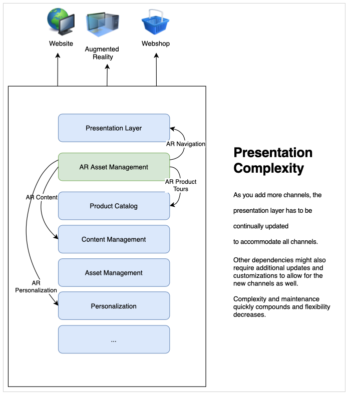

# Meer informatie over CMS Headless Development {#learn-about}

>[!CAUTION]
>
>OUTDATED - Deze conceptinhoud is vervangen door de nieuwe [documentatie voor Headless Developer Journey.](/help/journey-headless/developer/overview.md)

In dit deel van de [AEM Headless Developer Journey,](overview.md) leert u over technologie zonder kop en waarom u deze zou gebruiken.

## Doelstelling {#objective}

Met dit document krijgt u inzicht in de levering van inhoud zonder kop en waarom het moet worden gebruikt. Na het lezen moet u:

* Begrijp de basisconcepten en de terminologie van de inhoud zonder kop levering
* Begrijpen waarom en wanneer een kop zonder kop nodig is
* Op hoog niveau weten hoe concepten zonder kop worden gebruikt en hoe ze met elkaar verweven zijn

## Volledige levering van de Inhoud van de Stapel {#full-stack}

Sinds de opkomst van gebruiksvriendelijke, grootschalige contentbeheersystemen (CMS&#39;s) hebben organisaties deze als centrale locatie gebruikt voor het beheer van berichten, branding en communicatie. Het gebruik van het CMS als centraal punt voor het beheer van ervaringen heeft de efficiëntie verbeterd doordat taken in verschillende systemen niet hoeven te worden gedupliceerd.

In een volledig-stapel CMS, is alle functionaliteit voor het manipuleren van uw inhoud in CMS. De functies van het systeem bestaan uit verschillende onderdelen van de CMS-stapel. De full-stack oplossing heeft veel voordelen.

* U hebt één systeem om te onderhouden.
* Inhoud wordt centraal beheerd.
* Alle diensten van het systeem zijn geïntegreerd.
* Inhoud schrijven is naadloos.

Als u dus een nieuw kanaal wilt toevoegen of nieuwe soorten ervaringen wilt ondersteunen, kunt u een (of meer) nieuwe componenten in de stapel invoegen en hebt u slechts één plaats om uw wijzigingen aan te brengen.

De complexiteit van de afhankelijkheden in de stapel wordt snel zichtbaar, aangezien u ziet dat andere items in de stapel moeten worden aangepast aan de wijzigingen.

## Limieten voor volledige stapellevering {#limits}

De full-stack aanpak creëert inherent een silo waar alle landen in één systeem ervaren. Wijzigingen of toevoegingen aan één component van de silo vereisen wijzigingen in andere componenten, waardoor de tijd veel tijd kost en de kosten kostbaar zijn.

Dit geldt met name voor het presentatiesysteem, dat in traditionele instellingen vaak nauw verbonden is met het CMS. Een nieuw kanaal betekent doorgaans een update van het presentatiesysteem, die van invloed kan zijn op alle andere kanalen.

De beperkingen van deze natuurlijke silo kunnen duidelijk worden aangezien u meer inspanning besteedt om veranderingen over alle componenten van uw stapel te coördineren.

Gebruikers verwachten betrokkenheid, ongeacht het platform of aanraakpunt, waardoor u flexibel moet zijn in de manier waarop u uw ervaringen kunt aanbieden.  Deze multikanaalbenadering is de standaard van digitale ervaringen en een aanpak met volledige stapel kan in bepaalde omstandigheden onflexibel blijken.

## De kop in de kop {#the-head}

Het hoofd van een systeem is doorgaans de uitvoerrenderer van dat systeem, meestal in de vorm van een grafische interface of andere grafische uitvoer.

Een server zonder kop zit bijvoorbeeld waarschijnlijk ergens in een rack in een serverruimte en heeft geen monitor aangesloten. Om tot het toegang te hebben moet u ver met het verbinden. In dit geval is de monitor de kop omdat deze zorgt voor het renderen van de uitvoer van de server. Als consument van de service geeft u uw eigen hoofd (de monitor) wanneer u op afstand verbinding maakt.

Als we het hebben over een CMS zonder kop, beheert het CMS de inhoud en blijft het leveren aan consumenten. Door de **content** echter alleen op gestandaardiseerde wijze te leveren, laat een CMS zonder kop de uiteindelijke uitvoerrendering weg en laat de **presentatie** van de inhoud over aan de verbruikende service.

De verbruikende services, of het nu gaat om AIR, een webshop, mobiele ervaring, progressieve webapps (PWA), enz., nemen inhoud van het CMS zonder kop in en bieden hun eigen rendering. Ze zorgen ervoor dat ze hun eigen hoofd geven aan je inhoud.

Het weglaten van het hoofd vereenvoudigt CMS door ingewikkeldheid te verwijderen. Hierdoor wordt ook de verantwoordelijkheid voor het renderen van de inhoud verplaatst naar de diensten die de inhoud echt nodig hebben en die vaak beter geschikt zijn voor dergelijke rendering.

## Ontkoppelen {#decoupling}

De levering zonder kop is mogelijk door een reeks robuuste en flexibele API&#39;s (Application Programming Interfaces) beschikbaar te maken waar al uw ervaringen op kunnen tippen. De API dient als een gemeenschappelijke taal tussen de diensten, die hen op het inhoudsniveau door gestandaardiseerde inhoudslevering binden, maar hen de flexibiliteit toestaan om hun eigen oplossingen uit te voeren.

Met Headless kunt u bijvoorbeeld inhoud loskoppelen van de presentatie. Of in een generischere betekenis, ontkoppelt het vooreind van het achtereind van uw de dienststapel. In een headless opstelling, wordt het presentatiesysteem (het hoofd) losgemaakt van het inhoudsbeheer (staart). De twee werken slechts door API vraag in wisselwerking.

Deze ontkoppeling betekent dat elke verbruikende service (front-end) zijn ervaring kan opbouwen op basis van dezelfde inhoud die via de API&#39;s wordt geleverd, zodat de inhoud hergebruikt en consistent blijft. De verbruikende diensten kunnen hun eigen presentatiesystemen dan uitvoeren, toestaand de stapel van het inhoudsbeheer (het achtereind) om horizontaal te schrapen.

## Technologische onderbouwing {#technology}

Met een headless-aanpak kunt u een technologiestapel maken die zich eenvoudig en snel kan aanpassen aan de eisen van de toekomstige digitale ervaring.

In het verleden waren de API&#39;s voor CMS&#39;s meestal gebaseerd op REST. Representatiestatus-overdracht (REST) biedt bronnen als tekst zonder status. Hierdoor kunnen de bronnen worden gelezen en gewijzigd met een vooraf gedefinieerde set bewerkingen. REST maakte een grote interoperabiliteit tussen diensten op het web mogelijk door te zorgen voor een statenloze weergave van de inhoud.

Er is nog steeds behoefte aan robuuste REST API&#39;s. REST-verzoeken kunnen echter groot en uitgebreid zijn. Als er meerdere consumenten zijn die REST-oproepen voor al uw kanalen uitvoeren, kunnen deze uitgebreide verbindingen en prestaties worden beïnvloed.

Bij levering van inhoud zonder kop wordt vaak gebruikgemaakt van GraphQL API&#39;s. GraphQL staat voor een gelijkaardige stateless overdracht toe, maar staat voor meer gerichte vragen toe, die het totale aantal vereiste vragen verminderen, en prestaties verbeteren. Het is gebruikelijk om oplossingen te zien een mengeling van REST en GraphQL gebruiken, hoofdzakelijk het kiezen van het beste hulpmiddel voor de baan in kwestie.

Wat de gekozen API ook is, door een headless-systeem te definiëren op basis van gemeenschappelijke API&#39;s, kunt u de nieuwste browser en andere webtechnologieën, zoals progressieve webapps (PWA), benutten. API&#39;s maken een standaardinterface die eenvoudig kan worden uitgebreid en aangepast.

Inhoud wordt doorgaans weergegeven aan de clientzijde. Dit betekent doorgaans dat iemand uw inhoud op een mobiel apparaat aanroept, dat uw CMS de inhoud levert en dat het mobiele apparaat (de client) verantwoordelijk is voor het renderen van de inhoud die u hebt bediend. Als het apparaat oud of anderszins langzaam is, is uw digitale ervaring ook langzaam.

Door de inhoud los te koppelen van de presentatie kan er meer controle zijn over dergelijke prestatieproblemen aan de clientzijde. De server-kant teruggeven (SSR) brengt de verantwoordelijkheid over om de inhoud van browser van de cliënt aan de server terug te geven. Zo kunt u als leverancier van de inhoud uw publiek een niveau van gegarandeerde prestaties aanbieden als dat is wat wordt vereist.

## Organisatorische uitdagingen {#organization}

Met headless hebt u de beschikking over een wereld van flexibiliteit om uw digitale beleving te bieden. Maar deze flexibiliteit kan ook zijn eigen uitdaging vormen.

Als er veel verschillende kanalen zijn, kan dat betekenen dat ze elk hun eigen presentatiesystemen hebben. Hoewel ze allemaal dezelfde inhoud gebruiken via dezelfde API&#39;s, kan de ervaring verschillen vanwege de verschillende presentaties. De consistentie van de ervaring van de klant moet in het oog worden gehouden en er moet zorg voor worden gedragen.

Door zorgvuldige ontwerpsystemen, het delen van patroonbibliotheken, en het gebruiken van herbruikbare ontwerpcomponenten evenals gevestigde, open cliënt-kant kaders, kunnen de verenigbare ervaringen worden gewaarborgd, maar dit moet worden gepland.

## De toekomst is zonder kop en de toekomst is nu {#future}

Digitale ervaringen zullen blijven bepalen hoe merken met klanten communiceren. Wat aan headless ontwerp opwindend is is de flexibiliteit het ons geeft om aan evoluerende klantenverwachtingen te antwoorden.

Het is onmogelijk om de toekomst te voorspellen, maar zonder kop geeft u de flexibiliteit om te reageren op wat de toekomst brengt.

## AEM en zonder kop {#aem-and-headless}

Terwijl u deze ontwikkelaarstraject doorloopt, leert u hoe AEM levering zonder kop ondersteunt naast de volledige leveringsmogelijkheden voor de stapel.

Als marktleider op het gebied van digitaal ervaringsbeheer realiseert Adobe zich dat de ideale oplossing voor echte uitdagingen die ontwerpers ervaren zelden een binaire keuze is. Daarom AEM niet alleen beide modellen worden ondersteund, maar ook de naadloze hybride combinatie van beide, waarbij de voordelen van een volledig en zonder kop stapel worden gecombineerd, zodat u de consumenten van uw inhoud het beste kunt dienen, waar ze zich ook bevinden.

Deze reis concentreert zich op het hoofdloze-enige model van inhoudlevering. Maar als je deze basiskennis hebt, kun je verder verkennen hoe je de kracht van beide modellen kunt benutten.

## Volgende {#what-is-next}

Bedankt dat je aan de slag bent gegaan met je AEM tocht zonder kop! Nu u dit document leest, moet u:

* Begrijp de basisconcepten en de terminologie van koploze inhoudlevering.
* Begrijp waarom en wanneer de kop niet nodig is.
* Op hoog niveau weten hoe headless-concepten worden gebruikt en hoe ze met elkaar verweven zijn.

Bouw op deze kennis voort en zet uw AEM onophoudelijke reis door het document [Aan de slag met AEM zonder hoofd als Cloud Service ](getting-started.md) te herzien waar u zult leren hoe te opstelling de noodzakelijke hulpmiddelen en hoe te beginnen nadenkend over hoe AEM de levering van inhoud zonder kop en zijn eerste vereisten benadert.

## Aanvullende bronnen {#additional-resources}

Hoewel u wordt aangeraden naar het volgende gedeelte van de ontwikkeltocht zonder kop te gaan door het document [Aan de slag met AEM zonder kop als Cloud Service te bekijken,](getting-started.md) zijn de volgende aanvullende, optionele bronnen die een diepere duik maken over bepaalde concepten die in dit document worden genoemd, maar die niet nodig zijn om verder te gaan op de tocht zonder kop.

* [Inleiding tot de Architectuur van Adobe Experience Manager als Cloud Service](/help/core-concepts/architecture.md)  - Begrijp AEM als structuur van een Cloud Service
* [AEM Tutorials](https://experienceleague.adobe.com/docs/experience-manager-learn/getting-started-with-aem-headless/overview.html)  zonder kop - Gebruik deze praktische zelfstudies om te bekijken hoe u de verschillende opties kunt gebruiken om inhoud aan eindpunten zonder kop met AEM te leveren en te kiezen wat bij u past.
