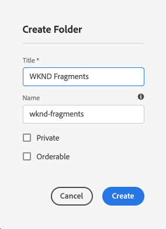

# Snelstartgids {#creating-an-assets-folder} voor het maken van een middelenmap zonder kop

Met Modellen AEM inhoudsfragmenten kunt u de structuur van inhoudsfragmenten definiëren als de basis voor inhoud zonder kop. Inhoudsfragmenten worden vervolgens in mappen met elementen opgeslagen.

##  Wat is een middelenmap? {#what-is-an-assets-folder}

[Nu u Content Fragment ](create-content-model.md) Models hebt gemaakt waarmee u de gewenste structuur voor uw toekomstige inhoudsfragmenten definieert, bent u waarschijnlijk erg blij om bepaalde fragmenten te maken.

U moet echter eerst een map met middelen maken waarin u deze wilt opslaan.

De omslagen van activa worden gebruikt om traditionele inhoudselementen [te organiseren zoals beelden en video evenals Inhoudsfragmenten.](/help/assets/manage-digital-assets.md)

## Een middelenmap maken {#how-to-create-an-assets-folder}

Een beheerder hoeft alleen maar af en toe mappen te maken om de inhoud te ordenen terwijl deze wordt gemaakt. Voor deze gids Aan de slag hoeven we slechts één map te maken.

1. Meld u aan bij AEM als Cloud Service en selecteer **Navigatie -> Middelen -> Bestanden** in het hoofdmenu.
1. Tik of klik op **Maken -> Map**.
1. Geef een **Titel** en een **Naam** op voor uw map.
   * De **Titel** zou beschrijvend moeten zijn.
   * De **Naam** wordt de knooppuntnaam in de repository.
      * Deze wordt automatisch gegenereerd op basis van de titel en aangepast volgens de naamconventies [AEM.](/help/implementing/developing/introduction/naming-conventions.md)
      * Deze kan zo nodig worden aangepast.

   
1. Selecteer de map die u net hebt gemaakt en selecteer vervolgens **Eigenschappen** op de werkbalk (of gebruik de `p` [sneltoets.](/help/sites-cloud/authoring/getting-started/keyboard-shortcuts.md))
1. Selecteer in het venster **Eigenschappen** de tab **Cloud Services**.
1. Voor **Cloud Configuration** Selecteer de [configuratie die u eerder hebt gemaakt.](create-configuration.md)

   
1. Tik of klik op **Opslaan en sluiten**.
1. Tik of klik op **OK** in het bevestigingsvenster.

   

U kunt extra submappen maken in de map die u net hebt gemaakt. De submappen overerven de **Cloud Configuration** van de bovenliggende map. Dit kan echter worden genegeerd als u modellen uit een andere configuratie wilt gebruiken.

Als u een gelokaliseerde sitestructuur gebruikt, kunt u [een hoofdmap voor de taal maken](/help/assets/translate-assets.md) onder de nieuwe map.

## Volgende stappen {#next-steps}

Nu u een map voor de inhoudsfragmenten hebt gemaakt, kunt u verdergaan naar het vierde deel van de gids Aan de slag en [inhoudsfragmenten maken.](create-content-fragment.md)

>[!TIP]
>
>Voor volledige details over het beheren van Inhoudsfragmenten, zie [Documentatie van Inhoudsfragmenten](/help/assets/content-fragments/content-fragments.md)
