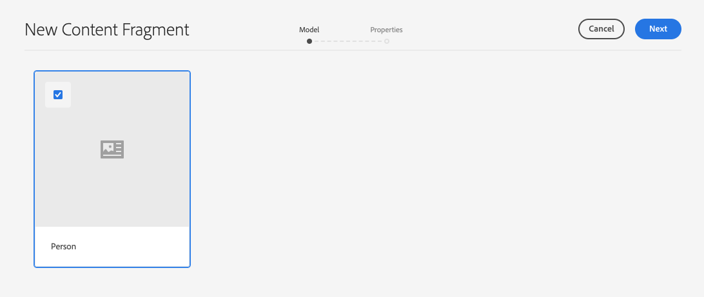

# Handleiding voor snel starten van inhoudsfragmenten zonder kop {#creating-content-fragments} maken

Leer hoe u AEM inhoudsfragmenten kunt gebruiken voor het ontwerpen, maken, beheren en gebruiken van pagina-onafhankelijke inhoud voor levering zonder kop.

## Wat zijn inhoudsfragmenten? {#what-are-content-fragments}

[Nu u een map met middelen hebt gemaakt ](create-assets-folder.md) waarin u de inhoudsfragmenten kunt opslaan, kunt u nu de fragmenten maken!

Met inhoudsfragmenten kunt u pagina-onafhankelijke inhoud ontwerpen, maken, beheren en publiceren. Hiermee kunt u inhoud voorbereiden die klaar is voor gebruik op meerdere locaties en via meerdere kanalen.

Inhoudsfragmenten bevatten gestructureerde inhoud en kunnen in JSON-indeling worden geleverd.

## Een inhoudsfragment maken {#how-to-create-a-content-fragment}

Inhoudsauteurs maken een willekeurig aantal Inhoudsfragmenten om de inhoud te vertegenwoordigen die zij maken. Dit zal hun belangrijkste taak in AEM zijn. Met het oog op deze gids voor het op gang brengen van de werkzaamheden zullen we slechts één gids hoeven te maken.

1. Meld u aan bij AEM als Cloud Service en selecteer **Navigatie -> Middelen** in het hoofdmenu.
1. Tik of klik op de [map die u eerder hebt gemaakt.](create-assets-folder.md)
1. Tik of klik op **Maken -> Inhoudsfragment**.
1. Het maken van een inhoudsfragment wordt in twee stappen weergegeven als een wizard. Selecteer eerst het model dat u wilt gebruiken om het inhoudsfragment te maken en tik of klik op **Volgende**.
   * Welke modellen beschikbaar zijn, is afhankelijk van de [**Cloud Configuration** die u hebt gedefinieerd voor de map assets](create-assets-folder.md) waarin u het Content Fragment maakt.
   * Als u het bericht `We could not find any models` ontvangt, controleer de configuratie van uw activa omslag.

   
1. Geef een **Titel**, **Beschrijving** en **Codes** op en tik op **Maken**.

   
1. Tik of klik op **Open** in het bevestigingsvenster.

   
1. Geef de details van het inhoudsfragment op in de Inhoudsfragmenteditor.

   
1. Tik of klik op **Opslaan en sluiten**.

Inhoudsfragmenten kunnen verwijzen naar andere inhoudsfragmenten, waarbij zo nodig een geneste inhoudsstructuur mogelijk is.

Inhoudsfragmenten kunnen ook verwijzen naar andere elementen in AEM. [Deze elementen moeten in ](/help/assets/manage-digital-assets.md) AEM worden opgeslagen voordat u een verwijzing naar een inhoudsfragment maakt.

## Volgende stappen {#next-steps}

Nu u een inhoudsfragment hebt gemaakt, kunt u verdergaan naar het laatste gedeelte van de gids Aan de slag en [API-verzoeken maken om inhoudsfragmenten te openen en te leveren.](create-api-request.md)

>[!TIP]
>
>Voor volledige details over het beheren van Inhoudsfragmenten, zie [Documentatie van Inhoudsfragmenten](/help/assets/content-fragments/content-fragments.md)
