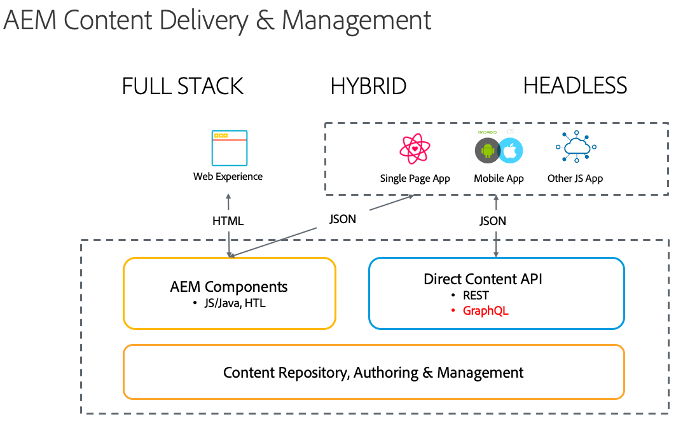

# Headless Development voor AEM Sites als een Cloud Service {#headless-development}

Het gebruiken van krachtige eigenschappen zoals de Modellen van de Inhoud, de Fragments van de Inhoud, en GraphQL API, AEM als Cloud Service staat u toe om uw ervaringen centraal te beheren en hen te dienen over kanalen.

## Overzicht {#overview}

De implementatie zonder hoofd wordt steeds belangrijker om ervaringen aan uw publiek te kunnen bieden, waar ze zich ook bevinden en ongeacht het kanaal.

Bij implementatie zonder kop gaan pagina- en componentbeheer verloren, zoals gebruikelijk is in oplossingen voor volledige stapels en hybride oplossingen, en wordt de nadruk gelegd op het maken van kanaalneutrale, herbruikbare fragmenten van inhoud en hun levering over het kanaal. Het is een modern en dynamisch ontwikkelingspatroon voor het implementeren van webervaringen.

## AEM als Cloud Service en zonder kop {#aem-headless}

AEM als Cloud Service is een flexibel instrument voor het model van de implementatie zonder kop door drie krachtige services aan te bieden:

1. Inhoudsmodellen
   * Inhoudsmodellen zijn een gestructureerde weergave van inhoud.
   * Deze worden gedefinieerd door informatiearchitecten in de AEM Content Fragment Model-editor.
   * Inhoudsmodellen dienen als basis voor inhoudsfragmenten.
1. Contentfragmenten
   * Inhoudsfragmenten zijn instantiaties van inhoudsmodellen.
   * Deze worden gemaakt door auteurs van inhoud met de AEM Content Fragment-editor.
   * Ze worden opgeslagen in AEM Assets en beheerd in de interface voor middelenbeheer.
1. Inhoud-API voor levering
   * De AEM GraphQL API ondersteunt de levering van contentfragmenten.
   * De AEM Assets REST-API ondersteunt CRUD-bewerkingen voor inhoudsfragmenten.
   * Directe inhoudlevering is ook mogelijk met de JSON-export van de [Content Fragment Core Component.](https://docs.adobe.com/content/help/en/experience-manager-core-components/using/components/content-fragment-component.html)

## Hulplijnen {#getting-started} zonder koptekst Aan de slag

Met de hulplijnen Aan de slag zonder koptekst kunt u in vijf stappen een eenvoudig pad inslaan voor het maken, beheren en leveren van ervaringen met AEM als Cloud Service. Elke gids bouwt op het vorige voort, zodat wordt het geadviseerd om hen grondig en in orde te onderzoeken.

1. [Een configuratie maken](getting-started/create-configuration.md)
1. [Een inhoudsfragmentmodel maken](getting-started/create-content-model.md)
1. [Een middelenmap maken](getting-started/create-assets-folder.md)
1. [Een inhoudsfragment maken](getting-started/create-content-fragment.md)
1. [Inhoudsfragmenten openen en leveren](getting-started/create-api-request.md)

## Publiek {#audience}

De taken die worden beschreven in [Headless Getting Started Guides](#getting-started) zijn noodzakelijk voor een eenvoudige end-to-end demonstratie van AEM mogelijkheden zonder kop. Iedereen met beheerdertoegang tot een test AEM instantie kan deze gidsen volgen om hoofdloze levering in AEM te begrijpen, hoewel iemand met ontwikkelaarservaring ideaal is.

In een productiesituatie worden de taken echter meerdere malen door verschillende personen uitgevoerd. Bijvoorbeeld:

* **** Beheerders hoeven de initiële configuratie en mapstructuur voor de inhoud normaal slechts eenmaal of sporadisch in te stellen.
* **De** architecten van de informatie zullen over het algemeen nieuwe modellen toevoegen aangezien de behoeften van de organisatie evolueren.
* **Inhoudsauteurs** maken voortdurend nieuwe inhoud als Inhoudsfragmenten op basis van de modellen die door de architecten zijn gedefinieerd.

Met de hulplijnen Aan de slag zonder kop wordt aangegeven wie de beschreven taken gewoonlijk uitvoert en hoe vaak.

## Volgende stap {#next-step}

Klaar om meer te leren? Begin vervolgens met het lezen van het eerste deel van de gids Aan de slag voor headless: [Een configuratie maken.](getting-started/create-configuration.md)
