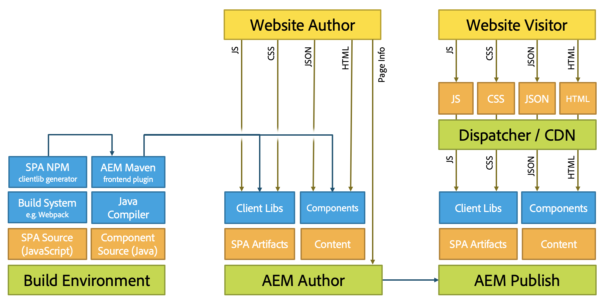

# SPA ontwikkelen voor AEM {#developing-spas-for-aem}

Toepassingen op één pagina (SPA) kunnen aantrekkelijke ervaringen bieden voor websitegebruikers. Ontwikkelaars willen sites kunnen maken met behulp van SPA frameworks en auteurs willen inhoud naadloos bewerken binnen AEM voor een site die is gebouwd met behulp van dergelijke frameworks.

Dit artikel stelt belangrijke vragen om te overwegen wanneer het in dienst nemen van een front-end ontwikkelaar om een SPA voor AEM te ontwikkelen en geeft een overzicht van de architectuur van AEM met betrekking tot het opstellen van SPA op AEM.

## Ontwikkelingsprincipes SPA voor AEM {#spa-development-principles-for-aem}

Bij het ontwikkelen van toepassingen voor één pagina op AEM wordt ervan uitgegaan dat de ontwikkelaar aan de voorzijde de beste werkwijzen volgt bij het maken van een SPA. Als u als front-end ontwikkelaar deze algemene beste praktijken evenals weinig AEM-specifieke principes volgt, zal uw SPA functioneel met [AEM en zijn inhoud-creatie mogelijkheden](introduction.md#content-editing-experience-with-spa) zijn.

* **[Draagbaarheid](#portability)**  - De onderdelen moeten zo draagbaar mogelijk zijn, net als alle andere onderdelen. De SPA moet met draagbare en herbruikbare onderdelen worden gebouwd.
* **[AEM de Structuur](#aem-drives-site-structure)**  van de Plaats van Drives - de voorste eindontwikkelaar leidt tot componenten en bezit hun interne structuur, maar baseert zich op AEM om de inhoudsstructuur van de plaats te bepalen.
* **[Dynamische rendering](#dynamic-rendering)**  - Alle rendering moet dynamisch zijn.
* **[Het dynamische Verpletteren](#dynamic-routing)**  - de SPA is verantwoordelijk voor het verpletteren en AEM luistert aan het en haalt gebaseerd op het. Om het even welk verpletteren zou ook dynamisch moeten zijn.

Als u deze principes in gedachten houdt bij het ontwikkelen van uw SPA, is deze zo flexibel en mogelijk in de toekomst, waarbij alle ondersteunde AEM ontwerpfuncties worden ingeschakeld.

Als u geen AEM ontwerpeigenschappen te hoeven steunen, kunt u een verschillend [SPA ontwerpmodel](#spa-design-models) moeten overwegen.

### Overdraagbaarheid {#portability}

Zoals bij het ontwikkelen van om het even welke component, zouden uw componenten op een zodanige manier moeten worden ontworpen dat hun draagbaarheid wordt gemaximaliseerd. Patronen die de draagbaarheid of herbruikbaarheid van de onderdelen in de weg staan, moeten worden vermeden om ervoor te zorgen dat de onderdelen compatibel, flexibel en duurzaam zijn.

De resulterende SPA moet worden gebouwd met zeer draagbare en herbruikbare onderdelen.

### Sitestructuur AEM stations {#aem-drives-site-structure}

De front-end ontwikkelaar moet zichzelf beschouwen als de verantwoordelijke voor het maken van een bibliotheek met SPA componenten die worden gebruikt om de app te maken. De front-end ontwikkelaar heeft volledige controle over de interne structuur van de componenten. [AEM bezit echter altijd de structuur van de site.](editor-overview.md)

Dit betekent dat de front-end ontwikkelaar klanteninhoud vóór of na het ingangspunt van de componenten kan toevoegen en derde vraag binnen de component kan ook maken. De front-end ontwikkelaar heeft echter geen volledige controle over hoe de componenten bijvoorbeeld nesten.

### Dynamische rendering {#dynamic-rendering}

De SPA mag alleen vertrouwen op dynamische rendering van inhoud. Dit is de standaardverwachting waarbij AEM alle onderliggende elementen van de inhoudsstructuur ophaalt en rendert.

Elke expliciete rendering die naar specifieke inhoud verwijst, wordt als statische rendering beschouwd en wordt wel ondersteund, maar is niet compatibel met AEM functies voor het schrijven van inhoud. Dit druist ook in tegen het beginsel van [portability](#portability).

### Dynamisch routeren {#dynamic-routing}

Zoals met het teruggeven, zou al het verpletteren ook dynamisch moeten zijn. In AEM, [zou de SPA altijd het verpletteren](routing.md) moeten bezitten en AEM aan het luistert en inhoud haalt die op het wordt gebaseerd.

Om het even welk statisch verpletterend werk tegen het [beginsel van portability](#portability) en beperkt de auteur door niet compatibel te zijn met de eigenschappen van de inhoudcreatie van AEM. Bijvoorbeeld, met het statische verpletteren, als de inhoudsauteur een route zou willen veranderen of een pagina zou veranderen, zou hij of zij de front eindontwikkelaar moeten vragen om het te doen.

## Projectarchetype {#aem-project-archetype} AEM

Om het even welk AEM project zou hefboomwerking [AEM Project Archetype](https://experienceleague.adobe.com/docs/experience-manager-core-components/using/developing/archetype/overview.html), dat SPA projecten gebruikend React of Angular steunt en hefboomwerkingen de SPA SDK gebruikt.

## Ontwerpmodellen SPA {#spa-design-models}

Als de [principes van het ontwikkelen van SPA in AEM](#spa-development-principles-for-aem) worden gevolgd, dan zal uw SPA met alle gesteunde AEM tevreden auteurseigenschappen functioneel zijn.

Er kunnen zich echter gevallen voordoen waarin dit niet volledig noodzakelijk is. In de volgende tabel vindt u een overzicht van de verschillende ontwerpmodellen, hun voordelen en hun nadelen.

<table>
 <tbody>
  <tr>
   <th><strong>Ontwerpmodel  </strong></th>
   <th><strong>Voordelen</strong></th>
   <th><strong>Nadelen</strong></th>
  </tr>
  <tr>
   <td>AEM wordt gebruikt als een CMS zonder kop zonder het <a href="/help/implementing/developing/hybrid/reference-materials.md">SPA framework van SDK van de Editor te gebruiken.</a></td>
   <td>De front-end ontwikkelaar heeft volledige controle over de app.</td>
   <td>
Inhoudsauteurs kunnen geen gebruik maken van AEM ervaring voor het schrijven van inhoud.
 
De code is noch draagbaar noch herbruikbaar als het statische verwijzingen of het verpletteren bevat.
 
Hiermee wordt het gebruik van de sjablooneditor niet toegestaan, zodat de ontwikkelaar van de front-end via het JCR bewerkbare sjablonen moet bijhouden.
 </td>
  </tr>
  <tr>
   <td>De front-end ontwikkelaar gebruikt het SPA Editor SDK-framework, maar opent slechts enkele gebieden voor de auteur van de inhoud.</td>
   <td>De ontwikkelaar behoudt de controle over de app door alleen authoring in beperkte delen van de app in te schakelen.</td>
   <td>
Inhoudsauteurs zijn beperkt tot een beperkt aantal AEM toepassingen voor het schrijven van inhoud.
 
De code riskeert noch draagbaar noch herbruikbaar als het statische verwijzingen of het verpletteren bevat.
 
Hiermee wordt het gebruik van de sjablooneditor niet toegestaan, zodat de ontwikkelaar van de front-end via het JCR bewerkbare sjablonen moet bijhouden.
 </td>
  </tr>
  <tr>
   <td>In het project wordt de SDK van de SPA Editor volledig benut en worden de frontendcomponenten ontwikkeld als een bibliotheek en wordt de inhoudsstructuur van de app gedelegeerd aan AEM.</td>
   <td>
De app is herbruikbaar en draagbaar.
 
De auteur van de inhoud kan de app bewerken met AEM ervaring voor het schrijven van inhoud.  
 
De SPA is compatibel met de sjablooneditor.
 </td>
   <td>
De ontwikkelaar heeft geen controle over de structuur van de app en het gedeelte van de inhoud dat aan AEM is gedelegeerd.
 
De ontwikkelaar kan gedeelten van de app nog steeds reserveren voor de inhoud die niet is bedoeld om te worden gemaakt met AEM.
 </td>
  </tr>
 </tbody>
</table>

>[!NOTE]
>
>Hoewel alle modellen in AEM worden gesteund, slechts door de derde (en daardoor volgend de geadviseerde [SPA ontwikkelingsprincipes in AEM](#spa-development-principles-for-aem)) zullen de inhoudauteurs met de inhoud van de SPA in AEM kunnen in wisselwerking staan en uitgeven aangezien zij gewend zijn.

## Bestaande SPA migreren naar AEM {#migrating-existing-spas-to-aem}

In het algemeen als uw SPA de [SPA Ontwikkelingsprincipes voor AEM](#spa-development-principles-for-aem) volgt, zal uw SPA in AEM werken en bewerkbaar zijn gebruikend de AEM Redacteur SPA.

Ga als volgt te werk om uw bestaande SPA klaar te maken voor AEM.

1. **Maak uw componenten JS modulair.** - Maak ze in staat om te worden gerenderd in elke volgorde, positie en grootte.
1. **Gebruik de containers die worden geleverd door de SDK om uw componenten op het scherm te plaatsen.** - AEM biedt een pagina- en alineasysteem voor gebruik.
1. **Maak een AEM component voor elke JS-component.** - De AEM componenten definiëren het dialoogvenster en de JSON-uitvoer.

## Instructies voor front-end ontwikkelaars {#instructions-for-front-end-developers}

De belangrijkste taak bij het in dienst nemen van een front-end ontwikkelaar om een SPA voor AEM tot stand te brengen is akkoord te gaan over de componenten en hun modellen JSON.

Hieronder volgt een overzicht van de stappen die een front-end ontwikkelaar moet volgen bij het ontwikkelen van een SPA voor AEM.

1. **Onderdelen en hun JSON-model overeenkomen**

   Voor-eind ontwikkelaars en achterste AEM ontwikkelaars moeten het eens zijn over welke componenten noodzakelijk en een model zodat is er één-op-één gelijke van SPA componenten aan de achterste eindcomponenten.

   AEM componenten zijn nog steeds nodig, vooral om te zorgen voor bewerkingsdialoogvensters en om het componentmodel te exporteren.

1. **In React componenten, heb toegang tot het model via`this.props.cqModel`**

   Zodra de componenten worden overeengekomen en het model JSON op zijn plaats is, is de front-end ontwikkelaar vrij om de SPA te ontwikkelen en kan eenvoudig tot het model JSON via `this.props.cqModel` toegang hebben.

1. **De  `render()` methode van de component implementeren**

   De front-end ontwikkelaar implementeert de `render()` methode zoals zij geschikt zien en kan de gebieden van het `cqModel` bezit gebruiken. Hiermee worden het DOM en de HTML-fragmenten uitgevoerd die in de pagina worden ingevoegd. Dit is de standaardmanier om een app te maken in React.

1. **Wijs de component aan het AEM middeltype via toe`MapTo()`**

   De afbeelding slaat componentenklassen op en wordt intern door de verstrekte `Container` component gebruikt om componenten terug te winnen en dynamisch te concretiseren die op het bepaalde middeltype worden gebaseerd.

   Dit dient als de &quot;lijm&quot;tussen voorkant en achtereind zodat weet de redacteur aan welke componenten de reactiecomponenten beantwoorden.

   De `Page` en `ResponsiveGrid` zijn goede voorbeelden van klassen die de basis `Container` uitbreiden.

1. **De parameter van de component definiëren  `EditConfig` als parameter voor`MapTo()`**

   Deze parameter is noodzakelijk om de redacteur te vertellen hoe de component zou moeten worden genoemd zolang bij nog niet wordt teruggegeven of geen inhoud heeft om terug te geven.

1. **De opgegeven  `Container` klasse uitbreiden voor pagina&#39;s en containers**

   Pagina- en alineasystemen moeten deze klasse uitbreiden, zodat delegatie naar binnencomponenten naar behoren werkt.

1. **Voer een verpletterende oplossing uit die het gebruiken van HTML5  `History` API.**

   Wanneer `ModelRouter` wordt toegelaten, zal het roepen van `pushState` en `replaceState` functies een verzoek aan `PageModelManager` teweegbrengen om een ontbrekend fragment van het model te halen.

   De huidige versie van `ModelRouter` steunt slechts het gebruik van URLs die aan de daadwerkelijke middelweg van de Invoerpunten van het Sling Model richt. Het steunt niet het gebruik van vanity URLs of aliassen.

   `ModelRouter` kan worden onbruikbaar gemaakt of worden gevormd om een lijst van regelmatige uitdrukkingen te negeren.

## AEM-agnost {#aem-agnostic}

Deze codeblokken illustreren hoe uw React- en Angular-componenten niets nodig hebben dat specifiek is voor Adobe of AEM.

* Alles wat zich in de JavaScript-component bevindt, is AEM-agnostisch.
* Nochtans specifiek voor AEM is dat de component JS aan een AEM component met de hulp moet worden in kaart gebracht MapTo.

De `MapTo` helper is de &quot;lijm&quot;die de achterkant en de front-end componenten toestaat om samen te passen:

* Het vertelt de container JS (of JS paragraafsysteem) welke component JS voor het teruggeven van elk van de componenten verantwoordelijk is die in JSON aanwezig zijn.
* Er wordt een HTML-gegevenskenmerk toegevoegd aan de HTML die de JS-component rendert, zodat de SPA Editor weet welk dialoogvenster aan de auteur moet worden weergegeven wanneer de component wordt bewerkt.

Voor meer informatie over het gebruiken van `MapTo` en het bouwen van SPA voor AEM in het algemeen, zie de Aan de slag gids voor uw gekozen kader.

* [Aan de slag met SPA in AEM Reageren gebruiken](getting-started-react.md)
* [Aan de slag met SPA in AEM Angular gebruiken](getting-started-angular.md)

## AEM Architectuur en SPA {#aem-architecture-and-spas}

De algemene architectuur van AEM, inclusief ontwikkelings-, auteurs- en publicatieomgevingen, verandert niet wanneer u SPA gebruikt. Het is echter nuttig te begrijpen hoe SPA ontwikkeling in deze architectuur past.

* **Build-omgeving**

   Dit is waar de bron voor de SPA toepassingsbron en componentenbron wordt uitgecheckt.

   * De NPM clientlib generator leidt tot een cliëntbibliotheek van het SPA project.
   * Deze bibliotheek wordt door Maven genomen en samen met de component geïmplementeerd door de Maven Build-plug-in bij de AEM-auteur.

* **AEM-auteur**

   Inhoud wordt gemaakt op de AEM auteur, inclusief SPA.

   Wanneer een SPA wordt bewerkt met de SPA Editor in de ontwerpomgeving:

   1. De SPA vraagt om de buitenste HTML.
   1. De CSS is geladen.
   1. Het JavaScript-bestand van de SPA toepassing wordt geladen.
   1. Wanneer de SPA toepassing wordt uitgevoerd, wordt de JSON opgevraagd, zodat de app het DOM van de pagina kan maken met de kenmerken `cq-data`.
   1. Met deze `cq-data`-kenmerken kan de editor aanvullende pagina-informatie laden, zodat deze weet welke bewerkingsconfiguraties beschikbaar zijn voor de componenten.

* **AEM-publicatie**

   Dit is waar de authored inhoud en de gecompileerde bibliotheken met inbegrip van SPA toepassingsartefacten, clientlibs, en componenten voor openbare consumptie worden gepubliceerd.

* **Dispatcher/CDN**

   De verzender fungeert als de cachelaag van AEM voor bezoekers van de site.
   * Verzoeken worden op dezelfde manier verwerkt als aanvragen bij de AEM-auteur. Er is echter geen verzoek om de pagina-informatie, omdat dit alleen nodig is voor de editor.
   * JavaScript, CSS, JSON en HTML worden in cache geplaatst, waardoor de pagina wordt geoptimaliseerd voor snelle levering.

>[!NOTE]
>
>In AEM is het niet nodig om JavaScript-bouwmechanismen uit te voeren of om JavaScript zelf uit te voeren. AEM alleen de gecompileerde artefacten van de SPA toepassing.

## Volgende stappen {#next-steps}

* [Aan de slag met SPA in AEM met ](getting-started-react.md) Reactshows hoe een basisSPA wordt gebouwd om met de SPA Redacteur in AEM te werken gebruikend Reageren.
* [Aan de slag met SPA in AEM met ](getting-started-angular.md) Angularshows hoe een basisSPA is gemaakt om met de SPA Editor in AEM Angular te werken.
* [SPA de ](editor-overview.md) Overzichten van de Redacteur gaat dieper in het communicatie model tussen AEM en de SPA.
* [WKND SPA ](wknd-tutorial.md) Projectis een geleidelijke zelfstudie die een eenvoudig SPA project in AEM implementeert.
* [Het dynamische Model aan de Toewijzing van de Component voor ](model-to-component-mapping.md) SPAs verklaart het dynamische model aan componentenafbeelding en hoe het binnen SPA in AEM werkt.
* [SPA ](blueprint.md) Blueprintoffers duiken diep in hoe SPA SDK voor AEM werkt voor het geval u SPA in AEM voor een kader buiten React of Angular wilt uitvoeren of eenvoudig een dieper begrip zou willen.
