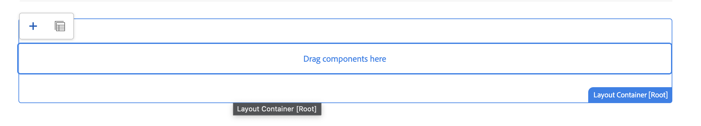

# Een externe SPA bewerken in AEM {#editing-external-spa-within-aem}

Wanneer u besluit [welk integratieniveau](/help/implementing/developing/headful-headless.md) wilt u tussen uw externe SPA en AEM hebben, moet u de SPA in AEM kunnen uitgeven en bekijken, vaak.

## Overzicht {#overview}

In dit document worden de aanbevolen stappen beschreven voor het uploaden van een zelfstandige SPA naar een AEM-instantie, het toevoegen van bewerkbare gedeelten van inhoud en het inschakelen van ontwerpen.

## Vereisten {#prerequisites}

De voorwaarden zijn eenvoudig.

* Zorg ervoor dat een instantie van AEM lokaal wordt uitgevoerd.
* Een basis AEM SPA project maken met [het AEM Project Archetype](https://experienceleague.adobe.com/docs/experience-manager-core-components/using/developing/archetype/overview.html?#available-properties).
   * Forms de basis van het AEM project dat wordt bijgewerkt om de externe SPA op te nemen.
   * Voor de voorbeelden in dit document gebruikt de Adobe het beginpunt van [het WKND-SPA-project](https://experienceleague.adobe.com/docs/experience-manager-learn/sites/spa-editor/spa-editor-framework-feature-video-use.html#spa-editor).
* Heb de werkende, externe Reactie SPA die u bij hand wilt integreren.

## SPA uploaden naar AEM project {#upload-spa-to-aem-project}

Eerst, moet u de externe SPA aan uw AEM project uploaden.

1. Vervangen `src` in de `/ui.frontend` projectmap met de React-toepassing `src` map.
1. Eventuele extra afhankelijkheden opnemen in de app `package.json` in de `/ui.frontend/package.json` bestand.
   * Zorg ervoor dat de SPA SDK-afhankelijkheden [aanbevolen versies](/help/implementing/developing/hybrid/getting-started-react.md#dependencies).
1. Alle aanpassingen opnemen in het dialoogvenster `/public` map.
1. Inclusief inline scripts of stijlen die zijn toegevoegd in het dialoogvenster `/public/index.html` bestand.

## De externe SPA configureren {#configure-remote-spa}

Nu de externe SPA deel uitmaakt van uw AEM project, moet deze binnen AEM worden geconfigureerd.

### Inclusief Adobe SPA SDK-pakketten {#include-spa-sdk-packages}

Om uit AEM SPA eigenschappen voordeel te halen, zijn er gebiedsdelen op de volgende drie pakketten.

* [`@adobe/aem-react-editable-components`](https://github.com/adobe/aem-react-editable-components)
* [`@adobe/aem-spa-component-mapping`](https://www.npmjs.com/package/@adobe/aem-spa-component-mapping)
* [`@adobe/aem-spa-page-model-manager`](https://www.npmjs.com/login?next=/package/@adobe/aem-spa-model-manager)

De `@adobe/aem-spa-page-model-manager` bevat de API voor het initialiseren van een Modelbeheer en het ophalen van het model uit de AEM. Dit model kan vervolgens worden gebruikt om AEM componenten te renderen met behulp van API&#39;s van `@adobe/aem-react-editable-components` en `@adobe/aem-spa-component-mapping`.

#### Installatie {#installation}

Voer het volgende uit `npm` zodat u de vereiste pakketten kunt installeren.

```shell
npm install --save @adobe/aem-spa-component-mapping @adobe/aem-spa-page-model-manager @adobe/aem-react-editable-components
```

### ModelManager-initialisatie {#model-manager-initialization}

Voordat de app wordt gerenderd, wordt de [`ModelManager`](/help/implementing/developing/hybrid/blueprint.md#pagemodelmanager) moet worden geïnitialiseerd om het maken van de AEM af te handelen `ModelStore`.

Deze initialisatie moet worden uitgevoerd binnen het `src/index.js` van uw toepassing of waar de hoofdmap van de toepassing wordt weergegeven.

Voor deze initialisatie kunt u `initializationAsync` API van de `ModelManager`.

De volgende schermafbeelding laat zien hoe u initialisatie van de `ModelManager` in een eenvoudige React-toepassing. De enige beperking is dat `initializationAsync` moet vóór `ReactDOM.render()`.


In dit voorbeeld wordt `ModelManager` is geïnitialiseerd en is leeg `ModelStore` wordt gemaakt.

De `initializationAsync` kan optioneel een `options` object als parameter:

* `path` - Bij initialisatie wordt het model op het gedefinieerde pad opgehaald en opgeslagen in het dialoogvenster `ModelStore`. Dit pad kan worden gebruikt om het `rootModel` bij initialisatie, indien nodig.
* `modelClient` - Hiermee kunt u een aangepaste client opgeven die het model moet ophalen.
* `model` - A `model` object dat wordt doorgegeven als een parameter die doorgaans wordt gevuld [SSR gebruiken](/help/implementing/developing/hybrid/ssr.md).

### AEM authorable Leaf Components {#authorable-leaf-components}

1. Maak/identificeer een AEM component waarvoor een authorable React component wordt gecreeerd. In dit voorbeeld, gebruikt het de tekstcomponent van het WKND-project.

   

1. Maak een eenvoudige React-tekstcomponent in de SPA. In dit voorbeeld wordt een nieuw bestand `Text.js` is gemaakt met de volgende inhoud.

   

1. Maak een configuratieobject zodat u de kenmerken kunt opgeven die nodig zijn voor AEM bewerken.

   

   * `resourceType` is verplicht om de component React aan de AEM component in kaart te brengen en het uitgeven toe te laten wanneer het openen in de AEMRedacteur.

1. De wrapperfunctie gebruiken `withMappable`.

   

   Deze omslagfunctie wijst de React component aan de AEM toe `resourceType` gespecificeerd in config en laat het uitgeven mogelijkheden toe wanneer geopend in de Redacteur van de AEM. Voor standalone componenten, haalt het ook de modelinhoud voor de specifieke knoop.

   >[!NOTE]
   >
   >In dit voorbeeld zijn er afzonderlijke versies van de component: AEM omwikkelde en losgekoppelde React-componenten. De omloopversie moet worden gebruikt wanneer uitdrukkelijk het gebruiken van de component. Wanneer de component deel uitmaakt van een pagina, kunt u de standaardcomponent blijven gebruiken zoals momenteel gedaan in de SPA editor.

1. Inhoud in de component renderen.

   De JCR-eigenschappen van de tekstcomponent worden als volgt AEM weergegeven.

   

   Deze waarden worden als eigenschappen doorgegeven aan het gemaakte object `AEMText` React-component en kan worden gebruikt om de inhoud te renderen.

   ```javascript
   import React from 'react';
   import { withMappable } from '@adobe/aem-react-editable-components';
   
   export const TextEditConfig = {
       // Empty component placeholder label
       emptyLabel:'Text', 
       isEmpty:function(props) {
          return !props || !props.text || props.text.trim().length < 1;
       },
       // resourcetype of the AEM counterpart component
       resourceType:'wknd-spa-react/components/text'
   };
   
   const Text = ({ text }) => (<div>{text}</div>);
   
   export default Text;
   
   export const AEMText = withMappable(Text, TextEditConfig);
   ```

   Hieronder ziet u hoe de component wordt weergegeven wanneer de AEM zijn voltooid.

   ```javascript
   const Text = ({ cqPath, richText, text }) => {
      const richTextContent = () => (
         <div className="aem_text" id={cqPath.substr(cqPath.lastIndexOf('/') + 1)} data-rte-editelement dangerouslySetInnerHTML={{__html: text}}/>
      );
      return richText ? richTextContent() : (<div className="aem_text">{text}</div>);
   };
   ```

   >[!NOTE]
   >
   >In dit voorbeeld zijn verdere aanpassingen aangebracht aan de gerenderde component, zodat deze overeenkomen met de bestaande tekstcomponent. Het heeft geen betrekking op ontwerpen in AEM.

#### Authorable Components toevoegen aan de pagina {#add-authorable-component-to-page}

Nadat u de authorable React-componenten hebt gemaakt, kunt u deze in de hele toepassing gebruiken.

Neem een voorbeeldpagina waar u een tekst van het WKND SPA project moet toevoegen. In dit voorbeeld wilt u de tekst &quot;Hello World!&quot; weergeven op `/content/wknd-spa-react/us/en/home.html`.

1. Bepaal het pad van het knooppunt dat moet worden weergegeven.

   * `pagePath`: De pagina die het knooppunt bevat, in dit voorbeeld `/content/wknd-spa-react/us/en/home`
   * `itemPath`: Pad naar het knooppunt binnen de pagina, in dit voorbeeld `root/responsivegrid/text`
      * Bestaat uit de namen van de bevattende items op de pagina.

   

1. Component toevoegen op de gewenste positie op de pagina.

   

   De `AEMText` kan op de gewenste positie op de pagina worden toegevoegd met `pagePath` en `itemPath` waarden ingesteld als eigenschappen. `pagePath` is een verplichte eigenschap.

#### Bewerken van tekstinhoud op AEM controleren {#verify-text-edit}

Test nu de component op de actieve AEM.

1. Voer de volgende Maven-opdracht uit vanuit de `aem-guides-wknd-spa` directory zodat kunt u het project bouwen en opstellen aan AEM.

```shell
mvn clean install -PautoInstallSinglePackage
```

1. Navigeer in uw AEM naar `http://<host>:<port>/editor.html/content/wknd-spa-react/us/en/home.html`.


De `AEMText` -component kan nu worden AEM.

### AEM Authorable Pages {#aem-authorable-pages}

1. Identificeer een pagina die voor creatie in de SPA moet worden toegevoegd. Dit voorbeeld gebruikt `/content/wknd-spa-react/us/en/home.html`.
1. Een bestand maken (bijvoorbeeld `Page.js`) voor de authorable Page Component. de pagina-component gebruiken die is opgegeven in `@adobe/cq-react-editable-components`.
1. Stap vier in de sectie herhalen [AEM authorable bladcomponenten](#authorable-leaf-components). De wrapperfunctie gebruiken `withMappable` op de component.
1. Zoals eerder is gebeurd, is het van toepassing `MapTo` aan de AEM middeltypes voor alle kindcomponenten binnen de pagina.

   ```javascript
   import { Page, MapTo, withMappable } from '@adobe/aem-react-editable-components';
   import Text, { TextEditConfig } from './Text';
   
   export default withMappable(Page);
   
   MapTo('wknd-spa-react/components/text')(Text, TextEditConfig);
   ```

   >[!NOTE]
   >
   >In dit voorbeeld wordt de tekstcomponent React zonder omloop gebruikt in plaats van de omloop `AEMText` eerder gemaakt. De reden is dat wanneer de component onderdeel is van een pagina/container en niet zelfstandig is, de container ervoor zorgt dat de component recursief in kaart wordt gebracht. En, toelatend auteursmogelijkheden en de extra omslag is niet nodig voor elk kind.

1. Voer dezelfde stappen uit in de sectie om een pagina die u kunt schrijven, aan de SPA toe te voegen [Authorable Components toevoegen aan de pagina](#add-authorable-component-to-page). Hier kunt u de `itemPath` eigenschap.

#### Pagina-inhoud controleren op AEM {#verify-page-content}

Voer dezelfde stappen uit in de sectie om te controleren of de pagina kan worden bewerkt [Bewerken van tekstinhoud op AEM controleren](#verify-text-edit).


De pagina kan nu worden bewerkt op AEM met een lay-outcontainer en onderliggende tekstcomponent.

### Virtuele bladonderdelen {#virtual-leaf-components}

In de vorige voorbeelden hebt u componenten aan de SPA toegevoegd met bestaande AEM inhoud. Er zijn echter gevallen waarin inhoud nog niet in AEM is gemaakt, maar later moet worden toegevoegd door de auteur van de inhoud. Om dit scenario aan te passen, kan de front-end ontwikkelaar componenten in de aangewezen plaatsen binnen de SPA toevoegen. Deze componenten tonen placeholders wanneer geopend in de redacteur in AEM. Nadat de inhoud door de auteur van de inhoud binnen deze plaatsaanduidingen is toegevoegd, worden knooppunten gemaakt in de JCR-structuur en wordt de inhoud voortgezet. De gemaakte component staat dezelfde set bewerkingen toe als de zelfstandige bladcomponenten.

In dit voorbeeld gebruikt u de `AEMText` eerder gemaakte component. U wilt dat nieuwe tekst onder de bestaande tekstcomponent op de WKND-startpagina wordt toegevoegd. De toevoeging van componenten is hetzelfde als voor normale bladcomponenten. De `itemPath` kan worden bijgewerkt naar het pad waar de nieuwe component moet worden toegevoegd.

Omdat de nieuwe component onder de bestaande tekst moet worden toegevoegd op `root/responsivegrid/text`, is het nieuwe pad `root/responsivegrid/{itemName}`.

```html
<AEMText
 pagePath='/content/wknd-spa-react/us/en/home'
 itemPath='root/responsivegrid/text_20' />
```

De `TestPage` ziet er als volgt uit na het toevoegen van de virtuele component.


>[!NOTE]
>
>Zorg ervoor dat `AEMText` component heeft `resourceType` Stel de configuratie zo in dat u deze functie kunt inschakelen.

U kunt de wijzigingen nu implementeren in AEM volgende stappen in de sectie [Bewerken van tekstinhoud op AEM controleren](#verify-text-edit). Er wordt een tijdelijke aanduiding weergegeven voor de momenteel niet bestaande `text_20` knooppunt.


Wanneer de auteur van de inhoud deze component bijwerkt, wordt een nieuwe `text_20` node wordt gemaakt op `root/responsivegrid/text_20` in `/content/wknd-spa-react/us/en/home`.


#### Eisen en beperkingen {#limitations}

Er zijn verschillende vereisten om virtuele bladcomponenten en enkele beperkingen toe te voegen.

* De `pagePath` eigenschap is verplicht voor het maken van een virtuele component.
* Het paginaknooppunt dat is opgegeven op het pad in `pagePath` moet in het AEM-project bestaan.
* De naam van het knooppunt dat moet worden gemaakt, moet worden opgegeven in het dialoogvenster `itemPath`.
* De component kan op elk niveau worden gemaakt.
   * Als u een `itemPath='text_20'` in het vorige voorbeeld wordt het nieuwe knooppunt direct onder de pagina gemaakt, dat wil zeggen: `/content/wknd-spa-react/us/en/home/jcr:content/text_20`
* Het pad naar het knooppunt waar een nieuw knooppunt wordt gemaakt, moet geldig zijn als het wordt opgegeven via `itemPath`.
   * In dit voorbeeld: `root/responsivegrid` moet bestaan zodat de nieuwe knoop `text_20` kan daar worden gecreëerd.
* Alleen het maken van bladcomponenten wordt ondersteund. Virtuele container en pagina worden in toekomstige versies ondersteund.

### Virtuele containers {#virtual-containers}

De mogelijkheid om containers toe te voegen, zelfs als de bijbehorende container nog niet in AEM is gemaakt, wordt ondersteund. Het concept en de aanpak lijken op [virtuele bladcomponenten](#virtual-leaf-components).

De front-end ontwikkelaar kan de containercomponenten in aangewezen plaatsen binnen de SPA toevoegen en deze componenten tonen placeholders wanneer geopend in de redacteur in AEM. De auteur kan vervolgens componenten en de inhoud ervan toevoegen aan de container die de vereiste knooppunten maakt in de JCR-structuur.

Als een container bijvoorbeeld bestaat op `/root/responsivegrid`en de ontwikkelaar wil een onderliggende container toevoegen:


De `newContainer` bestaat nog niet in de AEM.

Wanneer u de pagina met deze component in AEM bewerkt, wordt een lege plaatsaanduiding voor een container weergegeven waarin de auteur inhoud kan toevoegen.




Nadat de auteur een onderliggende component aan de container heeft toegevoegd, wordt het nieuwe containerknooppunt gemaakt met de corresponderende naam in de JCR-structuur.


Meer componenten en inhoud kunnen nu aan de container worden toegevoegd zoals de auteur vereist en de veranderingen worden voortgeduurd.

#### Eisen en beperkingen {#container-limitations}

Er zijn verschillende vereisten om virtuele containers en enkele beperkingen toe te voegen.

* Het beleid om te bepalen welke componenten kunnen worden toegevoegd wordt geërft van de oudercontainer.
* De directe bovenliggende container van de container die moet worden gemaakt, moet in AEM bestaan.
   * Als de container `root/responsivegrid` bestaat in de AEM container, dan kan een nieuwe container tot stand worden gebracht door de weg te verstrekken `root/responsivegrid/newContainer`.
   * Echter `root/responsivegrid/newContainer/secondNewContainer` is niet mogelijk.
* Er kan slechts één nieuw componentniveau tegelijk worden gemaakt.

## Aanvullende aanpassingen {#additional-customizations}

Als u de vorige voorbeelden hebt gevolgd, kunt u uw externe SPA nu bewerken in AEM. Er zijn echter aanvullende aspecten van uw externe SPA die u verder kunt aanpassen.

### Hoofdknooppunt-id {#root-node-id}

Door gebrek, kunt u veronderstellen dat de React toepassing binnen wordt teruggegeven `div` van element-id `spa-root`. Indien nodig, kan deze syntaxis worden aangepast.

Stel dat u een SPA hebt waarin de toepassing wordt gerenderd in een `div` van element-id `root`. Deze syntaxis moet worden weerspiegeld in drie bestanden.

1. In de `index.js` van het React-verzoek (of `ReactDOM.render()` wordt aangeroepen)

   

1. In de `index.html` van de React-toepassing

   

1. Voer twee stappen uit in de hoofdtekst van de paginacomponent van de AEM-app:

   1. Een `body.html` voor de pagina-component.

   

   1. Het hoofdelement toevoegen aan het nieuwe `body.html` bestand.

   

### Het uitgeven van React SPA met het Verpletteren {#editing-react-spa-with-routing}

Als de externe SPA toepassing Reageren meerdere pagina&#39;s heeft, [het kan het verpletteren gebruiken om de pagina/component te bepalen om terug te geven](/help/implementing/developing/hybrid/routing.md). Het basisgebruiksgeval moet momenteel - actieve URL met de weg aanpassen die voor een route wordt verstrekt. Om het uitgeven op dergelijke verpletterende toegelaten toepassingen toe te laten, moet de weg worden aangepast tegen moet worden getransformeerd om AEM-specifieke info aan te passen.

In het volgende voorbeeld hebt u een eenvoudige React-toepassing met twee pagina&#39;s. De pagina die moet worden teruggegeven wordt bepaald door de weg aan de router tegen actieve URL wordt verstrekt aan te passen. Als u bijvoorbeeld ingeschakeld bent `mydomain.com/test`, `TestPage` wordt weergegeven.


Om het uitgeven binnen AEM voor dit SPA toe te laten, zijn de volgende stappen vereist.

1. Identificeer het niveau dat als wortel op AEM zou dienst doen.

   * Voor uw monster, overweeg wknd-spa-response/us/en als wortel van de SPA. Dit betekent dat alles vóór dat pad AEM alleen pagina&#39;s/inhoud is.

1. Maak een pagina op het vereiste niveau.

   * In dit voorbeeld is de pagina die moet worden bewerkt `mydomain.com/test`. `test` bevindt zich in het hoofdpad van de app. Dit hoofdpad moet ook behouden blijven wanneer u de pagina in AEM maakt. Daarom kunt u een pagina op het wortelniveau tot stand brengen dat in de vorige stap wordt bepaald.
   * De nieuwe pagina die u maakt, moet dezelfde naam hebben als de pagina die u wilt bewerken. In dit voorbeeld, voor `mydomain.com/test`moet de nieuwe pagina worden gemaakt `/path/to/aem/root/test`.

1. Voeg helpers binnen SPA het verpletteren toe.

   * De gemaakte pagina kan de verwachte inhoud nog niet in AEM weergeven. De reden is omdat de router een weg van verwacht `/test` overwegende dat het AEM actieve pad `/wknd-spa-react/us/en/test`. Om het AEM-specifieke gedeelte van URL aan te passen, moet u sommige helpers op de SPA toevoegen.

   

   * De `toAEMPath` helper verstrekt door `@adobe/cq-spa-page-model-manager` kan worden gebruikt. Het transformeert de weg die voor het verpletteren wordt verstrekt om AEM-specifieke gedeelten te omvatten wanneer de toepassing op een AEM instantie open is. Er worden drie parameters geaccepteerd:
      * De weg die voor het verpletteren wordt vereist
      * De oorsprong-URL van de AEM instantie waar de SPA wordt bewerkt
      * De projectwortel op AEM zoals bepaald in eerste stap

   * Deze waarden kunnen worden ingesteld als omgevingsvariabelen voor meer flexibiliteit.

1. Verifieer het uitgeven van de pagina in AEM.

   * Implementeer het project om het te AEM en naar het gemaakte object te navigeren `test` pagina. De pagina-inhoud wordt nu gerenderd en AEM componenten kunnen worden bewerkt.

## Kaderbeperkingen {#framework-limitations}

De component RemotePage verwacht dat de implementatie activa-manifest zoals levert [hier gevonden](https://github.com/shellscape/webpack-manifest-plugin). De component RemotePage, echter, is slechts getest om met het kader van de Reactie (en Next.js via de ver-pagina-volgende component) te werken, en steunt daarom ver het laden van toepassingen van andere kaders, zoals Angular niet.

## Aanvullende bronnen {#additional-resources}

Het volgende referentiemateriaal kan nuttig zijn om SPA in de context van AEM te begrijpen.

* [Hoofdletters en headless in AEM](/help/implementing/developing/headful-headless.md)
* [Het AEM Project Archetype](https://experienceleague.adobe.com/docs/experience-manager-core-components/using/developing/archetype/overview.html)
* [Het WKND-SPA-project](https://experienceleague.adobe.com/docs/experience-manager-learn/sites/spa-editor/spa-editor-framework-feature-video-use.html)
* [Aan de slag met SPA in AEM Reageren gebruiken](/help/implementing/developing/hybrid/getting-started-react.md)
* [Referentiematerialen SPA (API-referenties)](/help/implementing/developing/hybrid/reference-materials.md)
* [SPA Bladeren en PageModelManager](/help/implementing/developing/hybrid/blueprint.md#pagemodelmanager)
* [SPA](/help/implementing/developing/hybrid/routing.md)
* [SPA en rendering op de server](/help/implementing/developing/hybrid/ssr.md)
