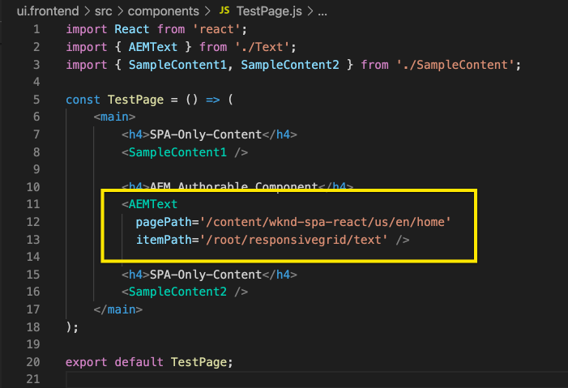

# Een externe SPA bewerken in AEM {#editing-external-spa-within-aem}

Wanneer het beslissen van [welk niveau van integratie](/help/implementing/developing/headful-headless.md) u tussen uw externe SPA en AEM zou willen hebben, moet u vaak kunnen uitgeven evenals de SPA binnen AEM bekijken.

## Overzicht {#overview}

In dit document worden de aanbevolen stappen beschreven voor het uploaden van een zelfstandige SPA naar een AEM-instantie, het toevoegen van bewerkbare gedeelten van inhoud en het inschakelen van ontwerpen.

## Vereisten {#prerequisites}

De voorwaarden zijn eenvoudig.

* Zorg ervoor dat een instantie van AEM lokaal wordt uitgevoerd.
* Creeer een basis AEM SPA project gebruikend [het Archetype van het Project van de AEM.](https://experienceleague.adobe.com/docs/experience-manager-core-components/using/developing/archetype/overview.html?#available-properties)
   * Dit zal de basis vormen van het AEM project dat zal worden bijgewerkt met de externe SPA.
   * Voor de steekproeven in dit document, gebruiken wij het uitgangspunt van [het WKND SPA project.](https://experienceleague.adobe.com/docs/experience-manager-learn/sites/spa-editor/spa-editor-framework-feature-video-use.html#spa-editor)
* Heb de werkende, externe Reactie SPA die u bij hand wilt integreren.

## SPA uploaden naar AEM project {#upload-spa-to-aem-project}

Eerst moet u de externe SPA uploaden naar uw AEM project.

1. Vervang `src` in `/ui.frontend` projectomslag met de omslag `src` van uw React toepassing.
1. Neem eventuele extra afhankelijkheden op in het `package.json`-bestand van de app.`/ui.frontend/package.json`
   * Zorg ervoor dat de SPA SDK-afhankelijkheden van [aanbevolen versies zijn.](/help/implementing/developing/hybrid/getting-started-react.md#dependencies)
1. Neem aanpassingen op in de map `/public`.
1. Neem inline scripts of stijlen op die u in het bestand `/public/index.html` hebt toegevoegd.

## De externe SPA {#configure-remote-spa} configureren

Nu de externe SPA deel uitmaakt van uw AEM project, moet deze binnen AEM worden geconfigureerd.

### Inclusief Adobe SPA SDK-pakketten {#include-spa-sdk-packages}

Om uit AEM SPA eigenschappen voordeel te halen, zijn er gebiedsdelen op de volgende drie pakketten.

* [`@adobe/aem-react-editable-components`](https://github.com/adobe/aem-react-editable-components)
* [`@adobe/aem-spa-component-mapping`](https://www.npmjs.com/package/@adobe/aem-spa-component-mapping)
* [`@adobe/aem-spa-page-model-manager`](https://www.npmjs.com/package/@adobe/aem-spa-model-manager)

`@adobe/aem-spa-page-model-manager` verstrekt API voor het initialiseren van een ModelManager en het terugwinnen van het model van de AEM instantie. Dit model kan dan worden gebruikt om AEM componenten terug te geven gebruikend APIs van `@adobe/aem-react-editable-components` en `@adobe/aem-spa-component-mapping`.

#### Installatie {#installation}

Voer de volgende npm-opdracht uit om de vereiste pakketten te installeren.

```shell
npm install --save @adobe/aem-spa-component-mapping @adobe/aem-spa-page-model-manager @adobe/aem-react-editable-components
```

### ModelManager-initialisatie {#model-manager-initialization}

Voordat de app wordt gerenderd, moet [`ModelManager`](/help/implementing/developing/hybrid/blueprint.md#pagemodelmanager) worden geïnitialiseerd om het maken van de AEM `ModelStore` af te handelen.

Dit moet worden gedaan binnen het `src/index.js` dossier van uw toepassing of waar de wortel van de toepassing wordt teruggegeven.

Hiervoor kunnen we `initializationAsync` API gebruiken die wordt geleverd door `ModelManager`.

De volgende schermafbeelding laat zien hoe u initialisatie van de `ModelManager` in een eenvoudige React-toepassing kunt inschakelen. De enige beperking is dat `initializationAsync` vóór `ReactDOM.render()` moet worden geroepen.


In dit voorbeeld wordt `ModelManager` geïnitialiseerd en wordt een lege `ModelStore` gemaakt.

`initializationAsync` U kunt optioneel een  `options` object accepteren als parameter:

* `path` - Bij initialisatie wordt het model op het gedefinieerde pad opgehaald en opgeslagen in de  `ModelStore`map. Dit kan worden gebruikt om `rootModel` bij initialisering te halen indien nodig.
* `modelClient` - Hiermee kunt u een aangepaste client opgeven die verantwoordelijk is voor het ophalen van het model.
* `model` - Een  `model` object dat wordt doorgegeven als een parameter die doorgaans wordt gevuld bij  [gebruik van SSR.](/help/implementing/developing/hybrid/ssr.md)

### AEM authorable Leaf Components {#authorable-leaf-components}

1. Maak/identificeer een AEM component waarvoor een authorable React component zal worden gecreeerd. In dit voorbeeld, gebruiken wij de de tekstcomponent van het WKND-project.

   

1. Maak een eenvoudige React-tekstcomponent in de SPA. In dit voorbeeld is een nieuw bestand `Text.js` gemaakt met de volgende inhoud.

   

1. Maak een configuratieobject om de kenmerken op te geven die nodig zijn voor AEM bewerken.

   

   * `resourceType` is verplicht om de component React aan de AEM component in kaart te brengen en het uitgeven toe te laten wanneer het openen in de AEM redacteur.

1. Gebruik de wrapperfunctie `withMappable`.

   

   Deze omslagfunctie brengt de React component aan AEM `resourceType` in config wordt gespecificeerd in kaart en laat het uitgeven mogelijkheden toe wanneer geopend in de AEM redacteur. Voor standalone componenten, zal het ook de modelinhoud voor de specifieke knoop halen.

   >[!NOTE]
   >
   >In dit voorbeeld zijn er afzonderlijke versies van de component: AEM omwikkelde en losgekoppelde React componenten. De omgelopen versie moet worden gebruikt wanneer expliciet de component wordt gebruikt. Wanneer de component deel uitmaakt van een pagina, kunt u de standaardcomponent blijven gebruiken zoals momenteel gedaan in de SPA editor.

1. Inhoud in de component renderen.

   De JCR-eigenschappen van de tekstcomponent worden als volgt AEM weergegeven.

   

   Deze waarden worden als eigenschappen doorgegeven aan de nieuwe `AEMText` React-component en kunnen worden gebruikt om de inhoud te renderen.

   ```javascript
   import React from 'react';
   import { withMappable } from '@adobe/aem-react-editable-components';
   
   export const TextEditConfig = {
       // Empty component placeholder label
       emptyLabel:'Text', 
       isEmpty:function(props) {
          return !props || !props.text || props.text.trim().length < 1;
       },
       // resourcetype of the AEM counterpart component
       resourceType:'wknd-spa-react/components/text'
   };
   
   const Text = ({ text }) => (<div>{text}</div>);
   
   export default Text;
   
   export const AEMText = withMappable(Text, TextEditConfig);
   ```

   Dit is hoe de component zal verschijnen wanneer de AEM configuraties volledig zijn.

   ```javascript
   const Text = ({ cqPath, richText, text }) => {
      const richTextContent = () => (
         <div className="aem_text" id={cqPath.substr(cqPath.lastIndexOf('/') + 1)} data-rte-editelement dangerouslySetInnerHTML={{__html: text}}/>
      );
      return richText ? richTextContent() : (<div className="aem_text">{text}</div>);
   };
   ```

   >[!NOTE]
   >
   >In dit voorbeeld hebben wij verdere aanpassingen aangebracht aan de teruggegeven component om de bestaande tekstcomponent aan te passen. Dit houdt echter geen verband met het schrijven in AEM.

#### Auteursbare componenten aan de Pagina {#add-authorable-component-to-page} toevoegen

Zodra authorable React componenten worden gecreeerd, kunnen wij hen door de toepassing gebruiken.

Neem een voorbeeldpagina waar wij een tekst van het WKND SPA project moeten toevoegen. In dit voorbeeld willen we de tekst &quot;Hello World!&quot; weergeven on `/content/wknd-spa-react/us/en/home.html`.

1. Bepaal het pad van het knooppunt dat moet worden weergegeven.

   * `pagePath`: De pagina die het knooppunt bevat, in ons voorbeeld  `/content/wknd-spa-react/us/en/home`
   * `itemPath`: Pad naar het knooppunt binnen de pagina, in ons voorbeeld  `root/responsivegrid/text`
      * Dit bestaat uit de namen van de bevattende items op de pagina.

   

1. Component toevoegen op de gewenste positie op de pagina.

   

   De `AEMText` component kan op de vereiste positie binnen de pagina worden toegevoegd met `pagePath` en `itemPath` waarden die als eigenschappen worden geplaatst. `pagePath` is een verplichte eigenschap.

#### Bewerken van tekstinhoud controleren op AEM {#verify-text-edit}

We kunnen nu de component testen op onze actieve AEM-instantie.

1. Voer het volgende Maven bevel van de `aem-guides-wknd-spa` folder in werking om het project aan AEM te bouwen en op te stellen.

```shell
mvn clean install -PautoInstallSinglePackage
```

1. Navigeer op uw AEM naar `http://<host>:<port>/editor.html/content/wknd-spa-react/us/en/home.html`.


De component `AEMText` kan nu worden AEM.

### Auteursbare pagina&#39;s AEM {#aem-authorable-pages}

1. Identificeer een pagina die voor creatie in de SPA moet worden toegevoegd. In dit voorbeeld wordt `/content/wknd-spa-react/us/en/home.html` gebruikt.
1. Een nieuw bestand maken (bijvoorbeeld `Page.js`) voor de authorable Component van de Pagina. Hier, kunnen wij de Component van de Pagina opnieuw gebruiken die in `@adobe/cq-react-editable-components` wordt verstrekt.
1. Herhaal stap vier in de sectie [AEM authorable leaf components.](#authorable-leaf-components) Gebruik de omslagfunctie  `withMappable` op de component.
1. Zoals eerder gedaan, pas `MapTo` op de AEM middeltypes voor alle kindcomponenten binnen de pagina toe.

   ```javascript
   import { Page, MapTo, withMappable } from '@adobe/aem-react-editable-components';
   import Text, { TextEditConfig } from './Text';
   
   export default withMappable(Page);
   
   MapTo('wknd-spa-react/components/text')(Text, TextEditConfig);
   ```

   >[!NOTE]
   >
   >In dit voorbeeld gebruiken wij de unwrapped React tekstcomponent in plaats van de verpakte `AEMText` eerder gecreeerd. Wanneer de component deel uitmaakt van een pagina/container en niet zelfstandig is, zorgt de container ervoor dat de component recursief in kaart wordt gebracht en dat ontwerpmogelijkheden worden ingeschakeld en dat de extra omloop niet nodig is voor elk onderliggend element.

1. Als u een pagina wilt toevoegen die kan worden geschreven in de SPA, voert u dezelfde stappen uit in de sectie [Auteurscomponenten toevoegen aan de pagina.](#add-authorable-component-to-page) Hier kunnen we de  `itemPath` eigenschap echter overslaan.

#### Pagina-inhoud verifiëren op AEM {#verify-page-content}

Als u wilt controleren of de pagina kan worden bewerkt, voert u dezelfde stappen uit in de sectie [Bewerken van tekstinhoud op AEM controleren.](#verify-text-edit)


De pagina kan nu worden bewerkt op AEM met een lay-outcontainer en onderliggende tekstcomponent.

### Virtuele bladcomponenten {#virtual-leaf-components}

In de vorige voorbeelden hebben we componenten aan de SPA toegevoegd met bestaande AEM inhoud. Er zijn echter gevallen waarin inhoud nog niet in AEM is gemaakt, maar later moet worden toegevoegd door de auteur van de inhoud. Hiervoor kan de front-end ontwikkelaar componenten toevoegen op de juiste locaties in de SPA. Deze componenten zullen placeholders tonen wanneer geopend in de redacteur in AEM. Nadat de inhoud door de auteur van de inhoud in deze plaatsaanduidingen is toegevoegd, worden knooppunten gemaakt in de JCR-structuur en wordt de inhoud voortgezet. De gemaakte component staat dezelfde set bewerkingen toe als de zelfstandige bladcomponenten.

In dit voorbeeld wordt de eerder gemaakte component `AEMText` opnieuw gebruikt. Wij willen dat nieuwe tekst onder de bestaande tekstcomponent op de WKND homepage wordt toegevoegd. De toevoeging van componenten is hetzelfde als voor normale bladcomponenten. De `itemPath` kan echter worden bijgewerkt naar het pad waar de nieuwe component moet worden toegevoegd.

Aangezien de nieuwe component onder de bestaande tekst bij `root/responsivegrid/text` moet worden toegevoegd, zou het nieuwe pad `root/responsivegrid/{itemName}` zijn.

```html
<AEMText
 pagePath='/content/wknd-spa-react/us/en/home'
 itemPath='root/responsivegrid/text_20' />
```

De `TestPage` component ziet er als volgt uit na het toevoegen van de virtuele component.


>[!NOTE]
>
>Zorg ervoor dat de `AEMText`-component in de configuratie is ingesteld om deze functie in te schakelen.`resourceType`

U kunt de wijzigingen nu implementeren in AEM volgende stappen in de sectie [Bewerken van tekstinhoud bij AEM controleren.](#verify-text-edit) Er wordt een tijdelijke aanduiding weergegeven voor het momenteel niet bestaande  `text_20` knooppunt.


Wanneer de auteur van de inhoud deze component bijwerkt, wordt een nieuw `text_20` knooppunt gemaakt op `root/responsivegrid/text_20` in `/content/wknd-spa-react/us/en/home`.


#### Vereisten en beperkingen {#limitations}

Er zijn een aantal vereisten om virtuele bladcomponenten en enkele beperkingen toe te voegen.

* De eigenschap `pagePath` is verplicht voor het maken van een virtuele component.
* Het paginaknooppunt op de weg in `pagePath` moet in het AEM project bestaan.
* De naam van de te creëren knoop moet in `itemPath` worden verstrekt.
* De component kan op elk niveau worden gemaakt.
   * Als wij `itemPath='text_20'` in het vorige voorbeeld verstrekken, zal de nieuwe knoop direct onder de pagina worden gecreeerd, d.w.z. `/content/wknd-spa-react/us/en/home/jcr:content/text_20`
* Het pad naar het knooppunt waar een nieuw knooppunt wordt gemaakt, moet geldig zijn wanneer dit via `itemPath` wordt opgegeven.
   * In dit voorbeeld moet `root/responsivegrid` bestaan, zodat het nieuwe knooppunt `text_20` daar kan worden gemaakt.
* Alleen het maken van bladcomponenten wordt ondersteund. Virtuele container en pagina worden in toekomstige versies ondersteund.

## Aanvullende aanpassingen {#additional-customizations}

Als u de vorige voorbeelden hebt gevolgd, kunt u uw externe SPA nu bewerken in AEM. Er zijn echter aanvullende aspecten van uw externe SPA die u verder kunt aanpassen.

### Hoofdknooppunt-id {#root-node-id}

Door gebrek, veronderstellen wij dat de React toepassing binnen `div` van elementidentiteitskaart `spa-root` wordt teruggegeven. Indien nodig, kan dit worden aangepast.

Stel dat we een SPA hebben waarin de toepassing wordt gerenderd in een `div` element-id `root`. Dit moet worden weerspiegeld in drie bestanden.

1. In `index.js` van de React toepassing (of waar `ReactDOM.render()` wordt geroepen)

   

1. In `index.html` van de React toepassing

   

1. Voer twee stappen uit in de hoofdtekst van de paginacomponent van de AEM-app:

   1. Maak een nieuwe `body.html` voor de paginacomponent.

   

   1. Voeg het nieuwe hoofdelement in het nieuwe `body.html` dossier toe.

   

### Het uitgeven van React SPA met het Verpletteren {#editing-react-spa-with-routing}

Als de externe React SPA toepassing veelvoudige pagina&#39;s heeft, [kan het het verpletteren gebruiken om de pagina/component te bepalen om terug te geven.](/help/implementing/developing/hybrid/routing.md) Het basisgebruiksgeval moet momenteel - actieve URL met de weg aanpassen die voor een route wordt verstrekt. Om het uitgeven op zulk toe te laten verpletterend toegelaten toepassingen, de weg aan te passen tegen moet worden getransformeerd om AEM-specifieke info aan te passen.

In het volgende voorbeeld hebben we een eenvoudige React-toepassing met twee pagina&#39;s. De pagina die moet worden teruggegeven wordt bepaald door de weg aan de router tegen actieve URL wordt verstrekt aan te passen. Als wij bijvoorbeeld op `mydomain.com/test` staan, wordt `TestPage` weergegeven.


Om het uitgeven binnen AEM voor dit SPA toe te laten, zijn de volgende stappen vereist.

1. Identificeer het niveau dat als wortel op AEM zou dienst doen.

   * Voor ons voorbeeld overwegen we wknd-spa-response/us/en als de basis van de SPA. Dit betekent dat alles vóór dat pad AEM alleen pagina&#39;s/inhoud is.

1. Maak een nieuwe pagina op het vereiste niveau.

   * In dit voorbeeld is de pagina die moet worden bewerkt `mydomain.com/test`. `test` bevindt zich in het hoofdpad van de app. Dit moet ook worden behouden bij het maken van de pagina in AEM. Daarom kunnen wij een nieuwe pagina op het wortelniveau tot stand brengen dat in de vorige stap wordt bepaald.
   * De nieuwe pagina die u maakt, moet dezelfde naam hebben als de pagina die u wilt bewerken. In dit voorbeeld voor `mydomain.com/test` moet de nieuwe gemaakte pagina `/path/to/aem/root/test` zijn.

1. Voeg helpers binnen SPA het verpletteren toe.

   * De nieuwe pagina geeft de verwachte inhoud nog niet in AEM weer. Dit is omdat de router een weg van `/test` terwijl de AEM actieve weg `/wknd-spa-react/us/en/test` verwacht. Om het AEM-specifieke gedeelte van URL aan te passen, moeten wij sommige helpers aan de SPA kant toevoegen.

   

   * De `toAEMPath` helper die door `@adobe/cq-spa-page-model-manager` wordt verstrekt kan voor dit worden gebruikt. Het transformeert de weg die voor het verpletteren wordt verstrekt om AEM-specifieke gedeelten te omvatten wanneer de toepassing op een AEM instantie open is. Er worden drie parameters geaccepteerd:
      * De weg die voor het verpletteren wordt vereist
      * De oorsprong-URL van de AEM instantie waar de SPA wordt bewerkt
      * De projectwortel op AEM zoals bepaald in eerste stap
   * Deze waarden kunnen worden ingesteld als omgevingsvariabelen voor meer flexibiliteit.


1. Verifieer het uitgeven van de pagina in AEM.

   * Implementeer het project om te AEM en naar de nieuwe `test` pagina te navigeren. De pagina-inhoud wordt nu gerenderd en AEM componenten kunnen worden bewerkt.

## Aanvullende bronnen {#additional-resources}

Het volgende referentiemateriaal kan nuttig zijn om SPA in de context van AEM te begrijpen.

* [Hoofdletters en headless in AEM](/help/implementing/developing/headful-headless.md)
* [Het AEM Project Archetype](https://experienceleague.adobe.com/docs/experience-manager-core-components/using/developing/archetype/overview.html)
* [Het WKND-SPA-project](https://experienceleague.adobe.com/docs/experience-manager-learn/sites/spa-editor/spa-editor-framework-feature-video-use.html)
* [Aan de slag met SPA in AEM Reageren gebruiken](/help/implementing/developing/hybrid/getting-started-react.md)
* [Referentiematerialen SPA (API-referenties)](/help/implementing/developing/hybrid/reference-materials.md)
* [SPA Bladeren en PageModelManager](/help/implementing/developing/hybrid/blueprint.md#pagemodelmanager)
* [SPA](/help/implementing/developing/hybrid/routing.md)
* [SPA en rendering op de server](/help/implementing/developing/hybrid/ssr.md)
