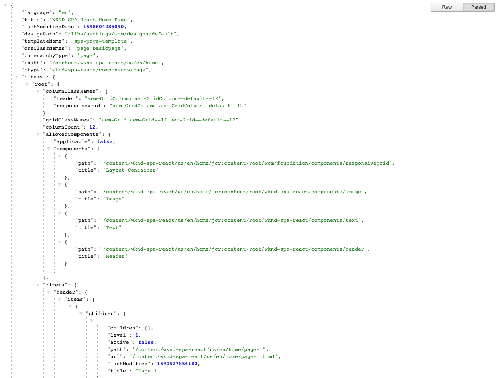

# SPA Inleiding en Analyse {#spa-introduction}

Toepassingen op één pagina (SPA) kunnen aantrekkelijke ervaringen bieden voor websitegebruikers. Ontwikkelaars willen sites kunnen maken met behulp van SPA frameworks en auteurs willen inhoud naadloos bewerken binnen AEM voor een site die is gebouwd met behulp van dergelijke frameworks.

De SPA Editor biedt een uitgebreide oplossing voor het ondersteunen van SPA binnen AEM. Dit artikel doorloopt het gebruiken van een basis SPA toepassing voor creatie en toont hoe het op het onderliggende AEM SPA Redacteur betrekking heeft.

## Inleiding {#introduction}

### Artikel doelstelling {#article-objective}

Dit artikel introduceert de basisconcepten van SPA alvorens de lezer door een analyse van de SPA redacteur door een eenvoudige SPA toepassing te gebruiken te leiden om basisinhoud het uitgeven aan te tonen. Vervolgens duikt het neer in de constructie van de pagina en hoe de SPA toepassing zich verhoudt tot en communiceert met de AEM SPA Editor.

Het doel van deze inleiding en analyse is aan een AEM ontwikkelaar te tonen waarom SPA relevant zijn, hoe zij over het algemeen werken, hoe een SPA door de AEM Redacteur wordt behandeld SPA, en hoe het van een standaard AEM toepassing verschillend is.

De analyse is gebaseerd op standaard AEM functionaliteit en de steekproefWKND SPA Project app. Als u de stappen wilt volgen, moet u [de voorbeeld-WKND-SPA Project-app van GitHub hier downloaden en installeren.](https://github.com/adobe/aem-guides-wknd-spa)

>[!CAUTION]
>
>Dit document gebruikt [WKND SPA Project app](https://github.com/adobe/aem-guides-wknd-spa) alleen voor demonstratiedoeleinden. Het mag niet worden gebruikt voor projectwerkzaamheden.

>[!TIP]
>
>Om het even welk AEM project zou hefboomwerking [AEM Project Archetype](https://docs.adobe.com/content/help/en/experience-manager-core-components/using/developing/archetype/overview.html), dat SPA projecten gebruikend React of Hoekig steunt en hefboomwerkingen de SPA SDK.

### Wat is een SPA? {#what-is-a-spa}

Een toepassing van één pagina (SPA) verschilt van een conventionele pagina in zoverre dat het cliënt-kant wordt teruggegeven en hoofdzakelijk JavaScript-gedreven is, die op Ajax vraag baseert om gegevens te laden en dynamisch de pagina bij te werken. De meeste of alle inhoud wordt één keer opgehaald in één pagina die wordt geladen met extra bronnen die asynchroon worden geladen, afhankelijk van gebruikersinteractie met de pagina.

Hierdoor is het minder nodig pagina&#39;s te vernieuwen en wordt de gebruiker een ervaring geboden die naadloos, snel is en meer lijkt op een native app-ervaring.

Met de AEM SPA Editor kunnen front-end ontwikkelaars SPA maken die in een AEM site kunnen worden geïntegreerd, zodat de auteurs van de inhoud de SPA inhoud net zo gemakkelijk kunnen bewerken als elke andere AEM.

### Waarom een SPA? {#why-a-spa}

Door sneller, vloeiend en meer als een native toepassing te zijn, wordt een SPA een zeer aantrekkelijke ervaring, niet alleen voor de bezoeker van de webpagina, maar ook voor marketers en ontwikkelaars vanwege de aard van de manier waarop SPA werkt.


#### Bezoekers {#visitors}

* Bezoekers willen native ervaringen als ze met inhoud werken.
* Er zijn duidelijke gegevens dat hoe sneller een pagina, hoe waarschijnlijker een conversie zal plaatsvinden.

#### Marketers {#marketers}

* Marketers willen rijke, native ervaringen bieden om bezoekers te dwingen om zich volledig met inhoud bezig te houden.
* Personalisatie kan deze ervaringen nog aantrekkelijker maken.

#### Ontwikkelaars {#developers}

* Ontwikkelaars willen een duidelijke scheiding tussen inhoud en presentatie.
* Schone scheiding maakt het systeem uitbreidbaarder en maakt het mogelijk om onafhankelijk front-end te ontwikkelen.

### Hoe werkt een SPA? {#how-does-a-spa-work}

Het primaire idee achter een SPA is dat de vraag aan en de afhankelijkheid van een server worden verminderd om vertragingen te minimaliseren die door serverlatentie worden veroorzaakt zodat de SPA de ontvankelijkheid van een inheemse toepassing benadert.

In een traditionele, opeenvolgende webpagina worden alleen de gegevens geladen die nodig zijn voor de directe pagina. Dit betekent dat wanneer de bezoeker naar een andere pagina gaat, de server om de extra bronnen wordt gevraagd. Aanvullende aanroepen kunnen nodig zijn wanneer de bezoeker werkt met elementen op de pagina. Deze veelvoudige vraag kan een gevoel van vertraging of vertraging geven aangezien de pagina met de verzoeken van de bezoeker moet inhalen.


Voor een vloeiendere ervaring, die nadert wat een bezoeker verwacht van mobiele, native apps, laadt een SPA alle benodigde gegevens voor de bezoeker bij de eerste lading. Hoewel dit een beetje langer kan duren, elimineert het dan de behoefte aan extra servervraag.

Door de pagina op de client te renderen, reageren de pagina-elementen sneller en hebben de bezoekers direct interactie met de pagina. Eventuele aanvullende gegevens worden asynchroon aangeroepen om de snelheid van de pagina te maximaliseren.

>[!TIP]
>
>Raadpleeg de artikelen voor technische details over SPA werken in AEM:
>* [Aan de slag met SPA in AEM Reageren gebruiken](getting-started-react.md)
>* [Aan de slag met SPA in AEM Gebruik van Hoek](getting-started-angular.md)

>
>
Raadpleeg het artikel voor een nadere uitleg van het ontwerp, de architectuur en de technische workflow van de SPA Editor:
>* [SPA Editor - Overzicht](editor-overview.md).


## Ervaring voor het bewerken van inhoud met SPA {#content-editing-experience-with-spa}

Wanneer een SPA is gemaakt om gebruik te maken van de AEM SPA Editor, merkt de auteur van de inhoud op dat er geen verschil is bij het bewerken en maken van inhoud. Er is algemene AEM beschikbaar en er zijn geen wijzigingen in de workflow van de auteur vereist.

1. Bewerk de WKND SPA Project-app in AEM.

   `http://localhost:4502/editor.html/content/wknd-spa-react/us/en/home.html`

   

1. Selecteer een tekstcomponent. Een werkbalk ziet er net zo uit als een andere component. Selecteer **Bewerken**.

   

1. Bewerk de inhoud als normaal binnen AEM en houd er rekening mee dat de wijzigingen zich blijven voordoen.

   

1. Met de middelenbrowser kunt u een nieuwe afbeelding naar een afbeeldingscomponent slepen en neerzetten.

   

1. De wijziging wordt doorgevoerd.

   

Extra ontwerpgereedschappen, zoals het slepen en neerzetten van aanvullende componenten op de pagina, het opnieuw rangschikken van componenten en het wijzigen van de layout, worden ondersteund, net als in elke andere AEM.

>[!NOTE]
>
>De SPA Editor wijzigt het DOM van de toepassing niet. De SPA zelf is verantwoordelijk voor het DOM.
>
>Als u wilt zien hoe dit werkt, gaat u verder naar het volgende gedeelte van dit artikel [SPA Apps en de AEM SPA Editor](#spa-apps-and-the-aem-spa-editor).

## Apps en de AEM SPA Redacteur {#spa-apps-and-the-aem-spa-editor} SPA

Door te ervaren hoe een SPA zich gedraagt voor de eindgebruiker en vervolgens de SPA pagina te inspecteren, kunt u beter begrijpen hoe een SAP-app werkt met de SPA Editor in AEM.

### Een SPA toepassing {#using-an-spa-application} gebruiken

1. Laad de WKND SPA-projecttoepassing op de publicatieserver of met de optie **Weergeven als gepubliceerd** in het menu **Pagina-informatie** in de paginaeditor.

   `http://<host>:<port>/content/wknd-spa-react/us/en/home.html`

   

   Maak een notitie van de paginastructuur, inclusief navigatie naar onderliggende pagina&#39;s, menu&#39;s en artikelkaarten.

1. Navigeer naar een onderliggende pagina met behulp van het menu en controleer of de pagina direct wordt geladen zonder dat een pagina moet worden vernieuwd.

   

1. Open de ingebouwde ontwikkelaarsgereedschappen van uw browser en controleer de netwerkactiviteit terwijl u door de onderliggende pagina&#39;s navigeert.

   

   Er is erg weinig verkeer wanneer u van pagina naar pagina gaat in de app. De pagina wordt niet opnieuw geladen en alleen de nieuwe afbeeldingen worden aangevraagd.

   De SPA beheert de inhoud en het verpletteren volledig op de cliëntkant.

Dus als de pagina niet opnieuw wordt geladen wanneer u door de onderliggende pagina&#39;s navigeert, hoe wordt deze geladen?

In de volgende sectie, [Een SPA toepassing laden](#loading-a-spa-application), wordt dieper ingegaan op de mechanica van het laden van de SPA en hoe de inhoud synchroon en asynchroon kan worden geladen.

### Een SPA {#loading-a-spa-application} laden

1. Als nog niet geladen, laadt u de toepassing We.Retail Journal op de publicatieserver of met de optie **View as Published** in het menu **Page Information** in de pagina-editor.

   `http://<host>:<port>/content/wknd-spa-react/us/en/home.html`

   

1. Gebruik het ingebouwde gereedschap van uw browser om de bron van de pagina weer te geven.
1. De inhoud van de bron is beperkt.

   ```html
    <!DOCTYPE html>
    <html lang="en">
    <head>
        <meta charset="UTF-8"/>
        <title>WKND SPA React Home Page</title>
   
        <meta name="template" content="spa-page-template"/>
        <meta name="viewport" content="width=device-width, initial-scale=1"/>
   
    <link rel="stylesheet" href="/etc.clientlibs/wknd-spa-react/clientlibs/clientlib-base.min.css" type="text/css">
   
    <meta name="theme-color" content="#000000"/>
    <link rel="icon" href="/etc.clientlibs/wknd-spa-react/clientlibs/clientlib-react/resources/favicon.ico"/>
    <link rel="apple-touch-icon" href="/etc.clientlibs/wknd-spa-react/clientlibs/clientlib-react/resources/logo192.png"/>
    <link rel="manifest" href="/etc.clientlibs/wknd-spa-react/clientlibs/clientlib-react/resources/manifest.json"/>
   
    <!-- AEM page model -->
    <meta property="cq:pagemodel_root_url" content="/content/wknd-spa-react/us/en.model.json"/>
    <link href="//fonts.googleapis.com/css?family=Source+Sans+Pro:400,600|Asar&display=swap" rel="stylesheet"/>
    <meta property="cq:datatype" content="JSON"/>
    <meta property="cq:wcmmode" content="edit"/>
   
    <link rel="stylesheet" href="/libs/cq/gui/components/authoring/editors/clientlibs/internal/page.min.css" type="text/css">
    <link rel="stylesheet" href="/etc.clientlibs/wcm/foundation/clientlibs/main.min.css" type="text/css">
    <script type="text/javascript" src="/libs/cq/gui/components/authoring/editors/clientlibs/internal/messaging.min.js"></script>
    <script type="text/javascript" src="/libs/cq/gui/components/authoring/editors/clientlibs/utils.min.js"></script>
    <script type="text/javascript" src="/libs/granite/author/deviceemulator/clientlibs.min.js"></script>
    <script type="text/javascript" src="/libs/cq/gui/components/authoring/editors/clientlibs/internal/page.min.js"></script>
    <script type="text/javascript" src="/etc.clientlibs/wcm/foundation/clientlibs/main.min.js"></script>
    <script type="text/javascript" src="/etc.clientlibs/clientlibs/granite/jquery.min.js"></script>
    <script type="text/javascript" src="/etc.clientlibs/clientlibs/granite/utils.min.js"></script>
    <script type="text/javascript" src="/etc.clientlibs/clientlibs/granite/jquery/granite.min.js"></script>
    <script type="text/javascript" src="/etc.clientlibs/foundation/clientlibs/jquery.min.js"></script>
    <script type="text/javascript" src="/etc.clientlibs/foundation/clientlibs/shared.min.js"></script>
   
    <!--cq{"decorated":false,"type":"cq/cloudconfig/components/scripttags/header","path":"/content/wknd-spa-react/us/en/home/jcr:content/cloudconfig-header","structurePath":"/content/wknd-spa-react/us/en/home/jcr:content/cloudconfig-header","selectors":null,"servlet":"Script /libs/cq/cloudconfig/components/scripttags/header/header.html","totalTime":2,"selfTime":2}-->
   
    <link rel="stylesheet" href="/etc.clientlibs/wknd-spa-react/clientlibs/clientlib-react.min.css" type="text/css">
   
    </head>
   
    <body class="page basicpage">
        <noscript>You need to enable JavaScript to run this app.</noscript>
    <div id="spa-root"></div>
   
    <script type="text/javascript" src="/etc.clientlibs/wknd-spa-react/clientlibs/clientlib-react.min.js"></script>
   
    <script type="text/javascript" src="/etc.clientlibs/core/wcm/components/commons/site/clientlibs/container.min.js"></script>
    <script type="text/javascript" src="/etc.clientlibs/wknd-spa-react/clientlibs/clientlib-base.min.js"></script>
   
    <script type="text/javascript" src="/libs/cq/gui/components/authoring/editors/clientlibs/internal/pagemodel/messaging.min.js"></script>
   
    <link rel="stylesheet" href="/etc.clientlibs/wknd-spa-react/clientlibs/clientlib-author.min.css" type="text/css">
   
    <!--cq{"decorated":true,"type":"cq/cloudserviceconfigs/components/servicecomponents","path":"/content/wknd-spa-react/us/en/home/jcr:content/cloudservices","selectors":null,"servlet":"Script /libs/cq/cloudserviceconfigs/components/servicecomponents/servicecomponents.jsp","totalTime":2,"selfTime":2}-->
   
    <!--cq{"decorated":false,"type":"cq/cloudconfig/components/scripttags/footer","path":"/content/wknd-spa-react/us/en/home/jcr:content/cloudconfig-footer","structurePath":"/content/wknd-spa-react/us/en/home/jcr:content/cloudconfig-footer","selectors":null,"servlet":"Script /libs/cq/cloudconfig/components/scripttags/footer/footer.html","totalTime":2,"selfTime":2}-->
   
    </body>
    </html>
    <!--cq{"decorated":false,"type":"wknd-spa-react/components/page","path":"/content/wknd-spa-react/us/en/home/jcr:content","selectors":null,"servlet":"Script /apps/spa-project-core/components/page/page.html","totalTime":39,"selfTime":33}-->
   ```

   De pagina heeft geen inhoud in de hoofdtekst. Het bestaat hoofdzakelijk uit stijlbladen en een vraag aan diverse manuscripten zoals `clientlib-react.min.js`.

   Deze scripts vormen de belangrijkste stuurprogramma&#39;s voor deze toepassing en zijn verantwoordelijk voor het renderen van alle inhoud.

1. Gebruik de ingebouwde gereedschappen van uw browser om de pagina te inspecteren. Zie de inhoud van de DOM volledig geladen.

   

1. Ga naar het tabblad Netwerk in de Inspecteur en laad de pagina opnieuw.

   Afbeeldingsverzoeken negeren. De primaire bronnen die voor de pagina worden geladen, zijn de pagina zelf, CSS, het React JavaScript, de afhankelijkheden en JSON-gegevens voor de pagina.

   

1. Laad `home.model.json` in een nieuw lusje.

   `http://<host>:<port>/content/wknd-spa-react/us/en/home.model.json`

   

   De AEM SPA Editor gebruikt [AEM Content Services](/help/assets/content-fragments/content-fragments.md) om de volledige inhoud van de pagina als een JSON-model te leveren.

   Door specifieke interfaces uit te voeren, verstrekken de Modellen van het Sling de informatie noodzakelijk aan de SPA. De levering van de JSON-gegevens wordt naar beneden gedelegeerd aan elke component (van pagina, alinea, component, enz.).

   Elke component kiest wat het blootstelt en hoe het (server-kant met HTML of cliënt-kant met React of Hoekig) wordt teruggegeven. Dit artikel richt zich op client-side rendering met React.

1. Het model kan pagina&#39;s ook groeperen zodat ze synchroon worden geladen, waardoor het aantal pagina&#39;s dat opnieuw moet worden geladen, afneemt.

   In het voorbeeld van We.Retail Journal worden de pagina&#39;s `home`, `page-1`, `page-2` en `page-3` synchroon geladen, aangezien bezoekers doorgaans alle pagina&#39;s bezoeken.

   Dit gedrag is niet verplicht en is volledig definieerbaar.

   

1. Als u dit verschil in gedrag wilt zien, laadt u de pagina `home` opnieuw en wist u de netwerkactiviteit van de inspecteur. Navigeer naar `page-1` in het paginamenu en controleer of de enige netwerkactiviteit een aanvraag is voor het image van `page-1`. `page-1` zelf hoeft niet te worden geladen.

   

### Interactie met de SPA-editor {#interaction-with-the-spa-editor}

Met behulp van de voorbeeldtoepassing WKND SPA Project is het duidelijk hoe de app zich gedraagt en wordt geladen wanneer deze wordt gepubliceerd, waarbij gebruik wordt gemaakt van inhoudsservices voor het leveren van JSON-inhoud en het asynchroon laden van bronnen.

Voor de auteur van de inhoud is het maken van inhoud met een SPA-editor bovendien naadloos in AEM.

In de volgende sectie zullen wij het contract onderzoeken dat de SPARedacteur toestaat om componenten binnen de SPA met AEM componenten te verbinden en deze naadloze het uitgeven ervaring te bereiken.

1. Laad de WKND SPA toepassing van het Project in de redacteur en schakelaar aan **Voorproef** wijze.

   `http://<host>:<port>/editor.html/content/wknd-spa-react/us/en/home.html`

1. Controleer de inhoud van de pagina met de ingebouwde ontwikkelaarsgereedschappen van uw browser. Selecteer met het selectiegereedschap een bewerkbare component op de pagina en bekijk de details van het element.

   De component heeft een nieuw gegevenskenmerk `data-cq-data-path`.

   

   Bijvoorbeeld

   `data-cq-data-path="/content/wknd-spa-react/us/en/home/jcr:content/root/responsivegrid/text`

   Met dit pad kunt u het contextconfiguratieobject van elke component ophalen en koppelen.

   Dit is het enige prijsverhogingsattribuut dat voor de redacteur wordt vereist om dit als editable component binnen de SPA te erkennen. Op basis van dit kenmerk bepaalt de SPA Editor welke bewerkbare configuratie aan de component is gekoppeld, zodat het juiste frame, de juiste werkbalk, enzovoort. is geladen.

   Bepaalde specifieke klassenamen worden ook toegevoegd voor het markeren van plaatsaanduidingen en voor het slepen en neerzetten van elementen.

   >[!NOTE]
   >
   >Dit gedrag verschilt van gerenderde pagina&#39;s aan serverzijde in AEM, waar een `cq`-element is ingevoegd voor elke bewerkbare component.
   >
   >Deze benadering in de Redacteur van de SPA verwijdert de behoefte om douaneelementen te injecteren, die slechts een extra gegevensattribuut baseren, die de prijsverhoging voor de frontend ontwikkelaar eenvoudiger maken.

## Volgende stappen {#next-steps}

Nu u de SPA het uitgeven ervaring in AEM begrijpt en hoe een SPA op de SPA Redacteur betrekking heeft, neem een diepgaande duik in het begrijpen van hoe een SPA wordt gebouwd.

* [Aan de slag met SPA in AEM met ](getting-started-react.md) Reactshows hoe een basisSPA is gemaakt om met de SPA Editor te werken in AEM Reageren
* [Aan de slag met SPA in AEM met behulp van ](getting-started-angular.md) Angularshows hoe een basisSPA is gemaakt om met de SPA Editor te werken in AEM met behulp van Hoekig
* [SPA de ](editor-overview.md) Overzichten van de Redacteur gaat dieper in het communicatie model tussen AEM en de SPA.
* [Het ontwikkelen van SPA voor ](developing.md) AEMbeschrijft hoe te om front-end ontwikkelaars in dienst te nemen om een SPA voor AEM te ontwikkelen evenals hoe SPA met AEM architectuur in wisselwerking staan.
