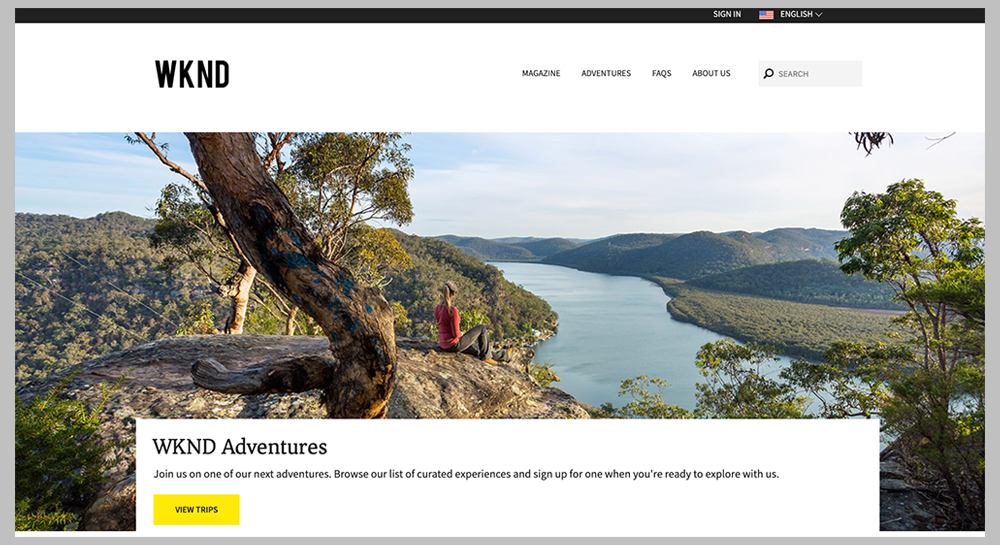

# Aan de slag met het ontwikkelen van AEM Sites - WKND-zelfstudie{#getting-started-developing-aem-sites-wknd-tutorial}

## Overzicht {#overview}

Hebt u Adobe Experience Manager nog niet ontwikkeld als cloudservice? Wilt u de nieuwste praktijken vernieuwen? Dit is de plaats om te beginnen!

Het doel van deze meerdelige zelfstudie is om een nieuwe ontwikkelaar van AEM te leren hoe hij een website in AEM implementeert met behulp van de nieuwste standaarden en technologieën. De hoop is aan het eind van deze zelfstudie zult u de basisstichting van het platform van AEM en de kennis van enkele gemeenschappelijke ontwerppatronen begrijpen.

## Zelfstudie voor WKND-ontwikkelaars {#wknd-developer-tutorial}

[De WKND-zelfstudie voor ontwikkelaars is hier](https://docs.adobe.com/content/help/en/experience-manager-learn/getting-started-wknd-tutorial-develop/overview.html) beschikbaar en begeleidt u bij het maken van een AEM-project met de nieuwste technologieën en best practices.

## Kernbegrippen {#core-concepts}

De zelfstudie-implementatie maakt gebruik van veel krachtige functies van AEM. De site wordt geïmplementeerd met:

* [Maven AEM Project Archetype](https://docs.adobe.com/content/help/en/experience-manager-core-components/using/developing/archetype/overview.html)
* [Kernonderdelen](https://docs.adobe.com/content/help/en/experience-manager-core-components/using/introduction.html)
* [HTL](https://docs.adobe.com/content/help/en/experience-manager-htl/using/getting-started/getting-started.html)
* Verkoopmodellen
* [Bewerkbare sjablonen](https://docs.adobe.com/content/help/en/experience-manager-learn/sites/page-authoring/template-editor-feature-video-use.html)
* [Stijlsysteem](https://docs.adobe.com/content/help/en/experience-manager-learn/sites/page-authoring/style-system-feature-video-use.html)