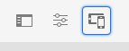

# Responsief ontwerp {#responsive-design}

Met responsief ontwerp kunnen dezelfde ervaringen effectief worden weergegeven op meerdere apparaten in verschillende richtingen.

>[!TIP]
>
>Dit document biedt een overzicht van responsief ontwerp voor ontwikkelaars en van de manier waarop functies in AEM worden uitgevoerd. Er zijn aanvullende bronnen beschikbaar:
>
>* Voor inhoudsauteurs, zijn de details van hoe te om ontvankelijke ontwerpeigenschappen op een inhoudspagina te gebruiken beschikbaar in het document [ Responsieve Lay-out.](/help/sites-cloud/authoring/page-editor/responsive-layout.md)
>* Voor plaatsbeheerders, wordt de details van hoe te om de lay-outcontainer voor uw plaatsen te vormen beschreven in [ Vormend het document van de Container van de Lay-out en van de Wijze van de Lay-out.](/help/sites-cloud/administering/responsive-layout.md)

## Overzicht {#overview}

Ontwerp uw ervaringen zodat ze zich aanpassen aan de clientviewport waarin ze worden weergegeven. Met responsief ontwerp kunnen dezelfde pagina&#39;s effectief op meerdere apparaten in beide richtingen worden weergegeven. In de volgende afbeelding ziet u enkele manieren waarop een pagina kan reageren op wijzigingen in de viewportgrootte:

* Lay-out: gebruik lay-outs met één kolom voor kleinere viewports en lay-outs met meerdere kolommen voor grotere viewports.
* Tekengrootte: gebruik grotere tekstgrootte (indien van toepassing, zoals koppen) in grotere viewports.
* Inhoud: neem alleen de belangrijkste inhoud op wanneer u deze weergeeft op kleinere apparaten.
* Navigatie: er zijn apparaatspecifieke gereedschappen voor toegang tot andere pagina&#39;s.
* Afbeeldingen: afbeeldingsuitvoeringen die geschikt zijn voor de viewport van de client, worden weergegeven op basis van de afmetingen van het venster.


Ontwikkel Adobe Experience Manager (AEM) toepassingen die HTML5 produceren die zich aan veelvoudige venstergrootte en richtlijn aanpast. De volgende bereiken van viewport-breedten komen bijvoorbeeld overeen met verschillende apparaattypen en -oriëntaties

* Maximale breedte van 480 pixels (telefoon, staand)
* Maximale breedte van 767 pixels (telefoon, liggend)
* Breedte tussen 768 pixels en 979 pixels (tablet, staand)
* Breedte tussen 980 pixels en 1199 pixels (tablet, liggend)
* Breedte van 1200 px of hoger (bureaublad)

Zie de volgende onderwerpen voor informatie over het uitvoeren van ontvankelijk ontwerpgedrag:

* [Mediaquery&#39;s](#using-media-queries)
* [Vloeiende rasters](#developing-a-fluid-grid)
* [Adaptieve afbeeldingen](#using-adaptive-images)

Aangezien u ontwerpt, gebruik de **Mededinger** toolbar aan voorproef uw pagina&#39;s voor diverse het schermgrootte.

## Voordat u ontwikkelt {#before-you-develop}

Voordat u de AEM-toepassing ontwikkelt die uw webpagina&#39;s ondersteunt, moet u een aantal ontwerpbeslissingen nemen. U moet bijvoorbeeld over de volgende informatie beschikken:

* De apparaten waarvoor u zich richt
* De doelviewportgrootten
* De paginalay-outs voor elk van de beoogde viewportgrootte

### Toepassingsstructuur {#application-structure}

De typische AEM-toepassingsstructuur ondersteunt alle responsieve ontwerpimplementaties:

* Paginacomponenten bevinden zich onder `/apps/<application_name>/components`
* Sjablonen bevinden zich onder `/apps/<application_name>/templates`

## Mediaquery&#39;s gebruiken {#using-media-queries}

Met mediaquery&#39;s kunt u CSS-stijlen selectief gebruiken voor het weergeven van pagina&#39;s. Met de AEM-ontwikkelingsprogramma&#39;s en -functies kunt u mediaquery&#39;s effectief en efficiënt implementeren in uw toepassingen.

De W3C groep verstrekt de [ aanbeveling van de Vragen van Media 0&rbrace; &lbrace;die deze CSS3 eigenschap en de syntaxis beschrijft.](https://www.w3.org/TR/css3-mediaqueries/)

### Het CSS-bestand maken {#creating-the-css-file}

Definieer in uw CSS-bestand mediaquery&#39;s op basis van de eigenschappen van de apparaten waarvoor u een mediaquery maakt. De volgende implementatiestrategie is effectief voor het beheren van stijlen voor elke mediaquery:

* Gebruik de omslag van de Bibliotheek van de a [ Cliënt ](clientlibs.md) om CSS te bepalen die wordt samengesteld wanneer de pagina wordt teruggegeven.
* Definieer elke mediaquery en de bijbehorende stijlen in afzonderlijke CSS-bestanden. Het is handig bestandsnamen te gebruiken die de apparaatfuncties van de mediaquery vertegenwoordigen.
* Definieer stijlen die op alle apparaten in een afzonderlijk CSS-bestand van toepassing zijn.
* In het css.txt- dossier van de omslag van de Bibliotheek van de Cliënt, orde de lijst CSS dossiers zoals vereist in het geassembleerde CSS dossier.

Het [ WKND leerprogramma ](develop-wknd-tutorial.md) gebruikt deze strategie om stijlen in het plaatsontwerp te bepalen. Het CSS-bestand dat door WKND wordt gebruikt, bevindt zich op `/apps/wknd/clientlibs/clientlib-grid/less/grid.less` .

### Mediaquery&#39;s gebruiken met AEM-pagina&#39;s {#using-media-queries-with-aem-pages}

[ het WKND steekproefproject ](/help/implementing/developing/introduction/develop-wknd-tutorial.md) en [ Archetype van het Project van AEM ](https://experienceleague.adobe.com/docs/experience-manager-core-components/using/developing/archetype/overview.html?lang=nl-NL) gebruiken de [ Component van de Kern van de Pagina ](https://experienceleague.adobe.com/docs/experience-manager-core-components/using/wcm-components/page.html?lang=nl-NL), die de clientlibs via het paginabeleid omvat.

Als uw eigen paginacomponent niet op de Component van de Kern van de Pagina wordt gebaseerd, kunt u de omslag van de cliëntbibliotheek in het manuscript van HTML of JSP van het ook omvatten. Als u dit doet, wordt het CSS-bestand gegenereerd en wordt ernaar verwezen met de mediaquery&#39;s die nodig zijn om het responsieve raster te laten werken.

#### HTL {#htl}

```html
<sly data-sly-use.clientlib="${'/libs/granite/sightly/templates/clientlib.html'}">
<sly data-sly-call="${clientlib.all @ categories='apps.weretail.all'}"/>
```

#### JSP {#jsp}

```xml
<ui:includeClientLib categories="apps.weretail.all"/>
```

Met het JSP-script wordt de volgende HTML-code gegenereerd die verwijst naar de stijlpagina&#39;s:

```xml
<link rel="stylesheet" href="/etc/designs/weretail/clientlibs-all.css" type="text/css">
<link href="/etc/designs/weretail.css" rel="stylesheet" type="text/css">
```

## Voorvertonen voor specifieke apparaten {#previewing-for-specific-devices}

Met de emulator kunt u uw pagina&#39;s voorvertonen in verschillende viewportgrootten, zodat u het gedrag van uw responsieve ontwerp kunt testen. Wanneer het uitgeven van een pagina in de Console van Plaatsen, kunt u het **Emulator** pictogram tikken of klikken om de mededinger te openbaren.



In de emulatortoolbar kunt u het **pictogram van Apparaten** ontsteken of klikken om een drop-down menu te openbaren waar u een apparaat kunt selecteren. Wanneer u een apparaat selecteert, wordt de pagina aangepast aan het formaat van de viewport.


### Apparaatgroepen opgeven {#specifying-device-groups}

Om de apparatengroepen te specificeren die in de **lijst van Apparaten** verschijnen, voeg a `cq:deviceGroups` bezit aan de `jcr:content` knoop van de malplaatjepagina van uw plaats toe. De waarde van de eigenschap is een array van paden naar de knooppunten van de apparaatgroep.

De sjabloonpagina van de WKND-site is bijvoorbeeld `/conf/wknd/settings/wcm/template-types/empty-page/structure` . En het knooppunt `jcr:content` eronder bevat de volgende eigenschap:

* Naam: `cq:deviceGroups`
* Type: `String[]`
* Waarde: `mobile/groups/responsive`

Apparaatgroepknooppunten bevinden zich in de map `/etc/mobile/groups` .

## Responsieve afbeeldingen {#responsive-images}

Responsieve pagina&#39;s worden dynamisch aangepast aan het apparaat waarop ze worden weergegeven en bieden een betere gebruikerservaring. Het is echter ook belangrijk dat elementen zijn geoptimaliseerd voor het onderbrekingspunt en het apparaat om de laadtijd van de pagina te minimaliseren.

[ de Component van het Beeld van de Component van de Kern ](https://experienceleague.adobe.com/docs/experience-manager-core-components/using/wcm-components/image.html?lang=nl-NL) eigenschappen zoals adaptieve beeldselectie.

* Door gebrek, gebruikt de Component van het Beeld de [ Aangepaste Servlet van het Beeld ](https://experienceleague.adobe.com/docs/experience-manager-core-components/using/developing/adaptive-image-servlet.html?lang=nl-NL) om de juiste vertoning te leveren.
* [ Web-Geoptimaliseerde Levering van het Beeld ](https://experienceleague.adobe.com/docs/experience-manager-core-components/using/developing/web-optimized-image-delivery.html?lang=nl-NL) is ook beschikbaar via eenvoudige checkbox in zijn beleid, dat beeldactiva van DAM in formaat WebP levert en de downloadgrootte van een beeld met ongeveer 25% gemiddeld kan verminderen.

## De container voor lay-out {#layout-container}

Met de AEM Layout Container kunt u op efficiënte en effectieve wijze responsieve lay-out implementeren om de afmetingen van de pagina aan te passen aan de viewport van de client.

>[ de documentatie GitHub ](https://adobe-marketing-cloud.github.io/aem-responsivegrid/) van het ontvankelijke net is een verwijzing die aan front-end ontwikkelaars kan worden gegeven die hen toestaan om het net van AEM buiten AEM te gebruiken, bijvoorbeeld, wanneer het creëren van statische modellen van HTML voor een toekomstige plaats van AEM.

>[!TIP]
>
>Gelieve te zien het document [ Vormende de Container van de Lay-out en Wijze van de Lay-out ](/help/sites-cloud/administering/responsive-layout.md) voor meer informatie over hoe de Container van de Lay-out werkt en hoe te om ontvankelijke lay-outs voor uw inhoud toe te laten.

## Geneste responsieve rasters {#nested-responsive-grids}

Het kan voorkomen dat u responsieve rasters moet nesten om de behoeften van uw project te ondersteunen. Houd er echter rekening mee dat de aanbevolen werkwijze van Adobe erin bestaat de structuur zo vlak mogelijk te houden.

Zorg ervoor dat wanneer u het gebruik van geneste responsieve rasters niet kunt vermijden:

* Alle containers (containers, tabbladen, accordeons, enz.) hebben de eigenschap `layout = responsiveGrid` .
* Meng de eigenschap `layout = simple` niet in de containerhiërarchie.

Dit omvat alle structurele containers van het paginasjabloon.

Het kolomnummer van de binnencontainer mag nooit groter zijn dan dat van de buitencontainer. In het volgende voorbeeld wordt aan deze voorwaarde voldaan. Terwijl het kolomnummer van de buitencontainer 8 is voor het standaardscherm (bureaublad), is het kolomnummer van de binnencontainer 4.

>[!BEGINTABS]

>[!TAB  Structuur van de Knoop van het Voorbeeld ]

```text
container
  @layout = responsiveGrid
  cq:responsive
    default
      @offset = 0
      @width = 8
  container
  @layout = responsiveGrid
    cq:responsive
      default
        @offset = 0
        @width = 4
    text
      @text =" Text Column 1"
```

>[!TAB  Voorbeeld resulterend HTML ]

```html
<div class="container responsivegrid aem-GridColumn--default--none aem-GridColumn aem-GridColumn--default--8 aem-GridColumn--offset--default--0">
  <div id="container-c9955c233c" class="cmp-container">
    <div class="aem-Grid aem-Grid--8 aem-Grid--default--8 ">
      <div class="container responsivegrid aem-GridColumn--default--none aem-GridColumn aem-GridColumn--offset--default--0 aem-GridColumn--default--4">
        <div id="container-8414e95866" class="cmp-container">
          <div class="aem-Grid aem-Grid--4 aem-Grid--default--4 ">
            <div class="text aem-GridColumn aem-GridColumn--default--4">
              <div data-cmp-data-layer="..." id="text-1234567890" class="cmp-text">
                <p>Text Column 1</p>
              </div>
            </div>
          </div>
        </div>
      </div>
    </div>
  </div>
</div>
```

>[!ENDTABS]
