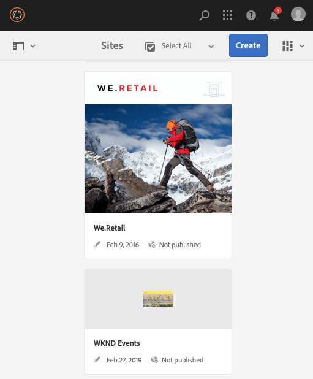
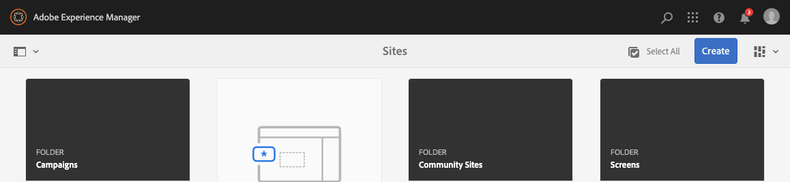
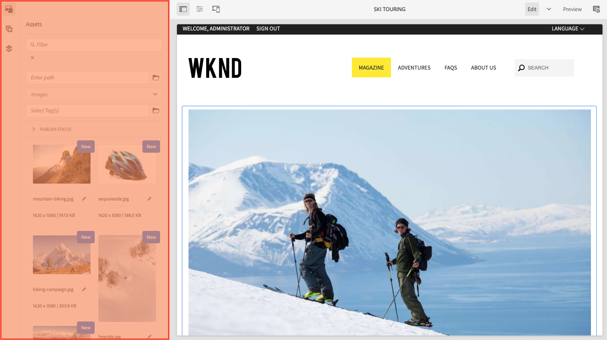

# Structuur van de AEM UI {#structure-of-the-aem-ui}

De AEM UI heeft verschillende onderliggende beginselen en bestaat uit verschillende sleutelelementen:

## Consoles {#consoles}

### Basislay-out en formaat {#basic-layout-and-resizing}

De interface biedt ruimte voor zowel mobiele apparaten als bureaubladapparaten, in plaats van twee stijlen te maken, AEM gebruikt één stijl die voor alle schermen en apparaten werkt.

Alle modules gebruiken de zelfde basislay-out, in AEM dit kan worden gezien als:

De lay-out voldoet aan een responsieve ontwerpstijl en past zich aan de grootte van het apparaat/venster aan dat u gebruikt.

Als de resolutie bijvoorbeeld lager is dan 1024 px (zoals op een mobiel apparaat), wordt het beeldscherm dienovereenkomstig aangepast:

### Koptekstbalk {#header-bar}

De kopbalbar toont globale elementen met inbegrip van:

* Het logo en het specifieke product/de specifieke oplossing die u momenteel gebruikt; voor AEM vormt dit ook een link naar de globale navigatie
* Zoeken
* Pictogram voor toegang tot de Help-bronnen
* Pictogram voor toegang tot andere oplossingen
* Een indicator van (en toegang tot) om het even welke alarm of Inbox punten die op u wachten
* Het gebruikerspictogram, samen met een koppeling naar uw profielbeheer

### Werkbalk {#toolbar}

De werkbalk is contextueel ten opzichte van uw locatie en de gereedschappen voor oppervlakken die relevant zijn voor het beheren van de weergave of elementen op de onderstaande pagina. De werkbalk is productspecifiek, maar de elementen hebben een zekere gemeen.

Op de werkbalk ziet u de acties die momenteel beschikbaar zijn.

Ook afhankelijk van of een bron momenteel is geselecteerd:

### Linkerspoor {#left-rail}

De linkerspoorstaaf kan worden geopend/verborgen zoals vereist om te tonen:

* **Alleen inhoud**
* **Inhoudsstructuur**
* **Tijdlijn**
* **Verwijzingen**
* **Filter**

De standaardwaarde is **Alleen inhoud** (spoorstaaf verborgen).

## Pagina-ontwerp {#page-authoring}

Bij het ontwerpen van pagina&#39;s ziet u de volgende structurele gebieden.

### Inhoudskader {#content-frame}

De pagina-inhoud wordt weergegeven in het inhoudskader. Het inhoudskader is volledig onafhankelijk van de editor - om ervoor te zorgen dat er geen conflicten zijn die te wijten zijn aan CSS of javascript.

Het inhoudskader bevindt zich in de rechtersectie van het venster, onder de werkbalk.

### Editor-frame {#editor-frame}

Het editorkader laat de het uitgeven eigenschappen toe.

Het editorframe is een container (abstract) voor alle pagina-ontwerpelementen. Het leeft bovenop het inhoudskader, en omvat:

* De bovenste werkbalk
* Het zijpaneel
* Alle overlays
* elk ander pagina-ontwerpelement; bijvoorbeeld de werkbalk van de component

### Zijpaneel {#side-panel}

Dit bevat drie standaardtabbladen. Met de tabbladen **Middelen** en **Componenten** kunt u dergelijke elementen selecteren en uit het deelvenster slepen en op de pagina neerzetten. Met het tabblad **Inhoudsstructuur** kunt u de hiërarchie van inhoud op de pagina inspecteren.

Het zijpaneel is standaard verborgen. Als deze optie is geselecteerd, wordt deze links weergegeven of schuift deze over om het hele venster te bedekken wanneer het vensterformaat kleiner is dan 1024 px; zoals bijvoorbeeld op een mobiel apparaat.

### Zijpaneel - Elementen {#side-panel-assets}

Op het tabblad Elementen kunt u een selectie maken uit het assortiment elementen. U kunt ook filteren op een bepaalde term of een groep selecteren.

### Zijpaneel - Elementgroepen {#side-panel-asset-groups}

Op het tabblad Middelen vindt u een vervolgkeuzelijst waarmee u de specifieke groepen elementen kunt selecteren.

### Zijpaneel - Componenten {#side-panel-components}

Op het tabblad Componenten kunt u een keuze maken uit het bereik van componenten. U kunt ook filteren op een bepaalde term of een groep selecteren.

### Zijpaneel - Inhoudsstructuur {#side-panel-content-tree}

Op het tabblad Inhoudsstructuur kunt u de hiërarchie van inhoud op de pagina weergeven. Wanneer u op een item in het tabblad klikt, gaat u naar het item op de pagina in de editor en selecteert u het item.

### Bedekkingen {#overlays}

Deze bedekken het inhoudskader en worden gebruikt door [layers](#layer) om de mechanica te realiseren van hoe u (volledig transparant) met de componenten en hun inhoud kunt in wisselwerking staan.

De overlays bevinden zich in het editorframe (met alle andere pagina-ontwerpelementen), hoewel ze de juiste componenten in het inhoudsframe bedekken.

### Laag {#layer}

Een laag is een onafhankelijke bundel van functionaliteit die kan worden geactiveerd aan:

* Een andere weergave van de pagina opgeven
* Hiermee kunt u een pagina bewerken en/of ermee werken

De lagen bieden geavanceerde functionaliteit voor de gehele pagina, in tegenstelling tot specifieke handelingen voor een afzonderlijke component.

AEM wordt geleverd met verschillende lagen die al zijn geïmplementeerd voor het ontwerpen van pagina&#39;s; bijvoorbeeld lagen bewerken, voorvertonen en notities aanbrengen.

>[!NOTE]
>
>Lagen zijn een krachtig concept dat invloed heeft op de weergave van de gebruiker en de interactie met de pagina-inhoud. Wanneer u uw eigen lagen ontwikkelt, moet u ervoor zorgen dat de laag wordt opgeschoond wanneer deze wordt afgesloten.

### Laagschakelaar {#layer-switcher}

Met de laagschakeloptie kunt u de laag kiezen die u wilt gebruiken. Als u deze optie sluit, wordt de laag weergegeven die momenteel wordt gebruikt.

De laagschakelaar is beschikbaar als daling onderaan van de toolbar (bij de bovenkant van het venster, binnen het redacteurskader).

### Deelwerkbalk {#component-toolbar}

Elke instantie van een component zal zijn toolbar tonen wanneer geklikt (of eens of met een langzaam tweemaal klikken). De werkbalk bevat de specifieke handelingen (bijvoorbeeld kopiëren, plakken, open editor) die beschikbaar zijn voor de componentinstantie op de pagina.

Afhankelijk van de beschikbare ruimte, worden de componententoolbars geplaatst bij de bovenkant, of bodem, juiste hoek van de aangewezen component.

## Aanvullende informatie {#further-information}

<!--For more details about the concepts around the touch-enabled UI, continue to the article [Concepts of the AEM Touch-Enabled UI](/help/sites-developing/touch-ui-concepts.md).-->

Zie de [JS-documentatieset](https://helpx.adobe.com/experience-manager/6-5/sites/developing/using/reference-materials/jsdoc/ui-touch/editor-core/index.html) voor meer technische informatie.
