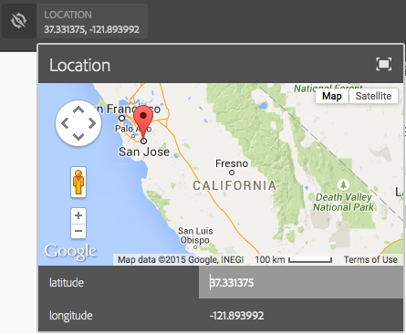

# Voorbeeld van UI-moduletypen van ContextHub {#sample-contexthub-ui-module-types}

ContextHub verstrekt verscheidene modules van steekproefUI die u in uw oplossingen kunt gebruiken. De volgende informatie wordt verstrekt:

* De belangrijkste eigenschappen van de module UI.
* Waar u de broncode kunt vinden, zodat u deze kunt openen voor leerdoeleinden.
* Hoe te om de module UI te vormen.

Voor informatie over het toevoegen van modules UI aan ContextHub, zie [&#x200B; Toevoegend een Module UI &#x200B;](configuring-contexthub.md#adding-a-ui-module). Voor informatie over het ontwikkelen van modules UI, zie [&#x200B; Creërend de Types van Module ContextHub UI &#x200B;](extending-contexthub.md#creating-contexthub-ui-module-types).

## Type module contextthub.base {#contexthub-base-ui-module-type}

Het contexthub.base moduletype UI is het basistype voor alle andere UI moduletypes. Als dusdanig verstrekt het generische eigenschappen voor het teruggeven van opslaggegevens.

De volgende functies zijn beschikbaar:

* **Titel en pictogram:** specificeer een titel voor de module UI en een pictogram. Naar het pictogram kan worden verwezen met een URL of vanuit de pictogrambibliotheek van de Koral UI.
* **gegevens van de Opslag:** identificeer één of meerdere opslag waarvan om gegevens terug te winnen.
* **Inhoud:** specificeer de inhoud die in de module UI verschijnt aangezien het in de toolbar ContextHub verschijnt.
* **Popover inhoud:** specificeer de inhoud die in popover verschijnt wanneer de module UI wordt geklikt of getikt.
* **Volledig scherm wijze:** Controle of de volledig-schermwijze wordt toegestaan.

De broncode bevindt zich in `/libs/granite/contexthub/code/ui/container/js/ContextHub.UI.BaseModuleRenderer.js` .

### Configuratie {#configuration}

Configureer de contexthub.base UI-module met behulp van een JavaScript-object in JSON-indeling. Omvat om het even welke volgende eigenschappen om de eigenschappen van de UI module te vormen:

* **beeld:** Een URL aan een beeld om als pictogram te tonen.
* **pictogram:** de naam van het pictogram van a [&#x200B; Koraal UI &#x200B;](https://opensource.adobe.com/coral-spectrum/examples/#icon) klasse. Als u een waarde opgeeft voor zowel het pictogram als de afbeeldingseigenschappen, wordt de afbeelding gebruikt.
* **titel:** een titel voor de module UI. De titel wordt weergegeven wanneer de aanwijzer op het pictogram van de gebruikersinterface wordt gepauzeerd.
* **volledig scherm:** een booleaanse waarde die erop wijst of de module UI volledig-schermwijze steunt. Gebruik `true` om het volledige scherm te ondersteunen en `false` om de modus Volledig scherm te voorkomen.
* **malplaatje:** A [&#x200B; 3&rbrace; malplaatje Handlebars &lbrace;dat de inhoud specificeert in de toolbar ContextHub terug te geven. &#x200B;](https://handlebarsjs.com/) Gebruik maximaal twee `<p>` -tags.
* **storeMapping:** een sleutel/opslagafbeelding. Gebruik de sleutel in malplaatjes Handlebar om tot de bijbehorende ContextHub opslaggegevens toegang te hebben.
* **lijst:** een serie van punten om als lijst in popover te tonen wanneer de module UI wordt geklikt. Als u dit item opneemt, neemt u geen popoverTemplate op. De waarde is een array van objecten met de volgende toetsen:
   * titel: De tekst die voor dit item moet worden weergegeven
   * afbeelding: (Optioneel) Een URL naar een afbeelding die links moet worden weergegeven
   * pictogram: (Optioneel) Een CUI-pictogramklasse die aan de linkerkant moet worden weergegeven; wordt genegeerd als een afbeelding is opgegeven
   * geselecteerd: (Optioneel) Een Booleaanse waarde die aangeeft of dit item moet worden weergegeven als geselecteerd (true=selected). Geselecteerde items worden standaard weergegeven met een vet lettertype. Gebruik een eigenschap `listType` om andere weergaven te configureren (zie hieronder).
* **listType:** de stijl voor popover lijstpunten te gebruiken. Gebruik een van de volgende waarden:
   * vinkje
   * selectievakje
   * radio
* **popoverTemplate:** Een malplaatje van Handels dat de inhoud specificeert in popover terug te geven wanneer de module UI wordt geklikt. Als u dit item opneemt, neemt u het item `list` niet op.

### Voorbeeld {#example}

Het volgende voorbeeld vormt een c `ontexthub.base` module UI aan vertoningsinformatie van opslag van a [&#x200B; contextthub.emulators &#x200B;](sample-stores.md#granite-emulators-sample-store-candidate). Het item `template` demonstreert hoe u gegevens kunt ophalen uit de winkel met behulp van de sleutel die het item `storeMapping` vaststelt.

```javascript
{
   "icon": "coral-Icon--move",
    "title": "Screen Resolution",
    "storeMapping": {
      "emulator": "emulators"
    },
    "template": "<p>{{{ i18n \"Resolution\"}}}</p><p>{{{emulator.currentDevice.width}}} x {{{emulator.currentDevice.height}}}</p>"
}
```


## Type van module contexthub.browserinfo {#contexthub-browserinfo-ui-module-type}

De gebruikersinterface van `contexthub.browserinfo` bevat informatie over de webbrowser en het besturingssysteem van de client. De informatie wordt verkregen van de surferinfo opslag, die op de {[&#x200B; opslagkandidaat 0} wordt gebaseerd contexthub.surferinfo.](sample-stores.md#contexthub-surferinfo-sample-store-candidate)


De broncode voor de UI-module bevindt zich in `/libs/granite/contexthub/components/modules/browserinfo` . Hoewel `contexthub.browserinfo` de gebruikersinterface-module van `contexthub.base` uitbreidt, worden er geen extra functies in genegeerd of beschikbaar gemaakt. De implementatie biedt een standaardconfiguratie voor het renderen van browserinformatie.

### Configuratie {#configuration-1}

Voor instanties van de module Contextthub.browserinfo UI is geen waarde vereist voor de Detail Configuration. De volgende JSON-tekst vertegenwoordigt de standaardconfiguratie van de module.

```javascript
{
   "icon":"coral-Icon--globe",
   "title":"Browser/OS Information",
   "storeMapping":{"surferinfo":"surferinfo"},
   "template":"<p>{{surferinfo.browser.family}} {{surferinfo.browser.version}}</p><p>{{surferinfo.os.name}} {{surferinfo.os.version}}</p>"
}
```

## Het type van de module contextthub.datetime {#contexthub-datetime-ui-module-type}

In de gebruikersinterface van `contexthub.datetime` worden de datum en tijd weergegeven die zijn opgeslagen in een opslagruimte met de naam datetime die is gebaseerd op de opslagkandidaat van `contexthub.datetime` .


De module verstrekt een popover vorm die u toelaat om de datum en de tijd in de opslag te veranderen.

De bron van de gebruikersinterface van `contexthub.datetime` bevindt zich in `/libs/granite/contexthub/components/modules/datetime` .

### Configuratie {#configuration-2}

Voor instanties van de module Contextthub.datetime UI is geen waarde vereist voor de Detail Configuration. De volgende JSON-tekst vertegenwoordigt de standaardconfiguratie van de module.

```javascript
{
   "icon":"coral-Icon--clock",
   "title":"DATE&TIME",
   "clickable":true,
   "storeMapping":{"d":"datetime"},
   "template":"<p class=\"contexthub-module-line1\">{{i18n \"Date&Time\"}}</p><p class=\"contexthub-module-line2\">{{d.formatted.locale.date}} {{d.formatted.locale.time}}</p>",
   "popoverTemplate":"<div class=\"datetime center\"><div class=\"coral-DatePicker-calendar\" data-init=\"datepicker\"><input class=\"coral-Textfield\" type=\"datetime\" value=\"{{d.formatted.iso}}\"><button class=\"coral-Button coral-Button--secondary coral-Button--square\" title=\"{{i18n \"Datetime picker\"}}\"><i class=\"coral-Icon coral-Icon--calendar coral-Icon--sizeS\"></i></button></div></div>"
}
```

## Contextthub.location UI Module Type {#contexthub-location-ui-module-type}

In de UI-module `contexthub.location` worden de lengte en breedte van de client weergegeven. De module biedt een pop-up die een Google-kaart weergeeft waarop u kunt klikken om de huidige locatie te wijzigen. De module verkrijgt informatie van een opslag ContextHub genoemd geolocation die op de {[&#x200B; opslagkandidaat 0} contexthub.geolocation gebaseerd is.](sample-stores.md#contexthub-geolocation-sample-store-candidate)



De bron van de UI-module bevindt zich in `/etc/cloudsettings/default/contexthub/geolocation` .

### Configuratie {#configuration-4}

Instanties van de module contexthub.location UI vereisen geen waarde voor de Configuratie van het Detail. De volgende JSON-tekst vertegenwoordigt de standaardconfiguratie van de module.

```javascript
{
 "icon":"coral-Icon--compass",
 "title":"Location",
 "clickable":true,
 "editable":{"key":"/geolocation","disabled":[],"hidden":["/geolocation/generatedThumbnail","/geolocation/city","/geolocation/country"]},
 "fullscreen":true,
 "storeMapping":{"g":"geolocation"},
 "template":"<p>{{i18n \"Location\"}}</p><p>{{g.address.postalCode}} {{g.address.city}}{{#if g.address.city}}{{#if g.address.region}},{{/if}}{{/if}} {{g.address.region}}</p>",
 "list":[
  {"title":"Basel, Switzerland",
  "data":{"longitude":7.58929,"latitude":47.554746,"city":"Basel","country":"Switzerland"}},
  {"title":"Melbourne, Australia",
  "data":{"longitude":144.96328,"latitude":-37.814107,"city":"Melbourne","country":"Australia"}},
  {"title":"Beijing, China",
  "data":{"longitude":116.407526,"latitude":39.90403,"city":"Beijing","country":"China"}},
  {"title":"New York, NY, USA",
  "data":{"longitude":-74.005973,"latitude":40.714353,"city":"New York","country":"United States"}},
  {"title":"Paris, France",
  "data":{"longitude":2.352222,"latitude":48.856614,"city":"Paris","country":"France"}},
  {"title":"Rio de Janeiro, Brazil",
  "data":{"longitude":-43.20071,"latitude":-22.913395,"city":"Rio","country":"Brazil"}},
  {"title":"San Jose, CA, USA",
  "data":{"longitude":-121.894955,"latitude":37.339386,"city":"San Jose","country":"United States"}},
  {"title":"Tokyo, Japan",
  "data":{"longitude":139.691706,"latitude":35.689487,"city":"Shinjuku","country":"Japan"}}
 ],
 "listType":"checkmark"
}
```

## contexthub.screen-orientation UI Module Type {#contexthub-screen-orientation-ui-module-type}

In de UI-module `contexthub.screen-orientation` wordt de huidige schermoriëntatie van de client weergegeven. Hoewel standaard uitgeschakeld, biedt de module een pop-up waarmee u een richting kunt selecteren. De module verkrijgt informatie van een opslag ContextHub genoemd mededingers die op [&#x200B; granite.emulators &#x200B;](sample-stores.md#granite-emulators-sample-store-candidate) opslagkandidaat gebaseerd is.


De bron van de UI-module bevindt zich in `/libs/granite/contexthub/components/modules/screen-orientation` .

### Configuratie {#configuration-5}

Voor instanties van de gebruikersinterface-module `contexthub.screen-orientation` is geen waarde vereist voor Detail Configuration. De volgende JSON-tekst vertegenwoordigt de standaardconfiguratie van de module. De eigenschap `clickable` is standaard `false` . Als u de standaardconfiguratie overschrijft en `clickable` op `true` instelt, wordt door op de module te klikken een pop-up weergegeven waarin u de richting kunt selecteren.

```javascript
{
   "icon":"coral-Icon--rotateRight",
   "title":"Screen Orientation",
   "clickable":false,
   "storeMapping":{"emulator":"emulators"},
   "template":"<p>{{{ i18n \"Screen Orientation\" }}}</p><p>{{{ emulator.currentDevice.orientation }}}",
   "listReference":"/emulators/orientations",
   "listType":"checkmark"
}
```

## Contextthub.tagcloud-UI-moduletype {#contexthub-tagcloud-ui-module-type}

In de gebruikersinterface van `contexthub.tagcloud` wordt informatie over tags weergegeven. In de werkbalk wordt in de gebruikersinterface het aantal codes weergegeven. Het pop-upvenster toont een tagcloud en een tekstvak voor het toevoegen van nieuwe tags. De module UI verkrijgt informatie van een opslag ContextHub genoemd tagcloud die op de `contexthub.tagcloud` opslagkandidaat gebaseerd is.


De bron van de UI-module bevindt zich in `/libs/granite/contexthub/components/modules/tagcloud` .

### Configuratie {#configuration-6}

Voor instanties van de gebruikersinterface-module `contexthub.tagcloud` is geen waarde vereist voor Detail Configuration. De volgende JSON-tekst vertegenwoordigt de standaardconfiguratie van de module.

```javascript
{
   "icon":"coral-Icon--tag",
   "title":"TagCloud",
   "clickable":true,
   "storeMapping":{"t":"tagcloud"},
   "maxTags":20,
   "template":"<p class=\"contexthub-module-line1\">{{i18n \"TagCloud\"}}</p><p class=\"contexthub-module-line2\">{{stats.total}} {{i18n \"Tags\"}}</p>",
   "popoverTemplate":"<div class=\"contexthub-popover-content center\"><p class=\"stats\">{{stats.total}} {{i18n \"Tags\"}} | {{stats.hits}} {{i18n \"Hits\"}} | {{i18n \"Last tag\"}}: {{#if stats.recent}}{{stats.recent}}{{else}}{{i18n \"Unknown\"}}{{/if}}</p><p class=\"tagcloud\">{{#each tags}}<span class=\"tag{{this.weight}}\">{{this.name}}</span> {{/each}}</p><div class=\"coral-InputGroup\"><input type=\"text\" class=\"coral-InputGroup-input coral-Textfield tag-name\" placeholder=\"{{i18n \"Add a namespace:my/tag\"}}\" pattern=\"^[A-Za-z0-9_\\-]+(:[A-Za-z0-9_\\-\\/]+)?$\" title=\"{{i18n \"namespace:my/tag\"}}\"><span class=\"coral-InputGroup-button\"><button class=\"coral-Button coral-Button--secondary coral-Button--square contexthub-new-tag\" type=\"button\" title=\"{{i18n \"increment\"}}\"><i class=\"coral-Icon coral-Icon--sizeS coral-Icon--add\"></i></button></span></div></div>"
}
```

## Type module granite.profile {#granite-profile-ui-module-type}

De `granite.profile` module ContextHub UI toont de vertoningsnaam van de huidige gebruiker. In het pop-upvenster wordt de aanmeldnaam van de gebruiker weergegeven en kunt u de waarde van de weergavenaam wijzigen. De module UI verkrijgt informatie van een opslag ContextHub genoemd profiel dat op de {[&#x200B; opslagkandidaat 0} granite.profile gebaseerd is.](sample-stores.md#granite-profile-sample-store-candidate)


De bron van de UI-module is `/libs/granite/contexthub/components/modules/profile` .

### Configuratie {#configuration-7}

Voor instanties van de gebruikersinterface-module `granite.profile` is geen waarde vereist voor Detail Configuration. De volgende JSON-tekst vertegenwoordigt de standaardconfiguratie van de module.

```javascript
{
   "icon":"coral-Icon--user",
   "title":"Profile",
   "clickable":true,
   "editable":{
      "key":"/profile",
      "disabled":["/profile/authorizableId"],
      "hidden":["/profile/avatar","/profile/path"]},
   "storeMapping":{"p":"profile"},
   "template":"<p class=\"contexthub-module-line1\">{{i18n \"Persona\"}}</p><p class=\"contexthub-module-line2\">{{p.displayName}}</p>",
   "listType":"checkmark"
}
```
