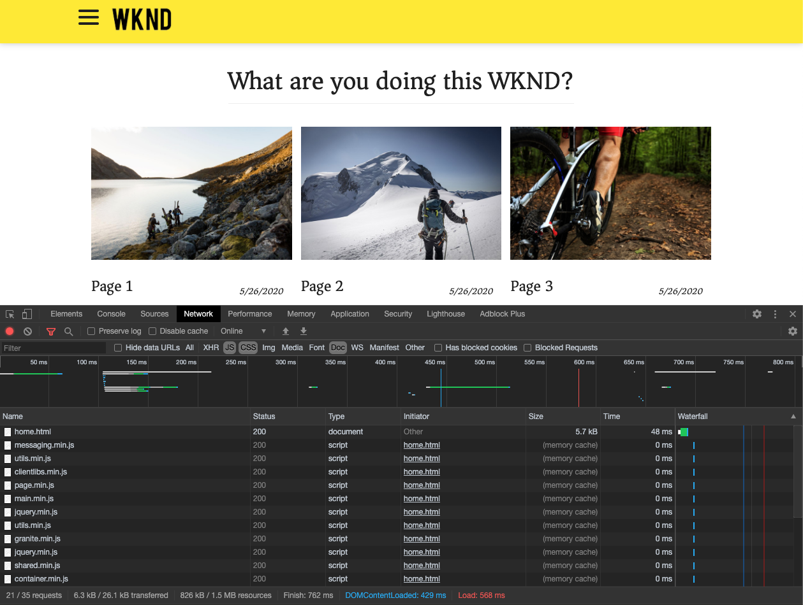

# Introductie van het KUUROORD en Analyse {#spa-introduction}

Toepassingen van één pagina (SPAs) kunnen dwingende ervaringen voor websitegebruikers aanbieden. De ontwikkelaars willen plaatsen kunnen bouwen gebruikend het kader van het KUUROORD en de auteurs willen inhoud binnen AEM voor een plaats foutloos uitgeven die gebruikend dergelijke kaders wordt gebouwd.

De redacteur van het KUUROORD biedt een uitvoerige oplossing voor het steunen van SPAs binnen AEM aan. Dit artikel loopt door het gebruiken van een basistoepassing van het KUUROORD voor creatie en toont hoe het op de onderliggende AEM Redacteur van het KUUROORD betrekking heeft.

## Inleiding {#introduction}

### Artikel {#article-objective}

Dit artikel introduceert de basisconcepten SPAs alvorens de lezer door een analyse van de redacteur van het KUUROORD door een eenvoudige toepassing van het KUUROORD te gebruiken om basisinhoud het uitgeven aan te tonen. Het duikt dan neer in de bouw van de pagina en hoe de toepassing van het KUUROORD op en met de AEM Redacteur van het KUUROORD betrekking heeft.

Het doel van deze inleiding en analyse moet aan een AEM ontwikkelaar aantonen waarom SPAs relevant is, hoe zij over het algemeen werken, hoe een KUUROORD door de Redacteur van het AEMKUUROORD wordt behandeld, en hoe het van een standaard AEM toepassing verschillend is.

De analyse is gebaseerd op standaard AEM functionaliteit en steekproefWKND SPA Project app. Om langs te volgen, te [downloaden en te installeren gelieve steekproefWKND SPA Project app van GitHub hier.](https://github.com/adobe/aem-guides-wknd-spa)

>[!CAUTION]
>
>Dit document gebruikt [WKND SPA Project app](https://github.com/adobe/aem-guides-wknd-spa) voor slechts demonstratiedoeleinden. Het mag niet worden gebruikt voor projectwerkzaamheden.

>[!TIP]
>
>Om het even welk AEM project zou hefboomwerking het [AEM Archetype](https://docs.adobe.com/content/help/en/experience-manager-core-components/using/developing/archetype/overview.html)van het Project, dat de projecten van het KUUROORD gebruikend React of Angular steunt en hefboomwerkingen SDK van het KUUROORD.

### Wat is een SPA? {#what-is-a-spa}

Een enig-paginatoepassing (SPA) verschilt van een conventionele pagina in die zin dat het cliënt-kant wordt teruggegeven en hoofdzakelijk JavaScript-gedreven is, die op Ajax vraag baseert om gegevens te laden en dynamisch de pagina bij te werken. De meeste of alle inhoud wordt één keer opgehaald in één pagina die wordt geladen met extra bronnen die asynchroon worden geladen, afhankelijk van gebruikersinteractie met de pagina.

Hierdoor is het minder nodig pagina&#39;s te vernieuwen en wordt de gebruiker een ervaring geboden die naadloos, snel is en meer lijkt op een native app-ervaring.

De AEM redacteur van het KUUROORD staat front-end ontwikkelaars toe om SPAs tot stand te brengen die in een AEM plaats kan worden geïntegreerd, toestaand de inhoudsauteurs om de inhoud van het KUUROORD zo gemakkelijk als om het even welke andere AEM inhoud uit te geven.

### Waarom een SPA? {#why-a-spa}

Door sneller, dynamisch, en meer als een inheemse toepassing te zijn, wordt een SPA een zeer aantrekkelijke ervaring niet alleen voor de bezoeker van de webpagina, maar ook voor marketers en ontwikkelaars toe te schrijven aan de aard van hoe SPAs werkt.


#### Bezoekers {#visitors}

* Bezoekers willen native ervaringen als ze met inhoud werken.
* Er zijn duidelijke gegevens dat hoe sneller een pagina, hoe waarschijnlijker een conversie zal plaatsvinden.

#### Marketers {#marketers}

* Marketers willen rijke, native ervaringen bieden om bezoekers te dwingen om zich volledig met inhoud bezig te houden.
* Personalisatie kan deze ervaringen nog aantrekkelijker maken.

#### Ontwikkelaars {#developers}

* Ontwikkelaars willen een duidelijke scheiding tussen inhoud en presentatie.
* Schone scheiding maakt het systeem uitbreidbaarder en maakt het mogelijk om onafhankelijk front-end te ontwikkelen.

### Hoe werkt een SPA? {#how-does-a-spa-work}

Het primaire idee achter een KUUROORD is dat de vraag aan en de afhankelijkheid van een server worden verminderd om vertragingen te minimaliseren die door serverlatentie worden veroorzaakt zodat SPA de ontvankelijkheid van een inheemse toepassing benadert.

In een traditionele, opeenvolgende webpagina worden alleen de gegevens geladen die nodig zijn voor de directe pagina. Dit betekent dat wanneer de bezoeker naar een andere pagina gaat, de server om de extra bronnen wordt gevraagd. Aanvullende aanroepen kunnen nodig zijn wanneer de bezoeker werkt met elementen op de pagina. Deze veelvoudige vraag kan een gevoel van vertraging of vertraging geven aangezien de pagina met de verzoeken van de bezoeker moet inhalen.


Voor een vloeiendere ervaring, die nadert wat een bezoeker van mobiele, native apps verwacht, laadt een SPA alle noodzakelijke gegevens voor de bezoeker bij de eerste lading. Hoewel dit een beetje langer kan duren, elimineert het dan de behoefte aan extra servervraag.

Door de pagina op de client te renderen, reageren de pagina-elementen sneller en hebben de bezoekers direct interactie met de pagina. Eventuele aanvullende gegevens worden asynchroon aangeroepen om de snelheid van de pagina te maximaliseren.

>[!TIP]
>
>Voor technische details over hoe het werk van SPAs in AEM, zie de artikelen:
>* [Begonnen het worden met SPAs in AEM Gebruikend Reageren](getting-started-react.md)
>* [Begonnen het worden met SPAs in AEM Gebruikend Hoekig](getting-started-angular.md)

>
>
Voor een dichtere blik bij het ontwerp, de architectuur, en het technische werkschema van de Redacteur van het KUUROORD, zie het artikel:
>* [Overzicht](editor-overview.md)van de redacteur van het KUUROORD.


## Ervaring voor het bewerken van inhoud met SPA {#content-editing-experience-with-spa}

Wanneer een KUUROORD aan hefboomwerking de Redacteur van het AEMKUUROORD wordt gebouwd, merkt de inhoudauteur geen verschil wanneer het uitgeven en het creëren van inhoud. Er is algemene AEM beschikbaar en er zijn geen wijzigingen in de workflow van de auteur vereist.

1. Bewerk de WKND SPA Project-app in AEM.

   `http://localhost:4502/editor.html/content/wknd-spa-react/us/en/home.html`

   

1. Selecteer een tekstcomponent. Een werkbalk ziet er net zo uit als een andere component. Selecteer **Bewerken**.

   

1. Bewerk de inhoud als normaal binnen AEM en houd er rekening mee dat de wijzigingen zich blijven voordoen.

   

1. Met de middelenbrowser kunt u een nieuwe afbeelding naar een afbeeldingscomponent slepen en neerzetten.

   

1. De wijziging wordt doorgevoerd.

   

Aanvullende ontwerpgereedschappen, zoals slepen en neerzetten van aanvullende componenten op de pagina, het opnieuw rangschikken van componenten en het wijzigen van de layout, worden ondersteund, net als in elke andere AEM.

>[!NOTE]
>
>De redacteur van het KUUROORD wijzigt DOM van de toepassing niet. De SPA zelf is verantwoordelijk voor het DOM.
>
>Om te zien hoe dit werkt, ga op de volgende sectie van dit artikel [SPA Apps en de AEM Redacteur](#spa-apps-and-the-aem-spa-editor)van het KUUROORD verder.

## SPA Apps en de Redacteur van het AEMKUUROORD {#spa-apps-and-the-aem-spa-editor}

Ervarend hoe een KUUROORD zich voor het eind gedraagt en dan het inspecteren van de pagina van het KUUROORD helpt om beter te begrijpen hoe een SAP app met de Redacteur van het KUUROORD in AEM werkt.

### Een SPA-toepassing gebruiken {#using-an-spa-application}

1. Laad de toepassing van het Project WKND SPA op publiceer server of gebruikend de optie **Mening zoals Gepubliceerd** van het menu van de Informatie **van de** Pagina in de paginaredacteur.

   `http://<host>:<port>/content/wknd-spa-react/us/en/home.html`

   

   Maak een notitie van de paginastructuur, inclusief navigatie naar onderliggende pagina&#39;s, menu&#39;s en artikelkaarten.

1. Navigeer naar een onderliggende pagina met behulp van het menu en controleer of de pagina direct wordt geladen zonder dat een pagina moet worden vernieuwd.

   

1. Open de ingebouwde ontwikkelaarsgereedschappen van uw browser en controleer de netwerkactiviteit terwijl u door de onderliggende pagina&#39;s navigeert.

   

   Er is erg weinig verkeer wanneer u van pagina naar pagina gaat in de app. De pagina wordt niet opnieuw geladen en alleen de nieuwe afbeeldingen worden aangevraagd.

   Het KUUROORD beheert de inhoud en het verpletteren volledig op de cliëntkant.

Dus als de pagina niet opnieuw wordt geladen wanneer u door de onderliggende pagina&#39;s navigeert, hoe wordt deze geladen?

De volgende sectie, die een Toepassing [van het KUUROORD](#loading-a-spa-application)laadt, graaft dieper in de mechanica van het laden van het KUUROORD en hoe de inhoud synchroon en asynchroon kan worden geladen.

### Een SPA-toepassing laden {#loading-a-spa-application}

1. Als niet reeds geladen, laad de toepassing van het Dagboek Wij.Retail of op de publicatieserver of gebruikend de optie **Mening zoals Gepubliceerd** van het menu van de Informatie **van de** Pagina in de paginaredacteur.

   `http://<host>:<port>/content/wknd-spa-react/us/en/home.html`

   

1. Gebruik het ingebouwde gereedschap van uw browser om de bron van de pagina weer te geven.
1. De inhoud van de bron is beperkt.

   ```html
    <!DOCTYPE html>
    <html lang="en">
    <head>
        <meta charset="UTF-8"/>
        <title>WKND SPA React Home Page</title>
   
        <meta name="template" content="spa-page-template"/>
        <meta name="viewport" content="width=device-width, initial-scale=1"/>
   
    <link rel="stylesheet" href="/etc.clientlibs/wknd-spa-react/clientlibs/clientlib-base.min.css" type="text/css">
   
    <meta name="theme-color" content="#000000"/>
    <link rel="icon" href="/etc.clientlibs/wknd-spa-react/clientlibs/clientlib-react/resources/favicon.ico"/>
    <link rel="apple-touch-icon" href="/etc.clientlibs/wknd-spa-react/clientlibs/clientlib-react/resources/logo192.png"/>
    <link rel="manifest" href="/etc.clientlibs/wknd-spa-react/clientlibs/clientlib-react/resources/manifest.json"/>
   
    <!-- AEM page model -->
    <meta property="cq:pagemodel_root_url" content="/content/wknd-spa-react/us/en.model.json"/>
    <link href="//fonts.googleapis.com/css?family=Source+Sans+Pro:400,600|Asar&display=swap" rel="stylesheet"/>
    <meta property="cq:datatype" content="JSON"/>
    <meta property="cq:wcmmode" content="edit"/>
   
    <link rel="stylesheet" href="/libs/cq/gui/components/authoring/editors/clientlibs/internal/page.min.css" type="text/css">
    <link rel="stylesheet" href="/etc.clientlibs/wcm/foundation/clientlibs/main.min.css" type="text/css">
    <script type="text/javascript" src="/libs/cq/gui/components/authoring/editors/clientlibs/internal/messaging.min.js"></script>
    <script type="text/javascript" src="/libs/cq/gui/components/authoring/editors/clientlibs/utils.min.js"></script>
    <script type="text/javascript" src="/libs/granite/author/deviceemulator/clientlibs.min.js"></script>
    <script type="text/javascript" src="/libs/cq/gui/components/authoring/editors/clientlibs/internal/page.min.js"></script>
    <script type="text/javascript" src="/etc.clientlibs/wcm/foundation/clientlibs/main.min.js"></script>
    <script type="text/javascript" src="/etc.clientlibs/clientlibs/granite/jquery.min.js"></script>
    <script type="text/javascript" src="/etc.clientlibs/clientlibs/granite/utils.min.js"></script>
    <script type="text/javascript" src="/etc.clientlibs/clientlibs/granite/jquery/granite.min.js"></script>
    <script type="text/javascript" src="/etc.clientlibs/foundation/clientlibs/jquery.min.js"></script>
    <script type="text/javascript" src="/etc.clientlibs/foundation/clientlibs/shared.min.js"></script>
   
    <!--cq{"decorated":false,"type":"cq/cloudconfig/components/scripttags/header","path":"/content/wknd-spa-react/us/en/home/jcr:content/cloudconfig-header","structurePath":"/content/wknd-spa-react/us/en/home/jcr:content/cloudconfig-header","selectors":null,"servlet":"Script /libs/cq/cloudconfig/components/scripttags/header/header.html","totalTime":2,"selfTime":2}-->
   
    <link rel="stylesheet" href="/etc.clientlibs/wknd-spa-react/clientlibs/clientlib-react.min.css" type="text/css">
   
    </head>
   
    <body class="page basicpage">
        <noscript>You need to enable JavaScript to run this app.</noscript>
    <div id="spa-root"></div>
   
    <script type="text/javascript" src="/etc.clientlibs/wknd-spa-react/clientlibs/clientlib-react.min.js"></script>
   
    <script type="text/javascript" src="/etc.clientlibs/core/wcm/components/commons/site/clientlibs/container.min.js"></script>
    <script type="text/javascript" src="/etc.clientlibs/wknd-spa-react/clientlibs/clientlib-base.min.js"></script>
   
    <script type="text/javascript" src="/libs/cq/gui/components/authoring/editors/clientlibs/internal/pagemodel/messaging.min.js"></script>
   
    <link rel="stylesheet" href="/etc.clientlibs/wknd-spa-react/clientlibs/clientlib-author.min.css" type="text/css">
   
    <!--cq{"decorated":true,"type":"cq/cloudserviceconfigs/components/servicecomponents","path":"/content/wknd-spa-react/us/en/home/jcr:content/cloudservices","selectors":null,"servlet":"Script /libs/cq/cloudserviceconfigs/components/servicecomponents/servicecomponents.jsp","totalTime":2,"selfTime":2}-->
   
    <!--cq{"decorated":false,"type":"cq/cloudconfig/components/scripttags/footer","path":"/content/wknd-spa-react/us/en/home/jcr:content/cloudconfig-footer","structurePath":"/content/wknd-spa-react/us/en/home/jcr:content/cloudconfig-footer","selectors":null,"servlet":"Script /libs/cq/cloudconfig/components/scripttags/footer/footer.html","totalTime":2,"selfTime":2}-->
   
    </body>
    </html>
    <!--cq{"decorated":false,"type":"wknd-spa-react/components/page","path":"/content/wknd-spa-react/us/en/home/jcr:content","selectors":null,"servlet":"Script /apps/spa-project-core/components/page/page.html","totalTime":39,"selfTime":33}-->
   ```

   De pagina heeft geen inhoud in de hoofdtekst. Het bestaat voornamelijk uit stijlpagina&#39;s en een aanroep naar verschillende scripts, zoals `clientlib-react.min.js`bijvoorbeeld.

   Deze scripts vormen de belangrijkste stuurprogramma&#39;s voor deze toepassing en zijn verantwoordelijk voor het renderen van alle inhoud.

1. Gebruik de ingebouwde gereedschappen van uw browser om de pagina te inspecteren. Zie de inhoud van de DOM volledig geladen.

   

1. Ga naar het tabblad Netwerk in de Inspecteur en laad de pagina opnieuw.

   Afbeeldingsverzoeken negeren. De primaire bronnen die voor de pagina worden geladen, zijn de pagina zelf, CSS, het React JavaScript, de afhankelijkheden en JSON-gegevens voor de pagina.

   

1. Laad de aanwijzer `home.model.json` in een nieuw tabblad.

   `http://<host>:<port>/content/wknd-spa-react/us/en/home.model.json`

   

   De AEM redacteur van het KUUROORD hefboomwerkingen [AEM de Diensten](/help/assets/content-fragments/content-fragments.md) van de Inhoud om de volledige inhoud van de pagina als model te leveren JSON.

   Door specifieke interfaces uit te voeren, verstrekken de Modellen van het Sling de informatie noodzakelijk aan SPA. De levering van de JSON-gegevens wordt naar beneden gedelegeerd aan elke component (van pagina, alinea, component, enz.).

   Elke component kiest wat het blootstelt en hoe het (server-kant met HTML of cliënt-kant met React of Hoekig) wordt teruggegeven. Dit artikel richt zich op client-side rendering met React.

1. Het model kan pagina&#39;s ook groeperen zodat ze synchroon worden geladen, waardoor het aantal pagina&#39;s dat opnieuw moet worden geladen, afneemt.

   In het voorbeeld van We.Retail Journal worden de `home`, `page-1`, `page-2`en `page-3` pagina&#39;s synchroon geladen, aangezien bezoekers vaak al deze pagina&#39;s bezoeken.

   Dit gedrag is niet verplicht en is volledig definieerbaar.

   

1. Als u dit verschil in gedrag wilt weergeven, laadt u de `home` pagina opnieuw en wist u de netwerkactiviteit van de inspecteur. Navigeer naar `page-1` in het paginamenu en controleer of de enige netwerkactiviteit een verzoek is om het beeld van `page-1`. `page-1` zelf hoeft niet te worden geladen.

   

### Interactie met de Redacteur van het KUUROORD {#interaction-with-the-spa-editor}

Gebruikend de steekproeftoepassing van het Project van WKND SPA, is het duidelijk hoe app zich gedraagt en wanneer gepubliceerd wordt geladen, leveraging inhoudsdiensten voor JSON inhoudslevering evenals asynchrone lading van middelen.

Bovendien, voor de inhoudauteur, is de inhoudsverwezenlijking die een redacteur van het KUUROORD gebruikt naadloos binnen AEM.

In de volgende sectie zullen wij het contract onderzoeken dat de Redacteur van het KUUROORD toestaat om componenten binnen het KUUROORD met AEM componenten te relateren en deze naadloze het uitgeven ervaring te bereiken.

1. Laad de toepassing van het Project WKND SPA in de redacteur en schakelaar aan de wijze van de **Voorproef** .

   `http://<host>:<port>/editor.html/content/wknd-spa-react/us/en/home.html`

1. Controleer de inhoud van de pagina met de ingebouwde ontwikkelaarsgereedschappen van uw browser. Selecteer met het selectiegereedschap een bewerkbare component op de pagina en bekijk de details van het element.

   De component heeft een nieuw gegevenskenmerk `data-cq-data-path`.

   

   Bijvoorbeeld

   `data-cq-data-path="/content/wknd-spa-react/us/en/home/jcr:content/root/responsivegrid/text`

   Met dit pad kunt u het contextconfiguratieobject van elke component ophalen en koppelen.

   Dit is het enige prijsverhogingsattribuut dat voor de redacteur wordt vereist om dit als editable component binnen het KUUROORD te erkennen. Gebaseerd op dit attribuut, zal de Redacteur van het KUUROORD bepalen welke editable configuratie met de component wordt geassocieerd, zodat het correcte kader, de toolbar, enz. is geladen.

   Bepaalde specifieke klassenamen worden ook toegevoegd voor het markeren van plaatsaanduidingen en voor het slepen en neerzetten van elementen.

   >[!NOTE]
   >
   >Dit gedrag verschilt van gerenderde pagina&#39;s aan serverzijde in AEM, waar een `cq` element is ingevoegd voor elke bewerkbare component.
   >
   >Deze benadering in de Redacteur van het KUUROORD verwijdert de behoefte om douaneelementen in te spuiten, die slechts een extra gegevensattribuut verlaten, makend de prijsverhoging voor de frontend ontwikkelaar eenvoudiger.

## Volgende stappen {#next-steps}

Nu u het KUUROORD het uitgeven ervaring in AEM begrijpt en hoe een KUUROORD op de Redacteur van het KUUROORD betrekking heeft, neem een diepere duik in het begrip hoe een KUUROORD wordt gebouwd.

* [Begonnen het worden met SPAs in AEM gebruiken toont Reageren](getting-started-react.md) hoe een basisSPA wordt gebouwd om met de Redacteur van het KUUROORD in AEM te werken gebruikend Reageren
* [Het krijgen begonnen met SPAs in AEM het gebruiken van Angular](getting-started-angular.md) toont aan hoe een basisSPA wordt gebouwd om met de Redacteur van het KUUROORD in AEM te werken gebruikend Hoekig
* [Het Overzicht](editor-overview.md) van de Redacteur van het KUUROORD gaat in meer diepte in het communicatie model tussen AEM en het KUUROORD.
* [Het ontwikkelen van SPAs voor AEM](developing.md) beschrijft hoe te om front-end ontwikkelaars in dienst te nemen om een KUUROORD voor AEM te ontwikkelen evenals hoe SPAs met AEM architectuur in wisselwerking staat.
