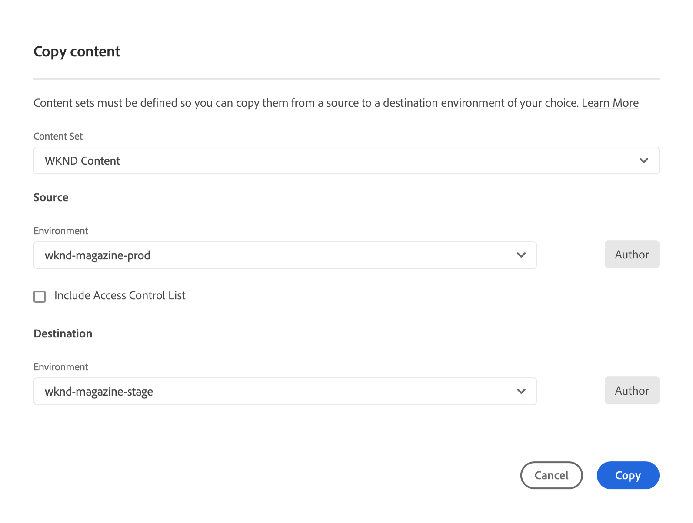

# Het gereedschap Inhoud kopiëren {#content-copy}

Met het hulpprogramma voor het kopiëren van inhoud kunnen gebruikers op verzoek muterende inhoud kopiëren van hun productieomgeving op AEM as a Cloud Service naar lagere omgevingen voor testdoeleinden.

>[!NOTE]
>Terwijl de primaire stroom van het inhoudsexemplaar van hogere milieu&#39;s aan lagere milieu&#39;s is, een extra vermogen - **Voorwaartse Stroom** - staat het kopiëren van lagere niet productiemilieu&#39;s aan hogere niet productiemilieu&#39;s (bijvoorbeeld Dev → Stadium, RDE → Stadium) toe. Zie [&#x200B; Beperkingen &#x200B;](#limitations) voor details, met inbegrip van beschikbaarheidsvereisten.

## Inleiding {#introduction}

De huidige, echte gegevens zijn waardevol voor het testen, de bevestiging, en de gebruiker-aanvaarding doeleinden. Het inhoudsexemplaarhulpmiddel laat u inhoud van een milieu van productieAEM as a Cloud Service aan een het opvoeren, ontwikkeling, of [&#x200B; Snelle Milieu van de Ontwikkeling (RDE) &#x200B;](/help/implementing/developing/introduction/rapid-development-environments.md) milieu voor zulk het testen kopiëren.

De inhoud die moet worden gekopieerd, wordt gedefinieerd door een inhoudsset. Een inhoudsset bestaat uit een lijst met JCR-paden die de veranderbare inhoud bevatten die van een ontwerpomgeving van een bron naar een ontwerpomgeving van een doel binnen hetzelfde Cloud Manager-programma moet worden gekopieerd. De volgende paden zijn toegestaan in een inhoudsset.

```text
/content
/conf/**/settings/wcm
/conf/**/settings/dam/cfm/models
/conf/**/settings/graphql/persistentQueries
/etc/clientlibs/fd/themes
```

Wanneer het kopiëren van inhoud, is het bronmilieu de bron van waarheid.

* Als de inhoud in de bestemmingsmilieu is gewijzigd, wordt het beschreven door inhoud in de bron, als de wegen het zelfde zijn.
* Als de paden verschillend zijn, wordt de inhoud van de bron samengevoegd met de inhoud in de bestemming.

## Machtigingen {#permissions}

Als u het gereedschap Inhoud kopiëren wilt gebruiken, zijn bepaalde machtigingen vereist in zowel de bronomgeving als de doelomgeving.

| Functie Inhoud kopiëren | AEM-beheergroep | Implementatiebeheerfunctie |
|---|---|---|
| Creeer en wijzig [&#x200B; inhoudssets &#x200B;](#create-content-set) | Niet vereist | Vereist |
| Begin of annuleer het [&#x200B; proces van het inhoudsexemplaar &#x200B;](#copy-content) | Vereist | Vereist |

Voor meer details op toestemmingen en hoe te om hen te plaatsen, zie [&#x200B; het Team van AEM as a Cloud Service en de Profielen van het Product &#x200B;](/help/onboarding/aem-cs-team-product-profiles.md).

## Een inhoudsset maken {#create-content-set}

Voordat inhoud kan worden gekopieerd, moet een inhoudsset zijn gedefinieerd. Nadat deze is gedefinieerd, kunnen inhoudssets opnieuw worden gebruikt om inhoud te kopiëren. Voer de volgende stappen uit, zodat u een inhoudsset kunt maken.

1. Logon aan Cloud Manager bij [&#x200B; my.cloudmanager.adobe.com &#x200B;](https://my.cloudmanager.adobe.com/) en selecteer de aangewezen organisatie en het programma.

1. Gebruikend het zijnavigatievenster, navigeer aan het **lusje van de Reeksen van de Inhoud** van de **Overzicht** pagina.

1. Bij top-right van het scherm, klik **toevoegen Inhoud plaatste**.

   

1. Op het **lusje van Details** van de tovenaar, verstrek een naam en een beschrijving voor de geplaatste inhoud en selecteer **verdergaan**.

   

1. Op het **lusje van de Wegen van de Inhoud** van de tovenaar, specificeer de wegen van de veranderlijke inhoud die in de inhoudreeks moet worden omvat.

   1. Ga de weg in **toevoegen omvat Weg** gebied.
   1. Klik **toevoegen Weg** om de weg aan de inhoudreeks toe te voegen.
   1. Klik **voeg Weg** opnieuw toe zonodig.
      * Er zijn maximaal 50 paden toegestaan.

   

1. Als u de inhoudenset moet verfijnen of beperken, kunnen subpaden worden uitgesloten.

   1. In de lijst van inbegrepen wegen, voegt de klik **subpaden** naast de weg toe u wilt beperken.
   1. Voer het subpad in dat u onder het geselecteerde pad wilt uitsluiten.
   1. Selecteer **Uitsluiten Weg**.
   1. Selecteer **toevoegen sluit subpaden** opnieuw uit om extra wegen toe te voegen om zonodig uit te sluiten.
      * Uitgesloten paden moeten relatief zijn ten opzichte van het ingesloten pad.
      * Het aantal uitgesloten paden is niet beperkt.

   

1. U kunt de opgegeven paden desgewenst bewerken.

   1. Klik op de X naast de uitgesloten subpaden, zodat u deze kunt verwijderen.
   1. Klik de ellipsknoop naast de wegen zodat kunt u **openbaren uitgeven** en **schrapping** opties.

   

1. Selecteer **creeer** om de geplaatste inhoud tot stand te brengen.

De inhoudenset kan nu worden gebruikt om inhoud tussen omgevingen te kopiëren.

## Een inhoudsset bewerken {#edit-content-set}

Voer vergelijkbare stappen uit als bij het maken van een stap Inhoud. In plaats van het klikken **voeg Geplaatste Inhoud** toe, selecteer een bestaande reeks van de console, en selecteer **uitgeven** van het ellipsmenu.

 uit

Wanneer u de inhoudenset bewerkt, kunt u de geconfigureerde paden uitbreiden om de uitgesloten subpaden zichtbaar te maken.

## Inhoud kopiëren {#copy-content}

Nadat u een inhoudsset hebt gemaakt, kunt u deze gebruiken om inhoud te kopiëren. Voer de volgende stappen uit om inhoud te kopiëren.

>[!NOTE]
> Gebruik geen inhoudsexemplaar op een milieu terwijl de verrichting van de a [&#x200B; inhoudsoverdracht &#x200B;](/help/journey-migration/content-transfer-tool/using-content-transfer-tool/overview-content-transfer-tool.md) op dat milieu loopt.

1. Logboek in Cloud Manager bij [&#x200B; my.cloudmanager.adobe.com &#x200B;](https://my.cloudmanager.adobe.com/) en selecteert de aangewezen organisatie en het programma.

1. Navigeer aan het **scherm van Milieu&#39;s** van de **pagina van het Overzicht**.

1. Navigeer aan de **pagina van de Reeksen van de Inhoud** van het **milieu&#39;s** scherm.

1. Selecteer een inhoud die van de console wordt geplaatst en selecteer **Inhoud van het Exemplaar** van het ellipsmenu.

   

   >[!NOTE]
   >
   >Een omgeving kan niet selecteerbaar zijn als:
   >
   >* De gebruiker beschikt niet over de juiste machtigingen.
   >* Het milieu heeft een lopende pijpleiding of een verrichting van de exemplaarinhoud lopend.
   >* Het milieu is aan het huren of opstarten.

1. In de **inhoud van het Exemplaar** dialoog, specificeer de bron en de bestemming voor uw actie van het inhoudsexemplaar.

   

   * Inhoud kan alleen worden gekopieerd van een hogere omgeving naar een lagere omgeving of tussen ontwikkelings-/RDE-omgevingen waarin de hiërarchie van omgevingen als volgt is (van hoogste naar laagste):
      * Productie
      * Staging
      * Ontwikkeling/RDE
   * Het kopiëren van inhoud naar andere programma&#39;s is standaard uitgeschakeld. Nochtans, op klantenverzoek, kan het worden toegelaten, die een extra **invoergebied van het Programma van de Bestemming** &lbrace;beschikbaar zal maken.

1. Indien nodig, kunt u ook verkiezen om **de Lijsten van het Toegangsbeheer** in uw exemplaarproces te omvatten.

1. Selecteer **Exemplaar**.

Het kopieerproces wordt gestart. De status van het kopieerproces wordt weerspiegeld in de console voor de geselecteerde inhoudenset.

## Activiteit voor kopiëren van inhoud {#copy-activity}

U kunt het statuut van uw exemplaarprocessen in de **pagina van de Activiteit van de Inhoud van het Exemplaar controleren**.

1. Logboek in Cloud Manager bij [&#x200B; my.cloudmanager.adobe.com &#x200B;](https://my.cloudmanager.adobe.com/) en selecteert de aangewezen organisatie en het programma.

1. Navigeer aan het **scherm van Milieu&#39;s** van de **pagina van het Overzicht**.

1. Navigeer aan de **pagina van de Activiteit van de Inhoud van het Exemplaar** van het **milieu&#39;s** scherm.


### Statussen van inhoud kopiëren {#statuses}

Wanneer u begint inhoud te kopiëren, kan het proces een van de volgende statussen hebben.

| Status | Beschrijving |
|---|---|
| In uitvoering | De bewerking voor het kopiëren van inhoud is aan de gang |
| Mislukt | Kopiëren van inhoud is mislukt |
| Voltooid | Kopie van inhoud voltooid |
| Geannuleerd | Gebruiker annuleert een bewerking voor het kopiëren van inhoud nadat deze is gestart |

### Een kopieerproces annuleren {#canceling}

Als u een bewerking voor het kopiëren van inhoud moet afbreken nadat u deze hebt gestart, kunt u deze desgewenst annuleren.

Om dit, op de **pagina van de Activiteit van de Inhoud van het Exemplaar** te doen, selecteer **annuleer** actie van het elliptische menu van het exemplaarproces u eerder begon.


>[!NOTE]
>
>Wanneer u een bewerking voor het kopiëren van inhoud annuleert, kan dit resulteren in een gedeeltelijke kopie van de inhoud in de doelomgeving. Deze situatie kan het bestemmingsmilieu in een onbruikbaar geval verlaten.
>
>Als uw omgeving zich in een dergelijke toestand bevindt als gevolg van annulering, neemt u contact op met de klantenservice van Adobe voor hulp.

### Logbestanden openen {#accessing-logs}

U kunt de logbestanden controleren op zowel de bron- als de doelomgeving voor een voltooid proces voor het kopiëren van inhoud.

Om dit, op de **pagina van de Activiteit van de Inhoud van het Exemplaar** te doen, selecteer de **Logboeken** actie van het elliptische menu van het exemplaarproces waarvoor u de logboeken en dan kiezen waarvoor milieu zou willen herzien.


De logbestanden worden naar uw lokale computer gedownload. Als het downloaden niet begint, controleert u de instellingen van de pop-upblokkering.

## Beperkingen {#limitations}

Het gereedschap voor het kopiëren van inhoud heeft de volgende beperkingen.

* Het gereedschap Inhoud kopiëren ondersteunt twee stroommodi:
   1. Top-Down Flow - Inhoud kan van hogere omgevingen naar lagere omgevingen worden gekopieerd (bijvoorbeeld Productie → werkgebied, Stage → Development/RDE).
   2. Forward Flow (nieuwe functie) - Inhoud kan ook worden gekopieerd van een lagere niet-productieomgeving naar een hogere niet-productieomgeving (bijvoorbeeld Development → Stage, RDE → Stage). Deze functie is alleen beschikbaar op uitdrukkelijk verzoek en blijft ingeschakeld totdat expliciet wordt gevraagd om te worden uitgeschakeld. Productieomgevingen zijn nooit geldige doelen voor doorlopende stroom.
* Inhoud kan alleen van en naar ontwerpservices worden gekopieerd.
* Het uitvoeren van gelijktijdige bewerkingen voor het kopiëren van inhoud in dezelfde omgeving is niet mogelijk.
* Per inhoudenset kunnen maximaal 50 paden worden opgegeven. Uitgesloten paden zijn niet beperkt.
* Gebruik het gereedschap voor het kopiëren van inhoud niet als een kloon- of spiegelgereedschap omdat het geen verplaatste of verwijderde inhoud op de bron kan bijhouden.
* Het gereedschap voor het kopiëren van inhoud heeft geen versiemogelijkheid en kan niet automatisch gewijzigde inhoud of gemaakte inhoud detecteren in de bronomgeving in een inhoudenset sinds de laatste bewerking voor het kopiëren van inhoud.
   * Als u uw doelomgeving alleen wilt bijwerken met wijzigingen in de inhoud, moet u sinds de laatste bewerking voor het kopiëren van inhoud een inhoudsset maken. Geef vervolgens de paden op in de broninstantie waar wijzigingen zijn aangebracht sinds de laatste bewerking voor het kopiëren van inhoud.
* Versiegegevens worden niet opgenomen in een inhoudskopie.
* [&#x200B; de Modellen van de Fragmenten van de Inhoud &#x200B;](/help/sites-cloud/administering/content-fragments/content-fragment-models.md#data-types) kunnen verwijzingsgebieden specificeren die op universeel unieke IDs (UUID) worden gebaseerd. Dergelijke UUIDs is opslagplaats-specifiek, zodat zal het hulpmiddel van de inhoudkopie deze UUIDs in het doelmilieu opnieuw berekenen wanneer het kopiëren van Inhoudsfragmenten.
