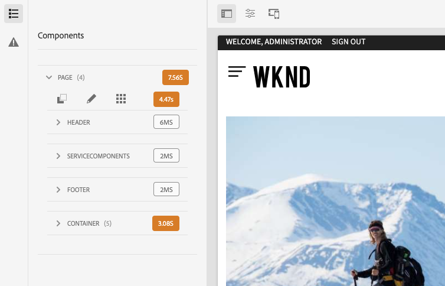

# Modus voor ontwikkelaars {#developer-mode}

Wanneer het uitgeven van pagina&#39;s in AEM, zijn verscheidene [&#x200B; wijzen &#x200B;](/help/sites-cloud/authoring/sites-console/introduction.md#page-modes) beschikbaar, met inbegrip van de wijze van de Ontwikkelaar. In de modus Ontwikkelaar wordt een zijpaneel geopend met verschillende tabbladen die een ontwikkelaar technische informatie over de huidige pagina bieden.

Er zijn twee tabbladen:

* **[Componenten](#components)** voor het bekijken van structuur en prestatiesinformatie.
* **[Fouten](#errors)** om het even welke problemen te zien die voorkomen.

Deze hulp een ontwikkelaar om:

* **ontdekt** hoe de pagina&#39;s worden samengesteld.
* **zuivert:** wat gebeurt waar en wanneer, die beurtelings helpt om kwesties op te lossen.

>[!NOTE]
>
>Modus Ontwikkelaar:
>
>* Is niet beschikbaar op mobiele apparaten of kleine vensters op het bureaublad (vanwege ruimtebeperkingen).
>  * Dit gebeurt wanneer de breedte minder dan 1024 px is.
>* Is alleen beschikbaar voor gebruikers die lid zijn van de `administrators` -groep.

## Ontwerpmodus openen {#opening-developer-mode}

De modus Ontwikkelaar wordt als een zijpaneel geïmplementeerd in de pagina-editor. Om het paneel te openen, selecteer **Ontwikkelaar** van de wijzesselecteur in de toolbar van de paginaredacteur:

Het deelvenster bestaat uit twee tabbladen:

* **[Componenten](#components)** - dit toont een componentenboom, gelijkend op de [&#x200B; inhoudsboom &#x200B;](/help/sites-cloud/authoring/page-editor/editor-side-panel.md#content-tree) voor auteurs
* **[Fouten](#errors)** - wanneer de problemen voorkomen, worden de details getoond voor elke component.

### Tabblad Componenten {#components}

Dit toont een componentenboom die:

* Hiermee wordt de keten van componenten en sjablonen op de pagina weergegeven. De structuur kan worden uitgebreid om de context binnen de hiërarchie te tonen.
* Geeft de computertijd aan de serverzijde weer die nodig is om de component te renderen.
* Hiermee kunt u de structuur uitvouwen en specifieke componenten in de structuur selecteren. De selectie biedt toegang tot componentdetails, zoals:
   * Pad naar opslagplaats
   * Koppelingen naar scripts (geopend in CRXDE Lite)
   * Het detail van de component zoals gezien in de [&#x200B; Console van Componenten &#x200B;](/help/sites-cloud/authoring/components-console.md)
* De componenten die in de boom worden geselecteerd worden vermeld door een blauwe grens in de redacteur.

Op het tabblad Deze componenten kunt u:

* Bepaal en vergelijk de rendertijd per component.
* Zie en begrijp de hiërarchie.
* Begrijp en verbeter vervolgens de laadtijd van de pagina door langzame componenten te zoeken.

Elk componentitem kan de volgende opties hebben:

* **Details van de Mening:** een verbinding aan een lijst die toont:
   * Alle componentscripts die worden gebruikt om de component te renderen.
   * Het inhoudspad van de opslagplaats voor deze specifieke component.

     

* **geef Manuscript uit:** een verbinding die het componentenmanuscript in CRXDE Lite opent.

* **de Details van de Component van de Mening:** opent de details van de component binnen de [&#x200B; Console van Componenten &#x200B;](/help/sites-cloud/authoring/components-console.md).

U kunt een componentitem uitbreiden door te tikken op het chevron of erop te klikken. U kunt ook het volgende weergeven:

    * De hiërarchie binnen de geselecteerde component.
    * Renderingtijden voor de geselecteerde component afzonderlijk, eventuele afzonderlijke componenten die erin zijn genest en het gecombineerde totaal. 

### Tabblad Fouten {#errors}

Hopelijk zal het **lusje van Fouten** altijd leeg zijn (zoals hierboven), maar wanneer de problemen voorkomen kunnen de volgende details voor elke component worden getoond:

* Een waarschuwing als de component een ingang aan het foutenlogboek, samen met details van de fout en directe verbindingen aan de aangewezen code binnen CRXDE Lite schrijft.
* Een waarschuwing als de component een beheersessie opent.

Bijvoorbeeld, als een ongedefinieerde methode wordt geroepen, wordt de resulterende fout getoond in het **lusje van Fouten** en de componenteningang in de boom van het **Componenten** lusje zal ook met een indicator worden duidelijk wanneer een fout voorkomt.
