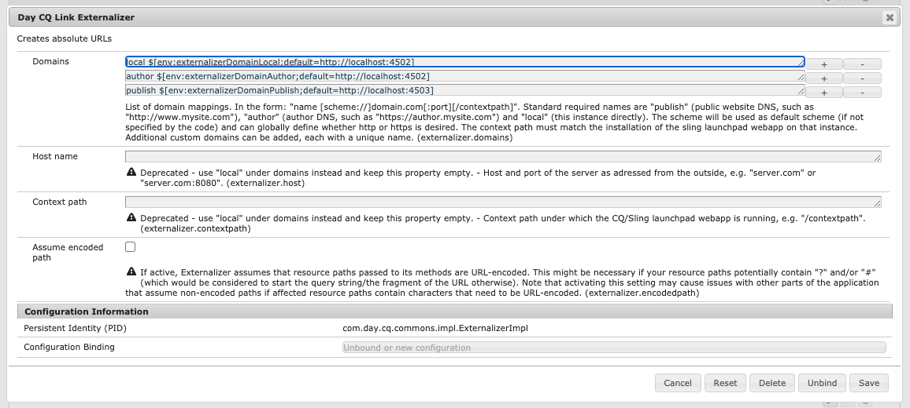

# URL&#39;s extern maken {#externalizing-urls}

In AEM **ExternalAlizer** is de dienst OSGi die u programmatically een middelweg laat omzetten (bijvoorbeeld `/path/to/my/page`) in een externe en absolute URL (bijvoorbeeld `https://www.mycompany.com/path/to/my/page`) door het pad vooraf te bevestigen met een vooraf geconfigureerde DNS.

Omdat een AEM as a Cloud Service instantie zijn uiterlijk zichtbare URL niet kan kennen en omdat soms een verbinding buiten het verzoekwerkingsgebied moet worden gecreeerd, verstrekt deze dienst een centrale plaats om die externe URLs te vormen en hen te bouwen.

Dit artikel verklaart hoe te om de dienst te vormen Externalzer en hoe te om het te gebruiken. Voor technische details van de dienst, zie [Javadocs](https://www.adobe.io/experience-manager/reference-materials/cloud-service/javadoc/com/day/cq/commons/Externalizer.html).

## Standaardgedrag van Externalzer en Hoe te om met voeten te treden {#default-behavior}

Buiten het vak wijst de service Externalzer een handvol domeinid&#39;s toe aan absolute URL-voorvoegsels die overeenkomen met de AEM service-URL&#39;s die voor de omgeving zijn gegenereerd, zoals `author https://author-p12345-e6789.adobeaemcloud.com` en `publish https://publish-p12345-e6789.adobeaemcloud.com`. De basis-URL&#39;s voor elk van deze standaarddomeinen worden gelezen van omgevingsvariabelen die zijn gedefinieerd door Cloud Manager.

Voor verwijzing, de standaardconfiguratie OSGi voor `com.day.cq.commons.impl.ExternalizerImpl.cfg.json` effectief is:

```json
{
   "externalizer.domains": [
      "local $[env:AEM_EXTERNALIZER_LOCAL;default=http://localhost:4502]",
      "author $[env:AEM_EXTERNALIZER_AUTHOR;default=http://localhost:4502]",
      "publish $[env:AEM_EXTERNALIZER_PUBLISH;default=http://localhost:4503]",
      "preview $[env:AEM_EXTERNALIZER_PREVIEW;default=http://localhost:4503]"
   ]
}
```

>[!CAUTION]
>
>De standaardwaarde `local`, `author`, `preview`, en `publish` Extern alizer domeinafbeeldingen in de configuratie OSGi moeten met origineel worden bewaard `$[env:...]` hierboven vermelde waarden.
>
>Een aangepaste toepassing implementeren `com.day.cq.commons.impl.ExternalizerImpl.cfg.json` om as a Cloud Service te AEM dat het weglaten van om het even welk van deze uit-van-de-doos domeinafbeeldingen in onvoorspelbaar toepassingsgedrag kan resulteren.

Als u de opdracht `preview` en `publish` waarden, omgevingsvariabelen van Cloud Manager gebruiken zoals beschreven in het artikel [Het vormen OSGi voor AEM as a Cloud Service](/help/implementing/deploying/configuring-osgi.md#cloud-manager-api-format-for-setting-properties) en het instellen van de vooraf gedefinieerde `AEM_CDN_DOMAIN_PUBLISH` en `AEM_CDN_DOMAIN_PREVIEW` variabelen.

## Het vormen van de Dienst Externalzer {#configuring-the-externalizer-service}

De dienst ExternalAlizer laat u centraal het domein bepalen dat aan programmatically prefixmiddelwegen kan worden gebruikt. De dienst Externalzer zou slechts voor toepassingen met één enkel domein moeten worden gebruikt.

>[!NOTE]
>
>Als u een [OSGi-configuraties voor AEM as a Cloud Service,](/help/implementing/deploying/overview.md#osgi-configuration) de volgende stappen zouden op een lokale ontwikkelaarinstantie moeten worden uitgevoerd en dan aan uw projectcode voor plaatsing geëngageerd.

Om een domeinafbeelding voor de dienst te bepalen Externalzer:

1. Navigeer aan de Manager van de Configuratie via:

   `https://<host>:<port>/system/console/configMgr`

1. Klikken **Day CQ Link ExternalAlizer** om het dialoogvenster Configuratie te openen.

   

   >[!NOTE]
   >
   >De directe koppeling naar de configuratie is `https://<host>:<port>/system/console/configMgr/com.day.cq.commons.impl.ExternalizerImpl`

1. Een **Domeinen** toewijzing. Een toewijzing bestaat uit een unieke naam die in de code kan worden gebruikt om naar het domein, een ruimte en het domein te verwijzen:

   `<unique-name> [scheme://]server[:port][/contextpath]`

   Waarbij:

   * **`scheme`** is meestal http of https, maar kan een ander protocol zijn.

      * Adobe raadt u aan https te gebruiken om https-koppelingen af te dwingen.
      * Deze wordt gebruikt als de clientcode het schema niet overschrijft wanneer wordt gevraagd om externalisatie van een URL.

   * **`server`** is de gastheernaam (of een domeinnaam of ip adres).
   * **`port`** (optioneel) is het poortnummer.
   * **`contextpath`** (optioneel) wordt alleen ingesteld als AEM is geïnstalleerd als een webapp onder een ander contextpad.

   Bijvoorbeeld: `production https://my.production.instance`

   De volgende toewijzingsnamen zijn vooraf gedefinieerd en moeten altijd worden ingesteld op basis van AEM:

   * `local` - de lokale instantie
   * `author` - DNS van het ontwerpsysteem
   * `publish` - het publiek met de website DNS geconfronteerd

   >[!NOTE]
   >
   >Met een aangepaste configuratie kunt u een nieuwe categorie toevoegen, zoals `production`, `staging` of zelfs externe niet-AEM systemen zoals `my-internal-webservice`. Het is nuttig om harde codering dergelijke URLs over verschillende plaatsen in codebase van een project te vermijden.

1. Klikken **Opslaan** om uw wijzigingen op te slaan.

### Het gebruiken van de Dienst Externalzer {#using-the-externalizer-service}

Deze sectie toont een paar voorbeelden van hoe de dienst Externalzer kan worden gebruikt.

>[!NOTE]
>
>In de context van HTML mogen geen absolute koppelingen worden gemaakt. Gebruik dit hulpprogramma daarom in dergelijke gevallen niet.

* **Een pad extern maken met het domein &#39;publish&#39;:**

  ```java
  String myExternalizedUrl = externalizer.publishLink(resolver, "/my/page") + ".html";
  ```

  Het veronderstellen van de domeinafbeelding:

   * `publish https://www.website.com`

   * `myExternalizedUrl` eindigt omhoog met de waarde:

   * `https://www.website.com/contextpath/my/page.html`

* **Een pad extern maken met het domein &#39;auteur&#39;:**

  ```java
  String myExternalizedUrl = externalizer.authorLink(resolver, "/my/page") + ".html";
  ```

  Het veronderstellen van de domeinafbeelding:

   * `author https://author.website.com`

   * `myExternalizedUrl` eindigt omhoog met de waarde:

   * `https://author.website.com/contextpath/my/page.html`

* **Een pad extern maken met het &#39;lokale&#39; domein:**

  ```java
  String myExternalizedUrl = externalizer.externalLink(resolver, Externalizer.LOCAL, "/my/page") + ".html";
  ```

  Het veronderstellen van de domeinafbeelding:

   * `local https://publish-3.internal`

   * `myExternalizedUrl` eindigt omhoog met de waarde:

   * `https://publish-3.internal/contextpath/my/page.html`

>[!TIP]
>
>Meer voorbeelden vindt u in het gedeelte [Javadocs](https://www.adobe.io/experience-manager/reference-materials/cloud-service/javadoc/com/day/cq/commons/Externalizer.html).
