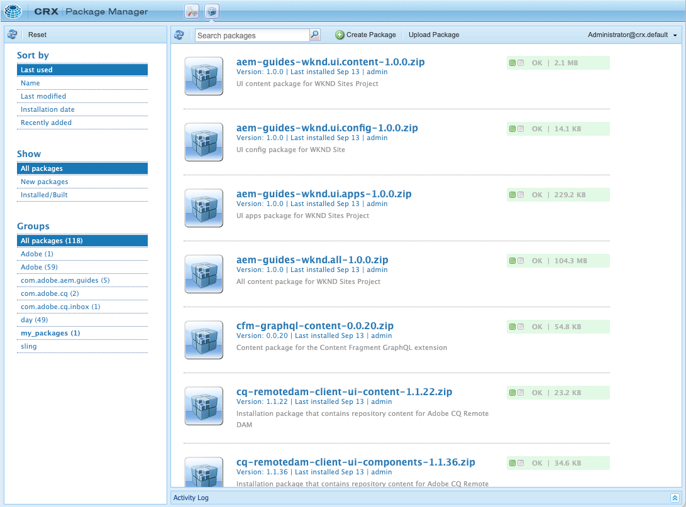

# Pakketbeheer {#working-with-packages}

Pakketten maken het importeren en exporteren van inhoud in de opslagplaats mogelijk. U kunt pakketten gebruiken om nieuwe inhoud te installeren, inhoud tussen instanties over te brengen, en file bewaarplaats inhoud.

Met Package Manager kunt u pakketten overbrengen tussen uw AEM en uw lokale bestandssysteem voor ontwikkelingsdoeleinden.

## Wat zijn pakketten? {#what-are-packages}

Een pakket is een gecomprimeerd bestand met opslagplaats-inhoud in serialisatie van het bestandssysteem, zogenaamde vault serialization, waarmee bestanden en mappen eenvoudig kunnen worden weergegeven en bewerkt. Inhoud in het pakket wordt met filters gedefinieerd.

Een pakket bevat ook vault meta-informatie, met inbegrip van de filterdefinities en de informatie van de de invoerconfiguratie. Extra eigenschappen van inhoud, die niet worden gebruikt voor het uitpakken van pakketten, kunnen in het pakket worden opgenomen, zoals een beschrijving, een visuele afbeelding of een pictogram. Deze eigenschappen voor extra inhoud zijn alleen bedoeld voor de consument van het inhoudspakket en alleen ter informatie.

>[!NOTE]
>
>Pakketten vertegenwoordigen de huidige versie van de inhoud op het moment dat het pakket wordt gemaakt. Ze bevatten geen vorige versies van de inhoud die AEM in de opslagplaats bewaart.

## Pakketten in AEM as a Cloud Service {#aemaacs-packages}

Inhoudspakketten die voor AEM as a Cloud Service toepassingen worden gemaakt, moeten een duidelijke scheiding hebben tussen onveranderbare en muteerbare inhoud. Daarom kan de Manager van het Pakket slechts worden gebruikt om pakketten te beheren die inhoud bevatten. Alle code moet worden geïmplementeerd via Cloud Manager.

>[!NOTE]
>
>Pakketten kunnen alleen inhoud bevatten. Willekeurige functionaliteit (bijvoorbeeld inhoud die is opgeslagen onder `/apps`) moet [geïmplementeerd via uw CI/CD-pijpleiding in Cloud Manager](/help/implementing/cloud-manager/deploy-code.md).

>[!IMPORTANT]
>
>De interface van Package Manager kan een **ongedefinieerd** foutbericht als een pakket langer dan 10 minuten duurt om te installeren.
>
>Dit is niet het gevolg van een fout tijdens de installatie, maar van een time-out die de Cloud Service heeft voor alle aanvragen.
>
>Probeer de installatie niet opnieuw als er een dergelijke fout optreedt. De installatie verloopt op de juiste wijze op de achtergrond. Als u de installatie opnieuw start, kunnen er conflicten optreden tijdens meerdere importprocessen tegelijk.

Ga voor meer informatie over het beheren van pakketten voor AEMaaCS naar [Distribueren naar AEM as a Cloud Service](/help/implementing/deploying/overview.md) in de het opstellen gebruikershandleiding.

## Pakketgrootte {#package-size}

Adobe raadt u aan geen grote pakketten te maken. Zo voorkomt u time-outproblemen bij het uploaden en downloaden van pakketten.

In het algemeen moet een pakket in zijn geheel binnen 60 seconden worden verzonden. Dit verstrekt de volgende formule als gids.

```text
MaxPackageSize (in MB) = ConnectionSpeed (in MB/s) * 60 s
```

Aangezien het netwerkverkeer variabel is en altijd kleiner is dan de geadverteerde maximale theoretische waarde, kunt u proberen een online testtool voor de snelheid van internetverbinding te gebruiken.

Internetsnelheden zijn bijna altijd verschillend voor uploads en downloads. Ervan uitgaande dat u pakketten moet uploaden en downloaden, moet u de lagere waarde (gewoonlijk uploadsnelheid) gebruiken in uw berekening.

### Voorbeeld {#example}

Gebruikend een hulpmiddel van de de snelheidstest van Internet, zie ik dat mijn huidige uploadsnelheid ongeveer 100 Mbps is.

```text
100 Mbps = 12.5 MB/s
12.5 MB/s * 60 s = 750 MB
```

Alle pakketten die ik maak, moeten dus kleiner zijn dan 750 MB.

>[!NOTE]
>
>De snelheden van het netwerk zijn onderworpen aan huidige, lokale voorwaarden. Zelfs met een recente snelheidstest, kan uw daadwerkelijke productie variëren.
>
>Daarom is de geleverde formule slechts een richtlijn en kan de werkelijke maximale aanbevolen verpakkingsgrootte variëren.

## Pakketbeheer {#package-manager}

Pakketbeheer beheert de pakketten op de AEM installatie. Nadat u [toegewezen de noodzakelijke toestemmingen](#permissions-needed-for-using-the-package-manager) U kunt de Manager van het Pakket voor diverse acties gebruiken, met inbegrip van het vormen, het bouwen, het downloaden, en het installeren van uw pakketten.

### Vereiste machtigingen {#required-permissions}

Gebruikers moeten over de juiste machtigingen beschikken voor het maken, wijzigen, uploaden en installeren van pakketten:

* Volledige rechten behalve verwijderen op `/etc/packages`
* The node that contains the package contents

>[!CAUTION]
>
>Het verlenen van toestemmingen voor pakketten kan tot gevoelige informatieonthulling en gegevensverlies leiden.
>
>Om deze risico&#39;s te beperken, wordt het hoogst geadviseerd om specifieke groepstoestemmingen over specifieke slechts subbomen te verlenen.

### Pakketbeheer openen {#accessing}

U kunt tot de Manager van het Pakket op drie manieren toegang hebben:

1. Vanuit het AEM hoofdmenu > **Gereedschappen** > **Implementatie** > **Pakketten**
1. Van [CRXDE Lite](crxde.md) de bovenste schakelbalk gebruiken
1. Direct door toegang te krijgen tot `http://<host>:<port>/crx/packmgr/`

### Gebruikersinterface pakketbeheer {#ui}

Pakketbeheer is verdeeld in vier belangrijke functionele gebieden:

* **Deelvenster Linkernavigatie** - Met dit deelvenster kunt u de lijst met pakketten filteren en sorteren.
* **Pakketlijst** - Dit is de lijst van pakketten op uw instantie gefilterd en gesorteerd per selecties in het Linkerpaneel van de Navigatie.
* **Activiteitenlogboek** - Dit deelvenster wordt eerst geminimaliseerd en wordt uitgebreid om de activiteit van Package Manager nader te bepalen, bijvoorbeeld wanneer een pakket wordt gemaakt of geïnstalleerd. Er zijn extra knoppen op het tabblad Activiteitenlog voor:
   * **Logboek wissen**
   * **Tonen/verbergen**
* **Werkbalk** - De werkbalk bevat vernieuwingsknoppen voor de lijst Navigatievensters links en Pakket en knoppen voor het zoeken, maken en uploaden van pakketten.



Wanneer u op een optie in het linkernavigatievenster klikt, wordt de pakketlijst direct gefilterd.

Wanneer u op een pakketnaam klikt, wordt het item in de pakketlijst uitgebreid en worden meer details over het pakket weergegeven.


Er is een aantal acties dat op een pakket via de beschikbare toolbarknopen kan worden ondernomen wanneer het pakketdetail wordt uitgebreid.

* [Bewerken](#edit-package)
* [Opbouwen](#building-a-package)
* [Opnieuw installeren](#reinstalling-packages)
* [Downloaden](#downloading-packages-to-your-file-system)

Onder de **Meer** knop.

* [Verwijderen](#deleting-packages)
* [Dekking](#package-coverage)
* [Inhoud](#viewing-package-contents-and-testing-installation)
* [Omloop](#rewrapping-a-package)
* [Andere versies](#other-versions)
* [Verwijderen](#uninstalling-packages)
* [Installeren testen](#viewing-package-contents-and-testing-installation)
* [Valideren](#validating-packages)
* [Repliceren](#replicating-packages)

### Pakketstatus {#package-status}

Elk item in de pakketlijst heeft een statusindicator waarmee u in één oogopslag de status van het pakket kunt zien. Als u de muisaanwijzer boven de status houdt, wordt knopinfo met de details van de status weergegeven.


Als het pakket is gewijzigd of nooit is gemaakt, wordt de status weergegeven als een koppeling waarmee u snel actie kunt ondernemen om het pakket opnieuw samen te stellen of te installeren.

## Pakketinstellingen {#package-settings}

Een pakket is in wezen een set filters en de gegevens in de opslagplaats op basis van die filters. Met de interface van Package Manager kunt u op een pakket klikken en vervolgens de **Bewerken** om de details van een pakket met inbegrip van de volgende montages te bekijken.

* [Algemene instellingen](#general-settings)
* [Pakketfilters](#package-filters)
* [Pakketafhankelijke onderdelen](#package-dependencies)
* [Geavanceerde instellingen](#advanced-settings)
* [Schermafbeeldingen verpakken](#package-screenshots)

### Algemene instellingen {#general-settings}

U kunt diverse pakketinstellingen bewerken om informatie te definiëren, zoals de pakketbeschrijving, afhankelijkheden en providerdetails.

De **Pakketinstellingen** is beschikbaar via de **Bewerken** knop wanneer [maken](#creating-a-new-package) of [bewerken](#viewing-and-editing-package-information) een pakket. Klik op **Opslaan**.


| Veld | Beschrijving |
|---|---|
| Naam | De naam van het pakket |
| Groep | Voor het organiseren van pakketten kunt u de naam van een nieuwe groep typen of een bestaande groep selecteren |
| Versie | Te gebruiken tekst voor de versie |
| Beschrijving | Een korte beschrijving van het pakket waarmee HTML-opmaakcodes voor opmaak kunnen worden gebruikt |
| Miniatuur | Het pictogram dat bij de pakketvermelding wordt weergegeven |

### Pakketfilters {#package-filters}

Filters identificeren de knooppunten in de opslagplaats die in het pakket moeten worden opgenomen. A **Filterdefinitie** geeft de volgende informatie op:

* De **Hoofdpad** van de inhoud die moet worden opgenomen
* **Regels** die specifieke knooppunten onder het hoofdpad bevatten of uitsluiten

Regels toevoegen met de opdracht **+** knop. Regels verwijderen met de opdracht **-** knop.

Regels worden toegepast volgens hun volgorde, zodat ze op de gewenste plaats worden geplaatst met behulp van de **Omhoog** en **Omlaag** pijlknoppen.

Filters kunnen nul of meer regels bevatten. Als er geen regels zijn gedefinieerd, bevat het pakket alle inhoud onder het hoofdpad.

U kunt een of meer filterdefinities definiëren voor een pakket. Gebruik meerdere filters om inhoud van meerdere hoofdpaden op te nemen.


Wanneer u filters maakt, kunt u een pad definiëren of een reguliere expressie gebruiken om alle knooppunten op te geven die u wilt opnemen in of uitsluiten.

| Type regel | Beschrijving |
|---|---|
| include | Als u een map opneemt, worden die map en alle bestanden en mappen in die map (dat wil zeggen de volledige substructuur) opgenomen, maar **niet** andere bestanden of mappen vanuit het opgegeven hoofdpad opnemen. |
| uitsluiten | Als u een map uitsluit, worden die map en alle bestanden en mappen in die map (dat wil zeggen de volledige substructuur) uitgesloten. |

Pakketfilters worden meestal gedefinieerd wanneer u voor het eerst [Maak het pakket.](#creating-a-new-package) U kunt ze echter ook later bewerken, waarna het pakket opnieuw moet worden samengesteld om de inhoud bij te werken op basis van de nieuwe filterdefinities.

>[!TIP]
>
>Eén pakket kan meerdere filterdefinities bevatten, zodat knooppunten van verschillende locaties gemakkelijk in één pakket kunnen worden gecombineerd.

### Afhankelijkheden {#dependencies}


| Veld | Beschrijving | Voorbeeld/details |
|---|---|---|
| Getest met | De productnaam en versie van dit pakket zijn bedoeld voor of zijn compatibel met. | `AEMaaCS` |
| Opgeloste problemen | Een tekstveld waarin details kunnen worden weergegeven van fouten die zijn opgelost met dit pakket, één bug per regel | - |
| Afhankelijk van | Vermeldt andere pakketten noodzakelijk zodat het huidige pakket zoals verwacht loopt wanneer geïnstalleerd | `groupId:name:version` |
| Vervangen | Een lijst met vervangen pakketten die door dit pakket worden vervangen | `groupId:name:version` |

### Geavanceerde instellingen {#advanced-settings}


| Veld | Beschrijving | Voorbeeld/details |
|---|---|---|
| Naam | De naam van de aanbieder van het pakket | `WKND Media Group` |
| URL | URL van de provider | `https://wknd.site` |
| Koppeling | Pakketspecifieke koppeling naar een providerpagina | `https://wknd.site/package/` |
| Vereisten | Definieert of er beperkingen zijn bij de installatie van het pakket | **Beheerder** - Het pakket mag alleen worden geïnstalleerd met beheerdersrechten.<br>**Opnieuw starten** - AEM moet na de installatie van het pakket opnieuw worden gestart |
| Wisselstroomverwerking | Hiermee wordt opgegeven hoe de toegangsbeheerinformatie die in het pakket is gedefinieerd, wordt verwerkt wanneer het pakket wordt geïmporteerd | **Negeren** - ACLs in de bewaarplaats behouden <br>**Overschrijven** - Overschrijf ACLs in de bewaarplaats <br>**Samenvoegen** - Voeg beide reeksen ACLs samen <br>**MergePreserve** - Voeg toegangsbeheer in de inhoud met die samen van het pakket door de toegangsbeheeringangen van hoofden toe te voegen niet aanwezig in de inhoud wordt voorzien <br>**Wissen** - Wis ACLs |

### Schermafbeeldingen verpakken {#package-screenshots}

U kunt meerdere schermafbeeldingen aan het pakket toevoegen om een visuele weergave van de weergave van de inhoud te bieden.


## Pakkethandelingen {#package-actions}

Er zijn vele acties die op een pakket kunnen worden ondernomen.

### Een pakket maken {#creating-a-new-package}

1. [Access Package Manager.](#accessing)

1. Klikken **Pakket maken**.

   >[!TIP]
   >
   >Als uw instantie vele pakketten heeft, zou er een omslagstructuur op zijn plaats kunnen zijn. In dergelijke gevallen is het eenvoudiger om naar de vereiste doelmap te navigeren voordat u het nieuwe pakket maakt.

1. In de **Nieuw pakket** voert u de volgende velden in:

   

   * **Pakketnaam** - Selecteer een beschrijvende naam, zodat u (en anderen) de inhoud van het pakket gemakkelijk kunt herkennen.

   * **Versie** - Dit is een tekstveld dat u kunt gebruiken om een versie aan te geven. Deze wordt aan de pakketnaam toegevoegd om de naam van het ZIP-bestand te vormen.

   * **Groep** - Dit is de naam van de doelgroep (of -map). Met groepen kunt u uw pakketten ordenen. Er wordt een map voor de groep gemaakt als deze nog niet bestaat. Als u de groepsnaam leeg laat, wordt het pakket gemaakt in de hoofdpakketlijst.

1. Klikken **OK** om het pakket te maken.

1. AEM geeft het nieuwe pakket boven aan de lijst met pakketten weer.

   

1. Klikken **Bewerken** om de [inhoud van pakket.](#package-contents) Klikken **Opslaan** nadat u de instellingen hebt bewerkt.

1. U kunt nu [Opbouwen](#building-a-package) uw pakket.

Het is niet verplicht om het pakket onmiddellijk na het maken ervan te bouwen. Een ongebouwd pakket bevat geen inhoud en bestaat alleen uit de filtergegevens en andere metagegevens van het pakket.

>[!TIP]
>
>Om onderbrekingen te voorkomen, raadt de Adobe aan [geen grote pakketten maken.](#package-size)

### Een pakket maken {#building-a-package}

Een pakket wordt vaak op hetzelfde moment als u gemaakt [Maak het pakket](#creating-a-new-package), maar u kunt op een later tijdstip terugkeren om het pakket samen te stellen of opnieuw samen te stellen. Dit kan nuttig zijn als de inhoud in de opslagplaats is gewijzigd of de pakketfilters zijn gewijzigd.

1. [Access Package Manager.](#accessing)

1. Open de pakketdetails uit de pakketlijst door op de pakketnaam te klikken.

1. Klikken **Opbouwen**. Er wordt een dialoogvenster weergegeven waarin u moet bevestigen dat u het pakket wilt maken, omdat bestaande pakketinhoud wordt overschreven.

1. Klikken **OK**. AEM bouwt het pakket en geeft alle inhoud weer die aan het pakket is toegevoegd, zoals dit gebeurt in de lijst met activiteiten. Na voltooiing AEM wordt bevestigd dat het pakket is gemaakt en (wanneer u het dialoogvenster sluit) worden de gegevens in de pakketlijst bijgewerkt.

>[!TIP]
>
>Om onderbrekingen te voorkomen, raadt de Adobe aan [geen grote pakketten maken.](#package-size)

### Een pakket bewerken {#edit-package}

Nadat een pakket is geüpload naar AEM, kunt u de instellingen wijzigen.

1. [Access Package Manager.](#accessing)

1. Open de pakketdetails uit de pakketlijst door op de pakketnaam te klikken.

1. Klikken **Bewerken** en de **[Pakketinstellingen](#package-settings)** zoals vereist.

1. Klikken **Opslaan** opslaan.

U moet [het pakket opnieuw opbouwen](#building-a-package) om de inhoud bij te werken op basis van de wijzigingen die u hebt aangebracht.

### Een pakket opnieuw inpakken {#rewrapping-a-package}

Nadat een pakket is gemaakt, kan het opnieuw worden verpakt. Wanneer u de pakketgegevens opnieuw inpakt, worden deze zonder miniatuur, beschrijving, enzovoort gewijzigd, zonder dat de pakketinhoud wordt gewijzigd.

1. [Access Package Manager.](#accessing)

1. Open de pakketdetails uit de pakketlijst door op de pakketnaam te klikken.

1. Klikken **Bewerken** en de **[Pakketinstellingen](#package-settings)** zoals vereist.

1. Klikken **Opslaan** opslaan.

1. Klikken **Meer** > **Omloop** en een dialoog zal om bevestiging vragen.

### Andere pakketversies weergeven {#other-versions}

Omdat elke versie van een pakket in de lijst verschijnt zoals elk ander pakket, kan de Manager van het Pakket andere versies van een geselecteerd pakket vinden.

1. [Access Package Manager.](#accessing)

1. Open de pakketdetails uit de pakketlijst door op de pakketnaam te klikken.

1. Klikken **Meer** > **Andere versies** en er wordt een dialoogvenster geopend met een lijst van andere versies van hetzelfde pakket met statusinformatie.

### Inhoud van pakket weergeven en installatie testen {#viewing-package-contents-and-testing-installation}

Nadat een pakket is samengesteld, kunt u de inhoud bekijken.

1. [Access Package Manager.](#accessing)

1. Open de pakketdetails uit de pakketlijst door op de pakketnaam te klikken.

1. Klik op **Meer** > **Inhoud** en Package Manager geeft de volledige inhoud van het pakket weer in het activiteitenlogboek.

   

1. Om een droge looppas van de installatie uit te voeren klik **Meer** > **Installeren testen** en de rapporten van de Manager van het Pakket in het activiteitenlogboek de resultaten alsof de installatie werd uitgevoerd.

   

### Pakketten naar uw bestandssysteem downloaden {#downloading-packages-to-your-file-system}

1. [Access Package Manager.](#accessing)

1. Open de pakketdetails uit de pakketlijst door op de pakketnaam te klikken.

1. Klik op de knop **Downloaden** of de gekoppelde bestandsnaam van het pakket in het gebied met pakketdetails.

1. AEM downloadt het pakket naar uw computer.

>[!TIP]
>
>Om onderbrekingen te voorkomen, raadt de Adobe aan [geen grote pakketten maken.](#package-size)

### Pakketten uploaden vanuit uw bestandssysteem {#uploading-packages-from-your-file-system}

1. [Access Package Manager.](#accessing)

1. Selecteer de groepsmap waarin u het pakket wilt uploaden.

1. Klik op de knop **Pakket uploaden** knop.

1. Geef de benodigde informatie over het geüploade pakket.

   

   * **Pakket** - Gebruik de **Bladeren...** om het vereiste pakket in uw lokale bestandssysteem te selecteren.
   * **Uploaden forceren** - Als er al een pakket met deze naam bestaat, wordt het uploaden afgedwongen en wordt het bestaande pakket overschreven.

1. Klikken **OK** en het geselecteerde pakket wordt geüpload en de pakketlijst wordt dienovereenkomstig bijgewerkt.

De pakketinhoud bestaat nu op AEM, maar als u de inhoud beschikbaar wilt maken voor gebruik, moet u [het pakket installeren](#installing-packages).

>[!TIP]
>
>Om onderbrekingen te voorkomen, raadt de Adobe aan [geen grote pakketten maken.](#package-size)

### Pakketten valideren {#validating-packages}

Omdat pakketten bestaande inhoud kunnen wijzigen, is het vaak handig om deze wijzigingen te valideren voordat u ze installeert.

#### Validatieopties {#validation-options}

Pakketbeheer kan de volgende validaties uitvoeren:

* [OSGi-pakket importeren](#osgi-package-imports)
* [Bedekkingen](#overlays)
* [ACLs](#acls)

##### OSGi-pakketinvoer valideren {#osgi-package-imports}

>[!NOTE]
>
>Omdat het pakket niet kan worden gebruikt om code in AEMaaCS op te stellen, **OSGi-pakket importeren** validatie is niet nodig.

**Wat wordt gecontroleerd**

Deze validatie inspecteert het pakket voor alle JAR-bestanden (OSGi-bundels), extraheert de bestanden `manifest.xml` (die de versioned gebiedsdelen bevat waarop OSGi bundel baseert), en verifieert de AEM instantie uitvoert genoemde gebiedsdelen met de correcte versies.

**Hoe wordt het gemeld**

Om het even welke versioned gebiedsdelen die niet door de AEM instantie kunnen worden tevredengesteld zijn vermeld in het Logboek van de Activiteit van de Manager van het Pakket.

**Foutstatussen**

Als de gebiedsdelen ontevreden zijn, dan zullen de bundels OSGi in het pakket met die gebiedsdelen niet beginnen. Dit resulteert in een gebroken toepassingsplaatsing aangezien om het even wat die op de unstarted bundel OSGi baseert zal beurtelings niet behoorlijk functioneren.

**Foutresolutie**

Om fouten wegens ontevreden bundels op te lossen OSGi, moet de gebiedsdeelversie in de bundel met ontevreden invoer worden aangepast.

##### Bedekkingen valideren {#overlays}

>[!NOTE]
>
>Omdat het pakket niet kan worden gebruikt om code in AEMaaCS op te stellen, **Bedekkingen** validatie is niet nodig.

**Wat wordt gecontroleerd**

Deze validatie bepaalt of het pakket dat wordt geïnstalleerd een bestand bevat dat al wordt bedekt in de AEM.

Als u bijvoorbeeld een bestaande overlay hebt van `/apps/sling/servlet/errorhandler/404.jsp`, een pakket dat `/libs/sling/servlet/errorhandler/404.jsp`, zodat het bestaande bestand wordt gewijzigd in `/libs/sling/servlet/errorhandler/404.jsp`.

**Hoe wordt het gemeld**

Dergelijke overlays worden beschreven in het activiteitenlogboek van Package Manager.

**Foutstatussen**

Een foutstatus houdt in dat het pakket probeert een bestand te implementeren dat al is bedekt. De wijzigingen in het pakket worden dus overschreven (en dus &quot;verborgen&quot;) door de bedekking en worden niet van kracht.

**Foutresolutie**

U kunt dit probleem oplossen door het bestand met de overlay in `/apps` moet de wijzigingen in het bovenliggende bestand in `/libs` en neemt de wijzigingen waar nodig op in de overlay ( `/apps`), en het overlappende bestand opnieuw gebruiken.

>[!NOTE]
>
>Het validatiemechanisme kan niet worden afgestemd op de correcte integratie van de overlay-inhoud in het overlaybestand. Daarom zal deze validatie ook na de nodige wijzigingen over conflicten blijven rapporteren.

##### ACLs bevestigen {#acls}

**Wat wordt gecontroleerd**

Deze validatie controleert welke machtigingen worden toegevoegd, hoe deze worden verwerkt (samenvoegen/vervangen) en of de huidige machtigingen worden beïnvloed.

**Hoe wordt het gemeld**

De toestemmingen worden beschreven in het Logboek van de Activiteit van de Manager van het Pakket.

**Foutstatussen**

Er kunnen geen expliciete fouten worden opgegeven. De bevestiging wijst eenvoudig erop of om het even welke nieuwe ACL toestemmingen worden toegevoegd of beïnvloed door het pakket te installeren.

**Foutresolutie**

Gebruikend de informatie die door de bevestiging wordt verstrekt, kunnen de beïnvloede knopen in CRXDE worden herzien en ACLs kan in het pakket aanpassen zoals nodig.

>[!CAUTION]
>
>Als beste praktijken wordt het geadviseerd dat de pakketten geen AEM-Verstrekte ACLs zouden moeten beïnvloeden aangezien dit in onverwacht gedrag kan resulteren.

#### Validatie uitvoeren {#performing-validation}

De validatie van pakketten kan op twee verschillende manieren worden uitgevoerd:

* [Via de interface van Package Manager](#via-package-manager)
* [Via HTTP-POST request zoals with cURL](#via-post-request)

Validatie moet altijd plaatsvinden na het uploaden van het pakket, maar voordat het wordt geïnstalleerd.

##### Pakketvalidatie via pakketbeheer {#via-package-manager}

1. [Access Package Manager.](#accessing)

1. Open de pakketdetails uit de pakketlijst door op de pakketnaam te klikken.

1. Klik op **Meer** > **Valideren**,

1. In het modale dialoogvenster dat dan wordt weergegeven, gebruikt u de selectievakjes om het type of de typen validatie te selecteren en de validatie te starten door op **Valideren**.

1. De gekozen validatie(s) worden dan uitgevoerd en de resultaten worden weergegeven in het activiteitenlog van Package Manager.

##### Pakketvalidatie via HTTP POST Request {#via-post-request}

Het verzoek van de POST heeft de volgende vorm.

```
https://<host>:<port>/crx/packmgr/service.jsp?cmd=validate&type=osgiPackageImports,overlays,acls
```

De `type` parameter kan elke door komma&#39;s gescheiden, ongeordende lijst zijn die bestaat uit:

* `osgiPackageImports`
* `overlays`
* `acls`

De waarde van `type` standaardinstellingen `osgiPackageImports` indien niet expliciet doorgegeven.

Wanneer u cURL gebruikt, voert u een instructie uit die vergelijkbaar is met het volgende:

```shell
curl -v -X POST --user admin:admin -F file=@/Users/SomeGuy/Desktop/core.wcm.components.all-1.1.0.zip 'http://localhost:4502/crx/packmgr/service.jsp?cmd=validate&type=osgiPackageImports,overlays,acls'
```

Bij validatie via een aanvraag voor een POST wordt het antwoord teruggestuurd als een JSON-object.

### Pakketdekking weergeven {#package-coverage}

Pakketten worden gedefinieerd door hun filters. U kunt Package Manager filters van een pakket op uw bestaande opslagplaats inhoud laten toepassen om te tonen welke inhoud van de bewaarplaats door de filterdefinitie van het pakket wordt behandeld.

1. [Access Package Manager.](#accessing)

1. Open de pakketdetails uit de pakketlijst door op de pakketnaam te klikken.

1. Klikken **Meer** > **Dekking**.

1. De dekkingsdetails worden vermeld in het activiteitenlog.

### Pakketten installeren {#installing-packages}

Wanneer u een pakket uploadt, wordt alleen de pakketinhoud aan de opslagplaats toegevoegd, maar deze is niet toegankelijk. U moet het geüploade pakket installeren om de inhoud van het pakket te kunnen gebruiken.

>[!CAUTION]
>
>Wanneer u een pakket installeert, kan bestaande inhoud worden overschreven of verwijderd. Upload een pakket alleen als u zeker weet dat de benodigde inhoud niet wordt verwijderd of overschreven.

Voordat u het pakket installeert, maakt Package Manager automatisch een pakket met momentopnamen dat de overschreven inhoud bevat. Deze momentopname wordt opnieuw geïnstalleerd als u uw pakket verwijdert.

1. [Access Package Manager.](#accessing)

1. Open in de pakketlijst de pakketdetails van het pakket dat u wilt installeren door op de pakketnaam te klikken.

1. Klik op de knop **Installeren** in de objectdetails of de **Installeren** in de pakketstatus.

1. In een dialoogvenster wordt bevestiging aangevraagd en kunnen aanvullende opties worden opgegeven.

   * **Alleen extraheren** - Extraheer het pakket alleen zodat er geen momentopname wordt gemaakt en het verwijderen daarom niet mogelijk is
   * **Drempel opslaan** - Aantal transiënte knooppunten totdat automatisch wordt opgeslagen (verhoog deze waarde als er uitzonderingen optreden die gelijktijdig worden gewijzigd)
   * **Subpakketten extraheren** - Automatisch extraheren van subpakketten inschakelen
   * **Toegangsbeheer** - Geeft aan hoe de toegangsbeheerinformatie die in het pakket is gedefinieerd, wordt verwerkt wanneer het pakket wordt geïnstalleerd (de opties zijn gelijk aan de [geavanceerde pakketinstellingen](#advanced-settings))
   * **Afhankelijkheden verwerken** - Specificeer hoe de gebiedsdelen tijdens installatie worden behandeld

1. Klikken **Installeren**.

1. In het activiteitenlog wordt de voortgang van de installatie beschreven.

Nadat de installatie is voltooid en voltooid, wordt de pakketlijst bijgewerkt en wordt het woord **Geïnstalleerd** in de pakketstatus.

### Pakketten opnieuw installeren {#reinstalling-packages}

Wanneer u pakketten opnieuw installeert, worden dezelfde stappen uitgevoerd op een reeds geïnstalleerd pakket die worden verwerkt wanneer [het pakket aanvankelijk installeren.](#installing-packages)

### Uploaden en installeren op basis van bestandssysteem {#file-system-based-upload-and-installation}

U kunt pakketbeheer volledig verlaten wanneer het installeren van pakketten. AEM kan pakketten detecteren die op een specifieke locatie in het lokale bestandssysteem van de hostcomputer zijn geplaatst en deze automatisch uploaden en installeren.

1. Onder de installatiemap AEM is er een `crx-quicksart` naast de pot en `license.properties` bestand. Een map maken met de naam `install` krachtens `crx-quickstart` resulterend in het pad `<aem-home>/crx-quickstart/install`.

1. Voeg in deze map uw pakketten toe. Deze worden automatisch geüpload en geïnstalleerd op uw exemplaar.

1. Nadat het uploaden en installeren is voltooid, kunt u de pakketten in Package Manager zien alsof u de interface van Package Manager hebt gebruikt om ze te installeren.

Als de instantie actief is, wordt het uploaden en de installatie onmiddellijk gestart wanneer u het aan het pakket toevoegt `install` map

Als de instantie niet wordt uitgevoerd, worden pakketten in de `install` worden bij het opstarten geïnstalleerd in alfabetische volgorde.

### Pakketten verwijderen {#uninstalling-packages}

Als u het pakket verwijdert, wordt de inhoud van de opslagplaats teruggezet naar de momentopname die vóór de installatie automatisch door Package Manager is gemaakt.

1. [Access Package Manager.](#accessing)

1. Open de pakketdetails van het pakket dat u uit de pakketlijst wilt verwijderen door op de pakketnaam te klikken.

1. Klikken **Meer** > **Verwijderen** om de inhoud van dit pakket uit de opslagplaats te verwijderen.

1. In een dialoogvenster wordt bevestiging gevraagd en worden alle aangebrachte wijzigingen vermeld.

1. Het pakket wordt verwijderd en de momentopname wordt toegepast. De voortgang van het proces wordt weergegeven in het activiteitenlog.

### Pakketten verwijderen {#deleting-packages}

Als u een pakket verwijdert, worden alleen de gegevens verwijderd uit Pakketbeheer. Als dit pakket al is geïnstalleerd, wordt de geïnstalleerde inhoud niet verwijderd.

1. [Access Package Manager.](#accessing)

1. Open de pakketdetails van het pakket dat u uit de pakketlijst wilt verwijderen door op de pakketnaam te klikken.

1. AEM vraagt om bevestiging dat u het pakket wilt schrappen. Klikken **OK** om de schrapping te bevestigen.

1. De pakketinformatie wordt verwijderd en de details worden vermeld in het activiteitenlog.

### Pakketten repliceren {#replicating-packages}

Kopieer de inhoud van een pakket en installeer het op de publicatie-instantie.

1. [Access Package Manager.](#accessing)

1. Open de pakketdetails van het pakket u van de pakketlijst wilt herhalen door de pakketnaam te klikken.

1. Klikken **Meer** > **Repliceren**.

1. Het pakket wordt gerepliceerd en de details worden gerapporteerd in het activiteitenlog.

## Softwaredistributie {#software-distribution}

AEM pakketten kunnen worden gebruikt om inhoud te maken en te delen in AEMaaCS-omgevingen.

[Softwaredistributie](https://downloads.experiencecloud.adobe.com) biedt AEM pakketten voor gebruik op de SDK voor lokale ontwikkeling AEM. AEM pakketten die op softwaredistributie worden geleverd, mogen niet worden geïnstalleerd in AEMaaCS-cloudomgevingen, tenzij dit uitdrukkelijk wordt goedgekeurd door ondersteuning voor Adoben.

Zie voor meer informatie de [Documentatie voor softwaredistributie.](https://experienceleague.adobe.com/docs/experience-cloud/software-distribution/home.html)
