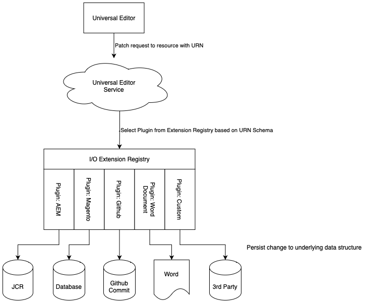
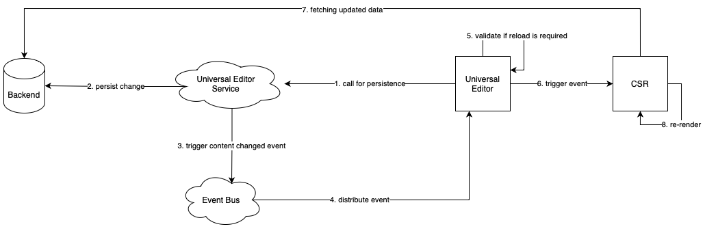

# Architectuur van Universal Editor {#architecture}

Leer over de architectuur van de Universele Redacteur en hoe de gegevens tussen zijn diensten en lagen stromen.

## Bouwstenen voor architectuur {#building-blocks}

De Universele Redacteur wordt samengesteld uit vier essentiële bouwstenen die met elkaar in wisselwerking staan om inhoudsauteurs toe te staan om het even welk aspect van om het even welke inhoud in om het even welke implementatie uit te geven zodat kunt u uitzonderlijke ervaringen leveren, inhoudssnelheid verhogen, en een state-of-the-art ontwikkelaarervaring verstrekken.

1. [Editors](#editors)
1. [Externe app](#remote-app)
1. [API-laag](#api-layer)
1. [Persistentielaag](#persistence-layer)

Dit document schetst elk van deze bouwstenen en hoe zij gegevens uitwisselen.

>[!TIP]
>
>Om de Universele Redacteur en zijn architectuur in actie te zien, zie [ Begonnen het Worden met de Universele Redacteur in AEM ](getting-started.md) leren hoe te om toegang tot de Universele Redacteur te krijgen en hoe te beginnen van instrumenten voorzien uw eerste AEM app om het te gebruiken.

### Editors {#editors}

* **Universele Redacteur** - De Universele Redacteur gebruikt van instrumenten voorzien DOM om op zijn plaats het uitgeven van inhoud toe te staan. Zie [ Attributen en Types ](attributes-types.md) voor details betreffende de noodzakelijke meta-gegevens. Zie het document [ Worden Begonnen met de Universele Redacteur in AEM ](getting-started.md) voor een voorbeeld van de instrumentatie in AEM.
* **het Comité van Eigenschappen** - sommige eigenschappen van componenten kunnen niet in-context worden uitgegeven, bijvoorbeeld, omwentelingstijd van een carrousel of die accordeonlusje altijd zal worden geopend of worden gesloten. Als u dergelijke componentgegevens wilt bewerken, vindt u een formuliereditor in het zijpaneel van de editor.

### Externe app {#remote-app}

Als u een app in de context bewerkbaar wilt maken in de Universal Editor, moet het DOM van instrumenten zijn voorzien. De externe toepassing moet bepaalde kenmerken in het DOM renderen. Zie [ Attributen en Types ](attributes-types.md) voor details betreffende de noodzakelijke meta-gegevens. Zie het document [ Worden Begonnen met de Universele Redacteur in AEM ](getting-started.md) voor een voorbeeld van de instrumentatie in AEM.

De Universal Editor streeft naar een minimale SDK, zodat de instrumentatie de verantwoordelijkheid is van de implementatie van de externe app.

### API-laag {#api-layer}

* **Gegevens van de Inhoud** - voor de Universele Redacteur, noch zijn de bronsystemen van de inhoudsgegevens noch de manier het wordt verbruikt belangrijk. Het is alleen belangrijk om de vereiste kenmerken te definiëren en te verschaffen met behulp van in de context bewerkbare gegevens.
* **het Blijven Gegevens** - voor elk editable gegeven is er een herkenningsteken URN. Dit URN wordt gebruikt om de persistentie aan het juiste systeem en middel te leiden.

### Persistentielaag {#persistence-layer}

* **Model van het Fragment van de Inhoud** - om het paneel voor het uitgeven van de eigenschappen van het Fragment van de Inhoud, de Redacteur van het Fragment van de Inhoud, en op vorm-gebaseerde redacteurs te steunen, worden de modellen per component en inhoudsfragment vereist.
* **Inhoud** - de Inhoud kan overal, zoals in AEM, Magento, etc. worden opgeslagen.

## Universal Editor-service en back-endsysteemverzending {#service}

De Universele Redacteur verzendt alle inhoudsveranderingen in de gecentraliseerde dienst genoemd de Universele Dienst van de Redacteur. Deze service, die wordt uitgevoerd op Adobe I/O Runtime, laadt de insteekmodules die beschikbaar zijn in het Extension Registry op basis van de opgegeven URL. De insteekmodule is verantwoordelijk voor de communicatie met de achterkant en voor het retourneren van een uniforme reactie.

## Renderpijplijnen {#rendering-pipelines}

### Rendering serverzijde {#server-side}

### Statische sitegeneratie {#static-generation}

### Rendering aan clientzijde {#client-side}

