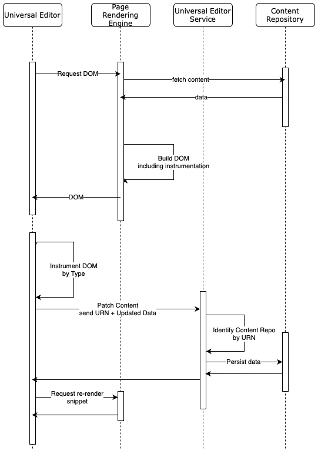

# Architectuur van Universal Editor {#architecture}

Leer over de architectuur van de Universele Redacteur en hoe de gegevens tussen zijn diensten en lagen stromen.

## Bouwstenen voor architectuur {#building-blocks}

De Universele Redacteur wordt samengesteld uit vier essentiële bouwstenen die met elkaar in wisselwerking staan om inhoudsauteurs toe te staan om het even welk aspect van om het even welke inhoud in om het even welke implementatie uit te geven om uitzonderlijke ervaringen te leveren, inhoudssnelheid te verhogen, en een state-of-the-art ontwikkelaarservaring te verstrekken.

1. [Editors](#editors)
1. [Externe app](#remote-app)
1. [API-laag](#api-layer)
1. [Persistentielaag](#persistence-layer)

Dit document schetst elk van deze bouwstenen en hoe zij gegevens uitwisselen.

>[!TIP]
>
>Als u de Universal Editor en de bijbehorende architectuur in actie wilt zien, raadpleegt u het document [Aan de slag met de Universal Editor in AEM](getting-started.md) om te leren hoe u toegang krijgt tot de Universal Editor en hoe u uw eerste AEM-app van instrumenten kunt voorzien om deze te gebruiken.

### Editors {#editors}

* **Universele editor** - De Universal Editor gebruikt een van instrumenten voorzien DOM om het op locatie bewerken van inhoud toe te staan. Zie het document [Kenmerken en typen](attributes-types.md) voor meer informatie over de vereiste metagegevens. Zie het document [Aan de slag met de Universal Editor in AEM](getting-started.md) voor een voorbeeld van de instrumenten in AEM.
* **Eigenschappenspoorlijn** - Sommige eigenschappen van componenten kunnen niet in de context worden bewerkt, bijvoorbeeld de rotatietijd van een carrousel of het accordeontabblad moet altijd worden geopend of gesloten. Om het bewerken van dergelijke componentgegevens mogelijk te maken, wordt een formuliereditor geleverd in de zijspoor van de editor.

### Externe app {#remote-app}

Als u een app in de context bewerkbaar wilt maken in de Universal Editor, moet het DOM van instrumenten zijn voorzien. De externe toepassing moet bepaalde kenmerken in het DOM renderen. Zie het document [Kenmerken en typen](attributes-types.md) voor meer informatie over de vereiste metagegevens. Zie het document [Aan de slag met de Universal Editor in AEM](getting-started.md) voor een voorbeeld van de instrumenten in AEM.

De Universal Editor streeft naar een minimale SDK, zodat de instrumentatie de verantwoordelijkheid is van de implementatie van de externe app.

### API-laag {#api-layer}

* **Inhoudsgegevens** - Voor de Universele Redacteur, noch zijn de bronsystemen van de inhoudsgegevens noch de manier het wordt gebruikt belangrijk. Het is alleen belangrijk om de vereiste kenmerken te definiëren en te verschaffen met behulp van in de context bewerkbare gegevens.
* **Blijvende gegevens** - Voor elke bewerkbare gegevens is er een URN-id. Dit URN wordt gebruikt om de persistentie aan het juiste systeem en middel te leiden.

### Persistentielaag {#persistence-layer}

* **Inhoudsfragmentmodel** - Voor ondersteuning van de rail voor het bewerken van eigenschappen van inhoudsfragmenten, zijn de Content Fragment Editor en op formulieren gebaseerde editors, modellen per component en inhoudsfragment vereist.
* **Inhoud** - Inhoud kan overal worden opgeslagen, bijvoorbeeld in AEM, Magento, enzovoort.

## Universal Editor-service en back-endsysteemverzending {#service}

De Universele Redacteur verzendt alle inhoudsveranderingen in de gecentraliseerde dienst genoemd de Universele Dienst van de Redacteur. Deze service, die wordt uitgevoerd op Adobe I/O Runtime, laadt de insteekmodules die beschikbaar zijn in het Extension Registry op basis van de opgegeven URL. De insteekmodule is verantwoordelijk voor de communicatie met de achterkant en voor het retourneren van een uniforme reactie.

## Renderpijplijnen {#rendering-pipelines}

### Rendering serverzijde {#server-side}

### Statische sitegeneratie {#static-generation}

### Rendering aan clientzijde {#client-side}

## Aanvullende bronnen {#additional-resources}

Zie deze documenten voor meer informatie over de Universal Editor.

* [Introductie van Universal Editor](introduction.md) - Leer hoe u met de Universal Editor elk aspect van elke inhoud in een implementatie kunt bewerken om buitengewone ervaringen te bieden, de snelheid van de inhoud te verhogen en een geavanceerde ontwikkelaarservaring te bieden.
* [Inhoud ontwerpen met de Universal Editor](authoring.md) - Leer hoe eenvoudig en intuïtief het is voor inhoudsauteurs om inhoud te maken met de Universal Editor.
* [Inhoud publiceren met de Universal Editor](publishing.md) - Leer hoe de Universal Visual Editor inhoud publiceert en hoe uw apps de gepubliceerde inhoud kunnen verwerken.
* [Aan de slag met de Universal Editor in AEM](getting-started.md) - Leer hoe u toegang krijgt tot de Universal Editor en hoe u uw eerste AEM-app van instrumenten kunt voorzien om deze te gebruiken.
* [Kenmerken en typen](attributes-types.md) - Meer informatie over de gegevenskenmerken en typen die de Universal Editor nodig heeft.
* [Universal Editor-verificatie](authentication.md) - Leer hoe de Universal Editor wordt geverifieerd.
