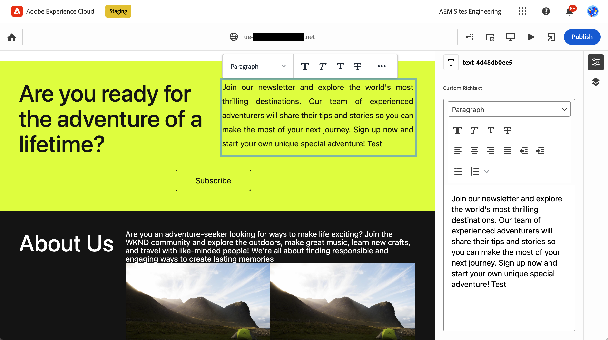

# Inhoud ontwerpen met de Universal Editor {#authoring}

Leer hoe gemakkelijk en intuïtief het is voor inhoudsauteurs om inhoud tot stand te brengen gebruikend de Universele Redacteur.

## Inleiding {#introduction}

Met de Universal Editor kunt u elk aspect van elke inhoud in een implementatie bewerken, zodat u uitzonderlijke ervaringen kunt bieden, de snelheid van de inhoud kunt verhogen en een geavanceerde ontwikkelaarservaring kunt bieden.

Hiervoor verschaft de Universal Editor de auteur van inhoud een intuïtieve gebruikersinterface die minimale training vereist om eenvoudig in de inhoud te kunnen springen en beginnen met het bewerken ervan. In dit document wordt de auteurservaring van de Universal Editor beschreven.

>[!TIP]
>
>Zie het document voor een meer gedetailleerde inleiding tot de Universal Editor [Introductie van de Universal Editor.](introduction.md)

>[!NOTE]
>
>De Universal Editor is nog in ontwikkeling. Momenteel kunnen niet alle inhoudstypen worden bewerkt.

## De app voorbereiden {#prepare-app}

Als u inhoud voor een app wilt ontwerpen met de Universal Editor, moet de app van instrumenten zijn voorzien door een ontwikkelaar om de editor te ondersteunen.

>[!TIP]
>
>Zie [Aan de slag met de Universal Editor in AEM](getting-started.md) voor een voorbeeld van hoe u een AEM toepassing configureert voor gebruik met de Universal Editor.

## Aanmelden {#sign-in}

Wanneer de app van instrumenten is voorzien om met de Universal Editor te werken, moet u zich aanmelden bij de Universal Editor. U hebt een Adobe ID nodig om u aan te melden en [toegang hebben tot de Universal Editor.](getting-started.md#request-access)

Nadat u bent aangemeld, voert u de URL van de pagina die u wilt bewerken in het dialoogvenster [locatiebalk.](#location-bar) zodat u inhoud zoals [tekstinhoud](#text-mode) of [media-inhoud.](#media-mode)

## De gebruikersinterface begrijpen {#ui}

De interface is verdeeld in vijf hoofdgebieden.

* [De koptekst Experience Cloud](#experience-cloud-header)
* [De koptekst van de Universal Editor](#universal-editor-header)
* [De modusrail](#mode-rail)
* [De editor](#editor)
* [De componentrail](#component-rail)

### De koptekst Experience Cloud {#experience-cloud-header}

De koptekst van de Experience Cloud staat altijd boven aan het scherm. Het is een anker dat u vertelt waar u zich binnen Experience Cloud bevindt en u helpt u naar andere Experience Cloud-apps te navigeren.

#### Experience Manager {#experience-manager}

Selecteer de verbinding van Adobe Experience Cloud bij de linkerzijde van de kopbal om aan de wortel van uw oplossing van de Experience Manager te navigeren om tot hulpmiddelen zoals [Cloud Manager,](/help/onboarding/cloud-manager-introduction.md) [Cloud Acceleration Manager](/help/journey-migration/cloud-acceleration-manager/introduction/overview-cam.md) en [Softwaredistributie.](https://experienceleague.adobe.com/docs/experience-cloud/software-distribution/home.html)

#### Organisatie {#organization}

Hier wordt de organisatie weergegeven waarmee u momenteel bent aangemeld. Tik of klik om over te schakelen naar een andere organisatie als uw Adobe ID is gekoppeld aan meerdere.

#### Oplossingen {#solutions}

Als u op de schakeloptie voor oplossingen tikt of erop klikt, kunt u snel naar andere Experience Cloud-oplossingen gaan.

#### Help {#help}

Met het Help-pictogram hebt u snel toegang tot leermiddelen en ondersteuningsbronnen.

#### Meldingen {#notifications}

Dit pictogram is gemarkeerd met het aantal momenteel toegewezen onvolledige [meldingen.](/help/implementing/cloud-manager/notifications.md)

#### Gebruikerseigenschappen {#user-properties}

Tik of klik op het pictogram dat uw gebruiker vertegenwoordigt om toegang te krijgen tot uw gebruikersinstellingen. Als u geen gebruikersbeeld hebt gevormd, wordt een pictogram willekeurig toegewezen.

### De koptekst van de Universal Editor {#universal-editor-header}

De Universal Editor-koptekst bevindt zich altijd boven aan het scherm net onder [de koptekst van de Experience Cloud.](#experience-cloud-header) Hiermee kunt u snel naar een andere pagina navigeren om deze te bewerken en te publiceren.

#### Het menu Hamburger {#hamburger-menu}

Het hamburgermenu is nog niet geïmplementeerd.

#### Locatiebalk {#location-bar}

Op de locatiebalk ziet u het adres van de pagina die u bewerkt. Tik of klik om het adres in te voeren van een andere pagina die u wilt bewerken.

>[!TIP]
>
>De sneltoets gebruiken `L` om de adresbalk te openen.

>[!NOTE]
>
>Elke pagina die u wilt bewerken met de universele editor moet [van instrumenten voorzien om de Universele Redacteur te steunen.](getting-started.md)

#### Emulatorinstellingen {#emulator}

Tik of klik op het emulatiepictogram om te bepalen hoe de Universal Editor de pagina weergeeft.

Als u op het emulatiepictogram tikt of erop klikt, worden de opties weergegeven.

Standaard wordt de editor geopend in een computerlay-out waarin de hoogte en breedte automatisch door de browser worden gedefinieerd.

U kunt er ook voor kiezen om een mobiel apparaat te emuleren en in de Universele Editor:

* De oriëntatie definiëren
* Breedte en hoogte definiëren
* De richting wijzigen

#### App-voorvertoning openen {#open-app-preview}

Tik of klik op het pictogram met de voorvertoning van de geopende app om de pagina die u momenteel bewerkt te openen in een eigen browser, zodat de editor er geen voorvertoning van kan weergeven.

>[!TIP]
>
>De sneltoets gebruiken `O` (de letter O) om de voorvertoning van de app te openen.

#### Publicatie {#publish}

Tik of klik op de knop Publiceren zodat u de wijzigingen in de live inhoud kunt publiceren voor gebruik door uw lezers.

>[!TIP]
>
>Zie het document [Inhoud publiceren met de Universal Visual Editor](publishing.md) voor meer informatie over publiceren met de Universele Redacteur.

### De Modus Rail {#rail}

De modusrail is altijd aanwezig langs de linkerkant van de editor. Zo kunt u gemakkelijk schakelen tussen de verschillende bewerkingsmodi.

#### Voorvertoningsmodus {#preview-mode}

In voorproefwijze, de pagina die in de redacteur wordt teruggegeven zoals het op uw gepubliceerde dienst zou worden gezien. Hierdoor kan de auteur van de inhoud door de inhoud navigeren door op koppelingen te klikken, enz.

>[!TIP]
>
>De sneltoets gebruiken `P` om over te schakelen naar de voorvertoningsmodus.

#### Tekstmodus {#text-mode}

In de tekstmodus wordt de pagina gerenderd in de editor, maar de auteur van de inhoud kan klikken om tekstinhoud te selecteren om deze te bewerken. Dit is de standaardmodus van de editor wanneer een pagina wordt geladen.

>[!TIP]
>
>De sneltoets gebruiken `T` om over te schakelen naar de tekstmodus.

#### Mediamodus {#media-mode}

In de mediamodus wordt de pagina gerenderd in de editor, maar de auteur van de inhoud kan klikken om media-inhoud te selecteren om deze te bewerken.

>[!TIP]
>
>De sneltoets gebruiken `M` om over te schakelen naar de mediamodus.

#### Componentmodus {#component-mode}

In de componentmodus wordt de pagina gerenderd in de editor, maar de auteur van de inhoud kan klikken om pagina-componenten te selecteren.

Wanneer u een inhoudsfragment selecteert, worden de details ervan weergegeven in het dialoogvenster [spoorstaaf.](#component-rail)

>[!TIP]
>
>De sneltoets gebruiken `C` om over te schakelen naar componentmodus.

#### Bewerken {#edit}

Wanneer in [componentmodus,](#component-mode) als u een inhoudsfragment selecteert, wordt de optie voor bewerken weergegeven op de modusrail.

Als u op de knop Bewerken tikt of erop klikt, wordt de editor voor inhoudsfragmenten op een nieuw tabblad geopend, zodat u inhoud waarnaar wordt verwezen, en tekst en media-inhoud vanuit de Universal Editor kunt bewerken.

>[!TIP]
>
>De sneltoets gebruiken `E` om een geselecteerde component te bewerken.

### De Editor {#editor}

De editor neemt het grootste deel van het venster in beslag en bevindt zich op de locatie van de pagina die is opgegeven in [de locatiebalk](#location-bar) wordt weergegeven.

* Als de editor zich in een bewerkingsmodus bevindt, zoals [tekstmodus](#text-mode) of [mediamodus,](#media-mode) de inhoud kan worden bewerkt en u kunt geen koppelingen volgen.
* Als de editor zich bevindt in [voorvertoningsmodus,](#preview-mode) U kunt wel navigeren naar de inhoud en koppelingen volgen, maar u kunt de inhoud niet bewerken.

### Component Rail {#component-rail}

De componentrail is altijd aanwezig langs de linkerkant van de redacteur. Afhankelijk van de modus, kunnen er details worden weergegeven voor een component die is geselecteerd in de inhoud of de hiërarchie van de pagina-inhoud.

#### Eigenschappenmodus {#properties-mode}

In de modus Eigenschappen toont de rail de eigenschappen van de component die momenteel in de editor is geselecteerd. Dit is de standaardmodus van de componentrail wanneer een pagina wordt geladen.

De details van de geselecteerde component worden in de spoorstaaf weergegeven. Als u een inhoudsfragment hebt geselecteerd met [componentmodus,](#component-mode) u kunt de instellingen in de componentrails wijzigen. Wijzigingen worden automatisch opgeslagen door de Universal Editor.

Merk op dat niet alle componenten details hebben die kunnen worden getoond.

>[!TIP]
>
>De sneltoets gebruiken `D` om over te schakelen naar de modus Eigenschappen.

#### Modus Inhoudsstructuur {#Content-tree-mode}

In de modus Inhoudsboomstructuur wordt in de rails de hiërarchie van de pagina-inhoud weergegeven.

Wanneer het selecteren van een punt in de inhoudsboom, scrolt de redacteur aan die inhoud en selecteert het.

>[!TIP]
>
>De sneltoets gebruiken `F` om over te schakelen naar de modus voor de inhoudstructuur.

## Inhoud bewerken {#editing-content}

Inhoud bewerken is eenvoudig en intuïtief. In de bewerkingsmodi ([tekstmodus](#text-mode), [mediamodus](#media-mode), en [componentmodus](#component-mode)), wordt bewerkbare inhoud gemarkeerd met een blauw vak terwijl u de muis over de inhoud in de editor beweegt.

Tik of klik op de inhoud in het blauwe vak om een interne editor te starten en uw wijzigingen aan te brengen. Uw wijzigingen worden automatisch opgeslagen.

Houd er rekening mee dat in de bewerkingsmodus door tikken of klikken op inhoud wordt geprobeerd deze te selecteren voor bewerking. Als u door de inhoud wilt navigeren door de koppelingen te volgen, schakelt u over naar [voorvertoningsmodus.](#preview-mode)

Afhankelijk van de [mode](#mode-rail) Als u werkt en de inhoud die u selecteert, hebt u mogelijk andere opties voor het bewerken van de plaats.

Bovendien kunt u extra eigenschappen voor de inhoud bekijken met de [spoorstaaf.](#component-rail) Als u bijvoorbeeld een RTF-component selecteert, kunt u opmaakopties in de componenttrack bewerken.

## Inhoud voorvertonen {#previewing-content}

Wanneer u klaar bent met het bewerken van inhoud, wilt u er vaak door navigeren om te zien hoe het er uitziet in de inhoud van andere pagina&#39;s. In [voorbeeldmodus](#preview-mode) u kunt op koppelingen klikken om door de inhoud te navigeren zoals een lezer zou doen. De inhoud wordt in de editor gerenderd zoals deze zou worden gepubliceerd.

Houd er rekening mee dat in de voorvertoningsmodus tikken of klikken op inhoud reageert op de manier waarop dit voor een lezer van de inhoud gebeurt. Als u de te bewerken inhoud wilt selecteren, schakelt u over naar een bewerkingsmodus, zoals [tekstmodus](#text-mode) of [mediamodus.](#media-mode)

## Aanvullende bronnen {#additional-resources}

Zie deze documenten voor meer informatie over de Universal Editor.

* [Introductie van Universal Editor](introduction.md) - Leer hoe u met de Universal Editor elk aspect van elke inhoud in een implementatie kunt bewerken, zodat u uitzonderlijke ervaringen kunt opdoen, de snelheid van de inhoud kunt verhogen en een geavanceerde ontwikkelaarservaring kunt bieden.
* [Inhoud publiceren met de Universal Editor](publishing.md) - Leer hoe de Universal Visual Editor inhoud publiceert en hoe uw apps de gepubliceerde inhoud kunnen verwerken.
* [Aan de slag met de Universal Editor in AEM](getting-started.md) - Leer hoe u toegang krijgt tot de Universal Editor en hoe u uw eerste AEM-app van instrumenten kunt voorzien om deze te gebruiken.
* [Architectuur van Universal Editor](architecture.md) - Leer over de architectuur van de Universele Redacteur en hoe de gegevens tussen zijn diensten en lagen stromen.
* [Kenmerken en typen](attributes-types.md) - Meer informatie over de gegevenskenmerken en typen die de Universal Editor nodig heeft.
* [Universal Editor-verificatie](authentication.md) - Leer hoe de Universal Editor wordt geverifieerd.
