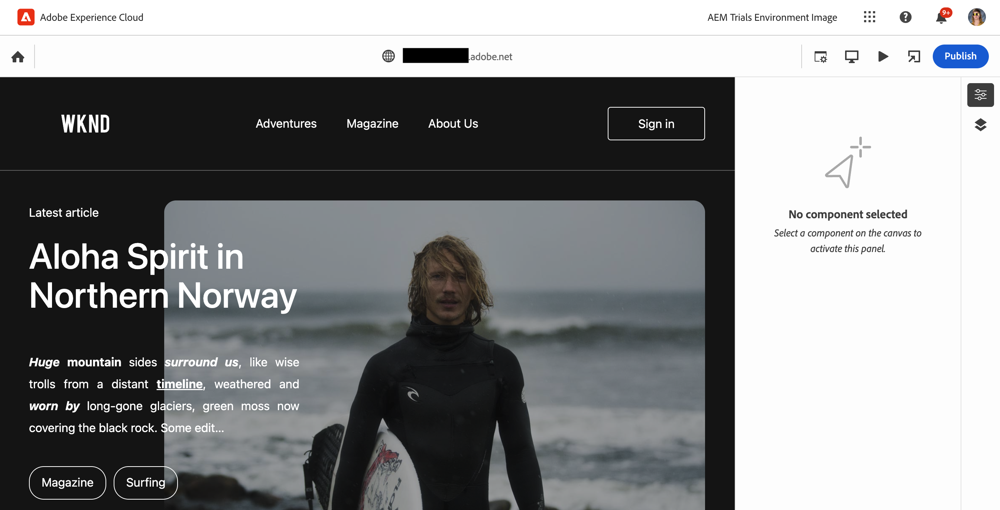
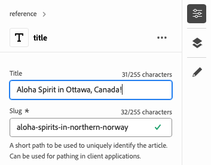
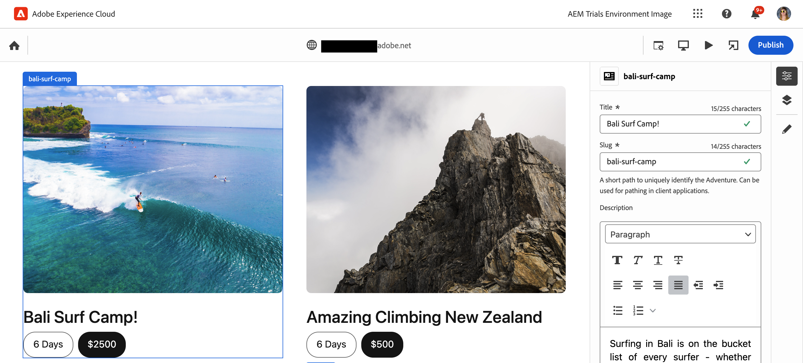

# Inhoud ontwerpen met de Universal Editor {#authoring}

Leer hoe gemakkelijk en intuïtief het is voor inhoudsauteurs om inhoud tot stand te brengen gebruikend de Universele Redacteur.

{{universal-editor-status}}

## Inleiding {#introduction}

Met de Universal Editor kunt u elk aspect van elke inhoud in een implementatie bewerken, zodat u uitzonderlijke ervaringen kunt bieden, de snelheid van de inhoud kunt verhogen en een geavanceerde ontwikkelaarservaring kunt bieden.

Hiervoor verschaft de Universal Editor de auteur van inhoud een intuïtieve gebruikersinterface die minimale training vereist om eenvoudig in de inhoud te kunnen springen en beginnen met het bewerken ervan. In dit document wordt de auteurservaring van de Universal Editor beschreven.

>[!TIP]
>
>Voor een meer gedetailleerde inleiding aan de Universele Redacteur, zie het document [ Universele Inleiding van de Redacteur.](introduction.md)

## De app voorbereiden {#prepare-app}

Als u inhoud voor een app wilt ontwerpen met de Universal Editor, moet de app van instrumenten zijn voorzien door een ontwikkelaar om de editor te ondersteunen.

>[!TIP]
>
>Zie [ Begonnen het Worden met de Universele Redacteur in AEM ](getting-started.md) voor een voorbeeld van hoe te om een AEM te vormen app om met de Universele Redacteur te werken.

## Aanmelden {#sign-in}

Meld u aan bij de Universal Editor nadat de app van instrumenten is voorzien om te werken met de Universal Editor. U hebt een Adobe ID nodig om binnen te ondertekenen en [ heeft toegang tot de Universele Redacteur.](getting-started.md#request-access)

Nadat u binnen wordt ondertekend, ga URL van de pagina in u in de [ plaatsbar wilt uitgeven.](#location-bar) zodat kunt u beginnen inhoud zoals [ tekstinhoud ](#text-mode) uit te geven of [ media inhoud.](#media-mode)

## De gebruikersinterface begrijpen {#ui}

De interface is verdeeld in deze hoofdgebieden.

* [De koptekst van het Experience Cloud](#experience-cloud-header)
* [De werkbalk van de Universal Editor](#universal-editor-toolbar)
* [De editor](#editor)
* [De eigenschappen per spoor](#properties-rail)

### De koptekst van het Experience Cloud {#experience-cloud-header}

De koptekst van het Experience Cloud bevindt zich altijd boven aan het scherm. Het is een anker dat u vertelt waar u binnen Experience Cloud bent en u helpt aan andere Experience Cloud apps navigeren.

#### Experience Manager {#experience-manager}

Selecteer de verbinding van Adobe Experience Cloud bij de linkerzijde van de kopbal om aan de wortel van uw oplossing van de Experience Manager te navigeren om tot hulpmiddelen zoals [ Cloud Manager, ](/help/onboarding/cloud-manager-introduction.md) [ Cloud Acceleration Manager, ](/help/journey-migration/cloud-acceleration-manager/introduction/overview-cam.md) en [ de Distributie van de Software toegang te hebben.](https://experienceleague.adobe.com/docs/experience-cloud/software-distribution/home.html)

#### Organisatie {#organization}

Hier wordt de organisatie weergegeven waarmee u momenteel bent aangemeld. Schakel deze optie in om over te schakelen naar een andere organisatie als uw Adobe ID aan meerdere organisaties is gekoppeld.

#### Oplossingen {#solutions}

Als u op de schakeloptie voor oplossingen tikt of erop klikt, kunt u snel naar andere oplossingen voor Experiencen Cloud gaan.

#### Help {#help}

Met het Help-pictogram hebt u snel toegang tot leermiddelen en ondersteuningsbronnen.

#### Meldingen {#notifications}

Dit pictogram is badged met het aantal momenteel toegewezen onvolledige [ berichten.](/help/implementing/cloud-manager/notifications.md)

#### Gebruikerseigenschappen {#user-properties}

Selecteer het pictogram dat uw gebruiker vertegenwoordigt om tot uw gebruikersmontages toegang te hebben. Als u geen gebruikersbeeld hebt gevormd, wordt een pictogram willekeurig toegewezen.

### De werkbalk Universele editor {#universal-editor-toolbar}

De Universal Editor-werkbalk bevindt zich altijd boven aan het scherm net onder [ de koptekst van het Experience Cloud.](#experience-cloud-header) Hiermee kunt u snel naar een andere pagina navigeren om de huidige pagina te bewerken en te publiceren.

#### De knop Home {#home-button}

Met de knop Home keert u terug naar de startpagina van de Universal Editor

Op de startpagina kunt u de URL invoeren van de site die u wilt bewerken met de Universal Editor.

>[!NOTE]
>
>Om het even welke pagina die u met de Universele Redacteur wilt uitgeven moet [ van instrumenten worden voorzien om de Universele Redacteur te steunen.](getting-started.md)

#### Locatiebalk {#location-bar}

Op de locatiebalk ziet u het adres van de pagina die u bewerkt. Selecteer deze optie om het adres in te voeren van een andere pagina die u wilt bewerken.

>[!TIP]
>
>Open de adresbalk met de sneltoets `L` .

>[!NOTE]
>
>Om het even welke pagina die u met de Universele Redacteur wilt uitgeven moet [ van instrumenten worden voorzien om de Universele Redacteur te steunen.](getting-started.md)

#### Instellingen voor verificatiekoptekst {#authentication-settings}

Selecteer het de montagespictogram van de authentificatiekop als u een kopbal van de douaneauthentificatie voor lokale ontwikkelingsdoeleinden moet [ plaatsen.](/help/implementing/universal-editor/developer-overview.md#auth-header)

#### Emulatorinstellingen {#emulator}

Selecteer het emulatiepictogram om te bepalen hoe de Universal Editor de pagina weergeeft.

Als u op het emulatiepictogram tikt of erop klikt, worden de opties weergegeven.

Standaard wordt de editor geopend in de computerlay-out, waarbij de hoogte en breedte automatisch door de browser worden gedefinieerd.

U kunt er ook voor kiezen om een mobiel apparaat te emuleren en in de Universele Editor:

* De oriëntatie definiëren
* Breedte en hoogte definiëren
* De richting wijzigen

#### Voorvertoningsmodus {#preview-mode}

In voorproefwijze, de pagina die in de redacteur wordt teruggegeven zoals het op uw gepubliceerde dienst zou worden gezien. Hierdoor kan de auteur van de inhoud door de inhoud navigeren door op koppelingen te klikken, enzovoort.

>[!TIP]
>
>Met de sneltoets `P` kunt u schakelen van en naar de voorvertoningsmodus.

#### App-voorvertoning openen {#open-app-preview}

Selecteer het pictogram voor de voorvertoning van de geopende app om de pagina die u momenteel bewerkt te openen op een eigen browsertabblad, zodat de editor geen voorvertoning van uw inhoud kan weergeven.

>[!TIP]
>
>Gebruik de sneltoets `O` (de letter O) om de voorvertoning van de app te openen.

#### Publish {#publish}

Selecteer de knop Publiceren zodat u de wijzigingen in de inhoud live kunt publiceren voor gebruik door de lezers.

>[!TIP]
>
>Zie het document [ het Publiceren Inhoud met de Universele Redacteur ](publishing.md) voor meer informatie bij het publiceren met de Universele Redacteur.

### De Editor {#editor}

De redacteur bezet het grootste deel van het venster en is waar de pagina die in [ wordt gespecificeerd de plaatsbar ](#location-bar) wordt teruggegeven.

Als de redacteur op [ voorproefwijze is, ](#preview-mode) zal de inhoud navigeerbaar zijn en u kunt verbindingen volgen, maar u kunt niet de inhoud uitgeven.

### Eigenschappenspoorlijn {#properties-rail}

De eigenschap rail is altijd aanwezig langs de rechterkant van de redacteur. Afhankelijk van de modus, kunnen er details worden weergegeven voor een component die is geselecteerd in de inhoud of de hiërarchie van de pagina-inhoud.

#### Eigenschappenmodus {#properties-mode}

In de modus Eigenschappen toont de rail de eigenschappen van de component die momenteel in de editor is geselecteerd. Dit is de standaardmodus van de eigenschap rail wanneer een pagina wordt geladen.

Afhankelijk van het type component dat u selecteert, kunnen details worden weergegeven en gewijzigd in de eigenschappenrails.

Niet alle componenten hebben details die kunnen worden getoond en/of worden uitgegeven.

>[!TIP]
>
>Gebruik de sneltoets `D` om over te schakelen naar de modus Eigenschappen.

#### Modus Inhoudsstructuur {#content-tree-mode}

In de modus Inhoudsboomstructuur wordt in de rails de hiërarchie van de pagina-inhoud weergegeven.

Wanneer het selecteren van een punt in de inhoudsboom, scrolt de redacteur aan die inhoud en selecteert het.

>[!TIP]
>
>Gebruik de hete sleutel `F` om over te schakelen op de modus van de inhoudstructuur.

##### Bewerken {#edit}

Tijdens het bewerken worden de opties voor de geselecteerde component weergegeven in de eigenschappenbalk, waar u de geselecteerde component kunt bewerken. Als de geselecteerde component een inhoudsfragment is, kunt u ook de knop Bewerken selecteren.

 uit

Tapping of het klikken van uitgeven knoop opent de [ redacteur van het Fragment van de Inhoud ](/help/assets/content-fragments/content-fragments-managing.md#opening-the-fragment-editor) in een nieuw lusje. Hierdoor hebt u toegang tot alle mogelijkheden van de Content Fragment Editor om het bijbehorende Content Fragment te bewerken.

Afhankelijk van de behoeften van uw workflow wilt u het inhoudsfragment wellicht bewerken in de universele editor of rechtstreeks in de editor voor inhoudsfragmenten.

>[!TIP]
>
>Gebruik de sneltoets `E` om een geselecteerde component te bewerken.

##### Toevoegen {#add}

Als u een containercomponent selecteert in de inhoudsstructuur of in de editor, wordt de optie Toevoegen weergegeven op de eigenschappenrails.

 toe

Het tikken of het klikken van toevoegen knoop opent een drop-down menu van componenten die beschikbaar zijn aan [ toevoegen aan de geselecteerde container.](#adding-components)

 toe

>[!TIP]
>
>Gebruik de sneltoets `A` om een component aan een geselecteerde containercomponent toe te voegen.

##### Verwijderen {#delete}

Als u een component binnen een containercomponent selecteert in de inhoudsstructuur of in de editor, wordt de verwijderingsoptie weergegeven op de eigenschappenrails.

Tapping of het klikken van de schrappingsknoop [ schrapt de component.](#deleting-components)

>[!TIP]
>
>Gebruik de sneltoets `Shift+Backspace` om een geselecteerde component uit een container te verwijderen.

## Inhoud bewerken {#editing-content}

Inhoud bewerken is eenvoudig en intuïtief. Terwijl u de muis over de inhoud in de editor beweegt, wordt bewerkbare inhoud gemarkeerd met een blauw vak.

>[!TIP]
>
>Door gebrek, selecteert het tikken of het klikken op inhoud het voor het uitgeven. Als u uw inhoud door verbindingen wilt navigeren, schakelaar aan [ voorproefwijze.](#preview-mode)

Afhankelijk van de inhoud u selecteert, kunt u verschillende op zijn plaats het uitgeven opties hebben en u kunt extra informatie en opties voor de inhoud in het [ eigenschappen spoor.](#properties-rail)

### Onbewerkte tekst bewerken {#edit-plain-text}

U kunt de tekst op zijn plaats bewerken door te dubbelklikken op de component of erop te dubbeltikken.

Druk op Enter/Return of selecteer buiten het tekstvak om uw wijzigingen op te slaan.

Wanneer u ervoor kiest om de tekstcomponent te selecteren, worden de details weergegeven in de eigenschappen rail. U kunt de tekst ook in de rails bewerken.

De details van uw tekst zijn ook beschikbaar in de eigenschappen rail. Wijzigingen worden automatisch opgeslagen als de focus het bewerkte veld verlaat in de eigenschappenrails.

### RTF-tekst bewerken {#edit-rich-text}

U kunt de tekst op zijn plaats bewerken door te dubbelklikken op de component of erop te dubbeltikken.

Voor uw gemak zijn opmaakopties en details op uw tekst beschikbaar op twee plaatsen.

* Het **contextmenu** opent boven het rijke tekstblok en biedt basishet formatteren opties in context aan. Vanwege ruimtebeperkingen kunnen sommige opties achter de knop voor ovaal worden verborgen.
* De **eigenschappen spoorstaaf** toont alle het formatteren opties beschikbaar samen met de tekst.

Wijzigingen worden automatisch opgeslagen als de focus het bewerkte veld verlaat.

### Media bewerken {#edit-media}

U kunt de details bekijken in de eigenschappen rail.

1. Tik of klik op de voorvertoning van de geselecteerde afbeelding in de eigenschappenbalk.
1. Het [ activa selecteur ](/help/assets/asset-selector.md#using-asset-selector) venster opent om u toe te staan om activa te selecteren.
1. Selecteer deze optie om een nieuw element te selecteren.
1. Selecteer **Uitgezochte** om aan eigenschappen spoor terug te keren waar de activa werd vervangen.

Wijzigingen worden automatisch in de inhoud opgeslagen.

### Inhoudsfragmenten bewerken {#edit-content-fragment}

Als u a [ het Fragment van de Inhoud selecteert, ](/help/sites-cloud/administering/content-fragments/overview.md) kunt u zijn details in de eigenschappen spoorstaaf uitgeven.

De velden die zijn gedefinieerd in het inhoudsmodel van het geselecteerde inhoudsfragment, worden weergegeven en kunnen worden bewerkt in de eigenschappenbalk.

Als u een veld selecteert dat verwant is aan een inhoudsfragment, wordt het inhoudsfragment in de componentrail geladen en wordt het veld automatisch naar het veld geschoven.

Wijzigingen worden automatisch opgeslagen als de focus het bewerkte veld verlaat in de eigenschappenrails.

Als u uw Fragment van de Inhoud in de [ redacteur van het Fragment van de Inhoud ](/help/sites-cloud/administering/content-fragments/authoring.md) in plaats daarvan wilt uitgeven, klik [ uitgeven knoop ](#edit) op de wijzeregel.

Afhankelijk van de behoeften van uw workflow wilt u het inhoudsfragment wellicht bewerken in de universele editor of rechtstreeks in de editor voor inhoudsfragmenten.

### Componenten toevoegen aan containers {#adding-components}

1. Selecteer een containercomponent in de inhoudsstructuur of in de editor.
1. Selecteer vervolgens het invoegpictogram in de eigenschappenrails.

    toe te voegen

De component wordt opgenomen in de container en kan in de redacteur worden uitgegeven.

>[!TIP]
>
>Gebruik de sneltoets `A` om een component aan de geselecteerde container toe te voegen.

### Componenten uit containers verwijderen {#deleting-components}

1. Selecteer een containercomponent in de inhoudsstructuur of in de editor.
1. Selecteer het chevron-pictogram van de container om de inhoud ervan in de inhoudsstructuur uit te vouwen.
1. Selecteer vervolgens in de inhoudsstructuur een component in de container.
1. Selecteer het verwijderingspictogram in de eigenschappenrails.

   

De geselecteerde component is verwijderd.

>[!TIP]
>
>Gebruik de sneltoets `Shift+Backspace` om de geselecteerde component uit de container te verwijderen.

### Componenten opnieuw ordenen in containers {#reordering-components}

1. Selecteer een containercomponent in de inhoudsstructuur of in de editor.
1. Als niet reeds op [ wijze van de inhoudsboom, ](#content-tree-mode) schakelaar aan het.
1. Selecteer het chevron-pictogram van de container om de inhoud ervan in de inhoudsstructuur uit te vouwen.
1. De greeppictogrammen van de belemmering naast de componenten binnen de container tonen dat u hen kunt herschikken. Sleep de componenten om deze binnen de container opnieuw te ordenen.

   

1. De gesleepte component wordt grijs in de componentstructuur, terwijl de invoegpositie wordt aangeduid met een blauwe lijn. Laat de component los om deze op de nieuwe locatie te plaatsen.

De componenten worden opnieuw gerangschikt in zowel de inhoudsstructuur als de editor

## Inhoud voorvertonen {#previewing-content}

Wanneer u klaar bent met het bewerken van inhoud, wilt u er vaak door navigeren om te zien hoe de inhoud er op andere pagina&#39;s uitziet. Op [ voorproefwijze ](#preview-mode) kunt u verbindingen klikken om uw inhoud te navigeren zoals een lezer. De inhoud wordt in de editor gerenderd zoals deze zou worden gepubliceerd.

In de voorvertoningsmodus reageert de gebruiker op de inhoud door erop te tikken of erop te klikken, net als bij een lezer van de inhoud. Als u de inhoud voor het uitgeven wilt selecteren, knevel uit [ voorproefwijze.](#preview-mode)

## Aanvullende bronnen {#additional-resources}

Zie deze documenten voor meer informatie over de Universal Editor.

* [ het Publiceren Inhoud met de Universele Redacteur ](publishing.md) - leer hoe de Universele Redacteur inhoud publiceert en hoe uw apps de gepubliceerde inhoud kunnen behandelen.
