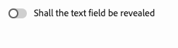

# De universele editor aanpassen {#customizing}

Leer over de verschillende opties om de Universele Redacteur aan te passen om de behoeften van uw inhoudsauteurs te steunen.

>[!TIP]
>
>De Universele Redacteur biedt ook vele [&#x200B; uitbreidingspunten aan, &#x200B;](/help/implementing/universal-editor/extending.md) toestaand u om zijn functionaliteit uit te breiden om aan uw projectbehoeften te voldoen.

## Publiceren uitschakelen {#disable-publish}

Voor bepaalde ontwerpworkflows moet de inhoud worden gecontroleerd voordat deze wordt gepubliceerd. In dergelijke situaties mag de optie om te publiceren niet beschikbaar zijn voor auteurs.

De **publiceer** knoop kan daarom volledig in app worden onderdrukt door de volgende meta-gegevens toe te voegen.

```html
<meta name="urn:adobe:aue:config:disable" content="publish"/>
```

## Publiceren uitschakelen voor voorvertoning {#publish-preview}

Bepaalde auteurswerkschema&#39;s zouden de publicatie aan de [&#x200B; voorproefdienst &#x200B;](/help/sites-cloud/authoring/sites-console/previewing-content.md) (als beschikbaar) kunnen uitsluiten.

De **optie van de Voorproef** in publiceer venster kan daarom volledig in app worden onderdrukt door de volgende meta-gegevens toe te voegen.

```html
<meta name="urn:adobe:aue:config:disable" content="publish-preview"/>
```

## Openingspagina uitschakelen {#open-page}

De **Open knoop van de Pagina** kan volledig in app worden onderdrukt door de volgende meta-gegevens toe te voegen.

```html
<meta name="urn:adobe:aue:config:disable" content="header-open-page" />
```

## Knop Dupliceren uitschakelen {#duplicate-button}

Het is mogelijk dat bepaalde ontwerpwerkstromen de mogelijkheid van de auteur van de inhoud om componenten te dupliceren moeten beperken. U kunt het [&#x200B; dubbele pictogram &#x200B;](/help/sites-cloud/authoring/universal-editor/navigation.md#duplicate) onbruikbaar maken door de volgende meta-gegevens toe te voegen.

```html
<meta name="urn:adobe:aue:config:disable" content="duplicate"/>
```

## Kopiëren en plakken uitschakelen {#copy-paste}

Het is mogelijk dat bepaalde ontwerpwerkstromen de mogelijkheid van de auteur van de inhoud om componenten te kopiëren en plakken moeten beperken. U kunt de [&#x200B; exemplaar en deegpictogrammen &#x200B;](/help/sites-cloud/authoring/universal-editor/authoring.md#copy-paste) onbruikbaar maken door de volgende meta-gegevens toe te voegen.

```html
<meta name="urn:adobe:aue:config:disable" content="copy"/>
```

## Het veranderen van Uw Eindpunt {#custom-endpoint}

Als u de Universal Editor-service, die door Adobe wordt gehost, maar uw eigen gehoste versie niet wilt gebruiken, kunt u dit instellen in een metatag. Gelieve te zien het document [&#x200B; Begonnen het worden met de Universele Redacteur in AEM &#x200B;](/help/implementing/universal-editor/getting-started.md##configuration-settings) voor details.

## Componenten filteren {#filtering-components}

U kunt de toegestane componenten per container in de Universele Redacteur beperken gebruikend componentenfilters. Gelieve te zien het document [&#x200B; Filtrerend Componenten &#x200B;](/help/implementing/universal-editor/filtering.md) voor meer informatie.

## Componenten voorwaardelijk tonen en verbergen in deelvenster Eigenschappen {#conditionally-hide}

Hoewel een component of componenten doorgaans beschikbaar zijn voor de auteurs, kunnen er bepaalde situaties zijn waarin dit geen nut heeft. In dergelijke gevallen, kunt u componenten in het eigenschappen paneel verbergen door a `condition` attributen aan de [&#x200B; gebieden van het componentenmodel &#x200B;](/help/implementing/universal-editor/field-types.md#fields) toe te voegen.

De voorwaarden kunnen worden bepaald gebruikend [&#x200B; schema JsonLogic &#x200B;](https://jsonlogic.com/). Als de voorwaarde waar is, wordt het veld weergegeven. Als de voorwaarde onwaar is, wordt het veld verborgen.

>[!BEGINTABS]

>[!TAB  Model van de Steekproef ]

```json
 {
    "id": "conditionally-revealed-component",
    "fields": [
      {
        "component": "boolean",
        "label": "Shall the text field be revealed?",
        "name": "reveal",
        "valueType": "boolean"
      },
      {
        "component": "text-input",
        "label": "Hidden text field",
        "name": "hidden-text",
        "valueType": "string",
        "condition": { "===": [{"var" : "reveal"}, true] }
      }
    ]
 }
```

>[!TAB  Onwaar van de Voorwaarde ]



>[!TAB  de Toestand van 0&rbrace; Waar &lbrace;]


>[!ENDTABS]

## Aangepaste voorbeeld-URL&#39;s {#custom-preview-urls}

U kunt een douanevoorproef URL via a `urn:adobe:aue:config:preview` metaconfiguratie specificeren, die wanneer het klikken van de **Open pagina** knoop in de [&#x200B; top-right toolbar van de redacteur &#x200B;](/help/sites-cloud/authoring/universal-editor/navigation.md#universal-editor-toolbar) zal openen.

Hiervoor neemt u gewoon de gewenste voorvertoning-URL op in een metatag van de van instrumenten voorziene app, zoals in het volgende voorbeeld.

```html
<meta name="urn:adobe:aue:config:preview" content="https://wknd.site"/>
```
