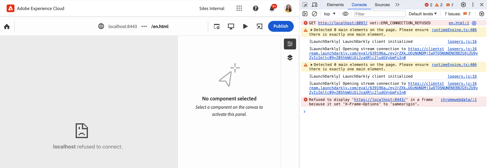

# Overzicht van de universele editor voor AEM ontwikkelaars {#developer-overview}

Als u een AEM ontwikkelaar bent geïnteresseerd in hoe de Universele Redacteur werkt en hoe te om het in uw project te gebruiken, geeft dit document u een inleiding van begin tot eind door u door het van instrumenten voorzien van instrumenten te leiden het WKND project om met de Universele Redacteur te werken.

## Doel {#purpose}

Dit document fungeert als een inleiding van ontwikkelaars op zowel de manier waarop de Universal Editor werkt als de manier waarop u uw toepassing kunt afstemmen op het werken ermee.

Het doet dit door een standaardvoorbeeld te nemen dat de meeste AEM ontwikkelaars met, de Componenten van de Kern en de plaats WKND vertrouwd zijn, en instrumenten een paar voorbeeldcomponenten om bewerkbaar te zijn gebruikend de Universele redacteur.

>[!TIP]
>
>Dit document neemt extra stappen om te illustreren hoe de Universele Redacteur werkt en is bedoeld om het begrip van de ontwikkelaar van de redacteur te verdiepen. Het is dus niet de meest directe manier om een app van instrumenten te voorzien, maar de meest illustratieve van de Universal Editor en hoe deze werkt.
>
>Als u omhoog-en-lopende zo snel mogelijk wilt worden, gelieve [ te zien die met de Universele Redacteur in AEM ](/help/implementing/universal-editor/getting-started.md) document wordt begonnen.

## Vereisten {#prerequisites}

Om dit overzicht te volgen, hebt u het volgende beschikbaar nodig.

* [ een lokale ontwikkelingsinstantie van AEM as a Cloud Service ](https://experienceleague.adobe.com/docs/experience-cloud/software-distribution/home.html)
   * Uw lokale ontwikkelingsinstantie moet [ worden gevormd met HTTPS voor ontwikkelingsdoel op `localhost` ](https://experienceleague.adobe.com/docs/experience-manager-learn/foundation/security/use-the-ssl-wizard.html).
   * [ De WKND demoplaats moet ](https://github.com/adobe/aem-guides-wknd) worden geïnstalleerd.
* [ Toegang tot de Universele Redacteur ](/help/implementing/universal-editor/getting-started.md#onboarding).
* [ de lokale Universele dienst van de Redacteur van A ](/help/implementing/universal-editor/local-dev.md) lopend voor ontwikkelingsdoeleinden.
   * Zorg ervoor om uw browser aan [ te leiden goedkeurt de lokale diensten zelf-ondertekend certificaat ](/help/implementing/universal-editor/local-dev.md#editing).

Afgezien van de algemene kennis van webontwikkeling, gaat dit document uit van basiskennis van AEM ontwikkeling. Als u niet met AEM ontwikkeling wordt ervaren, overweeg het herzien van [ het leerprogramma WKND alvorens ](/help/implementing/developing/introduction/develop-wknd-tutorial.md) verder te gaan.

## AEM starten en aanmelden bij de Universal Editor {#sign-in}

Als u niet reeds hebt, moet u uw lokale AEM ontwikkelingsinstantie hebben die met geïnstalleerde WKND en HTTPS loopt die als [ worden toegelaten in de eerste vereisten ](#prerequisites) wordt gedetailleerd. In dit overzicht wordt ervan uitgegaan dat de instantie wordt uitgevoerd op `https://localhost:8443` .

1. Open de hoofdstramienpagina voor de WKND-Engelse taal in de AEM Editor.

   ```text
   https://localhost:8443/editor.html/content/wknd/language-masters/en.html
   ```

1. In het **menu van de Informatie van de Pagina** van de redacteur, uitgezochte **Mening zoals Gepubliceerd**. Hierdoor wordt dezelfde pagina op een nieuw tabblad geopend en is de AEM Editor uitgeschakeld.

   ```text
   https://localhost:8443/content/wknd/language-masters/en.html?wcmmode=disabled
   ```

1. Kopieer deze koppeling.

1. Meld u nu aan bij de Universal Editor.

   ```text
   https://experience.adobe.com/#/aem/editor
   ```

1. Plak de verbinding die u eerder van de inhoud WKND in het **gebied van de Plaats URL** van de Universele Redacteur kopieerde en **Open** klik.

   

## De universele editor probeert de inhoud te laden {#sameorigin}

De Universal Editor laadt inhoud die in een frame moet worden bewerkt. AEM standaardinstellingen voor X-Frame-opties worden niet ingeschakeld. Dit kan in de browser duidelijk als een fout worden beschouwd en in de consoleuitvoer worden beschreven wanneer u probeert uw lokale kopie van WKND te laden.



Met de optie X-frame `sameorigin` voorkomt u dat AEM pagina&#39;s in een frame worden weergegeven. U moet deze koptekst verwijderen om de pagina&#39;s te kunnen laden in de Universal Editor.

1. Open de Manager van de Configuratie.

   ```text
   https://localhost:8443/system/console/configMgr
   ```

1. De OSGi-configuratie bewerken `org.apache.sling.engine.impl.SlingMainServlet`

   

1. Schrap het bezit `X-Frame-Options=SAMEORIGIN` van het bezit **Extra reactiekopballen**.

1. Sla de wijzigingen op.

Als u nu de Universal Editor opnieuw laadt, ziet u dat de AEM pagina wordt geladen.

>[!TIP]
>
>* Zie het document [ Begonnen Worden met de Universele Redacteur in AEM ](/help/implementing/universal-editor/getting-started.md#sameorigin) voor meer details op deze configuratie OSGi.
>* Zie het document [ Vormend OSGi voor Adobe Experience Manager as a Cloud Service ](/help/implementing/deploying/configuring-osgi.md) voor details over OSGi in AEM.

## Zelfde sitecookies verwerken {#samesite-cookies}

Wanneer de Universal Editor uw pagina laadt, wordt deze geladen op de AEM aanmeldpagina om ervoor te zorgen dat u geverifieerd bent om wijzigingen aan te brengen.

U kunt zich echter niet aanmelden. Als u de browserconsole weergeeft, ziet u dat de browser invoer in het frame heeft geblokkeerd


Het inlogtoken-cookie wordt als een extern domein naar AEM verzonden. Daarom moeten cookies op dezelfde locatie in AEM worden toegestaan.

1. Open de Manager van de Configuratie.

   ```text
   https://localhost:8443/system/console/configMgr
   ```

1. De OSGi-configuratie bewerken `com.day.crx.security.token.impl.impl.TokenAuthenticationHandler`

   

1. Verander het bezit **attribuut SameSite voor het login-symbolische koekje** aan `None`.

1. Sla de wijzigingen op.

Als u de Universal Editor nu opnieuw laadt, kunt u zich nu aanmelden bij AEM en wordt de doelpagina geladen.

>[!TIP]
>
>* Zie het document [ Begonnen Worden met de Universele Redacteur in AEM ](/help/implementing/universal-editor/getting-started.md#samesite-cookies) voor meer details op deze configuratie OSGi.
>* Zie het document [ Vormend OSGi voor Adobe Experience Manager as a Cloud Service ](/help/implementing/deploying/configuring-osgi.md) voor details over OSGi in AEM.

## Universele editor maakt verbinding met het externe frame {#ue-connect-remote-frame}

Wanneer de pagina in de Universal Editor is geladen en u zich hebt aangemeld bij AEM, probeert de Universal Editor verbinding te maken met het externe frame. Dit gebeurt via een JavaScript-bibliotheek die in het externe frame moet worden geladen. Als de JavaScript-bibliotheek niet aanwezig is, maakt de pagina uiteindelijk een time-outfout in de console.


U moet de benodigde JavaScript-bibliotheek toevoegen aan de paginacomponent van de WKND-app.

1. Open CRXDE Lite.

   ```text
   https://localhost:8443/crx/de
   ```

1. Bewerk het bestand `customheaderlibs.html` onder `/apps/wknd/components/page` .

   

1. Voeg de JavaScript-bibliotheek toe aan het einde van het bestand.

   ```html
   <script src="https://universal-editor-service.adobe.io/cors.js" async></script>
   ```

1. Klik **sparen allen** en laad dan de Universele Redacteur opnieuw.

De pagina wordt nu geladen met de juiste JavaScript-bibliotheek zodat de Universal Editor verbinding kan maken met uw pagina en de time-outfout wordt niet meer weergegeven in de console.

>[!TIP]
>
>* De bibliotheek kan in de kop- of voettekst worden geladen.

>[!NOTE]
>
>De eerder aanbevolen methode voor het opnemen van de JavaScript-bibliotheek `<script src="https://universal-editor-service.experiencecloud.live/corslib/LATEST"></script>` of via npmjs.com wordt niet meer aanbevolen, omdat het pakket is vervangen.
>
>Als een toepassing het vervangen pakket nog steeds gebruikt, geeft de Universal Editor een waarschuwing in de UI weer dat een verouderd pakket wordt gedetecteerd.

## Een verbinding definiëren om wijzigingen te behouden {#connection}

De WKND-pagina wordt nu geladen in de Universal Editor en de JavaScript-bibliotheek wordt geladen om de editor aan uw app te koppelen.

U ziet waarschijnlijk echter dat u niet kunt communiceren met de pagina in de Universal Editor. De Universal Editor kan uw pagina niet bewerken. Als u wilt dat de Universal Editor uw inhoud kan bewerken, moet u een verbinding definiëren zodat deze weet waar de inhoud moet worden geschreven. Voor lokale ontwikkeling moet u terugschrijven naar uw lokale AEM-ontwikkelingsinstantie op `https://localhost:8443` .

1. Open CRXDE Lite.

   ```text
   https://localhost:8443/crx/de
   ```

1. Bewerk het bestand `customheaderlibs.html` onder `/apps/wknd/components/page` .

   

1. Voeg de benodigde metagegevens voor de verbinding met uw lokale AEM-instantie toe aan het einde van het bestand.

   ```html
   <meta name="urn:adobe:aue:system:aem" content="aem:https://localhost:8443">
   ```

   * De nieuwste versie van de bibliotheek wordt altijd aanbevolen. Als u een vroegere versie nodig hebt, te zien gelieve het document [ Begonnen Worden met de Universele Redacteur in AEM ](/help/implementing/universal-editor/getting-started.md#alternative).

1. Voeg de vereiste metagegevens toe voor de verbinding met uw lokale Universal Editor-service aan het einde van het bestand.

   ```html
   <meta name="urn:adobe:aue:config:service" content="https://localhost:8000">
   ```

1. Klik **sparen allen** en laad dan de Universele Redacteur opnieuw.

Nu kan de Universele Redacteur niet alleen uw inhoud met succes van uw lokale AEM ontwikkelingsinstantie laden, maar weet ook waar te om het even welke veranderingen aan te houden u gebruikend uw lokale Universele dienst van de Redacteur aanbrengt. Dit is de eerste stap in het van instrumenten voorzien van uw app om met de Universele Redacteur editable te zijn.

>[!TIP]
>
>* Zie het document [ Begonnen Worden met de Universele Redacteur in AEM ](/help/implementing/universal-editor/getting-started.md#connection) voor meer details over de verbindingsmeta-gegevens.
>* Zie het document [ Universele Architectuur van de Redacteur ](/help/implementing/universal-editor/architecture.md#service) voor meer details over de structuur van de Universele Redacteur.
>* Zie het document [ Lokale Ontwikkeling AEM met de Universele Redacteur ](/help/implementing/universal-editor/local-dev.md) voor meer details over hoe te met een zelf-ontvangen versie van de Universele Redacteur te verbinden.

## Instrumentele onderdelen {#instrumenting-components}

U ziet echter waarschijnlijk dat u nog steeds weinig kunt doen met de Universal Editor. Als u probeert om het gummetje bij de bovenkant van de WKND-pagina in de Universele Redacteur te klikken, kunt u het niet echt selecteren (of iets anders op de pagina).

Uw componenten moeten ook van instrumenten voorzien zijn om met de Universele Redacteur editable te zijn. Hiervoor moet u de lasercomponent bewerken. Daarom moet u de Core Components bedekken aangezien de Componenten van de Kern onder `/libs` zijn, wat onveranderlijk is.

1. Open CRXDE Lite.

   ```text
   https://localhost:8443/crx/de
   ```

1. Selecteer de knoop `/libs/core/wcm/components` en klik **Knoop van de Bedekking** op de toolbar.

1. Met `/apps/` geselecteerd als **de Plaats van de Bedekking**, klik **O.K.**.

   

1. Selecteer de `teaser` knoop onder `/libs/core/wcm/components` en klik **Exemplaar** in de toolbar.

1. Selecteer de bedekte knoop bij `/apps/core/wcm/components` en klik **Deeg** in de toolbar.

1. Dubbelklik op het bestand `/apps/core/wcm/components/teaser/v2/teaser/teaser.html` om het te bewerken.

   

1. Voeg aan het einde van de eerste `div` bij ongeveer regel 26 de instrumentatiedetails voor de component toe.

   ```text
   data-aue-resource="urn:aem:${resource.path}"
   data-aue-type="component"
   data-aue-label="Teaser"
   ```

1. Klik **sparen allen** in de toolbar en herlaad de Universele Redacteur.

1. Klik in de Universal Editor op de tasercomponent boven aan de pagina en controleer of u deze nu kunt selecteren.

1. Als u het **pictogram van de boom van de Inhoud** in het eigenschappenpaneel van de Universele Redacteur klikt, kunt u zien dat de redacteur alle tellers op de pagina erkende nu dat u het van instrumenten voorzien hebt. Het geselecteerde tasje is gemarkeerd.

   

>[!TIP]
>
>Zie het document [ Gebruikend de Verzameling van het Middel in Adobe Experience Manager as a Cloud Service ](/help/implementing/developing/introduction/sling-resource-merger.md) voor meer details over het bedekken van knopen.

## Instrumentsubcomponenten van de taser {#subcomponents}

U kunt het gummetje nu selecteren, maar nog steeds niet bewerken. Dit komt doordat het gummetje een samenstelling is van verschillende componenten, zoals de component image en title. U moet deze subcomponenten instrumenten om hen uit te geven.

1. Open CRXDE Lite.

   ```text
   https://localhost:8443/crx/de
   ```

1. Selecteer het knooppunt `/apps/core/wcm/components/teaser/v2/teaser/` en dubbelklik op het bestand `title.html` .

    uit

1. Voeg de volgende eigenschappen in aan het einde van de tag `h2` (bij regel 17).

   ```text
   data-aue-prop="jcr:title"
   data-aue-type="text"
   data-aue-label="Title"
   ```

1. Klik **sparen allen** in de toolbar en herlaad de Universele Redacteur.

1. Klik op de titel van dezelfde lasercomponent boven aan de pagina en controleer of u deze nu kunt selecteren. In de inhoudsstructuur wordt de titel ook weergegeven als onderdeel van de geselecteerde tasercomponent.

   

U kunt nu de titel van de lasercomponent bewerken!

## Wat betekent het allemaal? {#what-does-it-mean}

Nu u de titel van het gummetje kunt bewerken, nemen we even de tijd om te bekijken wat u hebt bereikt en hoe.

U hebt de lasercomponent geïdentificeerd aan de Universele Redacteur door het van instrumenten te voorzien.

* `data-aue-resource` identificeert de bron in AEM die wordt bewerkt.
* `data-aue-type` definieert dat de items moeten worden behandeld als een paginacomponent (in tegenstelling tot een container).
* In `data-aue-label` wordt een gebruiksvriendelijk label weergegeven in de gebruikersinterface voor het geselecteerde gummetje.

U hebt ook de titelcomponent binnen de teaser component van instrumenten voorzien.

* `data-aue-prop` is het JCR-kenmerk dat wordt geschreven.
* `data-aue-type` geeft aan hoe het kenmerk moet worden bewerkt. In dit geval, met de tekstredacteur aangezien het een titel (in tegenstelling tot zeg, de rijke tekstredacteur) is.

## Verificatiekoppen definiëren {#auth-header}

Nu kunt u de titel van het gummetje online bewerken en worden de wijzigingen in de browser doorgevoerd.


Als u de browser echter opnieuw laadt, wordt de vorige titel opnieuw geladen. Hoewel de Universele Redacteur weet hoe te om met uw AEM instantie te verbinden, kan het redacteur aan uw AEM instantie nog niet voor authentiek verklaren om veranderingen in JCR terug te schrijven.

Als u het netwerktabblad van de browsergereedschappen voor ontwikkelaars weergeeft en naar `update` zoekt, wordt een fout van 401 aangetroffen wanneer u de titel probeert te bewerken.


Wanneer u de Universal Editor gebruikt om uw productie AEM inhoud te bewerken, gebruikt de Universal Editor dezelfde IMS-token die u hebt gebruikt om u aan te melden bij de editor voor verificatie om het schrijven naar de JCR te vergemakkelijken.

Wanneer u zich plaatselijk ontwikkelt, kunt u niet de leverancier van de AEM gebruiken aangezien de tokens IMS slechts aan Adobe-bezeten domeinen worden overgegaan. U moet manueel een manier verstrekken om voor authentiek te verklaren door een authentificatiekopbal uitdrukkelijk te plaatsen.

1. In de Universele interface van de Redacteur, klik het **pictogram van de Kopballen van de Authentificatie** in de toolbar.

1. Kopieer in de noodzakelijke authentificatiekopbal om aan uw lokale AEM instantie voor authentiek te verklaren en **te klikken sparen**.

   

1. Laad de Universal Editor opnieuw en bewerk nu de titel van het taser.

Er zijn niet meer om het even welke fouten die in de browser console worden gemeld en de veranderingen worden voortgeduurd terug naar uw lokale AEM ontwikkelingsinstantie.

Als u het verkeer in de browserontwikkelaarsgereedschappen onderzoekt en de `update` -gebeurtenissen zoekt, kunt u de details van de update zien.


```json
{
  "connections": [
    {
      "name": "aem",
      "protocol": "aem",
      "uri": "https://localhost:8443"
    }
  ],
  "target": {
    "resource": "urn:aem:/content/wknd/language-masters/en/jcr:content/root/container/carousel/item_1571954853062",
    "type": "text",
    "prop": "jcr:title"
  },
  "value": "Tiny Toon Adventures"
}
```

* `connections` is de verbinding met uw lokale AEM-instantie
* `target` is de exacte node en eigenschappen die worden bijgewerkt in het JCR
* `value` is de update die u hebt uitgevoerd.

U kunt zien dat de wijziging aanhoudt in het JCR.


>[!TIP]
>
>Er zijn vele hulpmiddelen beschikbaar online om de noodzakelijke authentificatiekopballen voor uw test en ontwikkelingsdoeleinden te produceren.
>
>Het basisvoorbeeld van de verificatieheader `Basic YWRtaW46YWRtaW4=` is voor de combinatie van gebruiker en wachtwoord van `admin:admin` , net als bij lokale AEM.

## De app van instrumenten voorzien voor het deelvenster Eigenschappen {#properties-rail}

U hebt nu een app die van instrumenten is voorzien om te kunnen worden bewerkt met de Universal Editor.

Het bewerken is momenteel beperkt tot het online bewerken van de titel van de taser. Er zijn echter gevallen waarin op plaats bewerken niet voldoende is. Tekst zoals de titel van het gummetje kan worden bewerkt op de plaats waar deze zich bevindt met behulp van het toetsenbord. Nochtans moeten de meer gecompliceerde punten kunnen tonen en het uitgeven van gestructureerde gegevens los van hoe het in browser wordt teruggegeven toestaan. Daar is het deelvenster Eigenschappen voor.

Ga terug naar het koptekstbestand van de paginacomponent van uw app om de app bij te werken zodat deze het deelvenster Eigenschappen kan gebruiken voor bewerking. Dit is waar u reeds de verbindingen aan uw lokale AEM ontwikkelingsinstantie en uw lokale Universele dienst van de Redacteur vestigde. Hier moet u de componenten definiëren die bewerkbaar zijn in de app en de bijbehorende gegevensmodellen.

1. Open CRXDE Lite.

   ```text
   https://localhost:8443/crx/de
   ```

1. Bewerk het bestand `customheaderlibs.html` onder `/apps/wknd/components/page` .

   

1. Voeg aan het einde van het bestand het script toe dat nodig is om de componenten te definiëren.

   ```html
   <script type="application/vnd.adobe.aue.component+json">
   {
     "groups": [
       {
         "title": "General Components",
         "id": "general",
         "components": [
           {
             "title": "Teaser",
             "id": "teaser",
             "plugins": {
               "aem": {
                 "page": {
                   "resourceType": "wknd/components/teaser"
                 }
               }
             }
           },
           {
             "title": "Title",
             "id": "title",
             "plugins": {
               "aem": {
                 "page": {
                   "resourceType": "wknd/components/title"
                 }
               }
             }
           }
         ]
       }
     ]
   }
   </script>
   ```

1. Hieronder voegt u aan het einde van het bestand het script toe dat nodig is om het model te definiëren.

   ```html
   <script type="application/vnd.adobe.aue.model+json">
   [
     {
       "id": "teaser",
       "fields": [
         {
           "component": "text-input",
           "name": "jcr:title",
           "label": "Title",
           "valueType": "string"
         },
         {
           "component": "text-area",
           "name": "jcr:description",
           "label": "Description",
           "valueType": "string"
         }
       ]
     },
     {
       "id": "title",
       "fields": [
         {
           "component": "select",
           "name": "type",
           "value": "h1",
           "label": "Type",
           "valueType": "string",
           "options": [
             { "name": "h1", "value": "h1" },
             { "name": "h2", "value": "h2" },
             { "name": "h3", "value": "h3" },
             { "name": "h4", "value": "h4" },
             { "name": "h5", "value": "h5" },
             { "name": "h6", "value": "h6" }
           ]
         }
       ]
     }
   ]
   </script>
   ```

1. Klik **sparen allen** in de toolbar.

## Wat betekent het allemaal? {#what-does-it-mean-2}

Om bewerkbaar te zijn met het deelvenster Eigenschappen, moeten de componenten worden toegewezen aan `groups` , zodat elke definitie begint als een lijst met groepen die de componenten bevatten.

* `title` is de naam van de groep.
* `id` is de unieke id van de groep, in dit geval algemene componenten waaruit de pagina-inhoud bestaat, in tegenstelling tot bijvoorbeeld geavanceerde componenten voor de paginalay-out.

Elke groep heeft dan een array van `components` .

* `title` is de naam van de component.
* `id` is de unieke id van de component, in dit geval een gummetje.

Elke component heeft dan een insteekmoduledefinitie die bepaalt hoe de component aan AEM in kaart wordt gebracht.

* `aem` is de plug-in die de bewerkingen verwerkt. Dit kan van als dienst worden gedacht die de component verwerkt.
* `page` definieert welk type component het is, in dit geval een standaardpagina-component.
* `resourceType` is de toewijzing aan de daadwerkelijke AEM component.

Elke component moet vervolgens worden toegewezen aan een `model` om de afzonderlijke bewerkbare velden te definiëren.

* `id` is de unieke id van het model, die moet overeenkomen met de id van de component.
* `fields` is een array van de afzonderlijke velden.
* `component` is het invoertype, zoals tekst of tekstgebied.
* `name` is de veldnaam in het JCR waaraan het veld is toegewezen.
* `label` is de beschrijving van het veld dat wordt weergegeven in de gebruikersinterface van de editor.
* `valueType` is het type gegevens.

## De component van instrumenten voorzien voor het paneel van Eigenschappen {#properties-rail-component}

U moet ook definiëren op componentniveau, welk model de component moet gebruiken.

1. Open CRXDE Lite.

   ```text
   https://localhost:8443/crx/de
   ```

1. Dubbelklik op het bestand `/apps/core/wcm/components/teaser/v2/teaser/teaser.html` om het te bewerken.

   

1. Voeg aan het einde van de eerste `div` op ongeveer regel 32, na de eigenschappen die u eerder hebt toegevoegd, de instrumentatiedetails toe voor het model dat de teaser-component gebruikt.

   ```text
   data-aue-model="teaser"
   ```

1. Klik **sparen allen** in de toolbar en herlaad de Universele Redacteur.

Nu kunt u het deelvenster Eigenschappen uittesten dat van instrumenten is voorzien voor uw component.

1. Klik in de Universal Editor op de titel van het gummetje om deze nogmaals te bewerken.

1. Klik op het deelvenster Eigenschappen om het tabblad Eigenschappen weer te geven en de velden weer te geven waarop u net hebt geïnstrueerd.

   

U kunt de titel van het gummetje nu in line bewerken zoals u eerder had, of in het deelvenster Eigenschappen. In beide gevallen worden de wijzigingen doorgevoerd in uw lokale AEM ontwikkelingsexemplaar.

## Extra velden toevoegen aan het deelvenster Eigenschappen {#add-fields}

Met behulp van de basisstructuur van het gegevensmodel voor de component die u al hebt geïmplementeerd, kunt u aanvullende velden toevoegen volgens hetzelfde model.

U kunt bijvoorbeeld een veld toevoegen om de opmaak van de component aan te passen.

1. Open CRXDE Lite.

   ```text
   https://localhost:8443/crx/de
   ```

1. Bewerk het bestand `customheaderlibs.html` onder `/apps/wknd/components/page` .

   

1. In het modeldefinitiescript, voeg een extra punt aan de `fields` serie voor het stijlgebied toe. Vergeet niet na het laatste veld een komma toe te voegen voordat u de nieuwe invoegt.

   ```json
   {
      "component": "select",
      "name": "cq:styleIds",
      "label": "Style",
      "valueType": "string",
        "multi": true,
      "options": [
        {"name": "hero", "value":"1555543212672"},
        {"name": "card", "value":"1605057868937"}
      ]
   }
   ```

1. Klik **sparen allen** in de toolbar en herlaad de Universele Redacteur.

1. Klik op de titel van het gummetje om deze nogmaals te bewerken.

1. Klik op het deelvenster Eigenschappen en controleer of er een nieuw veld is waarin u de stijl van de component kunt aanpassen.

   

Elk veld in het JCR voor de component kan op deze manier worden weergegeven in de Universal Editor.

## Samenvatting {#summary}

Gefeliciteerd! Nu kunt u uw eigen AEM-apps gebruiken om met de Universal Editor te werken.

Wanneer u uw eigen app van instrumenten begint te voorzien, moet u rekening houden met de basisstappen die u in dit voorbeeld hebt uitgevoerd.

1. [ u opstelling uw ontwikkelomgeving ](#prerequisites).
   * AEM die lokaal wordt uitgevoerd op HTTPS terwijl WKND is geïnstalleerd
   * Universal Editor Service die lokaal wordt uitgevoerd op HTTPS
1. U hebt AEM OSGi-instellingen bijgewerkt zodat de inhoud op afstand kan worden geladen.
   * [` org.apache.sling.engine.impl.SlingMainServlet`](#sameorigin)
   * [` com.day.crx.security.token.impl.impl.TokenAuthenticationHandler`](#samesite-cookies)
1. [ u voegde de `universal-editor-embedded.js` bibliotheek aan het `customheaderlibs.html` dossier van de paginacomponent van app ](#ue-connect-remote-frame) toe.
1. [ u bepaalde een verbinding om veranderingen in het `customheaderlibs.html` dossier van de paginacomponent van app ](#connection) voort te zetten.
   * U hebt een verbinding met de lokale AEM-ontwikkelingsinstantie gedefinieerd.
   * U hebt ook een verbinding met de lokale Universal Editor-service gedefinieerd.
1. [ u van instrumenten de teaser component ](#instrumenting-components).
1. [ u van instrumenten de subcomponenten van het meetapparaat ](#subcomponents).
1. [ u bepaalde een kopbal van de douaneauthentificatie zodat kon u veranderingen bewaren gebruikend uw lokale Universele dienst van de Redacteur ](#auth-header).
1. [ u van instrumenten de app om het eigenschappenpaneel ](#properties-rail) te gebruiken.
1. [ u van instrumenten de lasercomponent om het eigenschappen paneel ](#properties-rail-component) te gebruiken.

U kunt dezelfde stappen volgen om uw eigen app te gebruiken met de Universal Editor. Alle eigenschappen in het JCR kunnen worden weergegeven in de Universal Editor.

## Aanvullende bronnen {#additional-resources}

Bekijk de volgende documenten voor meer informatie en details over de functies van de Universal Editor.

* Als u omhoog-en-lopende zo snel mogelijk wilt worden, gelieve [ te zien die met de Universele Redacteur in AEM ](/help/implementing/universal-editor/getting-started.md) document wordt begonnen.
* Zie het document [ Begonnen Worden met de Universele Redacteur in AEM ](/help/implementing/universal-editor/getting-started.md#sameorigin) voor meer details op de noodzakelijke configuraties OSGi.
* Zie het document [ Begonnen Worden met de Universele Redacteur in AEM ](/help/implementing/universal-editor/getting-started.md#connection) voor meer details over de verbindingsmeta-gegevens.
* Zie het document [ Universele Architectuur van de Redacteur ](/help/implementing/universal-editor/architecture.md#service) voor meer details over de structuur van de Universele Redacteur.
* Zie het document [ Lokale Ontwikkeling AEM met de Universele Redacteur ](/help/implementing/universal-editor/local-dev.md) voor meer details over hoe te met een zelf-ontvangen versie van de Universele Redacteur te verbinden.
* Zie het document [ Gebruikend de Verzameling van het Middel in Adobe Experience Manager as a Cloud Service ](/help/implementing/developing/introduction/sling-resource-merger.md) voor meer details over het bedekken van knopen.

