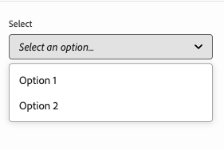

# Modeldefinities, velden en componenttypen {#field-types}

In het deelvenster Eigenschappen vindt u voorbeelden van velden en componenttypen die de Universal Editor kan bewerken. Begrijp hoe u uw eigen app kunt instrumenteren door een modeldefinitie te maken en aan de component te koppelen.

## Overzicht {#overview}

Wanneer u uw eigen toepassingen aanpast voor gebruik met de universele editor, moet u de componenten van instrumenten voorzien en definiëren welke velden en componenttypen ze kunnen manipuleren in het deelvenster Eigenschappen van de editor. U doet dit door een model te creëren en met dat van de component te verbinden.

Dit document biedt een overzicht van een modeldefinitie en van de velden en componenttypen waarover u beschikt, samen met voorbeeldconfiguraties.

>[!TIP]
>
>Als u niet vertrouwd met bent hoe te om uw app voor de Universele Redacteur van een instrument te voorzien, te zien gelieve het document [ Universele Overzicht van de Redacteur voor de Ontwikkelaars van AEM ](/help/implementing/universal-editor/developer-overview.md).

## Modeldefinitiestructuur {#model-structure}

Als u een component wilt configureren via het deelvenster Eigenschappen in de Universal Editor, moet er een modeldefinitie bestaan en aan de component zijn gekoppeld.

De modeldefinitie is een JSON-structuur, te beginnen met een array van modellen.

```json
[
  {
    "id": "model-id",        // must be unique
    "fields": []             // array of fields which shall be rendered in the properties panel
  }
]
```

Zie de **[sectie van Gebieden](#fields)** van dit document voor meer informatie over hoe te om uw `fields` serie te bepalen.

U kunt een model aan een component op twee manieren verbinden: het gebruiken van de [ componentendefinitie ](#component-definition) of [ via de instrumentatie.](#instrumentation)

### Koppelen met gebruik van componentdefinitie {#component-definition}

Dit is de voorkeursmethode voor het koppelen van het model aan de component. Hierdoor kunt u de koppeling centraal behouden in de componentdefinitie en kunt u componenten over containers slepen.

Neem gewoon de eigenschap `model` op in het componentobject in de `components` -array in het `component-definition.json` -bestand.

Voor details, gelieve te zien de document [ Definitie van de Component.](/help/implementing/universal-editor/component-definition.md)

### Koppeling met behulp van instrumentatie {#instrumentation}

Als u de modeldefinitie met een component wilt gebruiken, kunt u het attribuut `data-aue-model` gebruiken.

```html
<div data-aue-resource="urn:datasource:/content/path" data-aue-type="component"  data-aue-model="model-id">Click me</div>
```

>[!NOTE]
>
>De Universele Redacteur controleert eerst of een model via de instrumentatie wordt verbonden en gebruikt dat alvorens de componentendefinitie te controleren. Dit betekent:
>
>* Projecten die de koppeling naar het model via de instrumenten hebben geïmplementeerd, zullen ongewijzigd blijven werken en hoeven niet te worden gewijzigd.
>* Als u het model in de [ componentendefinitie ](#component-definition) evenals in de instrumentatie bepaalt, zal de instrumentatie altijd worden gebruikt.

## Modeldefinitie laden {#loading-model}

Wanneer een model is gemaakt, kan ernaar worden verwezen als een extern bestand.

```html
<script type="application/vnd.adobe.aue.model+json" src="<url-of-model-definition>"></script>
```

U kunt het model ook inline definiëren.

```html
<script type="application/vnd.adobe.aue.model+json">
  { ... model definition ... }
</script>
```

## Velden {#fields}

Een veldobject heeft de volgende typedefinitie.

| Configuratie | Type waarde | Beschrijving | Vereist |
|---|---|---|---|
| `component` | `ComponentType` | Renderer van de component | Ja |
| `name` | `string` | Bezit [ of weg ](#nesting) waar de gegevens zullen worden voortgeduurd | Ja |
| `label` | `FieldLabel` | Label van het veld | Ja |
| `description` | `FieldDescription` | Beschrijving van het veld | Nee |
| `value` | `FieldValue` | Dit is een standaardwaarde die als plaatsaanduiding fungeert. Als er geen waarde is ingesteld, blijft de Universal Editor behouden wat in de modeldefinitie is gedefinieerd als `value` . Dit zorgt ervoor dat wat u ziet zal aanpassen wat in het achterste gedeelte voortduurt. | Nee |
| `valueType` | `ValueType` | Standaardvalidatie, kan `string`, `string[]`, `number`, `date`, `boolean` zijn | Nee |
| `required` | `boolean` | Is het vereiste veld | Nee |
| `readOnly` | `boolean` | Is het veld alleen-lezen | Nee |
| `hidden` | `boolean` | Is het veld standaard verborgen | Nee |
| `condition` | `RulesLogic` | Regel om het gebied te tonen of te verbergen dat op a [ wordt gebaseerd voorwaarde ](/help/implementing/universal-editor/customizing.md#conditionally-hide) | Nee |
| `multi` | `boolean` | Is het gebied een multi gebied <br/> Nota dat container het nesten niet voor multi-gebieden in het eigenschappen paneel wordt toegelaten | Nee |
| `validation` | `ValidationType` | Validatieregel(s) voor het veld | Nee |
| `raw` | `unknown` | Onbewerkte gegevens die door de component kunnen worden gebruikt | Nee |

>[!NOTE]
>
>Het onderstrepingsteken (`_`) is niet toegestaan in veldnamen wanneer de plug-ins [`aem` of `xwalk` worden gebruikt. ](/help/implementing/universal-editor/component-definition.md#plugins)

### naamveld en nesten {#nesting}

Het veld `name` kan rechtstreeks naar een eigenschap van de huidige bron verwijzen, of in het geval van componenten in `cq:Pages` kan het ook een pad naar een geneste eigenschap gebruiken. Bijvoorbeeld:

```json
"name": "teaser/image/fileReference"
```

### Componenttypen {#component-types}

Hieronder vindt u de componenttypen die u kunt gebruiken voor het weergeven van velden.

| Beschrijving | Componenttype |
|---|---|
| [ de Markering van AEM ](#aem-tag) | `aem-tag` |
| [ Inhoud AEM ](#aem-content) | `aem-content` |
| [ Van Boole ](#boolean) | `boolean` |
| [ Checkbox Groep ](#checkbox-group) | `checkbox-group` |
| [ Container ](#container) | `container` |
| [ het Fragment van de Inhoud ](#content-fragment) | `aem-content-fragment` |
| [ Tijd van de Datum ](#date-time) | `date-time` |
| [ Fragment van de Ervaring ](#experience-fragment) | `aem-experience-fragment` |
| [ Multiselect ](#multiselect) | `multiselect` |
| [ Aantal ](#number) | `number` |
| [ Groep van de Keuzerondjes ](#radio-group) | `radio-group` |
| [ Verwijzing ](#reference) | `reference` |
| [ Rijke Tekst ](#rich-text) | `richtext` |
| [ Uitgezocht ](#select) | `select` |
| [ Lusje ](#tab) | `tab` |
| [ Tekst ](#text) | `text` |
| [ Gebied van de Tekst ](#textarea) | `textarea` |

#### AEM-tag {#aem-tag}

Een AEM-tagcomponenttype maakt een AEM-tagkiezer mogelijk, die kan worden gebruikt om tags aan de component te koppelen.

>[!BEGINTABS]

>[!TAB  Steekproef ]

```json
{
  "id": "aem-tag-picker",
  "fields": [
    {
      "component": "aem-tag",
      "label": "AEM Tag Picker",
      "name": "cq:tags",
      "valueType": "string"
    }
  ]
}
```

>[!TAB  Screenshot ]


>[!ENDTABS]

>[!TIP]
>
>Gelieve te zien het document [ Leiden Gegevens van de Taxonomie ](https://www.aem.live/docs/authoring-taxonomy) voor meer informatie over hoe u spreadsheets kunt gebruiken om uw taxonomiegegevens voor uw project van Edge Delivery Services te beheren.

#### AEM Content {#aem-content}

Een AEM-inhoudcomponenttype maakt een AEM-inhoudkiezer mogelijk, die kan worden gebruikt om een willekeurige AEM-bron te selecteren. In tegenstelling tot de [ verwijzingscomponent ](#reference), die slechts activa kan selecteren, kan de de inhoudscomponent van AEM van verwijzingen voorzien de inhoud van AEM. Het biedt een aanvullend validatietype aan.

| Validatietype | Type waarde | Beschrijving | Vereist |
|---|---|---|---|
| `rootPath` | `string` | Het pad dat de inhoudkiezer opent voor de gebruiker om AEM-inhoud te selecteren, waarbij de selectie wordt beperkt tot die map en submappen | Nee |

>[!BEGINTABS]

>[!TAB  Steekproef ]

```json
{
  "id": "aem-content-picker",
  "fields": [
    {
      "component": "aem-content",
      "name": "reference",
      "value": "",
      "label": "AEM Content Picker",
      "valueType": "string",
      "validation": {
            "rootPath": "/content/refresh"
        }
    }
  ]
}
```

>[!TAB  Screenshot ]


>[!ENDTABS]

#### Boolean {#boolean}

Een type van booleaanse component slaat een eenvoudige waar/vals waarde op die als knevel wordt teruggegeven. Het biedt een aanvullend validatietype aan.

| Validatietype | Type waarde | Beschrijving | Vereist |
|---|---|---|---|
| `customErrorMsg` | `string` | Bericht dat zal tonen als de ingevoerde waarde geen booleaanse waarde is | Nee |

>[!BEGINTABS]

>[!TAB  Steekproef 1 ]

```json
{
  "id": "boolean",
  "fields": [
    {
      "component": "boolean",
      "label": "Boolean",
      "name": "boolean",
      "valueType": "boolean"
    }
  ]
}
```

>[!TAB  Steekproef 2 ]

```json
{
  "id": "another-boolean",
  "fields": [
    {
      "component": "boolean",
      "label": "Boolean",
      "name": "boolean",
      "valueType": "boolean",
      "validation": {
        "customErrorMsg": "Think, McFly. Think!"
      }
    }
  ]
}
```

>[!TAB  Screenshot ]


>[!ENDTABS]

#### Groep selectievakjes {#checkbox-group}

Net als bij een booleaanse component staat een componenttype voor selectievakjes het selecteren van meerdere true/false-items toe, die als meerdere selectievakjes worden weergegeven.

>[!BEGINTABS]

>[!TAB  Steekproef ]

```json
{
  "id": "checkbox-group",
  "fields": [
    {
      "component": "checkbox-group",
      "label": "Checkbox Group",
      "name": "checkbox",
      "valueType": "string[]",
      "options": [
        { "name": "Option 1", "value": "option1" },
        { "name": "Option 2", "value": "option2" }
      ]
    }
  ]
}
```

>[!TAB  Screenshot ]


>[!ENDTABS]

#### Container {#container}

Met een containercomponenttype kunnen componenten worden gegroepeerd, inclusief ondersteuning voor meerdere velden. Het biedt een extra configuratie aan. Het nesten van containers is niet toegestaan voor meerdere velden in het deelvenster Eigenschappen

| Configuratie | Type waarde | Beschrijving | Vereist |
|---|---|---|---|
| `collapsible` | `boolean` | Is de container inklapbaar | Nee |

>[!BEGINTABS]

>[!TAB  Steekproef ]

```json
 {
  "id": "container",
  "fields": [
    {
      "component": "container",
      "label": "Container",
      "name": "container",
      "valueType": "string",
      "collapsible": true,
      "fields": [
        {
          "component": "text-input",
          "label": "Simple Text 1",
          "name": "text",
          "valueType": "string"
        },
        {
          "component": "text-input",
          "label": "Simple Text 2",
          "name": "text2",
          "valueType": "string"
        }
      ]
    }
  ]
}
```

>[!TAB  Screenshot ]


>[!TAB  Multifield Steun ]

```json
{
  "component": "container",
  "name": "test",
  "label": "Multi Text",
  "multi": true,
  "fields": [
    {
      "component": "reference",
      "name": "image",
      "value": "",
      "label": "Sample Image",
      "valueType": "string"
    },
    {
      "component": "text",
      "name": "alt",
      "value": "",
      "label": "Alt Text",
      "valueType": "string"
    }
  ]
}
```

>[!ENDTABS]


#### Inhoudsfragment {#content-fragment}

De plukker van het Fragment van de Inhoud kan worden gebruikt om a [ het Fragment van de Inhoud ](/help/sites-cloud/authoring/fragments/content-fragments.md) en zijn variaties (indien vereist) te selecteren. Het biedt een extra configuratie aan.

| Configuratie | Type waarde | Beschrijving | Vereist |
|---|---|---|---|
| `variationName` | `string` | Naam variabele waarin de geselecteerde variatie wordt opgeslagen. Indien ongedefinieerd, wordt geen variatietekiezer weergegeven | Nee |

Het biedt ook een aanvullend validatietype.

| Validatietype | Type waarde | Beschrijving | Vereist |
|---|---|---|---|
| `rootPath` | `string` | Het pad dat de inhoudkiezer opent voor de gebruiker om het inhoudsfragment te selecteren, waarbij de selectie wordt beperkt tot die map en submappen | Nee |

>[!NOTE]
>
>De Universele Redacteur [ bevestigt de gebieden van het Fragment van de Inhoud die op hun modellen ](/help/assets/content-fragments/content-fragments-models.md#validation) worden gebaseerd die u toestaan om de regels van de gegevensintegriteit zoals regex patronen en uniqueness beperkingen af te dwingen.
>
>Dit zorgt ervoor dat uw inhoud aan specifieke bedrijfsvereisten alvorens het wordt gepubliceerd voldoet.

>[!BEGINTABS]

>[!TAB  Steekproef 1 ]

```json
[
  {
    "id": "aem-content-fragment",
    "fields": [
      {
        "component": "aem-content-fragment",
        "name": "picker",
        "label": "Content Fragment Picker",
        "valueType": "string",
        "variationName": "contentFragmentVariation",
        "validation": {
            "rootPath": "/content/refresh"
        }
      }
    ]
  }
]
```

>[!TAB  Screenshot ]


>[!ENDTABS]

#### Datum en tijd {#date-time}

Met een componenttype voor datumtijd kunt u een datum, tijd of combinatie daarvan opgeven. Het biedt extra configuraties aan.

| Configuratie | Type waarde | Beschrijving | Vereist |
|---|---|---|---|
| `displayFormat` | `string` | Indeling waarmee de datumtekenreeks moet worden weergegeven | Ja |
| `valueFormat` | `string` | Indeling waarin de datumtekenreeks moet worden opgeslagen | Ja |

Het biedt ook een aanvullend validatietype.

| Validatietype | Type waarde | Beschrijving | Vereist |
|---|---|---|---|
| `customErrorMsg` | `string` | Bericht dat wordt weergegeven als `valueFormat` niet wordt gehaald | Nee |

>[!BEGINTABS]

>[!TAB  Steekproef 1 ]

```json
{
  "id": "date-time",
  "fields": [
    {
      "component": "date-time",
      "label": "Date & Time",
      "name": "date",
      "valueType": "date"
    }
  ]
}
```

>[!TAB  Steekproef 2 ]

```json
{
  "id": "another-date-time",
  "fields": [
    {
      "component": "date-time",
       "valueType": "date-time",
      "name": "field1",
      "label": "Date Time",
      "description": "This is a date time field that stores both date and time.",
      "required": true,
      "placeholder": "YYYY-MM-DD HH:mm:ss",
      "displayFormat": null,
      "valueFormat": null,
      "validation": {
        "customErrorMsg": "Marty! You have to come back with me!"
      }
    },
    {
      "component": "date-time",
      "valueType": "date",
      "name": "field2",
      "label": "Another Date Time",
      "description": "This is another date time field that only stores the date.",
      "required": true,
      "placeholder": "YYYY-MM-DD",
      "displayFormat": null,
      "valueFormat": null,
      "validation": {
        "customErrorMsg": "Back to the future!"
      }
    },
    {
      "component": "date-time",
      "valueType": "time",
      "name": "field3",
      "label": "Yet Another Date Time",
      "description": "This is another date time field that only stores the time.",
      "required": true,
      "placeholder": "HH:mm:ss",
      "displayFormat": null,
      "valueFormat": null,
      "validation": {
        "customErrorMsg": "Great Scott!"
      }
    }
  ]
}
```

>[!TAB  Screenshot ]


>[!ENDTABS]

#### Ervaar fragment {#experience-fragment}

De plukker van het Fragment van de Ervaring kan worden gebruikt om een [ Fragment van de Ervaring ](/help/sites-cloud/authoring/fragments/experience-fragments.md) en zijn variaties (indien vereist) te selecteren. Het biedt een extra configuratie aan.

| Configuratie | Type waarde | Beschrijving | Vereist |
|---|---|---|---|
| `variationName` | `string` | Naam variabele waarin de geselecteerde variatie wordt opgeslagen. Indien ongedefinieerd, wordt geen variatietekiezer weergegeven | Nee |

Het biedt ook een aanvullend validatietype.

| Validatietype | Type waarde | Beschrijving | Vereist |
|---|---|---|---|
| `rootPath` | `string` | Het pad dat de inhoudkiezer opent voor de gebruiker om het ervaringsfragment te selecteren, waarbij de selectie wordt beperkt tot die map en submappen | Nee |

>[!BEGINTABS]

>[!TAB  Steekproef 1 ]

```json
[
  {
    "id": "experience-fragment",
    "fields": [
      {
        "component": "aem-experience-fragment",
        "valueType": "string",
        "name": "experience-fragment",
        "label": "experience-fragment",
        "variationName": "experienceFragmentVariation",
        "validation": {
            "rootPath": "/content/refresh"
        }
      }
    ]
  }
]
```

>[!TAB  Screenshot ]


>[!ENDTABS]


#### Multiselect {#multiselect}

Een multiselect componenttype stelt veelvoudige punten voor selectie in een drop-down met inbegrip van de capaciteit voor om de selecteerbare elementen te groeperen.

>[!BEGINTABS]

>[!TAB  Steekproef 1 ]

```json
{
  "id": "multiselect",
  "fields": [
    {
      "component": "multiselect",
      "name": "multiselect",
      "label": "Multi Select",
      "valueType": "string",
      "options": [
        { "name": "Option 1", "value": "option1" },
        { "name": "Option 2", "value": "option2" }
      ]
    }
  ]
}
```

>[!TAB  Steekproef 2 ]

```json
{
  "id": "multiselect-grouped",
  "fields": [
    {
      "component": "multiselect",
      "name": "property",
      "label": "Multiselect field",
      "valueType": "string",
      "required": true,
      "maxSize": 2,
      "options": [
        {
          "name": "Theme",
          "children": [
            { "name": "Light", "value": "light" },
            { "name": "Dark",  "value": "dark" }
          ]
        },
        {
          "name": "Type",
          "children": [
            { "name": "Alpha", "value": "alpha" },
            { "name": "Beta", "value": "beta" },
            { "name": "Gamma", "value": "gamma" }
          ]
        }
      ]
    }
  ]
}
```

>[!TAB  Screenshots ]


>[!ENDTABS]

#### Getal {#number}

Een type van aantalcomponent staat voor de input van een aantal toe. Er zijn aanvullende validatietypen.

| Validatietype | Type waarde | Beschrijving | Vereist |
|---|---|---|---|
| `numberMin` | `number` | Minimaal toegestane aantal | Nee |
| `numberMax` | `number` | Maximaal toegestaan aantal | Nee |
| `customErrorMsg` | `string` | Bericht dat wordt weergegeven als `numberMin` of `numberMax` niet wordt gehaald | Nee |

>[!BEGINTABS]

>[!TAB  Steekproef 1 ]

```json
{
  "id": "number",
  "fields": [
    {
      "component": "number",
      "name": "number",
      "label": "Number",
      "valueType": "number",
      "value": 0
    }
  ]
}
```

>[!TAB  Steekproef 2 ]

```json
{
  "id": "another-number",
  "fields": [
   {
      "component": "number",
      "valueType": "number",
      "name": "field1",
      "label": "Number Field",
      "description": "This is a number field.",
      "required": true,
      "placeholder": null,
      "validation": {
        "numberMin": 0,
        "numberMax": 88,
        "customErrorMsg": "You also need 1.21 gigawatts."
      }
    }
  ]
}
```

>[!TAB  Screenshot ]


>[!ENDTABS]

#### Groep keuzerondjes {#radio-group}

Een componenttype voor een groep keuzerondjes maakt het mogelijk om meerdere opties die als een groep worden gerenderd, uit te sluiten, net als een groep selectievakjes.

>[!BEGINTABS]

>[!TAB  Steekproef ]

```json
{
  "id": "radio-group",
  "fields": [
    {
      "component": "radio-group",
      "label": "Radio Group",
      "name": "radio",
      "valueType": "string",
      "options": [
        { "name": "Option 1", "value": "option1" },
        { "name": "Option 2", "value": "option2" }
      ]
    }
  ]
}
```

>[!TAB  Screenshot ]


>[!ENDTABS]

#### Referentie {#reference}

Een type van verwijzingscomponent laat een de activakiezer van AEM toe, die kan worden gebruikt om om het even welk element van AEM te selecteren waarnaar te verwijzen. In tegenstelling tot de [ de inhoudscomponent van AEM ](#aem-content), die om het even welk middel van AEM kan selecteren, kan de verwijzingscomponent slechts activa van verwijzingen voorzien. Het biedt een aanvullend validatietype aan.

Een type referentiecomponent maakt een verwijzing naar een ander gegevensobject van het huidige object mogelijk.

>[!BEGINTABS]

>[!TAB  Steekproef ]

```json
{
  "id": "reference",
  "fields": [
    {
      "component": "reference",
      "label": "Reference",
      "name": "reference",
      "valueType": "string"
    }
  ]
}
```

>[!TAB  Screenshot ]


>[!ENDTABS]

#### RTF {#rich-text}

RTF-tekst staat toe dat tekst met meerdere regels wordt ingevoerd.

>[!BEGINTABS]

>[!TAB  Steekproef 1 ]

```json
{
  "id": "richtext",
  "fields": [
    {
      "component": "richtext",
      "name": "rte",
      "label": "Rich Text",
      "valueType": "string"
    }
  ]
}
```

>[!TAB  Screenshot ]


>[!ENDTABS]

#### Selecteren {#select}

Met een componenttype select kunt u één optie selecteren in een lijst met vooraf gedefinieerde opties in een vervolgkeuzemenu.

>[!BEGINTABS]

>[!TAB  Steekproef ]

```json
{
  "id": "select",
  "fields": [
    {
      "component": "select",
      "label": "Select",
      "name": "select",
      "valueType": "string",
      "options": [
        { "name": "Option 1", "value": "option1" },
        { "name": "Option 2", "value": "option2" }
      ]
    }
  ]
}
```

>[!TAB  Screenshot ]



>[!ENDTABS]

#### Tab {#tab}

Met een componenttype tab kunt u andere invoervelden groeperen op meerdere tabbladen om de indeling van de auteurs te verbeteren.

Een definitie `tab` kan worden beschouwd als een scheidingsteken in de array van `fields` . Alles wat na een `tab` wordt geleverd, wordt op dat tabblad geplaatst totdat er een nieuwe `tab` wordt gevonden. Hierna worden de volgende items op het nieuwe tabblad geplaatst.

Als u items boven alle tabbladen wilt weergeven, moet u deze vóór alle tabbladen definiëren.

>[!BEGINTABS]

>[!TAB  Steekproef ]

```json
{
  "id": "tab",
  "fields": [
    {
      "component": "tab",
      "label": "Tab 1",
      "name": "tab1"
    },
    {
      "component": "text-input",
      "label": "Text 1",
      "name": "text1",
      "valueType": "string"
    },
    {
      "component": "tab",
      "label": "Tab 2",
      "name": "tab2"
    },
    {
      "component": "text-input",
      "label": "Text 2",
      "name": "text2",
      "valueType": "string"
    }
  ]
}
```

>[!TAB  Screenshot ]


>[!ENDTABS]

#### Tekst {#text}

Met tekst kunt u één regel tekst invoeren.  Het bevat aanvullende validatietypen.

| Validatietype | Type waarde | Beschrijving | Vereist |
|---|---|---|---|
| `minLength` | `number` | Minimum aantal toegestane tekens | Nee |
| `maxLength` | `number` | Maximaal aantal tekens toegestaan | Nee |
| `regExp` | `string` | Gewone expressie die moet overeenkomen met de invoertekst | Nee |
| `customErrorMsg` | `string` | Bericht dat wordt weergegeven als `minLength` , `maxLength` en/of `regExp` wordt/worden overtreden | Nee |

>[!BEGINTABS]

>[!TAB  Steekproef 1 ]

```json
{
  "id": "simpletext",
  "fields": [
    {
      "component": "text",
      "name": "text",
      "label": "Simple Text",
      "valueType": "string"
    }
  ]
}
```

>[!TAB  Steekproef 2 ]

```json
{
  "id": "another simpletext",
  "fields": [
    {
      "component": "text",
      "name": "text",
      "label": "Simple Text",
      "valueType": "string",
      "valueFormat": "regexp",
      "description": "This is a text input with validation.",
      "required": true,
      "validation": {
        "minLength": 1955,
        "maxLength": 1985,
        "regExp": "^foo:.*",
        "customErrorMsg": "Why don't you make like a tree and get outta here?"
      }
    }
  ]
}
```

>[!TAB  Screenshot ]


>[!ENDTABS]

#### Tekstgebied {#textarea}

In het tekstgebied zijn meerdere regels tekstinvoer toegestaan.

>[!BEGINTABS]

>[!TAB  Steekproef ]

```json
{
  "id": "longertext",
  "fields": [
    {
      "component": "textarea",
      "name": "textarea",
      "label": "Text Area",
      "valueType": "string"
    }
  ]
}
```

>[!TAB  Screenshot ]


>[!ENDTABS]
