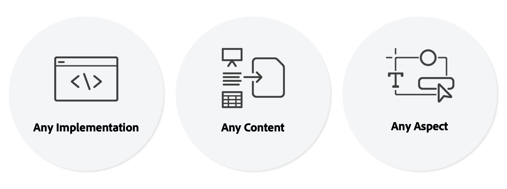

# Introductie van Universal Editor {#introduction}

De Universal Editor is een veelzijdige visuele editor die deel uitmaakt van Adobe Experience Manager Sites. Auteurs kunnen hiermee WYSIWYG (what-you-see-is-what-you-get)-bewerkingen uitvoeren van elke headless- of headful-ervaring. Begrijp hoe het inhoudsauteurs kan helpen uitzonderlijke ervaringen en hoe het ongeëvenaarde vrijheid voor ontwikkelaars biedt.

## Achtergrond {#background}

De Universele Redacteur verstrekt een efficiënte en intuïtieve in-context auteurservaring die minimale opleiding vereist. Met deze functie kunnen auteurs hun inhoud rechtstreeks beheren in de context van de webervaring en exact aangeven hoe deze wordt weergegeven aan de bezoekers. Aangezien het een ware redacteur als dienst en over het algemeen flexibeler is, is het van plan uiteindelijk de Redacteur van de Pagina te vervangen.

Auteurs profiteren van de flexibiliteit van de Universal Editor, omdat deze ondersteuning biedt voor dezelfde visuele bewerking voor alle vormen van AEM inhoud: bewerking op plaats en compositie van de layout is mogelijk op dezelfde manier voor zowel inhoudfragmenten als paginacomponenten. De twee vormen van inhoud kunnen zelfs worden uitgegeven wanneer het tonen zij aan zij in een Webervaring, zonder auteurs te moeten van context veranderen. Dit is een enorme verbetering in vergelijking met vorige editors in AEM slechts één type inhoud.

Ontwikkelaars profiteren van de veelzijdigheid van de Universal Editor, omdat deze ook werkelijke ontkoppeling van de implementatie ondersteunt. Het stelt ontwikkelaars in staat om vrijwel elk kader of architectuur van hun keuze te gebruiken, zonder enige SDK of technologiebeperkingen op te leggen. Deze flexibiliteit maakt het zelfs gemakkelijk om bestaande Web-apps voor de universele redacteur zonder het moeten te moeten opnieuw opbouwen.

## True Universal {#universal}

De Universal Editor kan van instrumenten worden voorzien voor elke implementatie, voor elke inhoud en voor elk aspect van de inhoud.

### Willekeurige implementatie {#any-implementation}

Omdat de ervaringen op vele verschillende manieren kunnen worden gebouwd, kan om het even welke implementatie de Universele Redacteur gebruiken zodat kunnen de auteurs in-context het uitgeven uitvoeren.

Gebruikers denken vaak dat een implementatie zonder kop de auteurs beperkt tot het bewerken van alle inhoud in een op formulieren gebaseerde gebruikersinterface, maar dit is niet het geval met de universele editor

De vereisten voor een implementatie om de Universele Redacteur te gebruiken zijn recht-voorwaarts en steunen het volgende:

* **Elke architectuur** - Server-side rendering, edge-side rendering, client-side rendering, enzovoort.
* **Willekeurig kader** - Vanilla AEM, of een ander framework van derden zoals React, Next.js, Angular enzovoort.
* **Willekeurig hosten** - Kan lokaal worden gehost op AEM of op een extern domein

### Willekeurige inhoud {#any-content}

De auteur van een inhoud moet dezelfde krachtige bewerkingservaring hebben als de AEM pagina-editor. Maar in de Universal Editor kunnen auteurs van inhoud bewerken **alle** inhoud visueel en in context en ondersteunt:

* **Paginastructuren AEM** - Genest `cq:Components` van `cq:Pages`, inclusief ervaringsfragmenten
* **Inhoudsfragmenten AEM** - Inhoud uit inhoudsfragmenten bewerken zoals deze in de context van de ervaring worden weergegeven.
* **Documenten** - Het bewijs van concepten heeft getoond dat ook Word, Excel, de Documenten van Google of van de Prijsverhoging de zelfde manier (dit is WIP) kunnen worden uitgegeven.

### Willekeurig aspect {#any-aspect}

Voor de auteur van inhoud gaat de inhoud niet alleen over de informatie in de inhoud, maar ook over de manier waarop deze wordt gerenderd en ontvangen. De inhoud wordt geleverd met extra meta-gegevens en instrumentatieregels, die de Universele Redacteur kan begrijpen en uitgeven met inbegrip van:

* **Lay-out en stijl toepassen** - Door gebruik te maken van een stijlsysteem kunnen de marketingdeskundige en de auteur van de inhoud verschillende stijlen toepassen op de inhoud ervan en verschillende lay-outs maken voor de inhoud, zoals kolommen, carrousels, tabs, accordeons, enzovoort.

## Waarde {#value}

Door de ervaring voor het bewerken van inhoud los te koppelen van een bepaald systeem voor het leveren van inhoud, wordt de editor echt universeel en flexibel, zodat de auteur van de inhoud uitzonderlijke ervaringen kan opdoen, de snelheid van de inhoud kan verhogen en een geavanceerde ontwikkelaarservaring kan bieden.

* **Uitzonderlijke ervaringen leveren** - Om artsen in staat te stellen een aantrekkelijke ervaring voor bezoekers te creëren, staat de Universele Redacteur artsen toe om de inhoud in de context van de voorproef tot stand te brengen en uit te geven. Hierdoor kunnen ze inhoud maken die past bij het ontwerp van de ervaring en die een zinvolle reis voor bezoekers is.
* **Snelheid van inhoud verhogen** - Als u de beheerworkflow van artsen wilt stroomlijnen, kunt u met de Universal Editor inhoud bewerken in de voorvertoning. Zo kunt u artsen begeleiden door alleen de opties weer te geven die relevant zijn voor die context en de workflow onafhankelijk te maken van de inhoudsbronnen.
* **Recentere ontwikkelaarservaring** - Om het heterogene toepassingslandschap in de wereld te ondersteunen, is de Universal Editor volledig ontkoppeld en is hij technologisch gezien niet-afhankelijk, zodat ontwikkelaars hun voorkeurstechnologie kunnen gebruiken om de ervaring te implementeren.

## De Universal Editor en de Content Fragment Editor {#universal-editor-content-fragment-editor}

Op het eerste gezicht lijken de Universal Editor en de Content Fragment Editor vergelijkbare bewerkingsmogelijkheden. Deze editors bieden echter zeer verschillende mogelijkheden en vervullen verschillende taken van de marketingdeskundige.

### Inhoudsfragmenteditor {#content-fragment-editor}

Een marketingdeskundige wil inhoud maken zonder de layout ervan te hoeven omschrijven, zodat deze in een groot aantal contexten opnieuw kan worden gebruikt.

* De onderliggende taak die moet worden uitgevoerd, is het schalen van de inhoudsstrategie.

### Universele editor {#universal-editor}

Een marketingdeskundige wil inhoud maken die is toegesneden op de lay-out van een bepaalde context en die een uitzonderlijke ervaring biedt.

* De onderliggende taak die u moet uitvoeren, is op overtuigende wijze verbinding maken met de lezers.

## Beperkingen {#limitations}

Houd rekening met de volgende beperkingen wanneer u de Universal Editor verkent en de implementatie ervan in uw eigen projecten doorvoert.

* Maximaal 25 AEM (Content Fragments, pages, Experience Fragments, Assets, etc.) moeten verwijzingen als instrumentatie op één enkele pagina zijn.
* AEM as a Cloud Service is de enige ondersteunde AEM achterkant.
* AEM as a Cloud Service release `2023.8.13099` of hoger is vereist.
* Inhoudsauteurs moeten hun eigen individuele Experience Cloud-accounts hebben.
* Chrome en Edge zijn de ondersteunde browsers

## Volgende stappen {#next-steps}

Zie het document [De universele Redacteur gebruikt Gevallen en Lerende Wegen](/help/implementing/universal-editor/use-cases.md) om meer over gemeenschappelijke gebruiksgevallen voor de Universele Redacteur te leren en de juiste documentatiemiddelen te ontdekken om u in uw project te steunen.
