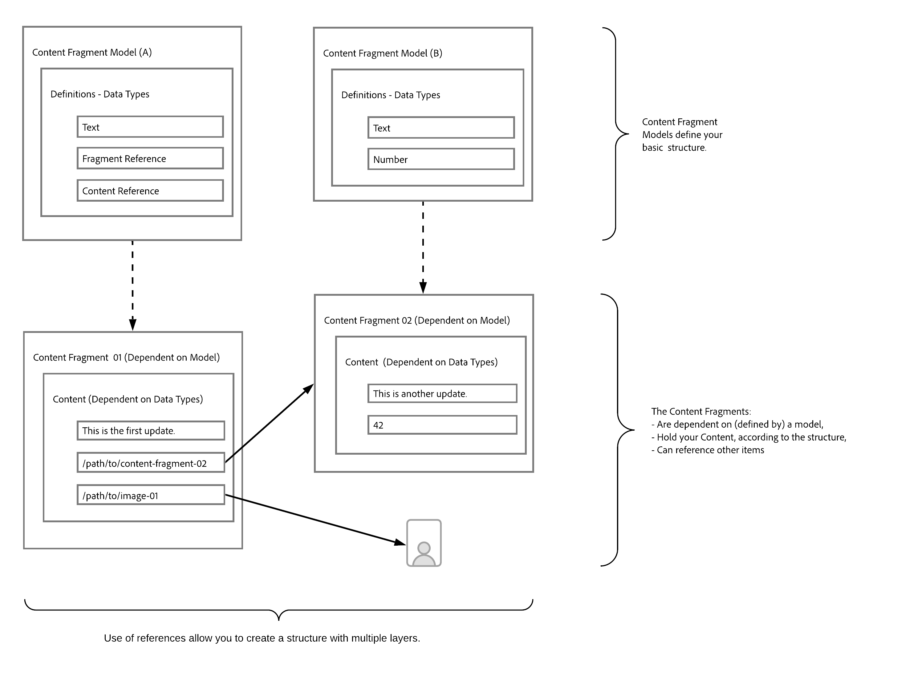

# Leer de basisbeginselen van de Content Modeling voor headless met AEM {#content-modeling-headless-basics}

## Het artikel tot nu toe {#story-so-far}

Aan het begin van de [ Reis van de Architect van de Inhoud zonder hoofd ](overview.md) de [ Inleiding ](introduction.md) behandelde de basisconcepten en de terminologie relevant voor het modelleren van inhoud voor hoofd.

Dit artikel bouwt hierop voort, zodat u begrijpt hoe u uw inhoud voor uw project zonder AEM kunt modelleren.

## Doelstelling {#objective}

* **Publiek**: Begin
* **Doelstelling**: Introduceer de concepten Inhoud Modeling voor Hoofdloze CMS.

## Inhoud modelleren met modellen van inhoudsfragmenten {#architect-content-fragment-models}

De modellering van de inhoud (Gegevens) is een reeks gevestigde technieken, vaak gebruikt wanneer ontwikkelde relatiedatabases, zodat wat de Modellering van de Inhoud voor AEM Zwaartepunt betekent?

### Waarom? {#why}

Om ervoor te zorgen dat uw toepassing de vereiste inhoud van AEM consistent en efficiënt kan aanvragen en ontvangen, moet deze inhoud gestructureerd zijn.

Dit betekent dat uw toepassing van tevoren de vorm van de reactie en daarom hoe te om het weet te verwerken. Dit is veel gemakkelijker dan het ontvangen van vrije-vorminhoud, die moet worden geparseerd om te bepalen wat het bevat en daarom, hoe het kan worden gebruikt.

### Inleiding aan hoe? {#how}

AEM gebruikt Content Fragments om de structuren te bieden die nodig zijn voor de levering van inhoud zonder kop aan uw toepassingen.

De structuur van het inhoudsmodel is:

* door de definitie van het inhoudsfragmentmodel wordt gerealiseerd,
* gebruikt als basis voor de Inhoudsfragmenten die worden gebruikt voor het genereren van inhoud.

>[!NOTE]
>
>De modellen van het Fragment van de Inhoud worden ook gebruikt als basis van de AEM Schema&#39;s van GraphQL, die voor het terugwinnen van uw inhoud - meer over dat in de Reis van de Ontwikkelaar worden gebruikt.

Verzoeken om uw inhoud worden ingediend met de AEM GraphQL API, een aangepaste implementatie van de standaard GraphQL API. Met de AEM GraphQL API kunnen toepassingen (complexe) query&#39;s uitvoeren op uw Content Fragments, waarbij elke query op een specifiek modeltype is gebaseerd.

De geretourneerde inhoud kan vervolgens door uw toepassingen worden gebruikt.

## De structuur maken met modellen van inhoudsfragmenten {#create-structure-content-fragment-models}

Modellen van inhoudsfragmenten bieden verschillende mechanismen waarmee u de structuur van de inhoud kunt definiëren.

Een inhoudsfragmentmodel beschrijft een entiteit.

>[!NOTE]
>De functionaliteit van het Fragment van de inhoud moet in Browser van de Configuratie worden toegelaten zodat u nieuwe modellen kunt tot stand brengen.

>[!TIP]
>
>Het model moet een naam krijgen, zodat de auteur van de inhoud weet welk model moet worden geselecteerd bij het maken van een inhoudsfragment.

Binnen een model:

1. **de Types van Gegevens** staan u toe om de individuele attributen te bepalen.
Bijvoorbeeld, bepaal het gebied wachtend de naam van een leraar als **Tekst** en hun jaren van de dienst als **Aantal**.
1. De gegevenstypes **Verwijzing van de Inhoud** en **Verwijzing van het Fragment** staan u toe om verhoudingen aan andere inhoud binnen AEM tot stand te brengen.
1. Het **gegevenstype van de Verwijzing van het Fragment** laat u veelvoudige niveaus van structuur realiseren door uw Fragmenten van de Inhoud (volgens het modeltype) te nesten. Dit is van essentieel belang voor het modelleren van inhoud.

Bijvoorbeeld:

## Gegevenstypen {#data-types}

AEM bevat de volgende gegevenstypen waarmee u uw inhoud kunt modelleren:

* Tekst met één regel
* Tekst met meerdere regels
* Getal
* Boolean
* Datum en tijd
* Opsomming
* Tags
* Content Reference
* Fragmentverwijzing
* JSON-object

>[!NOTE]
>
>Meer details zijn beschikbaar onder Modellen van het Fragment van de Inhoud - de Types van Gegevens.

## Verwijzingen en geneste inhoud {#references-nested-content}

Twee gegevenstypen bevatten verwijzingen naar inhoud buiten een specifiek fragment:

* **Verwijzing van de Inhoud**
Dit verstrekt een eenvoudige verwijzing naar andere inhoud van om het even welk type.
U kunt bijvoorbeeld naar een afbeelding op een bepaalde locatie verwijzen.

* **Verwijzing van het Fragment**
Hier vindt u verwijzingen naar andere inhoudsfragmenten.
Dit type verwijzing wordt gebruikt om geneste inhoud te creëren, introducerend de verhoudingen nodig om uw inhoud te modelleren.
Het gegevenstype kan worden geconfigureerd om fragmentauteurs toe te staan:
   * Bewerk het fragment waarnaar wordt verwezen rechtstreeks.
   * Een nieuw inhoudsfragment maken op basis van het juiste model

>[!NOTE]
>
>U kunt ook geïmproviseerde verwijzingen maken met behulp van koppelingen in tekstblokken.

## Structuurniveaus (geneste fragmenten) {#levels-of-structure-nested-fragments}

Voor inhoud die het **gegevenstype modelleren van de Verwijzing van het 0} Fragment laat u veelvoudige niveaus van structuur en verhoudingen tot stand brengen.**

Met deze verwijzing kunt u *diverse Modellen van het Fragment van de Inhoud* verbinden om onderlinge verhoudingen te vertegenwoordigen. Hierdoor kan de toepassing zonder kop de verbindingen volgen en zo nodig toegang krijgen tot de inhoud.

>[!NOTE]
>
>Dit zou met voorzichtigheid moeten worden gebruikt en de beste praktijken kunnen als *worden bepaald nest zo veel als noodzakelijk, maar zo weinig mogelijk*.

Fragmentverwijzingen doen alleen dat - ze stellen u in staat naar een ander fragment te verwijzen.

U kunt bijvoorbeeld de volgende modellen van inhoudsfragmenten definiëren:

* Plaats
* Bedrijf
* Persoon
* Uitreiking

Het lijkt vrij eenvoudig, maar een bedrijf heeft zowel een CEO als werknemers...en dit zijn allemaal mensen, elk gedefinieerd als een persoon.

En een persoon kan een Prijs (of misschien twee) hebben.

* Mijn bedrijf - Bedrijf
   * CEO - Persoon
   * Werknemer(s) - Persoon
      * Persoonlijke onderscheiding(en) - Uitreiking

Dat is alleen maar voor starters. Afhankelijk van de complexiteit kan een prijs bedrijfsspecifiek zijn of kan een bedrijf zijn hoofdkantoor in een bepaalde stad hebben.

U kunt deze interrelaties vertegenwoordigen met fragmentverwijzingen, zoals u (de architect), de auteur van de inhoud en de toepassingen zonder kop ze begrijpt.

## Volgende functies {#whats-next}

Nu u de grondbeginselen hebt geleerd, is de volgende stap [ te leren over het Creëren van Modellen van het Fragment van de Inhoud in AEM ](model-structure.md). Dit zal de diverse beschikbare verwijzingen introduceren en bespreken, en hoe te om niveaus van structuur met de Verwijzingen van het Fragment tot stand te brengen - een zeer belangrijk deel van modellering voor headless.

## Aanvullende bronnen {#additional-resources}

* [Modellen van inhoudsfragmenten](/help/sites-cloud/administering/content-fragments/content-fragment-models.md)

   * [Modellen van inhoudsfragmenten - gegevenstypen](/help/sites-cloud/administering/content-fragments/content-fragment-models.md#data-types)

* [Concepten ontwerpen](/help/sites-cloud/authoring/author-publish.md)

* [ Basis Behandelend ](/help/sites-cloud/authoring/basic-handling.md) - deze pagina is hoofdzakelijk gebaseerd op de **console van Plaatsen**, maar vele/de meeste eigenschappen zijn ook relevant voor het ontwerpen van **Fragmenten van de Inhoud** onder de **Assets** console.

* [Werken met inhoudsfragmenten](/help/sites-cloud/administering/content-fragments/overview.md)
