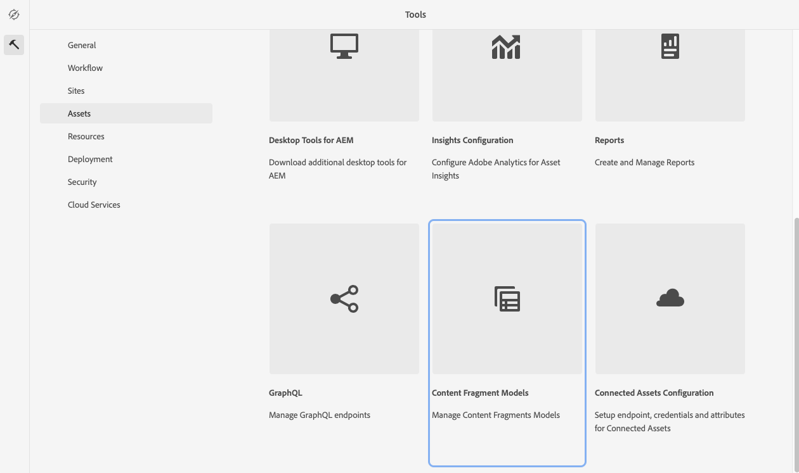

# Meer informatie over het maken van modellen voor inhoudsfragmenten in AEM {#architect-headless-content-fragment-models}

## Het artikel tot nu toe {#story-so-far}

Aan het begin van de [AEM Schrijverreis zonder kopinhoud](overview.md) de [Grondbeginselen van inhoudsmodellen voor headless met AEM](basics.md) heeft betrekking op de basisbegrippen en de terminologie die relevant zijn voor het ontwerpen van koploze producten.

Dit artikel bouwt op deze voort zodat begrijpt u hoe te om uw eigen Modellen van het Fragment van de Inhoud voor uw project zonder AEM te creëren.

## Doelstelling {#objective}

* **Publiek**: Begin
* **Doelstelling**: de concepten en mechanica van het modelleren van inhoud voor uw Zwaarloze CMS gebruikend de Modellen van de Fragments van de Inhoud.

<!-- which persona does this? -->
<!-- and who allows the configuration on the folders? -->

<!--
## Enabling Content Fragment Models {#enabling-content-fragment-models}

At the very start you need to enable Content Fragment Models for your site, this is done in the Configuration Browser; under Tools > General > Configuration Browser. You can either select to configure the global entry, or create a configuration. For example:

>[!NOTE]
>
>See Additional Resources - Content Fragments in the Configuration Browser
-->

## Modellen voor inhoudsfragmenten maken {#creating-content-fragment-models}

Vervolgens kunt u de modellen van Content Fragments maken en de structuur definiëren. Dit kan worden gedaan in het kader van **Gereedschappen** > **Algemeen** > **Modellen van inhoudsfragmenten**.

Nadat u deze optie hebt geselecteerd, navigeert u naar de locatie voor uw model en selecteert u **Maken**. Hier kunt u verschillende belangrijke details invoeren.

De optie **Model inschakelen** is standaard geactiveerd. Dit betekent dat uw model beschikbaar is voor gebruik (bij het maken van inhoudsfragmenten) zodra u het hebt opgeslagen. U kunt dit desgewenst deactiveren. Er zijn later mogelijkheden om een bestaand model in of uit te schakelen.

Bevestigen met **Maken** en u kunt **Openen** uw model om de structuur te beginnen definiëren.

## Modellen voor inhoudsfragmenten definiëren {#defining-content-fragment-models}

Wanneer u voor het eerst een nieuw model opent, ziet u een groot, leeg vak aan de linkerkant en een lange lijst met **Gegevenstypen** rechts:

Wat moet er gebeuren?

U kunt instanties van de **Gegevenstypen** op de linkerruimte - u bepaalt reeds uw model!

Nadat u een gegevenstype hebt toegevoegd, moet u de **Eigenschappen** voor dat veld. Deze hangen van het type af dat wordt gebruikt. Bijvoorbeeld:

U kunt zoveel velden toevoegen als u nodig hebt. Bijvoorbeeld:

### Uw makers van inhoud {#your-content-authors}

De auteurs van de inhoud zien de gegevenstypen en eigenschappen die u hebt gebruikt om uw modellen te maken, niet. Dit betekent dat u mogelijk hulp en informatie moet bieden over de manier waarop specifieke velden worden ingevuld. Voor basisinformatie kunt u het Etiket van het Gebied en StandaardWaarde gebruiken, maar de complexere gevallen zouden de projectspecifieke documentatie kunnen moeten worden overwogen.

>[!NOTE]
>
>Zie Aanvullende bronnen - Modellen van inhoudsfragmenten.

## Modellen voor inhoudsfragmenten beheren {#managing-content-fragment-models}

<!-- needs more details -->

Het beheren van uw modellen van het Fragment van de Inhoud impliceert:

* Het toelaten (of het onbruikbaar maken) hen - dit maakt hen voor auteurs beschikbaar wanneer het creëren van de Fragmenten van de Inhoud.
* Verwijderen - verwijdering is altijd nodig, maar u moet er rekening mee houden dat u een model verwijdert dat al wordt gebruikt voor inhoudsfragmenten, met name fragmenten die al zijn gepubliceerd.

## Publiceren {#publishing}

<!-- needs more details -->

Inhoudsfragmentmodellen moeten worden gepubliceerd wanneer/voordat afhankelijke inhoudsfragmenten worden gepubliceerd.

>[!NOTE]
>
>Als een auteur een inhoudsfragment probeert te publiceren waarvoor het model nog niet is gepubliceerd, geeft een selectielijst dit aan en het model wordt gepubliceerd met het fragment.

Zodra een model is gepubliceerd, wordt het *vergrendeld* in de modus ALLEEN-LEZEN bij de auteur. Dit is bedoeld om wijzigingen te voorkomen die zouden leiden tot fouten in bestaande GraphQL-schema&#39;s en query&#39;s, met name in de publicatieomgeving. Het wordt in de console aangegeven door **Vergrendeld**.

Wanneer het model **Vergrendeld** (in de modus ALLEEN-LEZEN) kunt u de inhoud en de structuur van modellen zien, maar niet rechtstreeks bewerken, hoewel u deze kunt beheren **Vergrendeld** modellen van of de console, of de modelredacteur.

## Volgende functies {#whats-next}

Nu u de grondbeginselen hebt geleerd, is de volgende stap het creëren van uw eigen Modellen van het Fragment van de Inhoud te beginnen.

## Aanvullende bronnen {#additional-resources}

* [Concepten ontwerpen](/help/sites-cloud/authoring/author-publish.md)

* [Basisverwerking](/help/sites-cloud/authoring/basic-handling.md) - deze pagina is voornamelijk gebaseerd op de **Sites** -console, maar veel/de meeste functies zijn ook relevant voor het navigeren naar en het uitvoeren van actie op **Modellen van inhoudsfragmenten** onder de **Algemeen** console.

* [Werken met inhoudsfragmenten](/help/sites-cloud/administering/content-fragments/overview.md)

   * [Modellen van inhoudsfragmenten](/help/sites-cloud/administering/content-fragments/content-fragment-models.md)

      * [Het model van het inhoudsfragment definiëren](/help/sites-cloud/administering/content-fragments/content-fragment-models.md#defining-your-content-fragment-model)

      * [Een inhoudsfragmentmodel in- of uitschakelen](/help/sites-cloud/administering/content-fragments/content-fragment-models.md#enabling-disabling-a-content-fragment-model)

      * [Modellen voor inhoudsfragmenten toestaan in de middelenmap](/help/sites-cloud/administering/content-fragments/content-fragment-models.md#allowing-content-fragment-models-assets-folder)

      * [Een inhoudsfragmentmodel verwijderen](/help/sites-cloud/administering/content-fragments/content-fragment-models.md#deleting-a-content-fragment-model)

      * [Een inhoudsfragmentmodel publiceren](/help/sites-cloud/administering/content-fragments/content-fragment-models.md#publishing-a-content-fragment-model)

      * [Publicatie van een inhoudsfragmentmodel ongedaan maken](/help/sites-cloud/administering/content-fragments/content-fragment-models.md#unpublishing-a-content-fragment-model)

      * [Vergrendelde (gepubliceerde) modellen van inhoudsfragmenten](/help/sites-cloud/administering/content-fragments/content-fragment-models.md#locked-published-content-fragment-models)

* Aan de slag - hulplijnen

   * [Modellen voor inhoudsfragmenten maken zonder kop instellen](/help/headless/setup/create-content-model.md)
