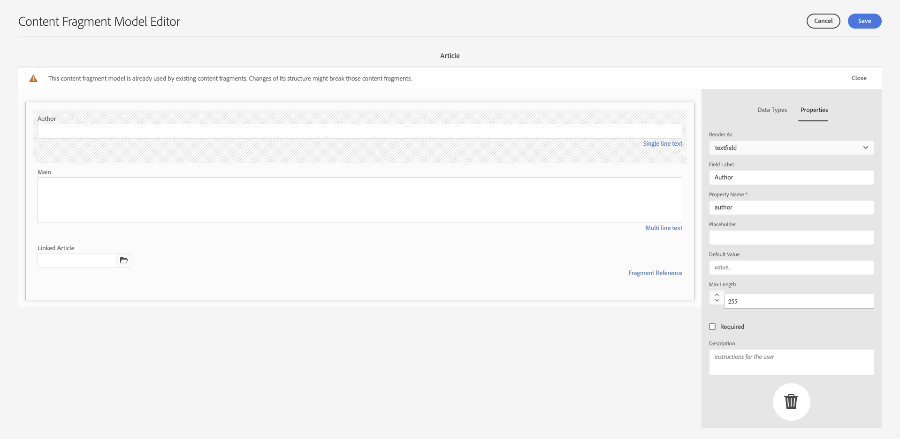

# Toegang tot uw inhoud via AEM levering-API&#39;s {#access-your-content}

In dit deel van de [ AEM Headless Reis van de Ontwikkelaar ](overview.md), kunt u leren hoe te om de vragen van GraphQL te gebruiken om tot de inhoud van uw Fragments van de Inhoud toegang te hebben en het te voeren aan uw app (koploze levering).

## Het verhaal tot nu toe {#story-so-far}

In het vorige document van de AEM hoofdloze reis, [ hoe te om Uw Inhoud ](model-your-content.md) te modelleren leerde u de grondbeginselen van inhoud modellerend in AEM leerde, zodat zou u nu moeten begrijpen hoe te om uw inhoudsstructuur te modelleren, dan realiseer die structuur die AEM de Modellen van het Fragment van de Inhoud en de Fragmenten van de Inhoud gebruikt:

* De concepten en terminologie met betrekking tot inhoudsmodellen herkennen.
* Begrijp waarom de inhoud modellering voor de levering van de Inhoud zonder Zwaartepunt nodig is.
* Begrijp hoe te om deze structuur te realiseren gebruikend AEM Modellen van het Fragment van de Inhoud (en auteursinhoud met de Fragmenten van de Inhoud.
* Begrijp hoe u uw inhoud modelleert; principes met basismonsters.

Dit artikel bouwt verder op die grondbeginselen zodat u begrijpt hoe te om tot uw bestaande inhoud zonder kop in AEM toegang te hebben gebruikend AEM GraphQL API.

* **Publiek**: Begin
* **Doelstelling**: Leer hoe te om tot de inhoud van uw Fragmenten van de Inhoud toegang te hebben gebruikend AEM vragen van GraphQL:
   * Introduceer GraphQL en de AEM GraphQL API.
   * Dive into the details of the AEM GraphQL API.
   * Bekijk sommige steekproefvragen om te zien hoe de dingen in praktijk werken.

## Wilt u dus toegang tot uw inhoud? {#so-youd-like-to-access-your-content}

Dus...u hebt al deze inhoud, netjes gestructureerd (in inhoudsfragmenten), en gewoon wachtend om uw nieuwe app te voeden. De vraag is: hoe kan het daar komen?

U hebt een manier nodig om specifieke inhoud als doel in te stellen, te selecteren wat u nodig hebt en terug te sturen naar uw app voor verdere verwerking.

Met Adobe Experience Manager (AEM) as a Cloud Service hebt u selectief toegang tot uw inhoudsfragmenten, met de GraphQL API van AEM, om alleen de inhoud te retourneren die u nodig hebt. Dit betekent dat u zonder kop gestructureerde inhoud kunt leveren voor gebruik in uw toepassingen.

>[!NOTE]
>
>AEM GraphQL API is een aangepaste implementatie, gebaseerd op de standaard GraphQL API-specificatie.

## GraphQL - Een inleiding {#graphql-introduction}

GraphQL is een open-source-specificatie die het volgende biedt:

* een querytaal waarmee u specifieke inhoud van gestructureerde objecten kunt selecteren.
* een runtime om deze query&#39;s uit te voeren met uw gestructureerde inhoud.

GraphQL is een sterk getypeerde API. Dit betekent dat *alle* inhoud duidelijk door type moet worden gestructureerd en worden georganiseerd, zodat GraphQL ** begrijpt wat om toegang te hebben en hoe. De gegevensvelden zijn gedefinieerd in GraphQL-schema&#39;s, die de structuur van de inhoudsobjecten definiëren.

De eindpunten van GraphQL verstrekken dan de wegen die aan de vragen van GraphQL antwoorden.

Dit alles betekent dat uw app de inhoud die het nodig heeft nauwkeurig, betrouwbaar en efficiënt kan selecteren - precies wat u nodig hebt bij AEM.

>[!NOTE]
>
>Zie *GraphQL*.org en *GraphQL*.com.

<!--
## AEM and GraphQL {#aem-graphql}

GraphQL is used in various locations in AEM; for example:

* Content Fragments
  * A customized API has been developed for this use-case (Headless Delivery to your app).
    * This is the AEM GraphQL API.
* Commerce
  * AEM Commerce consumes data from a Commerce platform via GraphQL.
  * There are GraphQL integrations between AEM and various third-party commerce solutions, used with the extension hooks provided by the CIF Core Components.
    * This does not use the AEM GraphQL API.

>[!NOTE]
>
>This step of the Headless Journey is only concerned with the AEM GraphQL API and Content Fragments.
-->

## GRAPHQL API AEM {#aem-graphql-api}

De AEM GraphQL API is een aangepaste versie gebaseerd op de standaard GraphQL API-specificatie, speciaal geconfigureerd om (complexe) query&#39;s uit te voeren op uw Content Fragments.

Inhoudsfragmenten worden gebruikt, omdat de inhoud is gestructureerd volgens Modellen van inhoudsfragmenten. Dit voldoet aan een basisvereiste van GraphQL.

* Een inhoudsfragmentmodel is samengesteld uit een of meer velden.
   * Elk veld wordt gedefinieerd op basis van een gegevenstype.
* Modellen van inhoudsfragmenten worden gebruikt om de overeenkomstige AEM GraphQL-schema&#39;s te genereren.

Om tot GraphQL voor AEM (en de inhoud) eigenlijk toegang te hebben wordt een eindpunt gebruikt om de toegangspad te verstrekken.

De inhoud die wordt geretourneerd via de AEM GraphQL API kan vervolgens door uw toepassingen worden gebruikt.

Om u direct te helpen input, en testvragen, is een implementatie van de standaard interface GraphiQL ook beschikbaar voor gebruik met AEM GraphQL (dit kan met AEM worden geïnstalleerd). Het biedt functies zoals syntaxismarkering, automatisch aanvullen, automatisch suggereren, samen met een geschiedenis en online documentatie.

>[!NOTE]
>
>De AEM GraphQL API-implementatie is gebaseerd op de GraphQL Java-bibliotheken.

<!--
### Use Cases for Author and Publish Environments {#use-cases-author-publish-environments}

The use cases for the AEM GraphQL API can depend on the type of AEM as a Cloud Service environment:

* Publish environment; used to: 
  * Query content for JS application (standard use-case)

* Author environment; used to: 
  * Query content for "content management purposes":
    * GraphQL in AEM as a Cloud Service is currently a read-only API.
    * The REST API can be used for CR(u)D operations.
-->

## Inhoudsfragmenten voor gebruik met de AEM GraphQL API {#content-fragments-use-with-aem-graphql-api}

Inhoudsfragmenten kunnen worden gebruikt als basis voor GraphQL voor AEM schema&#39;s en query&#39;s als:

* Zo kunt u pagina-onafhankelijke inhoud ontwerpen, maken, beheren en publiceren die zonder kop kan worden geleverd.
* Ze zijn gebaseerd op een Content Fragment Model, dat de structuur voor het resulterende fragment vooraf definieert met behulp van een selectie van gegevenstypen.
* Er kunnen extra structuurlagen worden bereikt met het gegevenstype Fragmentverwijzing, dat beschikbaar is wanneer u een model definieert.

### Modellen van inhoudsfragmenten {#content-fragments-models}

Deze modellen van inhoudsfragmenten:

* Wordt gebruikt om de Schema&#39;s te produceren, zodra **Toegelaten**.
* Geef de gegevenstypen en velden op die vereist zijn voor GraphQL. Ze zorgen ervoor dat uw toepassing alleen vraagt wat mogelijk is en wat wordt verwacht ontvangt.
* Het gegevenstype **Verwijzingen van het Fragment** kan in uw model worden gebruikt om een ander Fragment van de Inhoud van verwijzingen te voorzien, en zo extra niveaus van structuur introduceren.

### Fragmentverwijzingen {#fragment-references}

De **Verwijzing van het Fragment**:

* Is een specifiek gegevenstype beschikbaar wanneer het bepalen van een Model van het Fragment van de Inhoud.
* Verwijst naar een ander fragment, afhankelijk van een specifiek inhoudsfragmentmodel.
* Hiermee kunt u gestructureerde gegevens maken en ophalen.

   * Wanneer bepaald als a **multifeed**, kunnen de veelvoudige sub-fragmenten (teruggewonnen) door het eerste fragment van verwijzingen worden voorzien.

### JSON-voorvertoning {#json-preview}

Om u te helpen bij het ontwerpen en ontwikkelen van modellen van inhoudsfragmenten, kunt u een voorbeeld van JSON-uitvoer weergeven in de Content Fragment Editor.

](assets/cfm-model-json-preview.png " Voorproef JSON ")![

<!--
## GraphQL Schema Generation from Content Fragments {#graphql-schema-generation-content-fragments}

GraphQL is a strongly-typed API, which means that content must be clearly structured and organized by type. The GraphQL specification provides a series of guidelines on how to create a robust API for interrogating content on a certain instance. To do this, a client must fetch the Schema, which contains all the types necessary for a query. 

For Content Fragments, the GraphQL schemas (structure and types) are based on **Enabled** Content Fragment Models and their data types.

>[!CAUTION]
>
>All the GraphQL schemas (derived from Content Fragment Models that have been **Enabled**) are readable through the GraphQL endpoint.
>
>This means that you need to ensure that no sensitive content is available, to ensure that no sensitive data is exposed via GraphQL endpoints; for example, this includes information that could be present as field names in the model definition.

For example, if a user created a Content Fragment Model called `Article`, then AEM generates the object `article` that is of a type `ArticleModel`. The fields within this type correspond to the fields and data types defined in the model.

1. A Content Fragment Model:

   

1. The corresponding GraphQL schema (output from GraphiQL automatic documentation):
   

   This shows that the generated type `ArticleModel` contains several [fields](#fields). 
   
   * Three of them have been controlled by the user: `author`, `main` and `referencearticle`.

   * The other fields were added automatically by AEM, and represent helpful methods to provide information about a certain Content Fragment; in this example, `_path`, `_metadata`, `_variations`. These [helper fields](#helper-fields) are marked with a preceding `_` to distinguish between what has been defined by the user and what has been auto-generated.

1. After a user creates a Content Fragment based on the Article model, it can then be interrogated through GraphQL. For examples, see the Sample Queries.md#graphql-sample-queries) (based on a sample Content Fragment structure for use with GraphQL.

In GraphQL for AEM, the schema is flexible. This means that it is auto-generated each and every time a Content Fragment Model is created, updated or deleted. The data schema caches are also refreshed when you update a Content Fragment Model.

The Sites GraphQL service listens (in the background) for any modifications made to a Content Fragment Model. When updates are detected, only that part of the schema is regenerated. This optimization saves time and provides stability.

So for example, if you:

1. Install a package containing `Content-Fragment-Model-1` and `Content-Fragment-Model-2`:
 
   1. GraphQL types for `Model-1` and `Model-2` are generated.

1. Then modify `Content-Fragment-Model-2`:

   1. Only the `Model-2` GraphQL type will get updated.

   1. Whereas `Model-1` will remain the same. 

>[!NOTE]
>
>This is important to note in case you want to do bulk updates on Content Fragment Models through the REST api, or otherwise.

The schema is served through the same endpoint as the GraphQL queries, with the client handling the fact that the schema is called with the extension `GQLschema`. For example, performing a simple `GET` request on `/content/cq:graphql/global/endpoint.GQLschema` will result in the output of the schema with the Content-type: `text/x-graphql-schema;charset=iso-8859-1`.

### Schema Generation - Unpublished Models {#schema-generation-unpublished-models}

When Content Fragments are nested it can happen that a parent Content Fragment Model is published, but a referenced model is not.

>[!NOTE]
>
>The AEM UI prevents this happening, but if publishing is made programmatically, or with content packages, it can occur.

When this happens, AEM generates an *incomplete* Schema for the parent Content Fragment Model. This means that the Fragment Reference, which is dependent on the unpublished model, is removed from the schema.

## AEM GraphQL Endpoints {#aem-graphql-endpoints}

An endpoint is the path used to access GraphQL for AEM. Using this path you (or your app) can:

* access the GraphQL schemas,
* send your GraphQL queries,
* receive the responses (to your GraphQL queries).

AEM allows for:

* A global endpoint - available for use by all sites.
* Endpoints for specific Sites configurations - that you can configure (in the Configuration Browser), specific to a specified site/project.

## Permissions {#permissions}

The permissions are those required for accessing Assets.

## The AEM GraphiQL Interface {#aem-graphiql-interface}

To help you directly input, and test queries, an implementation of the standard GraphiQL interface is available for use with AEM GraphQL. This can be installed with AEM.

>[!NOTE]
>
>GraphiQL is bound the global endpoint (and does not work with other endpoints for specific Sites configurations).

It provides features such as syntax-highlighting, auto-complete, auto-suggest, together with a history and online documentation.


-->

## De AEM GraphQL API daadwerkelijk gebruiken {#actually-using-aem-graphiql}

### Eerste instelling {#initial-setup}

Voordat u begint met query&#39;s op uw inhoud, moet u:

* Uw eindpunt inschakelen
   * Extra > Algemeen > GraphQL
   * [GraphQL Endpoint inschakelen](/help/headless/graphql-api/graphql-endpoint.md)
      * Dit zal ook GrahiQL winde toelaten.

### Voorbeeldstructuur {#sample-structure}

Om de AEM GraphQL API in een vraag eigenlijk te gebruiken, kunnen wij de twee zeer basisstructuren van het Model van het Fragment van de Inhoud gebruiken:

* Bedrijf
   * Naam - tekst
   * CEO (Persoon) - Fragmentverwijzing
   * Werknemers (personen) - Fragmentverwijzing(en)
* Persoon
   * Naam - tekst
   * Voornaam - tekst

Zoals u kunt zien, verwijzen de gebieden CEO en Werknemers, naar de fragmenten van de Persoon.

De fragmentmodellen worden gebruikt:

* wanneer u de inhoud maakt in de Content Fragment Editor
* om de GraphQL-schema&#39;s te genereren waarop u een query uitvoert

### Waar kan ik uw query&#39;s testen? {#where-to-test-your-queries}

De vragen kunnen in de interface worden ingegaan GraphiQL. U kunt tot de vraagredacteur van één van beiden toegang hebben:

* **Hulpmiddelen** > **Algemeen** > **de Redacteur van de Vraag van GraphQL**
* direct; bijvoorbeeld `http://localhost:4502/aem/graphiql.html`


### Aan de slag met query&#39;s {#getting-Started-with-queries}

Een duidelijke vraag moet de naam van alle ingangen in het schema van het Bedrijf terugkeren. Hier kunt u een lijst met alle bedrijfsnamen aanvragen:

```xml
query {
  companyList {
    items {
      name
    }
  }
}
```

Een iets complexere vraag is om alle personen te selecteren die geen naam van &quot;Banen&quot;hebben. Hiermee worden alle personen gefilterd voor personen die niet de naam Taken hebben. Dit wordt bereikt met de operator EQUALS_NOT (er zijn nog veel meer):

```xml
query {
  personList(filter: {
    name: {
      _expressions: [
        {
          value: "Jobs"
          _operator: EQUALS_NOT
        }
      ]
    }
  }) {
    items {
      name
      firstName
    }
  }
}
```

U kunt ook complexere query&#39;s maken. Bijvoorbeeld, vraag voor alle bedrijven die minstens één werknemer met de naam van &quot;Smith&quot;hebben. Deze vraag illustreert het filtreren voor om het even welke persoon van naam &quot;Smith&quot;, die informatie van over de genestelde fragmenten terugkeert:

```xml
query {
  companyList(filter: {
    employees: {
      _match: {
        name: {
          _expressions: [
            {
              value: "Smith"
            }
          ]
        }
      }
    }
  }) {
    items {
      name
      ceo {
        name
        firstName
      }
      employees {
        name
        firstName
      }
    }
  }
}
```

<!-- need code / curl / cli examples-->

Voor alle informatie over het gebruik van de AEM GraphQL API en het configureren van de benodigde elementen kunt u verwijzen naar:

* GraphQL leren gebruiken met AEM
* De structuur van het voorbeeldinhoudsfragment
* GraphQL leren gebruiken met AEM - Voorbeeldinhoud en query&#39;s

## Volgende functies {#whats-next}

Nu u hebt geleerd om tot uw hoofdloze inhoud toegang te hebben en te vragen gebruikend AEM GraphQL API kunt u nu [ leren hoe te om REST API te gebruiken om tot de inhoud van uw Fragments van de Inhoud toegang te hebben en bij te werken ](update-your-content.md).

## Aanvullende bronnen {#additional-resources}

* [ Adobe Experience Manager as a Cloud Service APIs ](https://developer.adobe.com/experience-cloud/experience-manager-apis/)
* [ GraphQL.org ](https://graphql.org)
   * [ Schemas ](https://graphql.org/learn/schema/)
   * [ Variabelen ](https://graphql.org/learn/queries/#variables)
   * [ de bibliotheken van GraphQL Java ](https://graphql.org/code/#java)
* [ GraphiQL ](https://graphql.org/learn/serving-over-http/#graphiql)
* [GraphQL leren gebruiken met AEM](/help/headless/graphql-api/content-fragments.md)
   * [GraphQL Endpoint inschakelen](/help/headless/graphql-api/graphql-endpoint.md)
   * [De interface AEM GraphiQL installeren](/help/headless/graphql-api/graphiql-ide.md)
* [De structuur van het voorbeeldinhoudsfragment](/help/headless/graphql-api/sample-queries.md#content-fragment-structure-graphql)
* [GraphQL leren gebruiken met AEM - Voorbeeldinhoud en query&#39;s](/help/headless/graphql-api/sample-queries.md)
   * [Voorbeeldquery - één specifiek stedenfragment](/help/headless/graphql-api/sample-queries.md#sample-single-specific-city-fragment)
   * [Voorbeeldquery voor metagegevens - Lijst met metagegevens voor onderscheidingen: GB](/help/headless/graphql-api/sample-queries.md#sample-metadata-awards-gb)
   * [Voorbeeldquery - Alle steden met een benoemde variatie](/help/headless/graphql-api/sample-queries.md#sample-cities-named-variation)
* [Functionaliteit van inhoudsfragment inschakelen in configuratievenster](/help/sites-cloud/administering/content-fragments/setup.md#enable-content-fragment-functionality-configuration-browser)
* [Werken met inhoudsfragmenten](/help/sites-cloud/administering/content-fragments/overview.md)
   * [Modellen van inhoudsfragmenten](/help/sites-cloud/administering/content-fragments/content-fragment-models.md)
   * [JSON-uitvoer](/help/assets/content-fragments/content-fragments-json-preview.md)
* [ Begrijp het Middel dat van de dwars-Oorsprong (CORS) deelt ](https://experienceleague.adobe.com/docs/experience-manager-learn/foundation/security/understand-cross-origin-resource-sharing.html#understand-cross-origin-resource-sharing-(cors))
* [GraphQL Persisted Queries - caching inschakelen in Dispatcher](/help/headless/deployment/dispatcher-caching.md)
* [Toegangstokens genereren voor server-side API&#39;s](/help/implementing/developing/introduction/generating-access-tokens-for-server-side-apis.md)
* [ Begonnen het Worden met AEM Zwaartepunt ](https://experienceleague.adobe.com/docs/experience-manager-learn/getting-started-with-aem-headless/graphql/overview.html) - een korte videoles die een overzicht geven van het gebruiken van AEM zonder kop eigenschappen, met inbegrip van inhoud modelleren en GraphQL.
