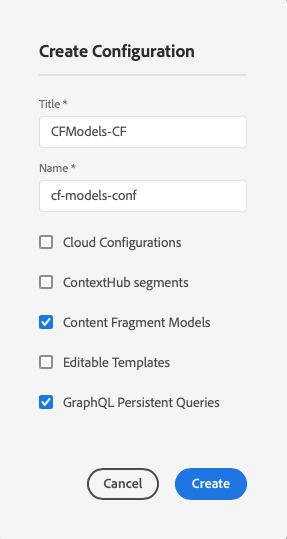
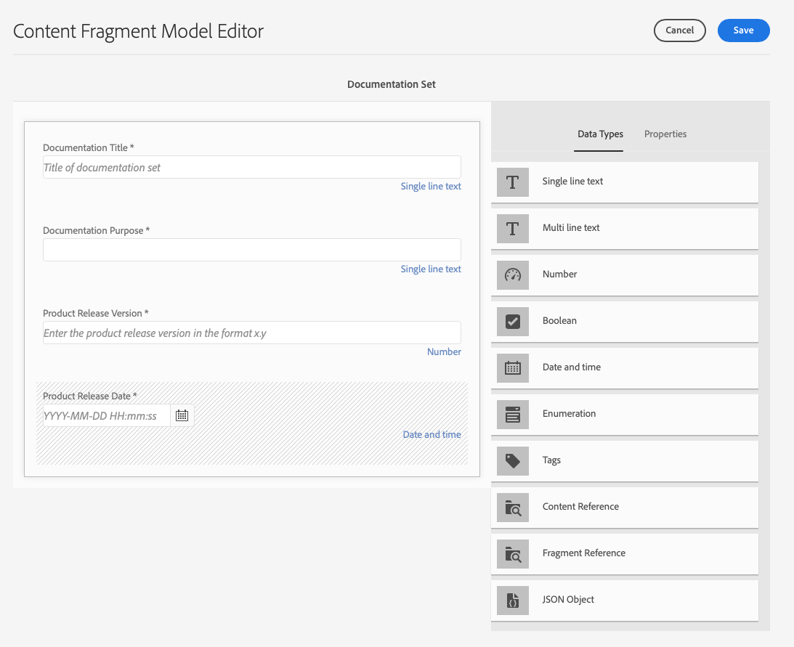

# Uw inhoud modelleren {#model-your-content}

In dit deel van het [AEM Headless Developer Journey](overview.md)leert u hoe u de inhoudsstructuur kunt modelleren. Dan realiseer die structuur voor Adobe Experience Manager (AEM) gebruikend de Modellen van de Fragmenten van de Inhoud en de Fragmenten van de Inhoud, voor hergebruik over kanalen.

## Het verhaal tot nu toe {#story-so-far}

Aan het begin [Meer informatie over CMS Headless Development](learn-about.md) bedekte levering zonder kop en waarom het wordt gebruikt. Vervolgens [Aan de slag met AEM headless as a Cloud Service](getting-started.md) beschreven AEM Headless in de context van uw eigen project.

In het vorige document van de AEM zonder kop: [Pad naar uw eerste ervaring met AEM zonder kop](path-to-first-experience.md), leerde u dan de stappen nodig om uw eerste project uit te voeren. Nadat u het document hebt gelezen, kunt u het volgende doen:

* Belangrijke planningsoverwegingen voor het ontwerpen van uw inhoud begrijpen en uitleggen
* Begrijp en verklaar de stappen voor het uitvoeren van headless, afhankelijk van uw vereisten van het integratieniveau.
* Stel de benodigde gereedschappen en AEM configuraties in.
* Weet de beste werkwijzen zodat u uw reis zonder kop vlot kunt maken, de productie van inhoud efficiënt houdt, en ervoor zorgt dat de inhoud snel wordt geleverd.

Dit artikel bouwt op die grondbeginselen voort zodat begrijpt u hoe te om uw eigen AEM hoofdloze project voor te bereiden.

## Doelstelling {#objective}

* **Publiek**: Begin
* **Doelstelling**: Leer hoe u uw inhoudsstructuur kunt modelleren en realiseer die structuur met AEM Content Fragment Models and Content Fragments:
   * Introduceer concepten en terminologie met betrekking tot gegevens/inhoud modellering.
   * Ontdek waarom contentmodellering nodig is voor levering van inhoud zonder koptekst.
   * Leer hoe u deze structuur kunt realiseren met AEM Content Fragment Models (en inhoud met Content Fragments schrijven).
   * Leer hoe u uw inhoud modelleert; principes met basisvoorbeelden.

>[!NOTE]
>
>De Modellering van gegevens is een groot gebied, aangezien het wanneer het ontwikkelen van Relationele Gegevensbestanden wordt gebruikt. Er zijn veel boeken en online informatiebronnen beschikbaar.
>
>Deze reis houdt slechts rekening met de aspecten die van belang zijn wanneer het modelleren van gegevens voor gebruik met AEM Headless.

## Inhoud modelleren {#content-modeling}

*Het is een grote, slechte wereld daar*.

Misschien, maar misschien niet. Het is zeker een ***ingewikkeld*** de wereld daarbuiten en de modellering van gegevens worden gebruikt om een vereenvoudigde vertegenwoordiging van een zeer (zeer) kleine onderafdeling te bepalen, gebruikend de specifieke informatie die voor een bepaald doel nodig is.

>[!NOTE]
>
>Aangezien AEM met inhoud behandelt, verwijst deze reis naar de Modellering van Gegevens als Inhoud Modeling.

Bijvoorbeeld:

Er zijn veel scholen, maar ze hebben allemaal verschillende dingen gemeen:

* Een locatie
* Een hoofdleraar
* Veel docenten
* Veel leden van niet-onderwijzend personeel
* Veel leerlingen
* Veel ex-docenten
* Veel ex-leerlingen
* Veel lesruimten
* Veel (veel) boeken
* Veel (veel) apparaten
* Veel activiteiten buiten het studieprogramma
* enzovoort...

Zelfs in zo&#39;n klein voorbeeld kan de lijst eindeloos lijken. Maar als u wilt dat uw toepassing een eenvoudige taak uitvoert, beperkt u de informatie tot de essentie.

Bijvoorbeeld speciale evenementen voor alle scholen in het gebied:

* Schoolnaam
* Locatie onderwijsinstelling
* Hoofddocent
* Type gebeurtenis
* Datum van gebeurtenis
* De leraar die de gebeurtenis organiseert

### Concepten {#concepts}

Wat u wilt beschrijven wordt bedoeld als **Entiteiten** - in feite de &quot;dingen&quot; waarover u informatie wilt opslaan.

De informatie die u over hen wilt opslaan is **Attributen** (eigenschappen), zoals Naam, en Kwalificaties voor de docenten.

Dan zijn er verschillende **Relaties** tussen de entiteiten. Een school heeft bijvoorbeeld meestal maar één hoofdleraar en veel leraren (en meestal is de hoofdleraar ook een leraar).

Het proces van het analyseren en definiëren van deze informatie, samen met de onderlinge relaties, wordt **Inhoud modelleren**.

### Basisbeginselen {#basics}

Vaak moet u beginnen met het maken van een **Conceptueel schema** die de entiteiten en hun relaties beschrijft. Meestal is dit op hoog niveau (conceptueel).

Als dit stabiel is, kunt u de modellen omzetten in een **Logisch schema** die de entiteiten, samen met de kenmerken, en de relaties beschrijft. Op dit niveau bekijkt u de definities nauwkeurig om dubbel werk te voorkomen en uw ontwerp te optimaliseren.

>[!NOTE]
>
>Soms worden deze twee stappen samengevoegd, vaak afhankelijk van de complexiteit van uw scenario.

Hebt u bijvoorbeeld aparte entiteiten nodig voor `Head Teacher` en `Teacher`of gewoon een extra kenmerk op de knop `Teacher` model?

### Gegevensintegriteit waarborgen {#data-integrity}

Gegevensintegriteit is nodig om de nauwkeurigheid en consistentie van uw inhoud gedurende de gehele levenscyclus te garanderen. Dit betekent dat auteurs van inhoud gemakkelijk kunnen begrijpen wat ze moeten opslaan - dus het volgende is van essentieel belang:

* een duidelijke structuur
* een zo beknopt mogelijke structuur (zonder afbreuk te doen aan de nauwkeurigheid)
* validatie van afzonderlijke velden
* indien van toepassing, de inhoud van specifieke velden beperken tot wat zinvol is

### Gegevensredundantie elimineren {#data-redundancy}

Gegevensredundantie treedt op wanneer dezelfde informatie tweemaal wordt opgeslagen binnen de inhoudsstructuur. Dit moet worden vermeden omdat dit tot verwarring kan leiden bij het creëren van de inhoud en tot fouten bij het opvragen, om nog maar te zwijgen van het misbruik van de opslagruimte.

### Optimalisatie en prestaties {#optimization-and-performance}

Door uw structuur te optimaliseren kunt u de prestaties verbeteren, zowel voor het maken van inhoud als voor het opvragen van inhoud.

Alles is een evenwichtsactie, maar het creëren van een structuur die te complex is, of teveel niveaus heeft, kan verwarrend zijn voor auteurs die de inhoud produceren. En, kan het prestaties ernstig beïnvloeden als de vraag tot veelvoudige genestelde (referenced) de Fragments van de Inhoud moet toegang hebben om de vereiste inhoud terug te winnen.

## Content Modeling for AEM Headless {#content-modeling-for-aem-headless}

Gegevensmodellering is een reeks gevestigde technieken, die vaak worden gebruikt wanneer ontwikkelde relatiedatabases, zodat wat betekent de Modellering van de Inhoud voor AEM Zwaartepunt?

### Waarom? {#why}

Om ervoor te zorgen dat uw toepassing de vereiste inhoud van AEM consistent en efficiënt kan aanvragen en ontvangen, moet deze inhoud gestructureerd zijn.

Dit betekent dat uw toepassing van tevoren de vorm van de reactie en daarom hoe te om het weet te verwerken. Dit is gemakkelijker dan het ontvangen van vrij-vorminhoud, die moet worden geparseerd om te bepalen wat het bevat en daarom, hoe het kan worden gebruikt.

### Inleiding aan hoe? {#how}

AEM gebruikt Content Fragments om de structuren te bieden die nodig zijn voor de levering van inhoud zonder kop aan uw toepassingen.

De structuur van het inhoudsmodel is:

* door de definitie van het inhoudsfragmentmodel wordt gerealiseerd,
* gebruikt als basis voor de Inhoudsfragmenten die worden gebruikt voor het genereren van inhoud.

>[!NOTE]
>
>De modellen van het Fragment van de Inhoud worden ook gebruikt als basis van de AEM Schema&#39;s van GraphQL, die voor het terugwinnen van uw inhoud - meer over dat in een recentere zitting worden gebruikt.

Verzoeken om uw inhoud worden ingediend met de AEM GraphQL API, een aangepaste implementatie van de standaard GraphQL API. Met de AEM GraphQL API kunt u (complexe) query&#39;s uitvoeren op uw inhoudsfragmenten, waarbij elke query op een specifiek modeltype is gebaseerd.

De geretourneerde inhoud kan vervolgens door uw toepassingen worden gebruikt.

## De structuur maken met modellen van inhoudsfragmenten {#create-structure-content-fragment-models}

Modellen van inhoudsfragmenten bieden verschillende mechanismen waarmee u de structuur van de inhoud kunt definiëren.

Een inhoudsfragmentmodel beschrijft een entiteit.

>[!NOTE]
>U moet de functionaliteit van het Fragment van de Inhoud in Browser van de Configuratie toelaten zodat u modellen kunt tot stand brengen.

>[!TIP]
>
>Het model moet een naam krijgen, zodat de auteur van de inhoud weet welk model moet worden geselecteerd bij het maken van een inhoudsfragment.

Binnen een model:

1. **Gegevenstypen** kunt u de afzonderlijke kenmerken definiëren.
U kunt bijvoorbeeld het veld met de naam van een docent definiëren als **Tekst** en hun dienstjaren als **Getal**.
1. De gegevenstypen **Content Reference** en **Fragmentverwijzing** kunt u relaties maken met andere inhoud binnen AEM.
1. De **Fragmentverwijzing** Met het gegevenstype kunt u meerdere structuurniveaus realiseren door de Content Fragments (op basis van het modeltype) te nesten. Dit is van essentieel belang voor het modelleren van inhoud.

Bijvoorbeeld:

### Gegevenstypen {#data-types}

AEM bevat de volgende gegevenstypen waarmee u uw inhoud kunt modelleren:

* Tekst met één regel
* Tekst met meerdere regels
* Getal
* Boolean
* Datum en tijd
* Opsomming
* Tags
* Content Reference
* Fragmentverwijzing
* JSON-object

### Verwijzingen en geneste inhoud {#references-nested-content}

Twee gegevenstypen bevatten verwijzingen naar inhoud buiten een specifiek fragment:

* **Content Reference**
Dit verstrekt een eenvoudige verwijzing naar andere inhoud van om het even welk type.
U kunt bijvoorbeeld naar een afbeelding op een bepaalde locatie verwijzen.

* **Fragmentverwijzing**
Hier vindt u verwijzingen naar andere inhoudsfragmenten.
Dit type verwijzing wordt gebruikt om geneste inhoud te creëren, introducerend de verhoudingen nodig om uw inhoud te modelleren.
Het gegevenstype kan worden geconfigureerd om fragmentauteurs toe te staan:
   * Bewerk het fragment waarnaar wordt verwezen rechtstreeks.
   * Een inhoudsfragment maken op basis van het juiste model

### Modellen voor inhoudsfragmenten maken {#creating-content-fragment-models}

Aan het begin moet u Modellen van inhoudsfragmenten voor uw site inschakelen. Dit wordt gedaan in Browser van de Configuratie onder **Gereedschappen** > **Algemeen** > **Configuratiebrowser**. U kunt of selecteren om de globale ingang te vormen, of een configuratie creëren. Bijvoorbeeld:

>[!NOTE]
>
>Zie Extra Middelen - de Fragmenten van de Inhoud in Browser van de Configuratie

Vervolgens kunt u de modellen van Content Fragments maken en de structuur definiëren. Dit kan worden gedaan in het kader van **Gereedschappen** > **Algemeen** > **Modellen van inhoudsfragmenten**. Bijvoorbeeld:

>[!NOTE]
>
>Zie Aanvullende bronnen - Modellen van inhoudsfragmenten.

## Inhoud met inhoudsfragmenten schrijven met het model {#use-content-to-author-content}

Inhoudsfragmenten zijn altijd gebaseerd op een inhoudsfragmentmodel. Het model biedt de structuur, het fragment bevat de inhoud.

### Het juiste model selecteren {#select-model}

De eerste stap voor het maken van uw inhoud is het maken van een inhoudsfragment. Dit doet u door Maken > Inhoudsfragment te kiezen in de vereiste map onder Middelen > Bestanden. De wizard begeleidt u door de stappen.

Een inhoudsfragment is gebaseerd op een specifiek inhoudsfragmentmodel dat u selecteert als de eerste stap van het ontwerpproces.

### Gestructureerde inhoud maken en bewerken {#create-edit-structured-content}

Nadat u het fragment hebt gemaakt, kunt u het openen in de Inhoudsfragmenteditor. Hier kunt u het volgende doen:

* Bewerk de inhoud in de modus Normaal of Volledig scherm.
* Maak de inhoud op als Volledige tekst, Onbewerkte tekst of Markeringen.
* Maak en beheer variaties in uw inhoud.
* Inhoud koppelen.
* Bewerk de metagegevens.
* De boomstructuur tonen.
* Geef een voorvertoning van de JSON-representatie weer.

### Inhoudsfragmenten maken {#creating-content-fragments}

Nadat u het juiste model hebt geselecteerd, wordt een inhoudsfragment geopend voor bewerking in de Inhoudsfragmenteditor:

>[!NOTE]
>
>Zie Aanvullende bronnen - Werken met inhoudsfragmenten.

## Aan de slag met enkele voorbeelden {#getting-started-examples}

<!--
tbc...
...and/or see the structures covered for the GraphQL samples...
...will those (ever) be delivered as an official sample package?
-->

Zie De structuur van het voorbeeldinhoudsfragment voor een basisstructuur als voorbeeld.

## Volgende functies {#whats-next}

Nu u hebt geleerd hoe u uw structuur kunt modelleren en inhoud kunt maken die hiervan afhankelijk is, is de volgende stap: [Leer hoe u met GraphQL-query&#39;s toegang krijgt tot inhoud van Content Fragments en hoe u deze kunt ophalen](access-your-content.md). Dit introduceert en bespreekt GraphQL, dan bekijkt sommige steekproefvragen om te zien hoe de dingen in de praktijk werken.

## Aanvullende bronnen {#additional-resources}

* [Werken met inhoudsfragmenten](/help/sites-cloud/administering/content-fragments/overview.md) - de introductiepagina voor inhoudsfragmenten
   * [Inhoudsfragmenten in de configuratiebrowser](/help/sites-cloud/administering/content-fragments/setup.md#enable-content-fragment-functionality-configuration-browser) - functionaliteit voor inhoudsfragmenten inschakelen in de configuratiegids
   * [Modellen van inhoudsfragmenten](/help/sites-cloud/administering/content-fragments/content-fragment-models.md) - modellen voor inhoudsfragmenten maken en bewerken
   * [Inhoudsfragmenten beheren](/help/sites-cloud/administering/content-fragments/managing.md) - Inhoudsfragmenten maken en ontwerpen; deze pagina leidt u naar andere gedetailleerde secties
* [AEM GraphQL Schemas](access-your-content.md) - hoe GraphQL modellen realiseert
* [De structuur van het voorbeeldinhoudsfragment](/help/headless/graphql-api/sample-queries.md#content-fragment-structure-graphql)
* [Aan de slag met AEM headless](https://experienceleague.adobe.com/docs/experience-manager-learn/getting-started-with-aem-headless/graphql/overview.html) - Een korte videozelfstudie waarin een overzicht wordt gegeven van het gebruik van functies zonder kop, zoals het modelleren van inhoud en GraphQL
   * [Basisbeginselen van GraphQL-modellen](https://experienceleague.adobe.com/docs/experience-manager-learn/getting-started-with-aem-headless/graphql/video-series/modeling-basics.html) - Leer hoe u inhoudsfragmenten in Adobe Experience Manager (AEM) definieert en gebruikt voor gebruik met GraphQL.
