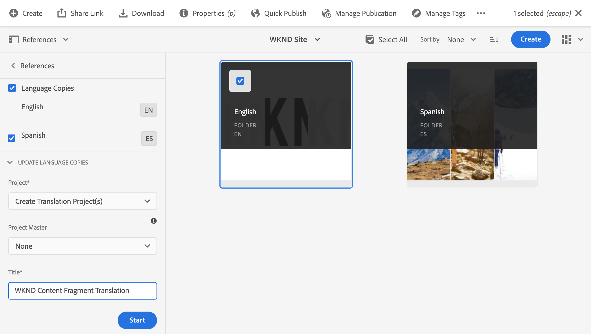
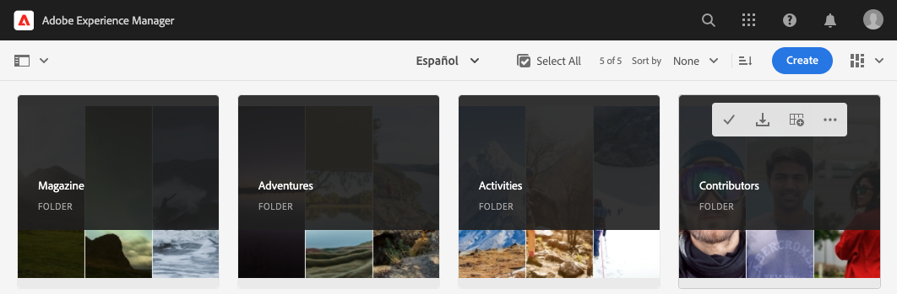

# Inhoud vertalen {#translate-content}

Gebruik de vertaalaansluiting en de regels om uw inhoud zonder kop te vertalen.

## Het verhaal tot nu toe {#story-so-far}

In het vorige document van de AEM hoofdloze lokalisatietraject, [Configureer vertaalregels](translation-rules.md) hebt u geleerd hoe u AEM vertaalregels kunt gebruiken om uw vertaalinhoud te identificeren. Nu moet u:

* Begrijp wat de vertaalregels doen.
* U kunt uw eigen vertaalregels definiëren.

Nu uw schakelaar en vertaalregels opstelling zijn, neemt dit artikel u door de volgende stap van het vertalen van uw inhoud zonder kop.

## Doelstelling {#objective}

Dit document helpt u begrijpen hoe te om AEM vertaalprojecten samen met de schakelaar en uw vertaalregels te gebruiken om inhoud te vertalen. Nadat u dit document hebt gelezen, moet u:

* Begrijp wat een vertaalproject is.
* Nieuwe vertaalprojecten kunnen maken.
* Gebruik vertaalprojecten om uw inhoud zonder kop te vertalen.

## Een vertaalproject maken {#creating-translation-project}

Met vertaalprojecten kunt u de vertaling van inhoud zonder kop AEM. Een vertaalproject bevat de inhoud die in andere talen moet worden vertaald.

Wanneer inhoud aan een vertaalproject wordt toegevoegd, wordt een vertaalbaan gecreeerd voor het. Taken bieden opdrachten en statusinformatie die u gebruikt om de workflows voor het vertalen van mensen en computers die op de bronnen worden uitgevoerd, te beheren.

Een vertaalproject maken:

1. Navigeer naar **Navigation** -> **Middelen** -> **Bestanden**. Onthoud dat inhoud zonder kop in AEM wordt opgeslagen als elementen die Content Fragments worden genoemd.
1. Selecteer de taalwortel van uw project. In dit geval hebben we `/content/dam/wknd/en` geselecteerd.
1. Tik op de spoorkiezer of klik op deze en toon het venster **References**.
1. Tik of klik op **Taalkopieën**.
1. Schakel het selectievakje **Taalkopieën** in.
1. Vouw de sectie **Taalkopieën bijwerken** onder in het venster Referenties uit.
1. Selecteer **Vertaalproject(en) maken** in het vervolgkeuzemenu **Project**.
1. Geef een geschikte titel op voor uw vertaalproject.
1. Tik of klik op **Start**.



U ontvangt een bericht dat het project werd gecreeerd.

>[!NOTE]
>
>Aangenomen wordt dat de vereiste taalstructuur voor de vertalingstalen al is gemaakt als onderdeel van de [definitie van de inhoudsstructuur.](getting-started.md#content-structure) Dit moet gebeuren in samenwerking met de inhoudarchitect.

## Een vertaalproject gebruiken {#using-translation-project}

Bij het creëren van het vertaalproject, evalueerde AEM de inhoud zonder kop onder de weg u selecteerde evenals gebaseerd op de regels die u eerder bepaalde. Op basis van deze regels werd de inhoud geëxtraheerd die vertaald moet worden in een nieuw vertaalproject.

Het vertaalproject weergeven:

1. Navigeer naar **Navigation** -&amp; **Projecten**.
1. Tik of klik op het project dat in de vorige sectie is gemaakt.


Het project is verdeeld in meerdere kaarten.

* **Samenvatting**  - Deze kaart toont de basiskopbalinformatie van het project met inbegrip van de eigenaar, de taal, en de vertaalleverancier.
* **Vertaaltaak**  - Deze kaart geeft een overzicht van de werkelijke vertaaltaak, inclusief de status, het aantal middelen, enz.
* **Team**  - Deze kaart toont de gebruikers die aan dit vertaalproject samenwerken. Deze reis zal dit onderwerp niet behandelen.
* **Taken**  - Extra taken verbonden aan het vertalen van de inhoud zoals het doen van punten of werkschemapunten. Deze reis zal dit onderwerp niet behandelen.

U kunt als volgt de details van de inhoud zonder kop in dit project bekijken:

1. Tik of klik op de knop voor weglatingen onder aan de **Vertaaltaak**-kaart.
1. In het venster **Vertaaltaak** worden alle items in de taak weergegeven.
   
1. Tik of klik op een regel om de details van die regel weer te geven. Houd er rekening mee dat één regel meerdere inhoudsitems kan vertegenwoordigen die moeten worden vertaald.
1. Tik of klik op het selectiekader voor een regelitem om andere opties weer te geven, zoals de optie om het item uit de taak te verwijderen of in de consoles Inhoudsfragmenten of Elementen weer te geven.


De inhoud van de vertaaltaak wordt doorgaans gestart in de status **Concept**, zoals aangegeven door de kolom **Staat** in het venster **Vertaal taak**.

Als u de vertaaltaak wilt starten, gaat u terug naar het overzicht van het vertaalproject en tikt u op de knop chevron boven aan de **Vertaaltaak**-kaart en selecteert u **Start**.


AEM communiceert nu met uw vertaalconfiguratie en -connector om de inhoud naar de vertaalservice te verzenden. U kunt de voortgang van de vertaling bekijken door naar het venster **Translation Job** terug te keren en de kolom **State** van de ingangen te bekijken.


De vertalingen van de machine keren automatisch met een staat van **Goedgekeurd** terug. Menselijke vertaling maakt meer interactie mogelijk, maar valt buiten het bereik van deze reis.

## Vertaalde inhoud controleren {#reviewing}

[Zoals eerder is opgemerkt, ](#using-translation-project) vloeit de door de machine vertaalde inhoud terug in AEM met de status van  **** Goedgekeurd, aangezien ervan wordt uitgegaan dat er geen menselijk ingrijpen vereist is omdat er machinevertaling wordt gebruikt. Het is natuurlijk nog steeds mogelijk om de vertaalde inhoud te beoordelen.

Ga eenvoudig naar de voltooide vertaalbaan en selecteer een lijnpunt door te tikken of checkbox te klikken. Het pictogram **Tonen in inhoudsfragment** wordt weergegeven in de werkbalk.


Tik of klik op dat pictogram om het vertaalde inhoudsfragment in de editorconsole te openen en de details van de vertaalde inhoud weer te geven.


U kunt het inhoudsfragment desgewenst verder wijzigen, op voorwaarde dat u de juiste machtigingen hebt, maar dat het bewerken van inhoudsfragmenten buiten het bereik van deze rit valt. Zie de sectie [Aanvullende bronnen](#additional-resources) aan het einde van dit document voor meer informatie over dit onderwerp.

Het is de taak van het project om alle middelen in verband met een vertaling op één plaats te verzamelen, zodat u gemakkelijk toegang hebt en een duidelijk overzicht krijgt. Zoals u echter kunt zien door de details van een vertaald item weer te geven, vloeien de vertalingen zelf terug naar de map met middelen van de vertaaltaal. In ons voorbeeld hier

```text
/content/dam/wknd/es
```

Als u via **Navigation** -> **Files** -> **Assets** naar deze map navigeert, wordt de vertaalde inhoud weergegeven.



AEM vertaalkader ontvangt de vertalingen van de vertaalschakelaar en leidt dan automatisch tot de inhoudsstructuur die op de taalwortel wordt gebaseerd en gebruikend de vertalingen die door de schakelaar worden verstrekt.

Het is belangrijk te begrijpen dat deze inhoud niet wordt gepubliceerd. Het blijft op het auteursgeval van AEM tot u besluit het klaar is om te publiceren. We zullen zien hoe we dit kunnen doen in de volgende stap van de lokalisatietraject.

## Menselijke vertaling {#human-translation}

Als uw vertaalservice voorziet in menselijke vertaling, biedt het revisieproces meer opties. Bijvoorbeeld, komen de vertalingen in het project met de status **Draft** terug en moeten worden herzien en manueel worden goedgekeurd of verworpen.

Menselijke vertaling valt buiten het bereik van deze lokalisatietraject. Zie de sectie [Aanvullende bronnen](#additional-resources) aan het einde van dit document voor meer informatie over dit onderwerp.

## Volgende functies {#what-is-next}

Nu u dit gedeelte van de reis zonder kop hebt voltooid, moet u:

* Begrijp wat een vertaalproject is.
* Nieuwe vertaalprojecten kunnen maken.
* Gebruik vertaalprojecten om uw inhoud zonder kop te vertalen.

Gebaseerd op deze kennis en doorgaan met uw AEM tocht naar een hoofdloze lokalisatie door het document [Vertaalde inhoud publiceren](publish-content.md) opnieuw te bekijken. Hierin leert u hoe u vertaalde inhoud kunt publiceren en hoe u die vertalingen kunt bijwerken wanneer de inhoud van de hoofdtaal verandert.

## Aanvullende bronnen {#additional-resources}

Hoewel u wordt aangeraden door het document [Vertaalde inhoud publiceren over te schakelen naar het volgende gedeelte van de reis zonder kop, zijn de volgende aanvullende, optionele bronnen die een diepere invloed hebben op bepaalde concepten die in dit document worden genoemd, maar die niet nodig zijn om door te gaan op de tocht zonder kop.](publish-content.md)

* [Vertaalprojecten](/help/sites-cloud/administering/translation/managing-projects.md)  beheren - Meer informatie over vertaalprojecten en aanvullende functies, zoals workflows voor menselijke vertaling en meertalige projecten.
