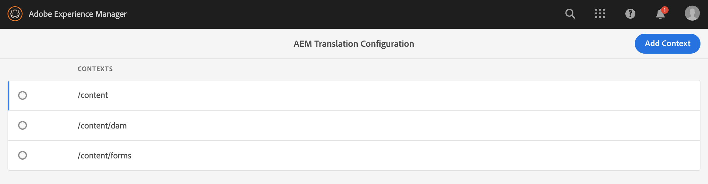

# Vertaalregels configureren {#configure-translation-rules}

Leer hoe u vertaalregels definieert om inhoud voor lokalisatie te identificeren.

## Het verhaal tot nu toe {#story-so-far}

In het vorige document van de AEM hoofdloze lokalisatietraject hebt u [vertaalconnector configureren](configure-connector.md) geleerd hoe u uw vertaalconnector kunt installeren en configureren. Dit moet nu:

* Begrijp de belangrijke parameters van het Kader van de Integratie van de Vertaling in AEM.
* Uw eigen verbinding met uw vertaalservice instellen.

Nu uw schakelaar opstelling is, neemt dit artikel u door de volgende stap van het identificeren van welke inhoud u moet vertalen.

## Doelstelling {#objective}

Dit document helpt u te begrijpen hoe u AEM vertaalregels kunt gebruiken om uw vertaalinhoud te identificeren. Nadat u dit document hebt gelezen, moet u:

* Begrijp wat de vertaalregels doen.
* U kunt uw eigen vertaalregels definiëren.

## Vertaalregels {#translation-rules}

In de vertaalregels wordt aangegeven welke inhoud is opgenomen in of uitgesloten van vertaalprojecten. Wanneer de inhoud wordt vertaald, AEM haalt de inhoud uit die op deze regels wordt gebaseerd zodat het naar de vertaaldienst via de schakelaar kan worden verzonden u reeds opstelling.

De vertaalregels bevatten de volgende informatie:

* Het pad van de inhoud waarop de regel van toepassing is
   * De regel is ook van toepassing op de onderliggende elementen van de inhoud
* De namen van de eigenschappen die de te vertalen inhoud bevatten
   * Het bezit kan voor een specifiek middeltype of voor alle middeltypes specifiek zijn

Omdat modellen van inhoudsfragmenten uniek zijn voor uw eigen project, is het van essentieel belang dat u vertaalregels instelt zodat AEM weet welke elementen van uw inhoudsmodellen moeten worden vertaald.

## Vertaalregels maken {#creating-rules}

Er kunnen meerdere regels worden gemaakt ter ondersteuning van complexe vertaalvereisten. Voor een project waaraan u werkt, moeten bijvoorbeeld alle velden van het model worden vertaald, maar voor een ander alleen beschrijvingsveld moet een vertaling worden gemaakt terwijl titels niet worden vertaald.

De vertaalregels worden ontworpen om dergelijke scenario&#39;s te behandelen. Nochtans in dit voorbeeld zullen wij illustreren hoe te om regels tot stand te brengen door zich op een eenvoudige, enige configuratie te concentreren.

Er is een **Vertaalconfiguratie** console beschikbaar voor het vormen van vertaalregels. Toegang tot dit bestand:

1. Navigeer naar **Extra** -> **Algemeen**.
1. Tik of klik op **Translation Configuration**.

In **Vertaalconfiguratie** UI, zijn er een aantal opties beschikbaar voor uw vertaalregels. Hier zullen we de meest noodzakelijke en typische stappen benadrukken die nodig zijn voor een basisconfiguratie zonder kop.

1. Tik of klik op **Context toevoegen**, zodat u een pad kunt toevoegen. Dit is het pad van de inhoud die door de regel wordt beïnvloed.
   
1. Gebruik de padbrowser om het gewenste pad te selecteren en op de knop **Bevestigen** te klikken om op te slaan. Onthoud dat Content Fragments, die inhoud zonder kop bevatten, zich over het algemeen onder `/content/dam/<your-project>` bevinden.
   
1. AEM slaat de configuratie op.
1. U moet de context selecteren u enkel creeerde en dan tikken of **uitgeven** klikt. Hiermee opent u **Vertaalregels Editor** om de eigenschappen te configureren.
   
1. Standaard worden alle configuraties overgeërfd van het bovenliggende pad, in dit geval `/content/dam`. Schakel de optie **Overnemen van`/content/dam`** uit om extra velden aan de configuratie toe te voegen.
1. Als deze optie is uitgeschakeld, voegt u onder de sectie **Algemeen** van de lijst de eigenschapnamen toe die u eerder hebt geïdentificeerd als velden voor vertaling.](getting-started.md#content-models)[
   1. Typ de naam van de eigenschap in het veld **Nieuwe eigenschap**.
   1. De opties **Translate** en **Inherit** worden automatisch ingeschakeld.
   1. Tik of klik op **Toevoegen**.
   1. Herhaal deze stappen voor alle velden die u wilt vertalen.
   1. Tik of klik op **Opslaan**.
      

U hebt nu uw vertaalregels geconfigureerd.

## Geavanceerd gebruik {#advanced-usage}

Er zijn een aantal extra eigenschappen die als deel van uw vertaalregels kunnen worden gevormd. Bovendien kunt u uw regels handmatig als XML opgeven, waardoor meer specificiteit en flexibiliteit mogelijk zijn.

Dergelijke functies zijn over het algemeen niet nodig om uw inhoud zonder kop te lokaliseren, maar u kunt over hen in de [Aanvullende Middelen](#additional-resources) sectie lezen als u geinteresseerd bent.

## Volgende functies {#what-is-next}

Nu u dit gedeelte van de reis zonder kop hebt voltooid, moet u:

* Begrijp wat de vertaalregels doen.
* U kunt uw eigen vertaalregels definiëren.

Bouw op deze kennis voort en zet uw AEM onophoudelijke lokalisatietraject voort door het document [Inhoud vertalen](translate-content.md) opnieuw te bekijken, waar u zult leren hoe uw connector en regels samenwerken om inhoud zonder kop te vertalen.

## Aanvullende bronnen {#additional-resources}

Hoewel u wordt aangeraden naar het volgende gedeelte van de reis zonder kop door het document [Inhoud vertalen te gaan,](translate-content.md) zijn de volgende aanvullende, optionele bronnen die een diepere invloed hebben op bepaalde in dit document vermelde concepten, maar die niet nodig zijn om verder te gaan op de tocht zonder kop.

* [Inhoud identificeren voor vertaling](/help/sites-cloud/administering/translation/rules.md)  - Leer hoe vertaalregels inhoud identificeren die moet worden vertaald.
