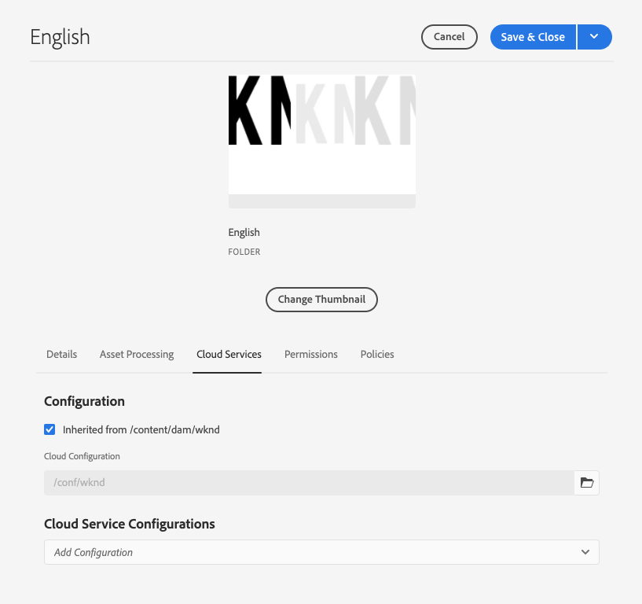

# De vertaalintegratie configureren {#configure-integration}

Leer hoe u verbinding AEM maken met een vertaalservice.

## Het verhaal tot nu toe {#story-so-far}

In het vorige document van de AEM hoofdloze vertaalreis, [ wordt begonnen met AEM hoofdloze vertaling ](learn-about.md) u leerde hoe te om uw inhoud zonder kop te organiseren en hoe AEM vertaalhulpmiddelen werken en u zou nu moeten:

* Begrijp het belang van inhoudsstructuur voor vertaling.
* Begrijp hoe AEM inhoud zonder kop opslaat.
* Wees vertrouwd met AEM vertaalhulpmiddelen.

Dit artikel bouwt op die grondbeginselen voort zodat kunt u de eerste configuratiestap nemen en de vertaaldienst opzetten, die u later in de reis zult gebruiken om uw inhoud te vertalen.

## Doelstelling {#objective}

Dit document helpt u te begrijpen hoe u een AEM integratie aan uw gekozen vertaaldienst plaatst. Na het lezen moet u:

* Begrijp de belangrijke parameters van het Kader van de Integratie van de Vertaling in AEM.
* Uw eigen verbinding met uw vertaalservice instellen.

## Het vertaalintegratieframework {#tif}

AEM TIF (Translation Integration Framework) integreert met vertaalservices van derden om de vertaling van AEM inhoud te ordenen. Het gaat om drie basisstappen.

1. Maak verbinding met uw vertaalserviceprovider.
1. Creeer een configuratie van het Kader van de Integratie van de Vertaling.
1. Koppel de configuratie aan uw inhoud.

In de volgende secties worden deze stappen nader beschreven.

## Verbinding maken met een vertaalserviceprovider {#connect-translation-provider}

De eerste stap bestaat uit het kiezen van de vertaalservice die u wilt gebruiken. Er zijn vele keuzen voor mensen en machine vertaaldiensten beschikbaar aan AEM. De meeste providers bieden een vertaalpakket aan dat moet worden geïnstalleerd. Zie de [ Extra sectie van Middelen ](#additional-resources) voor een selectie van beschikbare opties.

>[!NOTE]
>
>De vertaalspecialist is over het algemeen verantwoordelijk voor het kiezen van welke vertaaldienst aan gebruik, maar de beheerder is typisch verantwoordelijk voor het installeren van het vereiste pakket van de vertaalschakelaar.

Voor deze reis gebruiken we de Microsoft-vertaler die een proeflicentie AEM aanbieden. Zie de [ Extra sectie van Middelen ](#additional-resources) voor meer informatie over deze leverancier.

Als u een andere leverancier kiest, moet uw beheerder het aansluitingspakket installeren volgens de instructies van de vertaalservice.

>[!NOTE]
>
>Het gebruik van de uit-van-de-doos Microsoft Vertaler in AEM vereist geen extra opstelling en werkt zoals-is zonder extra schakelaarconfiguratie.
>
>Als u verkiest om de Vertaalschakelaar van Microsoft voor het testen doeleinden te gebruiken, te hoeven u niet om de stappen in de volgende twee secties uit te voeren: [ Creërend een Configuratie van de Integratie van de Vertaling ](#create-config) en [ associeer de Configuratie met Uw Inhoud ](#associate). Nochtans wordt u geadviseerd om hen te lezen zodat u met de stappen vertrouwd bent voor wanneer u uw aangewezen schakelaar moet vormen.
>
>De proefvergunning van de Vertaalschakelaar van Microsoft is niet voorgenomen voor productiedoeleinden en als u besluit om het vergunning te geven, moet de systeembeheerder de stappen volgen die in de [ Extra sectie van Middelen ](#additional-resources) aan het eind van dit document worden gedetailleerd zodat kunt u die vergunning vormen.

## Een configuratie voor vertaalintegratie maken {#create-config}

Nadat het schakelaarpakket voor uw aangewezen vertaaldienst wordt geïnstalleerd, moet u een configuratie van het Kader van de Integratie van de Vertaling voor die dienst tot stand brengen. De configuratie bevat de volgende informatie:

* Welke vertaalserviceprovider moet worden gebruikt?
* Of het vertalen van mensen of machines moet worden uitgevoerd
* Of andere inhoud die aan het inhoudsfragment is gekoppeld, zoals tags, moet worden vertaald

Een vertaalconfiguratie maken:

1. In het globale navigatiemenu, uitgezochte **Hulpmiddelen** > **Cloud Servicen** > **Cloud Servicen van de Vertaling**.
1. Navigeer naar de plaats waar u de configuratie in uw inhoudsstructuur wilt creëren. Dit is vaak gebaseerd op een bepaald project of kan globaal zijn.
   * In dit geval zou een configuratie globaal kunnen worden gemaakt om op alle inhoud, of enkel voor het WKND project van toepassing te zijn.

   {de configuratielocatie van 0} Vertaling ](assets/translation-configuration-location.png)

1. Selecteer **creeer** en **geef het venster van de Configuratie** uit verschijnt waar u de configuratieeigenschappen kunt vormen.

1. Inhoudsfragmenten worden opgeslagen als elementen in AEM. Selecteer het **Assets** lusje.


1. Geef de volgende informatie op.

   1. **Vertaalmethode** - selecteer **Vertaling van de Machine** of **Menselijke Vertaling** afhankelijk van uw vertaalleverancier. In het kader van deze reis gaan we uit van machinevertaling.
   1. **Vertaalleveranciers** - selecteer de schakelaar u voor uw vertaaldienst van de lijst installeerde.
   1. **Categorie van de Inhoud** - selecteer de meest aangewezen categorie om de vertaling (slechts voor machinevertaling) beter te richten.
   1. **vertaal het Fragment van de Inhoud Assets** - controleer dit om activa verbonden aan de Fragmenten van de Inhoud te vertalen.
   1. **vertaal Assets** - controleer dit om de activa te vertalen.
   1. **vertaal Meta-gegevens** - controleer dit om activa meta-gegevens te vertalen.
   1. **Vertaal Markeringen** - controleer dit om markeringen te vertalen die met de activa worden geassocieerd.
   1. **Auto-Uitvoer Vertaling** - controleer dit bezit als u vertalingen automatisch naar uw vertaaldienst wilt worden verzonden.
   1. **maak update-Enige Vertaling** onbruikbaar - wanneer deze optie wordt gecontroleerd, zal het bijwerken van het vertaalproject alle vertaalbare gebieden voor vertaling voorleggen, niet alleen die veranderd sinds laatste vertaling. Het bijwerken van uw vertaalproject wordt later in de reis besproken.
   1. **laat de Modelgebieden van de Inhoud voor Vertaling** toe - controleer deze optie zodat erkent de vertaalconfiguratie automatisch gebieden in de Modellen van de Inhoud die op de **Vertaalbare** vlag worden gebaseerd.

1. Selecteer **sparen &amp; Sluiten**.

U hebt nu de schakelaar aan uw vertaaldienst gevormd.

## De configuratie koppelen aan uw inhoud {#associate}

AEM is een flexibel en krachtig hulpmiddel en steunt veelvoudige, gelijktijdige vertaaldiensten via veelvoudige schakelaars en veelvoudige configuraties. Het opzetten van een dergelijke configuratie valt buiten het bereik van deze reis. Nochtans betekent deze flexibiliteit dat u moet specificeren welke schakelaars en configuratie zouden moeten worden gebruikt om uw inhoud te vertalen door deze configuratie met uw inhoud te associëren.

Navigeer hiertoe naar de hoofdtaalmap van de inhoud. Voor ons voorbeelddoel is dit

```text
/content/dam/<your-project>/en
```

1. Ga naar de globale navigatie en ga naar **Navigatie** > **Assets** > **Dossiers**.
1. In de activa console, selecteer de taalwortel om **Eigenschappen** te vormen en te selecteren.
1. Selecteer de **Cloud Servicen** tabel.
1. Onder **Configuraties van de Cloud Service** in **voeg de drop-down lijst van de Configuratie** toe, selecteer uw schakelaar. Het zou in de drop-down lijst moeten verschijnen wanneer u zijn pakket zoals [ eerder beschreven ](#connect-translation-provider) hebt geïnstalleerd.
1. Onder **Configuraties van de Cloud Service** in **voeg de drop-down lijst van de Configuratie** toe, ook uw configuratie.
1. Selecteer **sparen &amp; Sluiten**.



## Volgende functies {#what-is-next}

Nu u dit deel van de reis zonder kop hebt voltooid, moet u:

* Begrijp de belangrijke parameters van het Kader van de Integratie van de Vertaling in AEM.
* Uw eigen verbinding met uw vertaalservice instellen.

Bouw op deze kennis voort en zet uw AEM hoofdloze vertaalreis door het document [ te herzien vertaalt inhoud ](translation-rules.md), waar u leert hoe te om uw configuratie tot dusverre te gebruiken om uw inhoud eigenlijk te vertalen.

## Aanvullende bronnen {#additional-resources}

Terwijl wordt geadviseerd dat u zich op het volgende deel van de hoofdloze vertaalreis door het document [ te herzien vormt vertaalregels ](translation-rules.md) beweegt is het volgende wat extra, facultatieve middelen die een diepere duik op sommige concepten doen in dit document worden vermeld, maar zij worden niet vereist om op de hoofdloze reis verder te gaan.

* [ Vormend het Kader van de Integratie van de Vertaling ](/help/sites-cloud/administering/translation/integration-framework.md) - herzie een lijst van geselecteerde vertaalschakelaars en leer hoe te om het Kader van de Integratie van de Vertaling te vormen om met derdevertaaldiensten te integreren.
* [ Verbonden met de Vertaler van Microsoft ](/help/sites-cloud/administering/translation/connect-ms-translator.md) - AEM verstrekt een proefrekening van de Vertaling van Microsoft voor het testen doeleinden.
