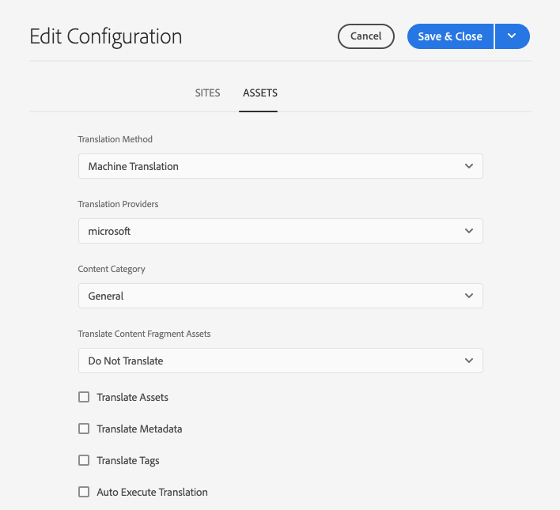

# De vertaalintegratie configureren {#configure-integration}

Leer hoe u verbinding AEM maken met een vertaalservice.

## Het verhaal tot nu toe {#story-so-far}

In het vorige document van de AEM zonder kop [Ga aan de slag met AEM headless vertaling](learn-about.md) u hebt geleerd hoe u uw inhoud zonder kop kunt ordenen en hoe AEM vertaalgereedschappen werken. Nu moet u:

* Begrijp het belang van inhoudsstructuur voor vertaling.
* Begrijp hoe AEM inhoud zonder kop opslaat.
* Wees vertrouwd met AEM vertaalhulpmiddelen.

Dit artikel bouwt op die grondbeginselen voort zodat kunt u de eerste configuratiestap nemen en de vertaaldienst opzetten, die u later in de reis zult gebruiken om uw inhoud te vertalen.

## Doelstelling {#objective}

Dit document helpt u te begrijpen hoe u een AEM integratie aan uw gekozen vertaaldienst plaatst. Na het lezen moet u:

* Begrijp de belangrijke parameters van het Kader van de Integratie van de Vertaling in AEM.
* Uw eigen verbinding met uw vertaalservice instellen.

## Het vertaalintegratieframework {#tif}

AEM TIF (Translation Integration Framework) integreert met vertaalservices van derden om de vertaling van AEM inhoud te ordenen. Het gaat om drie basisstappen.

1. Maak verbinding met uw vertaalserviceprovider.
1. Creeer een configuratie van het Kader van de Integratie van de Vertaling.
1. Koppel de configuratie aan uw inhoud.

In de volgende secties worden deze stappen nader beschreven.

## Verbinding maken met een vertaalserviceprovider {#connect-translation-provider}

De eerste stap bestaat uit het kiezen van de vertaalservice die u wilt gebruiken. Er zijn vele keuzen voor mensen en machine vertaaldiensten beschikbaar aan AEM. De meeste providers bieden een vertaalpakket aan dat moet worden geïnstalleerd. Zie de [Aanvullende bronnen](#additional-resources) voor een selectie van beschikbare opties.

>[!NOTE]
>
>De vertaalspecialist is over het algemeen verantwoordelijk voor het kiezen van welke vertaaldienst aan gebruik, maar de beheerder is typisch verantwoordelijk voor het installeren van het vereiste pakket van de vertaalschakelaar.

Voor deze reis gebruiken we de Microsoft-vertaler die een proeflicentie AEM aanbieden. Zie de [Aanvullende bronnen](#additional-resources) voor meer informatie over deze provider.

Als u een andere leverancier kiest, moet uw beheerder het aansluitingspakket installeren volgens de instructies van de vertaalservice.

>[!NOTE]
>
>Het gebruik van de uit-van-de-doos Microsoft Vertaler in AEM vereist geen extra opstelling en werkt zoals-is zonder extra schakelaarconfiguratie.
>
>Als u ervoor kiest de Microsoft Translator-aansluiting te gebruiken voor testdoeleinden, hoeft u de stappen in de volgende twee secties niet uit te voeren: [Een configuratie voor vertaalintegratie maken](#create-config) en [Koppel de configuratie aan uw inhoud.](#associate) Nochtans wordt u geadviseerd om hen te lezen zodat u met de stappen vertrouwd bent voor wanneer u uw aangewezen schakelaar moet vormen.
>
>De proeflicentie van de Microsoft Translator-aansluiting is niet bedoeld voor productiedoeleinden en als u besluit een licentie te verlenen, moet de systeembeheerder de stappen volgen die in het dialoogvenster [Aanvullende bronnen](#additional-resources) aan het einde van dit document, zodat u die licentie kunt configureren.

## Een configuratie voor vertaalintegratie maken {#create-config}

Nadat het schakelaarpakket voor uw aangewezen vertaaldienst wordt geïnstalleerd, moet u een configuratie van het Kader van de Integratie van de Vertaling voor die dienst tot stand brengen. De configuratie bevat de volgende informatie:

* Welke vertaalserviceprovider moet worden gebruikt?
* Of het vertalen van mensen of machines moet worden uitgevoerd
* Of andere inhoud die aan het inhoudsfragment is gekoppeld, zoals tags, moet worden vertaald

Een vertaalconfiguratie maken:

1. Selecteer in het algemene navigatiemenu de optie **Gereedschappen** > **Cloud Servicen** > **Cloud Servicen voor vertaling**.
1. Navigeer naar de plaats waar u de configuratie in uw inhoudsstructuur wilt creëren. Dit is vaak gebaseerd op een bepaald project of kan globaal zijn.
   * In dit geval zou een configuratie globaal kunnen worden gemaakt om op alle inhoud, of enkel voor het WKND project van toepassing te zijn.

   

1. Geef de volgende informatie op in de velden en selecteer **Maken**.
   1. Selecteren **Configuratietype** in de vervolgkeuzelijst. Selecteren **Translation Integration** in de lijst.
   1. Voer een **Titel** voor uw configuratie. De **Titel** identificeert de configuratie in de **Cloud Servicen** console en in de drop-down lijsten van het paginabezit.
   1. Typ desgewenst een **Naam** om te gebruiken voor het gegevensopslagknooppunt dat de configuratie opslaat.

   

1. Selecteren **Maken** en de **Configuratie bewerken** verschijnt waar u de configuratieeigenschappen kunt vormen.

1. Inhoudsfragmenten worden opgeslagen als elementen in AEM. Selecteer de **Activa** tab.



1. Geef de volgende informatie op.

   1. **Omzettingsmethode** - Selecteer **Machinevertaling** of **Menselijke vertaling** afhankelijk van uw vertaalbureau. In het kader van deze reis gaan we uit van machinevertaling.
   1. **Vertaalproviders** - Selecteer in de lijst de connector die u voor uw vertaalservice hebt geïnstalleerd.
   1. **Inhoudscategorie** - Selecteer de meest geschikte categorie om de vertaling beter te richten (alleen voor machinevertaling).
   1. **Elementen van inhoudsfragmenten omzetten** - Schakel dit selectievakje in om elementen te vertalen die aan inhoudsfragmenten zijn gekoppeld.
   1. **Elementen vertalen** - Schakel dit selectievakje in om de elementen te vertalen.
   1. **Metagegevens vertalen** - Schakel deze optie in om metagegevens van elementen te vertalen.
   1. **Tags vertalen** - Schakel dit selectievakje in om codes te vertalen die aan het element zijn gekoppeld.
   1. **Vertaling automatisch uitvoeren** - Schakel deze eigenschap in als u vertalingen automatisch naar uw vertaalservice wilt verzenden.
   1. **Alleen-bijwerken translatie uitschakelen** - Als deze optie is ingeschakeld, worden bij het bijwerken van het vertaalproject alle vertaalbare velden voor vertaling ingediend, en niet alleen de velden die zijn gewijzigd sinds de laatste vertaling. Het bijwerken van uw vertaalproject wordt later in de reis besproken.
   1. **Velden voor inhoudsmodellen inschakelen voor vertaling** - Schakel deze optie in zodat de vertaalconfiguratie automatisch velden in de inhoudsmodellen herkent die zijn gebaseerd op de **Vertaalbaar** markering.

1. Selecteren **Opslaan en sluiten**.

U hebt nu de schakelaar aan uw vertaaldienst gevormd.

## De configuratie koppelen aan uw inhoud {#associate}

AEM is een flexibel en krachtig hulpmiddel en steunt veelvoudige, gelijktijdige vertaaldiensten via veelvoudige schakelaars en veelvoudige configuraties. Het opzetten van een dergelijke configuratie valt buiten het bereik van deze reis. Nochtans betekent deze flexibiliteit dat u moet specificeren welke schakelaars en configuratie zouden moeten worden gebruikt om uw inhoud te vertalen door deze configuratie met uw inhoud te associëren.

Navigeer hiertoe naar de hoofdtaalmap van de inhoud. Voor ons voorbeelddoel is dit

```text
/content/dam/<your-project>/en
```

1. Ga naar de globale navigatie en ga naar **Navigatie** > **Activa** > **Bestanden**.
1. Selecteer in de middelenconsole de hoofdtaal die u wilt configureren en selecteer **Eigenschappen**.
1. Selecteer de **Cloud Servicen** tab.
1. Onder **Configuraties van Cloud Servicen** in de **Configuratie toevoegen** drop-down lijst, selecteer uw schakelaar. Het moet in de vervolgkeuzelijst worden weergegeven wanneer u het pakket hebt geïnstalleerd als [hierboven beschreven.](#connect-translation-provider)
1. Onder **Configuraties van Cloud Servicen** in de **Configuratie toevoegen** vervolgkeuzelijst, ook uw configuratie selecteren.
1. Selecteren **Opslaan en sluiten**.


## Volgende functies {#what-is-next}

Nu u dit deel van de reis zonder kop hebt voltooid, moet u:

* Begrijp de belangrijke parameters van het Kader van de Integratie van de Vertaling in AEM.
* Uw eigen verbinding met uw vertaalservice instellen.

Gebaseerd op deze kennis en doorgaan met uw AEM reis zonder hoofd door het document opnieuw te bekijken [Inhoud vertalen,](translation-rules.md) waar u leert hoe u uw configuratie tot nu toe gebruikt om uw inhoud te vertalen.

## Aanvullende bronnen {#additional-resources}

U kunt het beste naar het volgende gedeelte van de reis zonder kop gaan door het document te bekijken [Vertaalregels configureren](translation-rules.md) hieronder volgen enkele aanvullende , optionele bronnen die dieper ingaan op bepaalde in dit document genoemde concepten , maar die niet nodig zijn om verder te gaan op de weg zonder kop .

* [Het Kader voor de Integratie van de Vertaling vormen](/help/sites-cloud/administering/translation/integration-framework.md) - Een lijst met geselecteerde vertaalconnectors bekijken en leren hoe u het vertaalintegratieframework kunt configureren voor integratie met vertaalservices van derden.
* [Verbinding maken met Microsoft Translator](/help/sites-cloud/administering/translation/connect-ms-translator.md) - AEM verstrekt een proefrekening van Microsoft Vertaling voor testdoeleinden.
