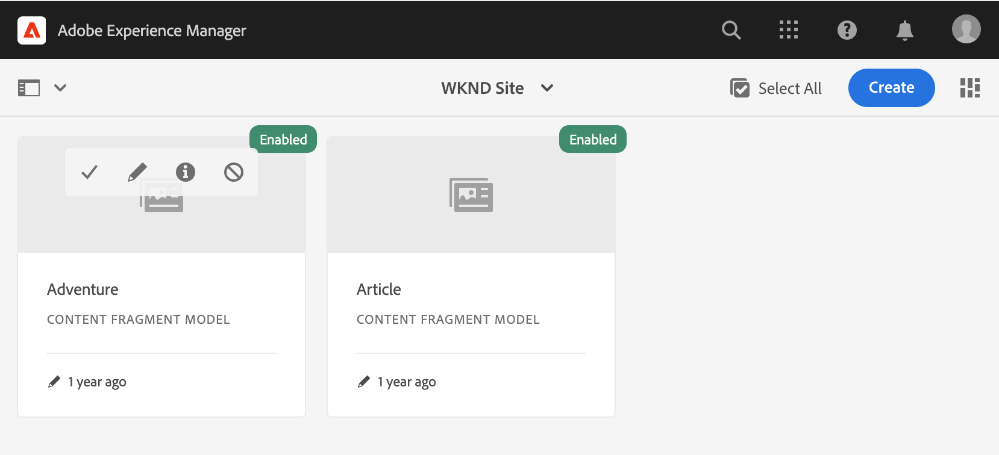

# Ga aan de slag met AEM headless Translation {#getting-started}

Leer hoe u uw inhoud zonder kop kunt ordenen en hoe AEM vertaalgereedschappen werken.

## Het verhaal tot nu toe {#story-so-far}

In het vorige document van de AEM zonder kop [Meer informatie over inhoud zonder kop en hoe u kunt vertalen in AEM](learn-about.md) U leerde de basistheorie van wat een krantenloze CMS is en u zou nu moeten:

* Begrijp de basisconcepten van inhoud zonder kop levering.
* Wees vertrouwd met de manier waarop AEM ondersteuning biedt voor headless en translatie.

Dit artikel bouwt verder op die grondbeginselen zodat u begrijpt hoe AEM inhoud zonder kop opslaat en beheert en hoe u AEM vertaalhulpmiddelen kunt gebruiken om die inhoud te vertalen.

## Doelstelling {#objective}

Dit document helpt u begrijpen hoe u aan de slag kunt gaan met het vertalen van inhoud zonder kop in AEM. Na het lezen moet u:

* Begrijp het belang van inhoudsstructuur voor vertaling.
* Begrijp hoe AEM inhoud zonder kop opslaat.
* Wees vertrouwd met AEM vertaalhulpmiddelen.

## Eisen en voorwaarden {#requirements-prerequisites}

Er zijn verschillende vereisten waaraan u moet voldoen voordat u inhoud zonder kop gaat vertalen AEM inhoud.

### Kennis {#knowledge}

* Ervaar het vertalen van inhoud in een CMS
* Ervaar het gebruiken van de basiseigenschappen van grootschalig CMS
* Werken met AEM basisverwerking
* Kennis van de vertaalservice die u gebruikt
* Basiskennis hebben van de inhoud die u wilt vertalen

>[!TIP]
>
>Als u niet vertrouwd bent met het gebruik van een grootschalig CMS als AEM, kunt u overwegen om de [Basisverwerking](/help/sites-cloud/authoring/basic-handling.md) documentatie voordat u verdergaat. De documentatie van de Basisbehandeling maakt geen deel uit van de reis. Ga daarom terug naar deze pagina wanneer u klaar bent.

### Gereedschappen {#tools}

* Sandbox-toegang voor het testen van het vertalen van uw inhoud
* Credentials om verbinding te maken met uw voorkeursvertaalservice
* Lid zijn van de `project-administrators` groep in AEM

## Structuur is sleutel {#content-structure}

AEM inhoud, of het nu kranteloze of traditionele webpagina&#39;s zijn, wordt aangedreven door de structuur ervan. AEM stelt weinig vereisten aan de inhoudsstructuur op, maar een zorgvuldige overweging van uw inhoudshiërarchie als onderdeel van de projectplanning kan vertaling veel eenvoudiger maken.

>[!TIP]
>
>Plan voor vertaling bij het allereerste begin van het project zonder kop. Werk vroeg nauw samen met de projectmanager en de inhoudarchitecten.
>
>Een projectmanager voor internationalisatie kan worden verlangd als een aparte persoon die tot taak heeft te bepalen welke inhoud moet worden vertaald en wat niet, en welke vertaalde inhoud door regionale of lokale inhoudproducenten kan worden gewijzigd.

## Hoe AEM inhoud zonder kop opslaat {#headless-content-in-aem}

Voor de vertaalspecialist is het niet belangrijk om diepgaand te begrijpen hoe AEM inhoud zonder kop beheert. Het is echter nuttig bekend te zijn met de basisconcepten en -terminologie, aangezien u later AEM vertaalhulpmiddelen gebruikt. Het belangrijkste is dat u uw eigen inhoud begrijpt en hoe deze is gestructureerd, zodat u deze effectief kunt vertalen.

### Inhoudsmodellen {#content-models}

Om ervoor te zorgen dat inhoud zonder kop consistent wordt geleverd tussen kanalen, regio&#39;s en talen, moet de inhoud zeer gestructureerd zijn. AEM gebruikt Content Models om deze structuur af te dwingen. U kunt Content Models zien als een soort sjabloon of patroon voor het maken van inhoud zonder kop. Omdat elk project zijn eigen behoeften heeft, bepaalt elk project zijn eigen Modellen van het Fragment van de Inhoud. AEM heeft geen vaste eisen of structuur voor dergelijke modellen.

De inhoudarchitect werkt in een vroeg stadium van het project om deze structuur te definiëren. Als vertaler moet u nauw samenwerken met de inhoudarchitect om de inhoud te begrijpen en te ordenen.

>[!NOTE]
>
>Het is de verantwoordelijkheid van de inhoudarchitect om de inhoudsmodellen te definiëren. De vertaalspecialist mag alleen vertrouwd zijn met de structuur die in de volgende stappen wordt beschreven.

Omdat de inhoudsmodellen de structuur van uw inhoud bepalen, moet u weten welke gebieden van uw modellen moeten worden vertaald. In het algemeen werkt u met de inhoudarchitect om dit te definiëren. Volg onderstaande stappen om door de velden van uw inhoudsmodellen te bladeren.

1. Navigeren naar **Gereedschappen** > **Algemeen** > **Modellen van inhoudsfragmenten**.
1. Modellen van inhoudsfragmenten worden over het algemeen opgeslagen in een mapstructuur. Selecteer de map voor uw project.
1. De modellen worden vermeld. Selecteer het model om de details weer te geven.
   
1. De **Inhoudsfragmentmodeleditor** wordt geopend.
   1. De linkerkolom bevat de velden van het model. Deze kolom interesseert ons.
   1. De rechterkolom bevat de velden die aan het model kunnen worden toegevoegd. Deze kolom kunnen wij negeren.
      
1. Selecteer een van de velden van het model. AEM worden het en de details van dat gebied getoond in de juiste kolom.
   
1. De inhoudarchitect schakelt de **Vertaalbaar** veld op elk veld Inhoudsmodel dat moet worden vertaald.

>[!TIP]
>
>Over het algemeen is de inhoudarchitect verantwoordelijk voor het identificeren van de velden die vereist zijn voor vertaling. De voorafgaande stappen zijn bedoeld voor het begrijpen van de vertaalspecialist.

### Inhoudsfragmenten {#content-fragments}

Inhoudsmodellen worden door de auteurs van de inhoud gebruikt om de inhoud zonder kop te maken. Inhoudsauteurs selecteren op welk model ze hun inhoud willen baseren en maken vervolgens Inhoudsfragmenten. Inhoudsfragmenten zijn exemplaren van de modellen en vertegenwoordigen feitelijke inhoud die zonder kop moet worden geleverd.

Als Content Models de patronen voor de inhoud zijn, zijn de Content Fragments de daadwerkelijke inhoud die op die patronen wordt gebaseerd. De inhoudsfragmenten vertegenwoordigen de inhoud die moet worden vertaald.

Inhoudsfragmenten worden als elementen in AEM beheerd als onderdeel van DAM (Digital Asset Management). Dit is belangrijk omdat ze allemaal onder het pad zijn geplaatst `/content/dam`.

## Aanbevolen inhoudsstructuur {#recommended-structure}

Zoals eerder geadviseerd, werk met uw inhoudarchitect om de aangewezen inhoudsstructuur voor uw eigen project te bepalen. Het volgende is echter een bewezen, eenvoudige en intuïtieve structuur die heel effectief is.

Een basismap definiëren voor uw project onder `/content/dam`.

```text
/content/dam/<your-project>
```

De taal waarin uw inhoud wordt geschreven wordt genoemd de taalwortel. In ons voorbeeld is het Engels en moet het onder dit pad liggen.

```text
/content/dam/<your-project>/en
```

Alle projectinhoud die mogelijk moet worden gelokaliseerd, moet onder de hoofdmap van de taal worden geplaatst.

```text
/content/dam/<your-project>/en/<your-project-content>
```

De vertalingen zouden als sibling omslagen naast de taalwortel met hun omslagnaam moeten worden gecreeerd die ISO-2 taalcode van de taal vertegenwoordigt. Duits zou bijvoorbeeld het volgende pad hebben.

```text
/content/dam/<your-project>/de
```

>[!NOTE]
>
>Over het algemeen is de inhoudsarchitect verantwoordelijk voor het maken van deze taalmappen. Als ze niet worden gecreëerd, kunnen AEM later geen vertaalbanen creëren.

De uiteindelijke structuur kan er ongeveer als volgt uitzien.

```text
/content
    |- dam
        |- your-project
            |- en
                |- some
                |- exciting
                |- headless
                |- content
            |- de
            |- fr
            |- it
            |- ...
        |- another-project
        |- ...
```

Houd rekening met het specifieke pad van uw inhoud, omdat dit later nodig is om uw vertaling te configureren.

>[!NOTE]
>
>Het is doorgaans de verantwoordelijkheid van de inhoudarchitect om de inhoudstructuur te definiëren, maar kan samenwerken met de vertaalspecialist.
>
>Het wordt hier nader toegelicht om de volledigheid te waarborgen.

## AEM vertaalgereedschappen {#translation-tools}

Nu u begrijpt wat Content Fragments zijn en hoe belangrijk de inhoudsstructuur is, kunnen we bekijken hoe we deze inhoud kunnen vertalen. De vertaalhulpmiddelen in AEM zijn vrij krachtig, maar eenvoudig te begrijpen op hoog niveau.

* **Vertaalaansluiting** - De connector is de koppeling tussen AEM en de vertaalservice die u gebruikt.
* **Omzettingsprojecten** - Vertaalprojecten bevatten inhoud die als één enkele vertaalinspanning moet worden aangepakt en volgen de voortgang van de vertaling, die met de schakelaar in aanraking komt om de te vertalen inhoud over te brengen en het terug van de vertaaldienst te ontvangen.

U plaatst over het algemeen slechts eens uw schakelaar voor uw instantie. Vervolgens gebruikt u vertaalprojecten om uw inhoud te vertalen en de vertalingen voortdurend bij te werken.

## Volgende functies {#what-is-next}

Nu u dit deel van de reis zonder kop hebt voltooid, moet u:

* Begrijp het belang van inhoudsstructuur voor vertaling.
* Begrijp hoe AEM inhoud zonder kop opslaat.
* Wees vertrouwd met AEM vertaalhulpmiddelen.

Gebaseerd op deze kennis en doorgaan met uw AEM reis zonder hoofd door het document opnieuw te bekijken [De vertaalintegratie configureren](configure-connector.md) waar u leert hoe u verbinding AEM maken met een vertaalservice.|

## Aanvullende bronnen {#additional-resources}

U kunt het beste naar het volgende gedeelte van de reis zonder kop gaan door het document te bekijken [De vertaalaansluiting configureren](configure-connector.md) hieronder volgen enkele aanvullende , optionele bronnen die dieper ingaan op bepaalde in dit document genoemde concepten , maar die niet nodig zijn om verder te gaan op de weg zonder kop .

* [AEM basisverwerking](/help/sites-cloud/authoring/basic-handling.md) - Leer de basisbeginselen van de AEM-interface om eenvoudig door essentiële taken te kunnen navigeren en deze uit te voeren, zoals het zoeken naar uw inhoud.
* [Te vertalen inhoud identificeren](/help/sites-cloud/administering/translation/rules.md) - Leer hoe vertaalregels inhoud identificeren die moet worden vertaald.
* [Het Kader voor de Integratie van de Vertaling vormen](/help/sites-cloud/administering/translation/integration-framework.md) - Leer hoe u het vertaalintegratieframework kunt configureren voor integratie met vertaalservices van derden.
* [Vertaalprojecten beheren](/help/sites-cloud/administering/translation/managing-projects.md) - Leer hoe u zowel machine- als menselijke vertaalprojecten in AEM kunt maken en beheren.
* [Inleiding tot AEM als een headless CMS](/help/headless/introduction.md)
* [Tutorials voor headless in AEM](https://experienceleague.adobe.com/docs/experience-manager-learn/getting-started-with-aem-headless/overview.html)
