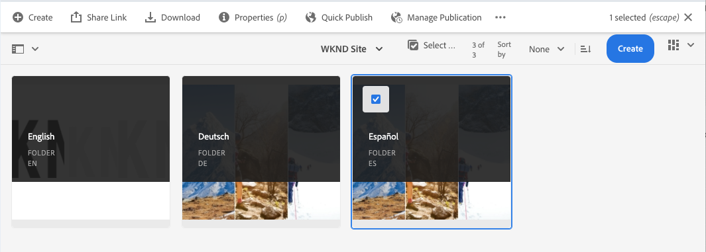
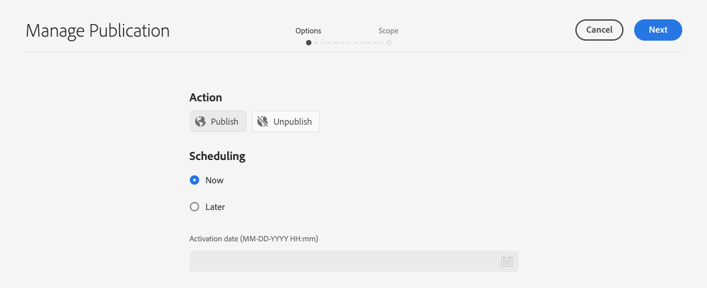

# Vertaalde inhoud zonder kop publiceren {#publish-content}

Leer hoe u uw vertaalde inhoud publiceert en de vertalingen bijwerkt terwijl de inhoud wordt bijgewerkt.

## Het verhaal tot nu toe {#story-so-far}

In het vorige document van de AEM zonder kop [Inhoud vertalen,](configure-connector.md) u hebt geleerd hoe u AEM vertaalprojecten kunt gebruiken om uw inhoud zonder kop te vertalen. Nu moet u:

* Begrijp wat een vertaalproject is.
* U kunt nieuwe vertaalprojecten maken.
* Gebruik vertaalprojecten om uw inhoud zonder kop te vertalen.

Nu uw eerste vertaling is voltooid, wordt in dit artikel de volgende stap gezet voor het publiceren van die inhoud en wat u moet doen om uw vertalingen bij te werken wanneer de onderliggende inhoud in de hoofdtaalwijziging verandert.

## Doelstelling {#objective}

Dit document helpt u te begrijpen hoe u inhoud zonder kop in AEM kunt publiceren en hoe u een continue workflow kunt maken om uw vertalingen up-to-date te houden. Nadat u dit document hebt gelezen, moet u:

* Begrijp het auteur-publicatiemodel van AEM.
* Zorg dat u weet hoe u uw vertaalde inhoud publiceert.
* Een voortdurend updatemodel voor uw vertaalde inhoud kunnen implementeren.

## Auteur-publicatiemodel AEM {#author-publish}

Voordat u de inhoud publiceert, is het verstandig om AEM publicatiemodel te begrijpen. In vereenvoudigde termen verdeelt AEM gebruikers van het systeem in twee groepen.

1. Degenen die de inhoud en het systeem maken en beheren
1. Degenen die de inhoud van het systeem consumeren

AEM wordt daarom fysiek in twee gevallen gescheiden.

1. De **auteur** -instantie is het systeem waarop auteurs en beheerders van inhoud werken om inhoud te maken en te beheren.
1. De **publish** het systeem dat de inhoud aan de consumenten levert , is bijvoorbeeld het systeem .

Nadat inhoud op de instantie van de auteur is gemaakt, moet deze naar de instantie publish worden overgedragen om de inhoud beschikbaar te maken voor consumptie. Het proces waarbij van de auteur naar publicatie wordt overgeschakeld, wordt **publicatie**.

## Uw vertaalde inhoud publiceren {#publishing}

Zodra u tevreden bent met de staat van uw vertaalde inhoud, moet het worden gepubliceerd zodat de headless diensten het kunnen verbruiken. Deze taak valt gewoonlijk niet onder de verantwoordelijkheid van de vertaalspecialist, maar wordt hier beschreven om de volledige werkstroom te illustreren.

>[!NOTE]
>
>Wanneer de vertaling is voltooid, informeert de vertalingsspecialist de eigenaars van de inhoud over het feit dat de vertalingen klaar zijn voor publicatie. De eigenaars van de inhoud publiceren deze vervolgens.
>
>De volgende stappen worden verstrekt voor volledigheid.

De eenvoudigste manier om de vertalingen te publiceren is aan de omslag van projectactiva te navigeren.

```text
/content/dam/<your-project>/
```

Onder dit pad hebt u submappen voor elke vertaaltaal en kunt u kiezen welke taal u wilt publiceren.

1. Ga naar **Navigatie** > **Activa** > **Bestanden** en opent u de projectmap.
1. Hier ziet u de hoofdmap van de taal en alle andere taalmappen. Selecteer de gelokaliseerde taal of talen die u wilt publiceren.
   
1. Selecteren **Publicatie beheren**.
1. In de **Publicatie beheren** venster, zorg ervoor dat **Publiceren** wordt automatisch geselecteerd onder **Handeling** en dat **Nu** is geselecteerd onder **Planning**. Selecteren **Volgende**.
   
1. In het volgende **Publicatie beheren** bevestigen dat het juiste pad of de juiste paden is of zijn geselecteerd. Selecteren **Publiceren**.
   
1. AEM bevestigt de publicatieactie met een pop-upbericht onder aan het scherm.
   

Uw vertaalde inhoud zonder kop is nu gepubliceerd! Het kan nu door uw headless diensten worden betreden en worden verbruikt.

>[!TIP]
>
>U kunt meerdere items selecteren (dat wil zeggen meerdere taalmappen) wanneer u publiceert, zodat u meerdere vertalingen tegelijk kunt publiceren.

Er zijn extra opties wanneer het publiceren van uw inhoud, zoals het plannen van een publicatietijd, die buiten het werkingsgebied van deze reis zijn. Zie de [Aanvullende bronnen](#additional-resources) aan het einde van het document voor meer informatie.

## Uw vertaalde inhoud bijwerken {#updating-translations}

Vertaling is zelden een eenmalige exercitie. Meestal blijven auteurs van inhoud uw inhoud toevoegen aan en wijzigen deze in de hoofdmap van de taal nadat de eerste vertaling is voltooid. Dit betekent dat u ook uw vertaalde inhoud moet bijwerken.

De specifieke projectvereisten bepalen hoe vaak u uw vertalingen moet bijwerken en welk besluitvormingsproces wordt gevolgd alvorens een update uit te voeren. Zodra u hebt besloten uw vertalingen bij te werken, is het proces in AEM zeer eenvoudig. Aangezien de eerste vertaling gebaseerd was op een vertaalproject, zijn ook updates mogelijk.

Het proces verschilt echter enigszins als u ervoor kiest om uw vertaalproject automatisch te maken of uw vertaalproject handmatig te maken.

### Een automatisch gemaakt vertaalproject bijwerken {#updating-automatic-project}

1. Navigeren naar **Navigatie** > **Activa** > **Bestanden**. Onthoud dat inhoud zonder kop in AEM wordt opgeslagen als elementen die Content Fragments worden genoemd.
1. Selecteer de taalwortel van uw project. In dit geval hebben we `/content/dam/wknd/en`.
1. Selecteer de spoorkiezer en geef de **Verwijzingen** deelvenster.
1. Selecteren **Taalkopieën**.
1. Controleer de **Taalkopieën** selectievakje.
1. De sectie uitbreiden **Taalkopieën bijwerken** onder aan het venster Verwijzingen.
1. In de **Project** vervolgkeuzelijst, selecteert u **Toevoegen aan een bestaand vertaalproject**.
1. In de **Bestaand vertaalproject** selecteert u het project dat u voor de eerste vertaling hebt gemaakt.
1. Selecteren **Start**.


De inhoud wordt toegevoegd aan het bestaande vertaalproject. Het vertaalproject weergeven:

1. Navigeren naar **Navigatie** > **Projecten**.
1. Selecteer het project dat u net hebt bijgewerkt.
1. Selecteer de taal of een van de talen die u hebt bijgewerkt.

U ziet dat er een nieuwe banenkaart aan het project is toegevoegd. In dit voorbeeld is een andere Spaanse vertaling toegevoegd.


U kunt zien dat de statistieken op de nieuwe kaart (aantal activa en inhoudsfragmenten) verschillend zijn. Dit komt omdat AEM herkent wat er is veranderd sinds de laatste vertaling en alleen de inhoud bevat die moet worden vertaald. Dit omvat het opnieuw vertalen van bijgewerkte inhoud en het voor het eerst vertalen van nieuwe inhoud.

Vanaf dit punt kunt u [start en beheer uw vertaaltaak op dezelfde manier als het origineel.](translate-content.md#using-translation-project)

### Een handmatig gemaakt vertaalproject bijwerken {#updating-manual-project}

Als u een vertaling wilt bijwerken, kunt u een nieuwe taak toevoegen aan uw bestaande project die verantwoordelijk is voor het vertalen van de bijgewerkte inhoud.

1. Navigeren naar **Navigatie** > **Projecten**.
1. Selecteer het project dat u moet bijwerken.
1. Selecteer de **Toevoegen** boven in het venster.
1. In de **Tegel toevoegen** venster, selecteert u **Vertaaltaak** en vervolgens **Verzenden**.

   

1. Selecteer op de kaart van de nieuwe vertaalbaan de chevron knoop bij de bovenkant van de kaart, en selecteer **Doel bijwerken** om de doeltaal van de nieuwe baan te bepalen.

   

1. In de **Doeltaal selecteren** , gebruikt u de vervolgkeuzelijst om de taal te selecteren en **Gereed**.

   

1. Als de doeltaal van uw nieuwe vertaaltaak is ingesteld, selecteert u de knop voor de weglatingsteken onder aan de taakkaart om de details van de taak weer te geven.
1. De taak is leeg wanneer deze voor het eerst wordt gemaakt. Inhoud aan de taak toevoegen door te tikken of op de knop **Toevoegen** en het gebruiken van wegbrowser [zoals u dat eerder deed toen u het vertaalproject oorspronkelijk creeerde.](translate-content.md##manually-creating)

>[!TIP]
>
>De krachtige filters van de padbrowser kunnen ook weer nuttig zijn om alleen de inhoud te zoeken die is bijgewerkt.
>
>Meer informatie over de padbrowser vindt u in het dialoogvenster [sectie aanvullende bronnen.](#additional-resources)

Vanaf dit punt kunt u [start en beheer uw vertaaltaak op dezelfde manier als het origineel.](translate-content.md#using-translation-project)

## Einde van de reis? {#end-of-journey}

Gefeliciteerd! U hebt de reis zonder kop voltooid! Nu moet u:

* Heb een overzicht van wat koploze inhoudlevering is.
* U hebt een basiskennis AEM functies zonder kop.
* Begrijp AEM vertaalfuncties en hoe deze verwant zijn aan inhoud zonder kop.
* U kunt beginnen met het vertalen van uw eigen inhoud zonder kop.

U kunt nu uw eigen inhoud zonder kop in AEM vertalen. AEM is echter een krachtig hulpmiddel en er zijn veel aanvullende opties beschikbaar. Bekijk enkele aanvullende bronnen die beschikbaar zijn in het dialoogvenster [Sectie Aanvullende bronnen](#additional-resources) voor meer informatie over de functies die u tijdens deze reis hebt gezien.

## Aanvullende bronnen {#additional-resources}

* [Vertaalprojecten beheren](/help/sites-cloud/administering/translation/managing-projects.md) - Leer de details van vertaalprojecten en aanvullende functies zoals workflows voor menselijke vertaling en meertalige projecten.
* [Ontwerpconcepten](/help/sites-cloud/authoring/author-publish.md) - Meer informatie over de auteur en het publicatiemodel van AEM. Dit document is gericht op het schrijven van pagina&#39;s in plaats van op inhoudfragmenten, maar de theorie blijft van toepassing.
* [Pagina&#39;s publiceren](/help/sites-cloud/authoring/sites-console/publishing-pages.md) - Meer informatie over de extra functies die beschikbaar zijn wanneer u inhoud publiceert. Dit document is gericht op het schrijven van pagina&#39;s in plaats van op inhoudfragmenten, maar de theorie blijft van toepassing.
* [Ontwerpomgeving en -gereedschappen](/help/sites-cloud/authoring/path-selection.md#path-selection) - AEM biedt verschillende mechanismen voor het organiseren en bewerken van uw inhoud, waaronder een robuuste padbrowser.
