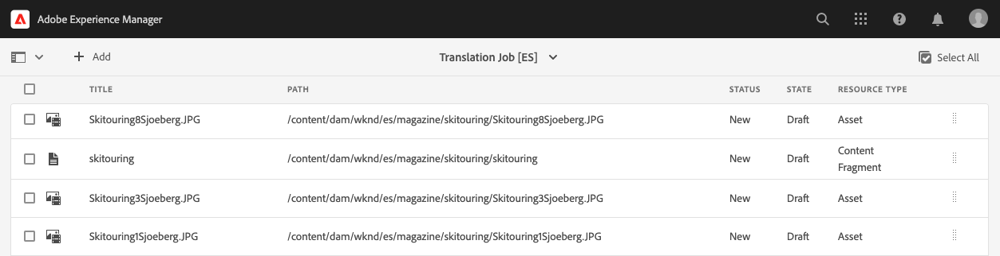
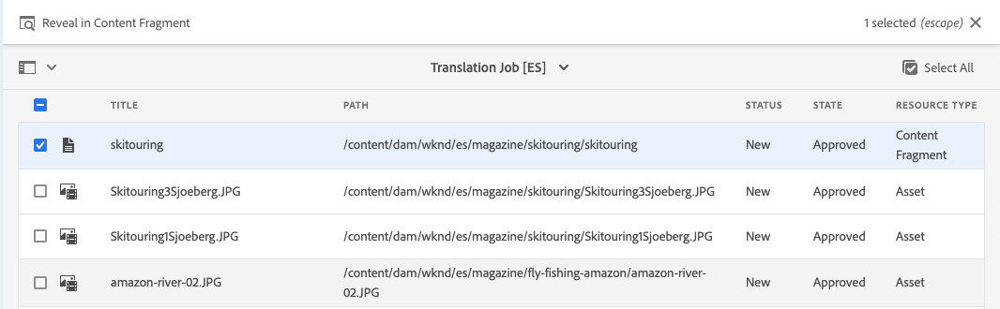

# Inhoud vertalen {#translate-content}

Gebruik de vertaalaansluiting en de regels om uw inhoud zonder kop te vertalen.

## Het verhaal tot nu toe {#story-so-far}

In het vorige document van de AEM hoofdloze vertaalreis, [Vorm Vertaal Regels](translation-rules.md) u leerde hoe te om AEM vertaalregels te gebruiken om uw vertaalinhoud te identificeren. Nu moet u:

* Begrijp wat de vertaalregels doen.
* U kunt uw eigen vertaalregels definiëren.

Nu uw schakelaar en vertaalregels opstelling zijn, neemt dit artikel u door de volgende stap van het vertalen van uw inhoud zonder kop.

## Doelstelling {#objective}

Dit document helpt u begrijpen hoe te om AEM vertaalprojecten samen met de schakelaar en uw vertaalregels te gebruiken om inhoud te vertalen. Nadat u dit document hebt gelezen, moet u:

* Begrijp wat een vertaalproject is.
* Nieuwe vertaalprojecten kunnen maken.
* Gebruik vertaalprojecten om uw inhoud zonder kop te vertalen.

## Een vertaalproject maken {#creating-translation-project}

Met vertaalprojecten kunt u de vertaling van inhoud zonder kop AEM. In een vertaalproject wordt de inhoud verzameld die op één locatie in andere talen moet worden vertaald voor een centrale weergave van de vertaalwerkzaamheden.

Wanneer inhoud aan een vertaalproject wordt toegevoegd, wordt een vertaalbaan gecreeerd voor het. Taken bieden opdrachten en statusinformatie die u gebruikt om de workflows voor het vertalen van mensen en computers die op de bronnen worden uitgevoerd, te beheren.

Vertaalprojecten kunnen op twee manieren worden gemaakt:

1. Selecteer de taalwortel van de inhoud en hebben AEM automatisch tot het vertaalproject leiden dat op de inhoudspad wordt gebaseerd.
1. Maak een leeg project en selecteer handmatig de inhoud die u aan het vertaalproject wilt toevoegen

Beide zijn geldige benaderingen die doorgaans alleen verschillen op basis van de persoon die de vertaling uitvoert:

* De TPM (vertaalprojectmanager) heeft vaak de flexibiliteit nodig om de inhoud handmatig te selecteren voor het vertaalproject.
* Als de eigenaar van de inhoud ook verantwoordelijk is voor de vertaling, is het vaak gemakkelijker AEM het project automatisch te maken op basis van het geselecteerde inhoudspad.

Beide benaderingen worden in de volgende secties verkend.

### Automatisch een vertaalproject maken op basis van het inhoudspad {#automatically-creating}

Voor eigenaars van inhoud die ook verantwoordelijk zijn voor vertaling, is het vaak gemakkelijker om het vertaalproject automatisch AEM maken. AEM automatisch een vertaalproject maken op basis van het inhoudspad:

1. Navigeer naar **Navigation** -> **Middelen** -> **Bestanden**. Onthoud dat inhoud zonder kop in AEM wordt opgeslagen als elementen die Content Fragments worden genoemd.
1. Selecteer de taalwortel van uw project. In dit geval hebben we `/content/dam/wknd/en` geselecteerd.
1. Tik op de spoorkiezer of klik op deze en toon het venster **References**.
1. Tik of klik op **Taalkopieën**.
1. Schakel het selectievakje **Taalkopieën** in.
1. Vouw de sectie **Taalkopieën bijwerken** onder in het venster Referenties uit.
1. Selecteer **Vertaalproject(en) maken** in het vervolgkeuzemenu **Project**.
1. Geef een geschikte titel op voor uw vertaalproject.
1. Tik of klik op **Start**.


U ontvangt een bericht dat het project werd gecreeerd.

>[!NOTE]
>
>Aangenomen wordt dat de vereiste taalstructuur voor de vertalingstalen al is gemaakt als onderdeel van de [definitie van de inhoudsstructuur.](getting-started.md#content-structure) Dit moet gebeuren in samenwerking met de inhoudarchitect.
>
>Als de taalmappen niet van tevoren worden gemaakt, kunt u geen taalkopieën maken zoals beschreven in de vorige stappen.

### Handmatig een vertaalproject maken door uw inhoud te selecteren {#manually-creating}

Voor managers van vertaalprojecten, is het vaak noodzakelijk om specifieke inhoud manueel te selecteren om in een vertaalproject te omvatten. Als u een dergelijk handmatig vertaalproject wilt maken, moet u eerst een leeg project maken en vervolgens de inhoud selecteren die u aan het project wilt toevoegen.

1. Navigeer naar **Navigation** -> **Projecten**.
1. Tik of klik op **Maken** -> **Map** om een map voor uw projecten te maken.
   * Dit is optioneel, maar handig om uw vertaalwerkzaamheden te organiseren.
1. Voeg in het venster **Project maken** een **Titel** voor de map toe en tik op **Maken** of klik op.

   

1. Tik of klik op de map om de map te openen.
1. Tik of klik in de nieuwe projectmap op **Maken** -> **Project**.
1. Projecten zijn gebaseerd op sjablonen. Tik of klik op de sjabloon **Vertaalproject** om het te selecteren en tik of klik op **Volgende**.

   

1. Op **Basis** lusje, ga een naam voor uw nieuw project in.

   

1. Gebruik op het tabblad **Geavanceerd** het vervolgkeuzemenu **Doeltaal** om de taal of talen te selecteren waarin de inhoud moet worden vertaald. Tik of klik op **Maken**.

   

1. Tik of klik op **Openen** in het bevestigingsdialoogvenster.

   

Het project is gemaakt, maar bevat geen inhoud om te vertalen. In de volgende sectie wordt beschreven hoe het project is gestructureerd en hoe u inhoud kunt toevoegen.

## Een vertaalproject gebruiken {#using-translation-project}

Vertaalprojecten zijn ontworpen om alle inhoud en taken in verband met een vertaalinspanning op één plaats te verzamelen, zodat uw vertaling eenvoudig en eenvoudig te beheren is.

Het vertaalproject weergeven:

1. Navigeer naar **Navigation** -> **Projecten**.
1. Tik of klik op het project dat in de vorige sectie is gemaakt.


Het project is verdeeld in meerdere kaarten.

* **Samenvatting**  - Deze kaart toont de basiskopbalinformatie van het project met inbegrip van de eigenaar, de taal, en de vertaalleverancier.
* **Vertaaltaak**  - Deze kaart of kaarten geven een overzicht van de werkelijke vertaaltaak, inclusief de status, het aantal middelen, enz. Over het algemeen is er één taak per taal waarbij de ISO-2-taalcode aan de taaknaam wordt toegevoegd.
* **Team**  - Deze kaart toont de gebruikers die aan dit vertaalproject samenwerken. Deze reis gaat niet over dit onderwerp.
* **Taken**  - Extra taken verbonden aan het vertalen van de inhoud zoals het doen van punten of werkschemapunten. Deze reis gaat niet over dit onderwerp.

Hoe u een vertaalproject gebruikt, hangt af van de manier waarop het is gemaakt: automatisch door AEM of handmatig.

### Een automatisch gemaakt vertaalproject gebruiken {#using-automatic-project}

Wanneer het automatisch tot stand brengen van het vertaalproject, evalueert AEM de inhoud zonder kop onder de weg u selecteerde gebaseerd op de vertaalregels die u eerder bepaalde. Op basis van die evaluatie extraheert het de inhoud die vertaald moet worden naar een nieuw vertaalproject.

U kunt als volgt de details van de inhoud zonder kop in dit project bekijken:

1. Tik of klik op de knop voor weglatingen onder aan de **Vertaaltaak**-kaart.
1. In het venster **Vertaaltaak** worden alle items in de taak weergegeven.
   
1. Tik of klik op een regel om de details van die regel weer te geven. Houd er rekening mee dat één regel meerdere inhoudsitems kan vertegenwoordigen die moeten worden vertaald.
1. Tik of klik op het selectiekader voor een regelitem om andere opties weer te geven, zoals de optie om het item uit de taak te verwijderen of in de consoles Inhoudsfragmenten of Elementen weer te geven.


De inhoud van de vertaaltaak wordt doorgaans gestart in de status **Concept**, zoals aangegeven door de kolom **Staat** in het venster **Vertaal taak**.

Als u de vertaaltaak wilt starten, gaat u terug naar het overzicht van het vertaalproject en tikt u op de knop chevron boven aan de **Vertaaltaak**-kaart en selecteert u **Start**.


AEM communiceert nu met uw vertaalconfiguratie en -connector om de inhoud naar de vertaalservice te verzenden. U kunt de voortgang van de vertaling bekijken door naar het venster **Translation Job** terug te keren en de kolom **State** van de ingangen te bekijken.


De vertalingen van de machine keren automatisch met een staat van **Goedgekeurd** terug. Menselijke vertaling maakt meer interactie mogelijk, maar valt buiten het bereik van deze reis.

### Handmatig een vertaalproject gebruiken {#using-manual-project}

Als u handmatig een vertaalproject maakt, AEM de benodigde taken, maar selecteert u niet automatisch de inhoud die u wilt opnemen. Hierdoor kan de projectbeheerder van de vertaling kiezen welke inhoud moet worden vertaald.

Inhoud toevoegen aan een vertaaltaak:

1. Tik of klik op de knop met de ellips onder aan een van de **Vertaaltaken**-kaarten.
1. Controleer of de taak geen inhoud bevat. Tik of klik op de knop **Toevoegen** boven aan het venster en vervolgens **Middelen/Pagina&#39;s** in de vervolgkeuzelijst.

   

1. Er wordt een padbrowser geopend waarin u specifiek kunt selecteren welke inhoud u wilt toevoegen. Zoek de inhoud en tik of klik om deze te selecteren.

   

1. Tik of klik op **Selecteer** om de geselecteerde inhoud aan de taak toe te voegen.
1. Geef in het dialoogvenster **Vertalen** op dat u **Taalkopie maken** wilt gebruiken.

   

1. De inhoud wordt nu opgenomen in de taak.

   

1. Tik of klik op het selectiekader voor een regelitem om andere opties weer te geven, zoals de optie om het item uit de taak te verwijderen of in de consoles Inhoudsfragmenten of Elementen weer te geven.


1. Herhaal deze stappen om alle vereiste inhoud in de taak op te nemen.

>[!TIP]
>
>De padbrowser is een krachtig hulpmiddel waarmee u uw inhoud kunt zoeken, filteren en doorbladeren. Tik of klik op de knop **Alleen inhoud/Filters** om het zijpaneel in of uit te schakelen en geavanceerde filters weer te geven, zoals **Gewijzigde datum** of **Vertaalstatus**.
>
>U kunt meer over wegbrowser in [extra middelensectie leren.](#additional-resources)

U kunt de voorafgaande stappen gebruiken om de noodzakelijke inhoud aan alle talen (banen) voor het project toe te voegen. Nadat u alle inhoud hebt geselecteerd, kunt u de vertaling starten.

De inhoud van de vertaaltaak wordt doorgaans gestart in de status **Concept**, zoals aangegeven door de kolom **Staat** in het venster **Vertaal taak**.

Als u de vertaaltaak wilt starten, gaat u terug naar het overzicht van het vertaalproject en tikt u op de knop chevron boven aan de **Vertaaltaak**-kaart en selecteert u **Start**.


AEM communiceert nu met uw vertaalconfiguratie en -connector om de inhoud naar de vertaalservice te verzenden. U kunt de voortgang van de vertaling bekijken door naar het venster **Translation Job** terug te keren en de kolom **State** van de ingangen te bekijken.


De vertalingen van de machine keren automatisch met een staat van **Goedgekeurd** terug. Menselijke vertaling maakt meer interactie mogelijk, maar valt buiten het bereik van deze reis.

## Vertaalde inhoud controleren {#reviewing}

[Zoals eerder is opgemerkt, ](#using-translation-project) vloeit de door de machine vertaalde inhoud terug in AEM met de status van  **** Goedgekeurd, aangezien ervan wordt uitgegaan dat er geen menselijk ingrijpen vereist is omdat er machinevertaling wordt gebruikt. Het is natuurlijk nog steeds mogelijk om de vertaalde inhoud te beoordelen.

Ga eenvoudig naar de voltooide vertaalbaan en selecteer een lijnpunt door te tikken of checkbox te klikken. Het pictogram **Tonen in inhoudsfragment** wordt weergegeven in de werkbalk.



Tik of klik op dat pictogram om het vertaalde inhoudsfragment in de editorconsole te openen en de details van de vertaalde inhoud weer te geven.


U kunt het inhoudsfragment desgewenst verder wijzigen, op voorwaarde dat u de juiste machtigingen hebt, maar dat het bewerken van inhoudsfragmenten buiten het bereik van deze rit valt. Zie de sectie [Aanvullende bronnen](#additional-resources) aan het einde van dit document voor meer informatie over dit onderwerp.

Het doel van het project is om alle middelen in verband met een vertaling op één plaats te verzamelen, zodat u gemakkelijk toegang hebt en een duidelijk overzicht krijgt. Zoals u echter kunt zien door de details van een vertaald item weer te geven, vloeien de vertalingen zelf terug naar de map met middelen van de vertaaltaal. In dit voorbeeld is de map

```text
/content/dam/wknd/es
```

Als u via **Navigation** -> **Files** -> **Assets** naar deze map navigeert, ziet u de vertaalde inhoud.


AEM vertaalkader ontvangt de vertalingen van de vertaalschakelaar en leidt dan automatisch tot de inhoudsstructuur die op de taalwortel wordt gebaseerd en gebruikend de vertalingen die door de schakelaar worden verstrekt.

Het is belangrijk om te begrijpen dat deze inhoud niet wordt gepubliceerd en daarom niet beschikbaar voor uw headless diensten. We zullen meer leren over deze publicatiestructuur van auteurs en zien hoe we onze vertaalde inhoud in de volgende stap van de vertaalreis kunnen publiceren.

## Menselijke vertaling {#human-translation}

Als uw vertaalservice voorziet in menselijke vertaling, biedt het revisieproces meer opties. Bijvoorbeeld, komen de vertalingen in het project met de status **Draft** terug en moeten worden herzien en manueel worden goedgekeurd of verworpen.

Menselijke vertaling valt buiten het bereik van deze lokalisatietraject. Zie de sectie [Aanvullende bronnen](#additional-resources) aan het einde van dit document voor meer informatie over dit onderwerp. Naast de aanvullende goedkeuringsopties is het werkschema voor menselijke vertalingen echter hetzelfde als voor machinevertalingen die in deze reis worden beschreven.

## Volgende functies {#what-is-next}

Nu u dit deel van de reis zonder kop hebt voltooid, moet u:

* Begrijp wat een vertaalproject is.
* Nieuwe vertaalprojecten kunnen maken.
* Gebruik vertaalprojecten om uw inhoud zonder kop te vertalen.

Gebaseerd op deze kennis en doorgaan met uw AEM doorlopende vertaaltocht door het document [Vertaalde inhoud publiceren](publish-content.md) te reviseren. Hierin leert u hoe u vertaalde inhoud publiceert en hoe u die vertalingen bijwerkt wanneer de inhoud van de hoofdtaal verandert.

## Aanvullende bronnen {#additional-resources}

Hoewel u wordt aangeraden naar het volgende gedeelte van de reis zonder kop door het document [Vertaalde inhoud publiceren te gaan, zijn ](publish-content.md) de volgende aanvullende, optionele bronnen die een diepere duw doen op bepaalde in dit document vermelde concepten, maar die niet nodig zijn om verder te gaan op de tocht zonder kop.

* [Vertaalprojecten](/help/sites-cloud/administering/translation/managing-projects.md)  beheren - Meer informatie over vertaalprojecten en aanvullende functies, zoals workflows voor menselijke vertaling en meertalige projecten.
* [Ontwerpomgeving en -gereedschappen](/help/sites-cloud/authoring/fundamentals/environment-tools.md##path-selection)  - AEM biedt verschillende mechanismen voor het organiseren en bewerken van uw inhoud, waaronder een robuuste padbrowser.
