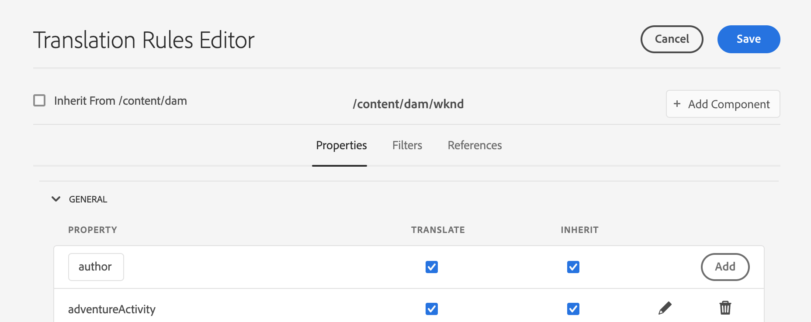

# Vertaalregels configureren {#configure-translation-rules}

Leer hoe u vertaalregels definieert om inhoud voor vertaling te identificeren.

## Het verhaal tot nu toe {#story-so-far}

In het vorige document van de AEM hoofdloze vertaalreis, [&#x200B; vorm vertaalintegratie &#x200B;](configure-connector.md) u leerde om uw vertaalintegratie te installeren en te vormen en zou nu moeten:

* Begrijp de belangrijke parameters van het Kader van de Integratie van de Vertaling in AEM.
* Uw eigen verbinding met uw vertaalservice instellen.

Nu uw integratie is ingesteld, wordt in dit artikel stapsgewijs vastgesteld welke inhoud u moet vertalen.

>[!CAUTION]
>
>Deze stap van de documentatietraject is slechts noodzakelijk als u niet de **Vertaalbare** vlag op de Fragmenten van de Inhoud gebruikt.
>
>* De **Vertaalbare** vlag leidt automatisch vertaalregels voor u en vereist geen interventie.
>* De **Vertaalbare** vlag wordt slechts gebruikt als de configuratie van het Kader van de Integratie van de Vertaling aan **[wordt geplaatst laat de Modelgebieden van de Inhoud voor Vertaling](/help/sites-cloud/administering/translation/integration-framework.md)** toe.
>* Het toelaten van deze optie in de configuratie van TIF zal om het even welke manueel-gecreeerde vertaalregels vervangen.|

## Doelstelling {#objective}

Dit document helpt u te begrijpen hoe u AEM vertaalregels kunt gebruiken om uw vertaalinhoud te identificeren. Nadat u dit document hebt gelezen, moet u:

* Begrijp wat de vertaalregels doen.
* U kunt uw eigen vertaalregels definiëren.

## Vertaalregels {#translation-rules}

Inhoudsfragmenten, die uw inhoud zonder kop vertegenwoordigen, kunnen veel informatie bevatten die is ingedeeld in gestructureerde velden. Afhankelijk van uw projectbehoeften is het waarschijnlijk dat niet alle velden in een inhoudsfragment moeten worden vertaald.

In de vertaalregels wordt aangegeven welke inhoud is opgenomen in of uitgesloten van vertaalprojecten. Wanneer de inhoud wordt vertaald, AEM de inhoud uitpakt of oogst die op deze regels wordt gebaseerd. Op die manier wordt alleen inhoud die moet worden vertaald naar de vertaaldienst verzonden.

De vertaalregels bevatten de volgende informatie:

* Het pad van de inhoud waarop de regel van toepassing is
   * De regel is ook van toepassing op de onderliggende elementen van de inhoud
* De namen van de eigenschappen die de te vertalen inhoud bevatten
   * Het bezit kan voor een specifiek middeltype of voor alle middeltypes specifiek zijn

Omdat de Modellen van het Fragment van de Inhoud, die de structuur van uw Inhoudsfragmenten bepalen, aan uw eigen project uniek zijn, is het essentieel aan opstellingsvertaalregels zodat AEM weet welke elementen van uw inhoudsmodellen moeten vertalen.

>[!TIP]
>
>Over het algemeen, verstrekt de inhoudarchitect de vertaalspecialist van de **Naam van het Bezit** van alle gebieden nodig voor vertaling. Deze namen zijn nodig om vertaalregels te configureren. Als vertaalspecialist, kunt u [&#x200B; deze **Naam van het Bezit** &#x200B;](getting-started.md#content-modlels) vinden zoals eerder beschreven in deze reis.

## Vertaalregels maken {#creating-rules}

Er kunnen meerdere regels worden gemaakt ter ondersteuning van complexe vertaalvereisten. Het ene project waaraan u werkt, vereist bijvoorbeeld dat alle velden van het model worden vertaald, maar dat andere alleen beschrijvingsvelden worden vertaald terwijl titels niet worden vertaald.

De vertaalregels worden ontworpen om dergelijke scenario&#39;s te behandelen. Nochtans in dit voorbeeld illustreren wij hoe te om regels tot stand te brengen door zich op een eenvoudige, enige configuratie te concentreren.

Er is de console van de Configuratie van de a **Vertaling** beschikbaar voor het vormen van vertaalregels. Toegang tot dit bestand:

1. Navigeer aan **Hulpmiddelen** > **Algemeen**.
1. Selecteer **de Configuratie van de Vertaling**.

In de **Configuratie van de Vertaling** UI, zijn er verscheidene opties beschikbaar voor uw vertaalregels. Hier benadrukken wij de meest noodzakelijke en typische stappen die voor een basisconfiguratie zonder kop worden vereist.

1. Selecteer **toevoegen Context** om een weg toe te voegen. Dit is het pad van de inhoud waarop de regel van toepassing is.
    toe
1. Gebruik wegbrowser om de vereiste weg te selecteren en **te selecteren bevestigen** om te bewaren. Inhoudsfragmenten, die inhoud zonder kop bevatten, bevinden zich doorgaans onder `/content/dam/<your-project>` .
   
1. Selecteer de context u creeerde en dan selecteren **uitgeeft**. Dit opent de **Redacteur van de Regels van de Vertaling** om de eigenschappen te vormen.
   
1. Standaard worden alle configuraties overgeërfd van het bovenliggende pad, in dit geval `/content/dam` . Schakel de optie **Overnemen van`/content/dam`** uit zodat u extra gebieden aan de configuratie kunt toevoegen.
1. Wanneer ongecontroleerd, onder de **Algemene** sectie van de lijst, voeg de bezitsnamen van de Model(s) van het Fragment van de Inhoud toe die u [&#x200B; eerder als gebieden voor vertaling &#x200B;](getting-started.md#content-models) identificeerde.
   1. Op het **Nieuwe gebied van het Bezit**, ga de bezitsnaam in. Bericht dat de opties **&#x200B;**&#x200B;vertalen en **overerven** automatisch worden gecontroleerd.
   1. Selecteer **toevoegen**.
   1. Herhaal deze stappen voor alle velden die u moet vertalen.
   1. Selecteer **sparen**.

       toe

U hebt nu uw vertaalregels geconfigureerd.

## Geavanceerd gebruik {#advanced-usage}

Er zijn verscheidene extra eigenschappen die als deel van uw vertaalregels kunnen worden gevormd. Bovendien kunt u uw regels handmatig als XML opgeven, waardoor meer specificiteit en flexibiliteit mogelijk zijn.

Zulke eigenschappen zijn over het algemeen niet nodig begonnen uw hoofdloze inhoud te lokaliseren, maar u kunt over hen verder in de [&#x200B; Aanvullende sectie van Middelen &#x200B;](#additional-resources) lezen als u geinteresseerd bent.

## Volgende functies {#what-is-next}

Nu u dit deel van de reis zonder kop hebt voltooid, moet u:

* Begrijp wat de vertaalregels doen.
* U kunt uw eigen vertaalregels definiëren.

Bouw op deze kennis voort en zet uw AEM hoofdloze vertaalreis door het document [&#x200B; te herzien vertaalt inhoud &#x200B;](translate-content.md) waar u leert hoe uw integratie en regels samenwerken om hoofdloze inhoud te vertalen.

## Aanvullende bronnen {#additional-resources}

Terwijl het wordt geadviseerd dat u zich op het volgende deel van de hoofdloze vertaalreis door het document [&#x200B; te herzien vertaalt inhoud &#x200B;](translate-content.md) beweegt, zijn het volgende sommige extra, facultatieve middelen die een diepere duik op sommige concepten doen in dit document worden vermeld, maar zij worden niet vereist om op de headless reis verder te gaan.

* [&#x200B; identificerend Inhoud om &#x200B;](/help/sites-cloud/administering/translation/rules.md) te vertalen - leer hoe de vertaalregels inhoud identificeren die moet vertalen.
