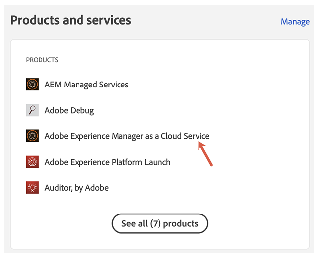
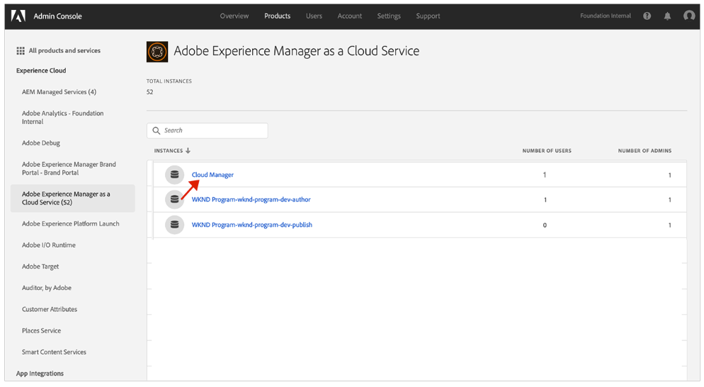
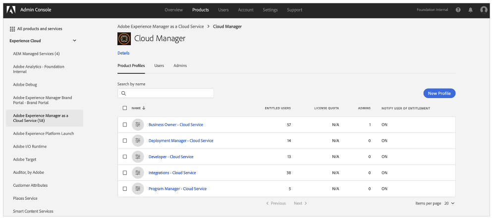

# Meldingsprofielen {#notification-profiles}

Leer hoe u gebruikersprofielen maakt in de Admin Console voor het beheer van de ontvangst van belangrijke e-mailberichten.

## Overzicht {#overview}

Van tijd tot tijd, contacteert de Adobe gebruikers betreffende hun milieu&#39;s van AEM as a Cloud Service. Naast productmeldingen wordt in Adobe soms ook e-mail gebruikt voor meldingen. Er zijn twee typen e-mailmeldingen:

* **Melding van het Ongeval** - Deze berichten worden verzonden tijdens een incident of wanneer de Adobe een potentiële beschikbaarheidskwestie met uw milieu van AEM as a Cloud Service heeft geïdentificeerd.
* **Proactief Bericht** - Deze berichten worden verzonden wanneer een het teamlid van de steun van de Adobe begeleiding op een potentiële optimalisering of een aanbeveling wil verstrekken die uw milieu van AEM as a Cloud Service kan profiteren.

De gebruikers kunnen deze berichten voor specifieke programma&#39;s ook ontvangen die op hun [ toestemmingen van de douanegroep worden gebaseerd.](/help/implementing/cloud-manager/custom-permissions.md)

Bovendien wordt het toewijzen van groepen aan proactieve meldingen ondersteund en kunnen gebruikers en groepen rechtstreeks aan de productprofielen worden toegewezen.

* Gebruikers in de groepen met incidenten en proactieve meldingen ontvangen standaard meldingen voor alle programma&#39;s.
* Als gebruikers echter niet alle meldingen willen ontvangen, kunnen ze aangepaste leesmachtigingen gebruiken om op te geven welke programmameldingen ze willen ontvangen.

Voor de correcte gebruikers om deze berichten te ontvangen, moet u gebruikersprofielen vormen en toewijzen zoals die in dit document worden beschreven.

## Vereisten {#prerequisites}

Omdat gebruikersprofielen worden gemaakt en onderhouden in de Admin Console, moet u voordat u profielen voor meldingen maakt:

* Machtigingen hebben om leden toe te voegen en te profielen.
* Een geldig Adobe Admin Console-profiel hebben.

## Nieuwe Cloud Manager-productprofielen maken {#create-profiles}

Maak twee gebruikersprofielen om de ontvangst van meldingen correct in te stellen. Deze stappen worden slechts één keer uitgevoerd.

1. Meld u aan bij de Admin Console op [`https://adminconsole.adobe.com` .](https://adminconsole.adobe.com)

1. Zorg ervoor dat u zich in de juiste organisatie bevindt.

1. Van de **pagina van het Overzicht**, uitgezochte **Adobe Experience Manager as a Cloud Service** van de **Producten en de diensten** kaart.

   

1. Navigeer aan de **instantie van Cloud Manager** van de lijst van alle instanties.

   

1. U kunt de lijst met alle geconfigureerde Cloud Manager-productprofielen bekijken.

   

1. Klik **Nieuw Profiel** en verstrek de volgende details:

   * **de profielnaam van het Product**: `Incident Notification - Cloud Service`
   * **Naam van de Vertoning**: `Incident Notification - Cloud Service`
   * **Beschrijving**: Het profiel van Cloud Manager voor de gebruikers die berichten tijdens een incident zullen ontvangen of wanneer de Adobe een potentieel beschikbaarheidsprobleem met uw milieu van AEM as a Cloud Service heeft geïdentificeerd.
      * Gebruikers met aangepaste leesmachtigingen voor specifieke programma&#39;s ontvangen alleen meldingen voor die programma&#39;s als zij aangepaste machtigingen willen gebruiken.

1. Klik **sparen**.

1. Klik **Nieuw Profiel** opnieuw en verstrek de volgende details:

   * **de profielnaam van het Product**: `Proactive Notification - Cloud Service`
   * **Naam van de Vertoning**: `Proactive Notification - Cloud Service`
   * **Beschrijving**: Het profiel van Cloud Manager voor de gebruikers die berichten zullen ontvangen wanneer een het teamlid van de steun van de Adobe begeleiding op een potentiële optimalisering of aanbeveling wil verstrekken om met uw het omgevingsconfiguratie van AEM as a Cloud Service te doen
      * Gebruikers met aangepaste leesmachtigingen voor specifieke programma&#39;s ontvangen alleen meldingen voor die programma&#39;s als zij aangepaste machtigingen willen gebruiken.

1. Klik **sparen**.

Uw twee nieuwe meldingsprofielen worden gemaakt.

>[!NOTE]
>
>Het is belangrijk dat de Cloud Manager **naam van het productprofiel** precies het zelfde zoals verstrekt is. Kopieer en plak de opgegeven productprofielnaam om fouten te voorkomen. Eventuele afwijkingen of typos leiden ertoe dat meldingen niet naar wens worden verzonden.
>
>In geval van fout of als de profielen niet zijn bepaald, zal de Adobe aan het op de hoogte brengen van bestaande gebruikers blijven die aan de **Cloud Manager ontwikkelaar** of **worden toegewezen de profielen van de Manager van de Plaatsing**.

## Gebruikers toewijzen aan de meldingsprofielen {#add-users}

Nu de profielen zijn gemaakt, moet u de juiste gebruikers toewijzen. Dit kunt u doen wanneer u nieuwe gebruikers maakt of bestaande gebruikers bijwerkt.

### Nieuwe gebruikers toevoegen aan profielen {#new-user}

Voer de volgende stappen uit om gebruikers toe te voegen voor wie gefedereerde id&#39;s nog niet zijn ingesteld.

1. Identificeer de gebruiker(s) of groep(en) die incidenten of proactieve meldingen moet ontvangen.

1. Meld u bij Admin Console aan bij [`https://adminconsole.adobe.com` ](https://adminconsole.adobe.com) als u nog niet bent aangemeld.

1. Zorg ervoor dat u de juiste organisatie hebt geselecteerd.

1. Van de **pagina van het Overzicht**, uitgezochte **Adobe Experience Manager as a Cloud Service** van de **Producten en de diensten** kaart.

   

1. Als federated identiteitskaart voor uw teamleden nog niet opstelling is, selecteer het **Gebruikers** lusje van de hoogste navigatie, dan uitgezocht **voeg Gebruiker** toe. Anders overslaan aan de sectie [ voeg Bestaande Gebruikers aan Profielen toe.](#existing-users)

   

1. In **voeg gebruikers aan uw team** dialoog toe, ga e-mailidentiteitskaart van de gebruiker in u `Adobe ID` voor het **Type van identiteitskaart** wilt toevoegen en selecteren.

1. Klik plus knoop onder **Uitgezochte producten** kop om met productselectie te beginnen.

1. Selecteer **Adobe Experience Manager as a Cloud Service** en wijs één of allebei van de nieuwe profielen aan de gebruiker toe.

   * **Melding van het incident - Cloud Service**
   * **Proactief Bericht - Cloud Service**

1. Klik **sparen** en een welkome e-mail wordt verzonden naar de gebruiker u toevoegde.

De uitgenodigde gebruiker zal nu de berichten ontvangen. Gebruikers met aangepaste leesmachtigingen voor specifieke programma&#39;s ontvangen alleen meldingen voor die programma&#39;s als zij aangepaste machtigingen willen gebruiken.

Herhaal deze stappen voor de gebruikers in uw team die u meldingen wilt ontvangen.

### Bestaande gebruikers toevoegen aan profielen {#existing-user}

Voer de volgende stappen uit om gebruikers toe te voegen voor wie gefedereerde id&#39;s al bestaan.

1. Identificeer de gebruiker(s) of groep(en) die incidenten of proactieve meldingen moet ontvangen.

1. Meld u bij Admin Console aan bij [`https://adminconsole.adobe.com` ](https://adminconsole.adobe.com) als u nog niet bent aangemeld.

1. Zorg ervoor dat u de juiste organisatie hebt geselecteerd.

1. Van de **pagina van het Overzicht**, uitgezochte **Adobe Experience Manager as a Cloud Service** van de **Producten en de diensten** kaart.

1. Selecteer het **lusje van Gebruikers** van de hoogste navigatie.

1. Als de gefedereerde identiteitskaart reeds voor het teamlid bestaat die u aan een berichtprofiel wilt toevoegen, bepaal de plaats van die gebruiker in de lijst en klik het. Anders overslaan aan de sectie [ voeg Nieuwe Gebruikers aan Profielen toe.](#add-user)

1. In de **sectie van Producten** van het venster van gebruikersdetails, klik de elliptische knoop en selecteer dan **uitgeven**.

1. In **geef producten** venster uit, klik de potloodknoop onder **Uitgezochte producten** rubriek om met productselectie te beginnen.

1. Selecteer **Adobe Experience Manager as a Cloud Service** en wijs één of allebei van de nieuwe profielen aan de gebruiker toe.

   * **Melding van het incident - Cloud Service**
   * **Proactief Bericht - Cloud Service**

1. Klik **sparen** en een welkome e-mail wordt verzonden naar de gebruiker u toevoegde.

De uitgenodigde gebruiker zal nu de berichten ontvangen. Gebruikers met aangepaste leesmachtigingen voor specifieke programma&#39;s ontvangen alleen meldingen voor die programma&#39;s als zij aangepaste machtigingen willen gebruiken.

Herhaal deze stappen voor de gebruikers in uw team die u meldingen wilt ontvangen.

## Aanvullende bronnen {#additional-resources}

Hieronder volgen aanvullende, optionele bronnen als u verder wilt gaan dan de inhoud van de instapreis.

* [ Centrum van Acties ](/help/operations/actions-center.md) - hefboomwerking het Centrum van Acties om op incidenten en andere belangrijke informatie gemakkelijk te handelen.
