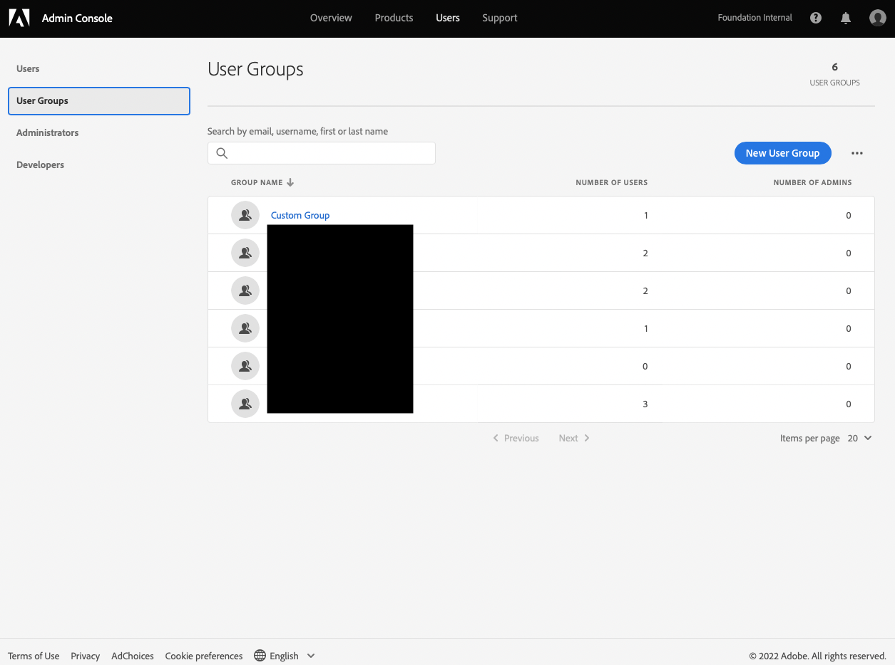
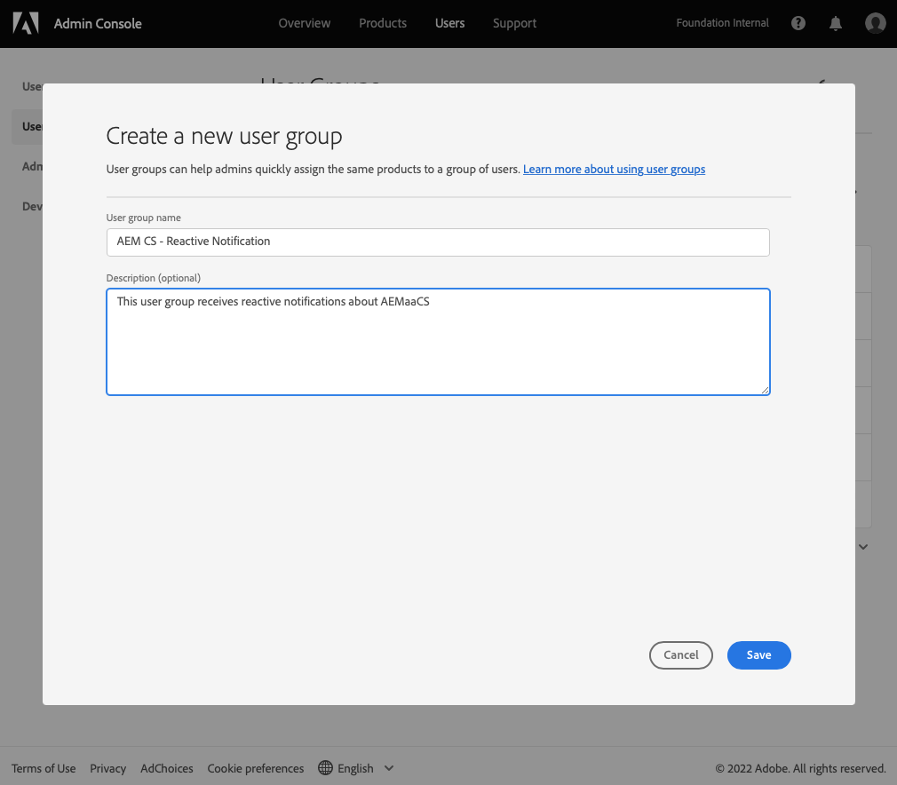
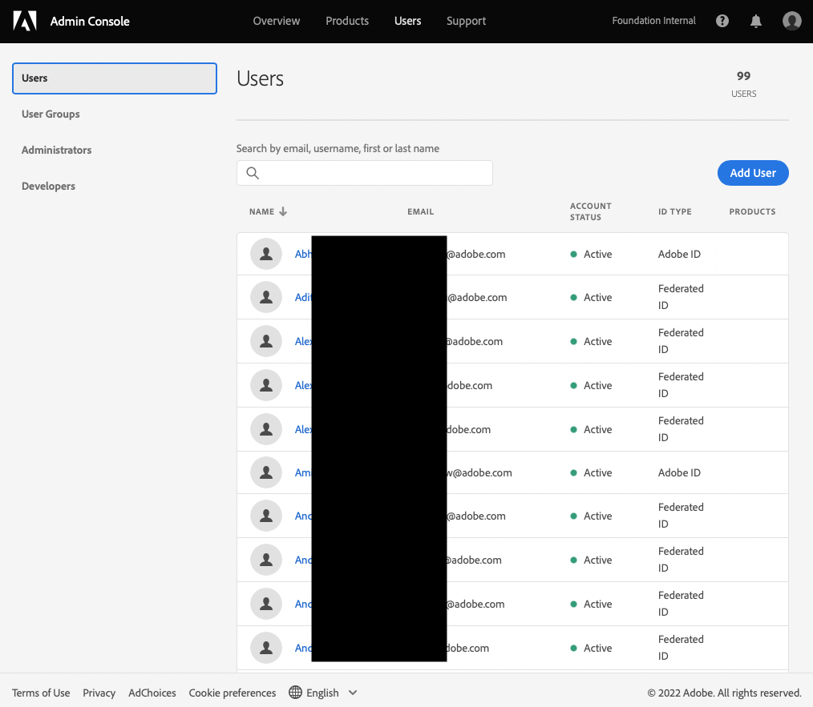
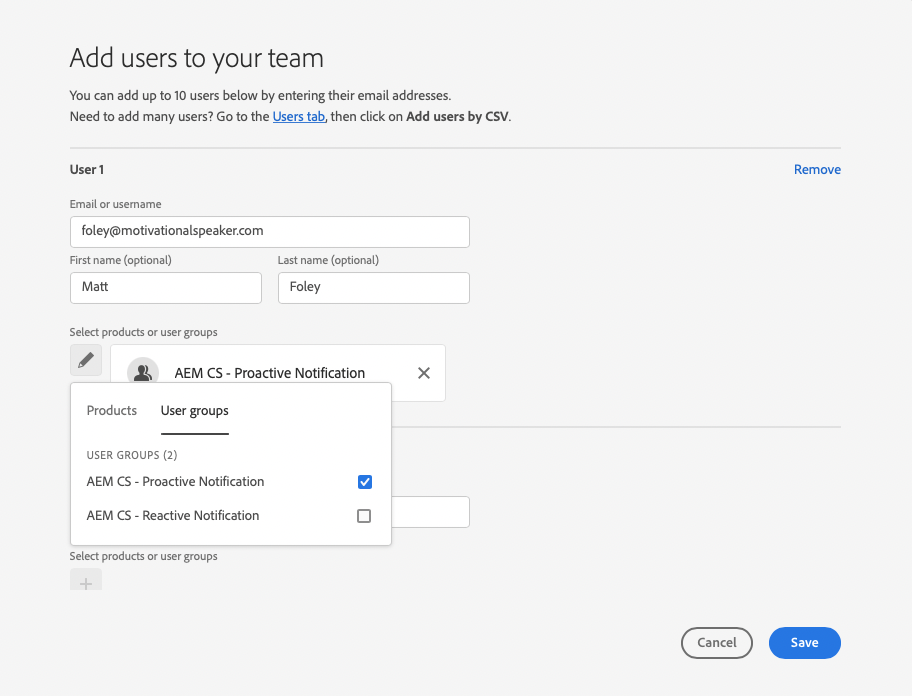
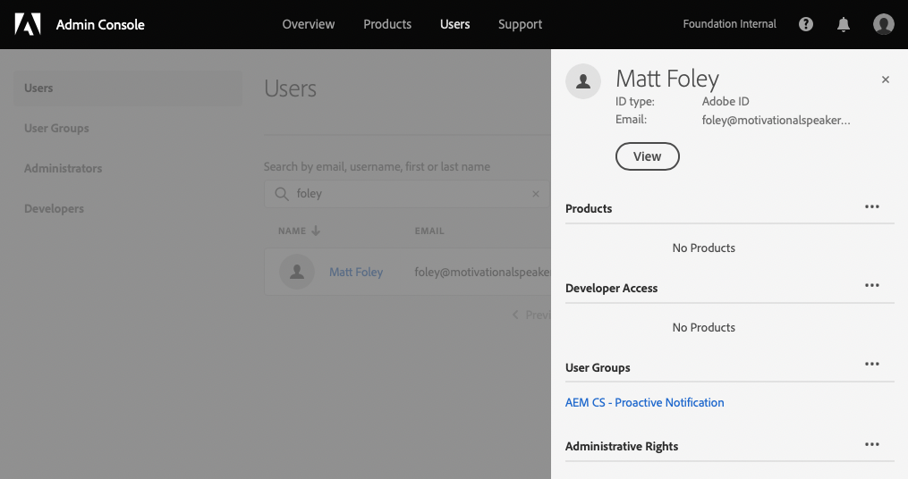

# Gebruikersgroepen voor meldingen {#user-groups}

Leer hoe u een gebruikersgroep in de Admin Console kunt maken om de ontvangst van belangrijke e-mailberichten te beheren.

## Overzicht {#overview}

Van tijd tot tijd moet Adobe contact opnemen met betrekking tot hun AEM as a Cloud Service omgeving. Naast productmeldingen gebruikt Adobe soms ook e-mail voor dergelijke berichten. Er zijn twee soorten meldingen:

* **Reactieve melding** - Deze meldingen worden verzonden tijdens een incident of wanneer Adobe een probleem met de mogelijke beschikbaarheid in uw AEM as a Cloud Service omgeving heeft vastgesteld.
* **Proactieve kennisgeving** - Deze meldingen worden verzonden wanneer een lid van het ondersteuningsteam van Adobe advies wil geven over een mogelijke optimalisatie of aanbeveling die uw AEM as a Cloud Service omgeving ten goede kan komen.

Voor de correcte gebruikers om deze berichten te ontvangen, moet u gebruikersgroepen vormen.

## Vereisten {#prerequisites}

Omdat gebruikersgroepen in de Admin Console worden gecreeerd en gehandhaafd, alvorens gebruikersgroepen voor berichten tot stand te brengen, moet u:

* Heeft machtigingen om groepslidmaatschappen toe te voegen en te bewerken.
* Een geldig Adobe Admin Console-profiel hebben.

## Gebruikersgroepen voor meldingen maken {#create-groups}

Als u de ontvangst van meldingen correct wilt instellen, moet u twee gebruikersgroepen maken. Deze stappen moeten slechts eenmaal worden uitgevoerd.

1. Aanmelden bij Admin Console bij [`https://adminconsole.adobe.com`.](https://adminconsole.adobe.com)

1. Klik op de knop **Gebruikers** en vervolgens de **Gebruikersgroepen** in het navigatievenster aan de linkerkant.

   

1. Klik op de knop **Nieuwe gebruikersgroep** en een **Naam gebruikersgroep** exact zoals opgegeven en optioneel **Beschrijving**.

   * De namen van de groepen moeten overeenkomen met het volgende. Pas de namen van de groepen op geen enkele manier aan of wijzig ze.
      * `AEM CS - Reactive Notification`
      * `AEM CS - Proactive Notification`

   

1. Klikken **Opslaan**.

1. Herhaal de stappen voor de tweede groep.

Als de groepen niet zijn gedefinieerd, stelt Adobe bestaande gebruikers via Cloud Manager op de hoogte **Ontwikkelaar** of **Implementatie** profielen.

## Gebruikers toevoegen aan groepen {#add-users}

Nu de groepen zijn gemaakt, moet u de juiste gebruikers toewijzen. Dit kunt u doen wanneer u nieuwe gebruikers maakt of bestaande gebruikers bijwerkt.

### Nieuwe gebruikers toevoegen aan groepen {#new-user}

1. Aanmelden bij Admin Console bij [`https://adminconsole.adobe.com`](https://adminconsole.adobe.com) als u nog niet bent aangemeld.

1. Klik op de knop **Gebruikers** en vervolgens de **Gebruikers** in het navigatievenster aan de linkerkant.

   

1. Klik op de knop **Gebruiker toevoegen** en geef het e-mailadres van de gebruiker op. U kunt desgewenst ook een voornaam en een achternaam opgeven.

   * Als de gebruiker al bestaat, komt de Admin Console overeen met het e-mailadres en worden de velden vooraf ingevuld.

1. Klik op de plusknop onder de velden voor de gebruikersnaam en klik vervolgens op de knop **Gebruikersgroepen** in het pop-upmenu om de groepen voor de gebruiker te selecteren.

   

1. Klikken **Opslaan** om de nieuwe gebruiker op te slaan.

Herhaal deze stappen voor elke gebruiker voor wie u de berichtgroepen moet toewijzen.

### Bestaande gebruikers toevoegen aan groepen {#existing-user}

1. Aanmelden bij Admin Console bij [`https://adminconsole.adobe.com`](https://adminconsole.adobe.com) als u nog niet bent aangemeld.

1. Klik op de knop **Gebruikers** en vervolgens de **Gebruikers** in het navigatievenster aan de linkerkant.

   

1. Klik op de rij van de gebruiker die u aan een berichtgroep wilt toevoegen. Er wordt een deelvenster geopend waarin de gebruikersgegevens worden weergegeven.

1. Klik op het pictogram voor de ovaal rechts van het dialoogvenster **Gebruikersgroepen** in het detailpaneel.