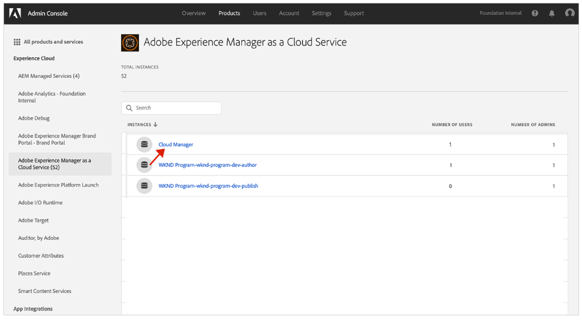
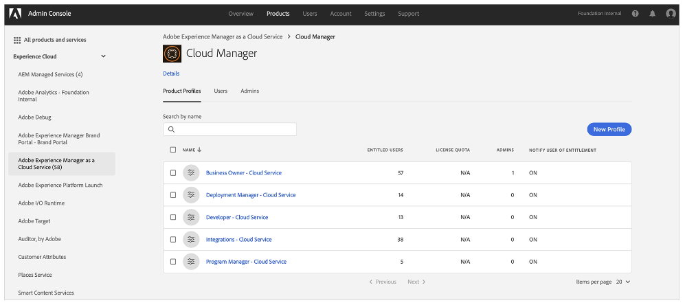

# Gebruikersgroepen voor meldingen {#user-groups}

Leer hoe u een gebruikersgroep in de Admin Console kunt maken om de ontvangst van belangrijke e-mailberichten te beheren.

## Overzicht {#overview}

Van tijd tot tijd moet Adobe contact opnemen met gebruikers over hun AEM as a Cloud Service omgeving. Naast productmeldingen gebruikt Adobe soms ook e-mail voor berichten. Er zijn twee typen e-mailmeldingen:

* **Melding incident** - Deze meldingen worden verzonden tijdens een incident of wanneer Adobe een probleem met de mogelijke beschikbaarheid in uw AEM as a Cloud Service omgeving heeft vastgesteld.
* **Proactieve kennisgeving** - Deze meldingen worden verzonden wanneer een lid van het ondersteuningsteam van Adobe advies wil geven over een mogelijke optimalisatie of aanbeveling die uw AEM as a Cloud Service omgeving ten goede kan komen.

Voor de correcte gebruikers om deze berichten te ontvangen, moet u gebruikersgroepen vormen en toewijzen die in dit document worden beschreven.

## Vereisten {#prerequisites}

Omdat gebruikersgroepen in de Admin Console worden gecreeerd en gehandhaafd, alvorens gebruikersgroepen voor berichten tot stand te brengen, moet u:

* Heeft machtigingen om groepslidmaatschappen toe te voegen en te bewerken.
* Een geldig Adobe Admin Console-profiel hebben.

## Nieuwe productprofielen voor Cloud Manager maken {#create-groups}

Als u de ontvangst van meldingen correct wilt instellen, moet u twee gebruikersgroepen maken. Deze stappen moeten slechts eenmaal worden uitgevoerd.

1. Aanmelden bij Admin Console bij [`https://adminconsole.adobe.com`.](https://adminconsole.adobe.com)

1. Van de **Overzicht** pagina, selecteert u **Adobe Experience Manager as a Cloud Service** van de **Producten en diensten** kaart.

   

1. Ga naar de **Cloud Manager** uit de lijst van alle instanties.

   

1. De lijst met alle geconfigureerde productprofielen van Cloud Manager wordt weergegeven.

   

1. Klikken **Nieuw profiel** en de volgende gegevens verstrekken:

   * **Naam van productprofiel**: `Incident Notification - Cloud Service`
   * **Weergavenaam**: `Incident Notification - Cloud Service`
   * **Beschrijving**: Het profiel van de Manager van de wolk voor de gebruikers die berichten tijdens een incident zullen ontvangen of wanneer Adobe een potentieel beschikbaarheidsprobleem met uw AEM as a Cloud Service milieu heeft geïdentificeerd

1. Klikken **Opslaan**.

1. Klikken **Nieuw profiel** nogmaals de volgende gegevens verstrekken:

   * **Naam van productprofiel**: `Proactive Notification - Cloud Service`
   * **Weergavenaam**: `Proactive Notification - Cloud Service`
   * **Beschrijving**: Het profiel van de Manager van de wolk voor de gebruikers die berichten zullen ontvangen wanneer een lid van het de ondersteuningsteam van Adobe raad over een potentiële optimalisering of aanbeveling willen verstrekken om met uw AEM as a Cloud Service omgevingsconfiguratie te doen

1. Klikken **Opslaan**.

Uw twee nieuwe berichtgroepen worden gecreeerd.

>[!NOTE]
>
>Het is belangrijk dat de Cloud Manager **productprofielnaam** is precies hetzelfde als opgegeven. Kopieer en plak de opgegeven productprofielnaam om fouten te voorkomen. Eventuele afwijkingen of typos leiden ertoe dat meldingen niet naar wens worden verzonden.
>
>Als er een fout optreedt of als de profielen niet zijn gedefinieerd, meldt Adobe de bestaande gebruikers die aan de profielen zijn toegewezen standaard **Cloud Manager Developer** of **Implementatiebeheer** profielen.

## De gebruikers toewijzen aan de nieuwe productprofielen voor meldingen {#add-users}

Nu de groepen zijn gemaakt, moet u de juiste gebruikers toewijzen. Dit kunt u doen wanneer u nieuwe gebruikers maakt of bestaande gebruikers bijwerkt.

### Nieuwe gebruikers toevoegen aan groepen {#new-user}

Voer de volgende stappen uit om gebruikers toe te voegen voor wie gefedereerde id&#39;s nog niet zijn ingesteld.

1. Identificeer de gebruiker(s) die of incident of pro-actieve berichten zou moeten ontvangen.

1. Aanmelden bij Admin Console bij [`https://adminconsole.adobe.com`](https://adminconsole.adobe.com) als u nog niet bent aangemeld.

1. Van de **Overzicht** pagina, selecteert u **Adobe Experience Manager as a Cloud Service** van de **Producten en diensten** kaart.

   

1. Als de gefederaliseerde id voor uw teamleden nog niet is ingesteld, selecteert u de optie **Gebruikers** tabblad van de bovenste navigatie en selecteer vervolgens **Gebruiker toevoegen**. Anders overslaan naar de sectie [Bestaande gebruikers toevoegen aan groepen.](#existing-users)

   

1. In de **Gebruikers aan uw team toevoegen** voert u de e-mailid in van de gebruiker die u wilt toevoegen en selecteert u `Adobe ID` voor de **Type id**.

1. Klik op de plusknop onder de knop **Producten selecteren** kop om productselectie te beginnen.

1. Selecteren **Adobe Experience Manager as a Cloud Service** en wijs één of allebei van de nieuwe groepen aan de gebruiker toe.

   * **Melding van incidenten - Cloud Service**
   * **Proactieve melding - Cloud Service**

1. Klikken **Opslaan** en er wordt een welkomstbericht verzonden naar de gebruiker die u hebt toegevoegd.

De uitgenodigde gebruiker zal nu de berichten ontvangen. Herhaal deze stappen voor de gebruikers in uw team die u meldingen wilt ontvangen.

### Bestaande gebruikers toevoegen aan groepen {#existing-user}

Voer de volgende stappen uit om gebruikers toe te voegen voor wie gefedereerde id&#39;s al bestaan.

1. Identificeer de gebruiker(s) die of incident of pro-actieve berichten zou moeten ontvangen.

1. Aanmelden bij Admin Console bij [`https://adminconsole.adobe.com`](https://adminconsole.adobe.com) als u nog niet bent aangemeld.

1. Van de **Overzicht** pagina, selecteert u **Adobe Experience Manager as a Cloud Service** van de **Producten en diensten** kaart.

1. Selecteer **Gebruikers** van de bovenste navigatie.

1. Als de gefedereerde identiteitskaart reeds voor het teamlid bestaat die u aan een berichtgroep wilt toevoegen, die gebruiker in de lijst wordt gevestigd en het klikt. Anders overslaan naar de sectie [Nieuwe gebruikers toevoegen aan groepen.](#add-user)

1. In de **Producten** in het venster met gebruikersgegevens klikt u op de knop voor ovaal en selecteert u **Bewerken**.

1. In de **Producten bewerken** venster, klikt u op de potloodknop onder de **Producten selecteren** kop om productselectie te beginnen.

1. Selecteren **Adobe Experience Manager as a Cloud Service** en wijs één of allebei van de nieuwe groepen aan de gebruiker toe.

   * **Melding van incidenten - Cloud Service**
   * **Proactieve melding - Cloud Service**

1. Klikken **Opslaan** en er wordt een welkomstbericht verzonden naar de gebruiker die u hebt toegevoegd.

De uitgenodigde gebruiker zal nu de berichten ontvangen. Herhaal deze stappen voor de gebruikers in uw team die u meldingen wilt ontvangen.
